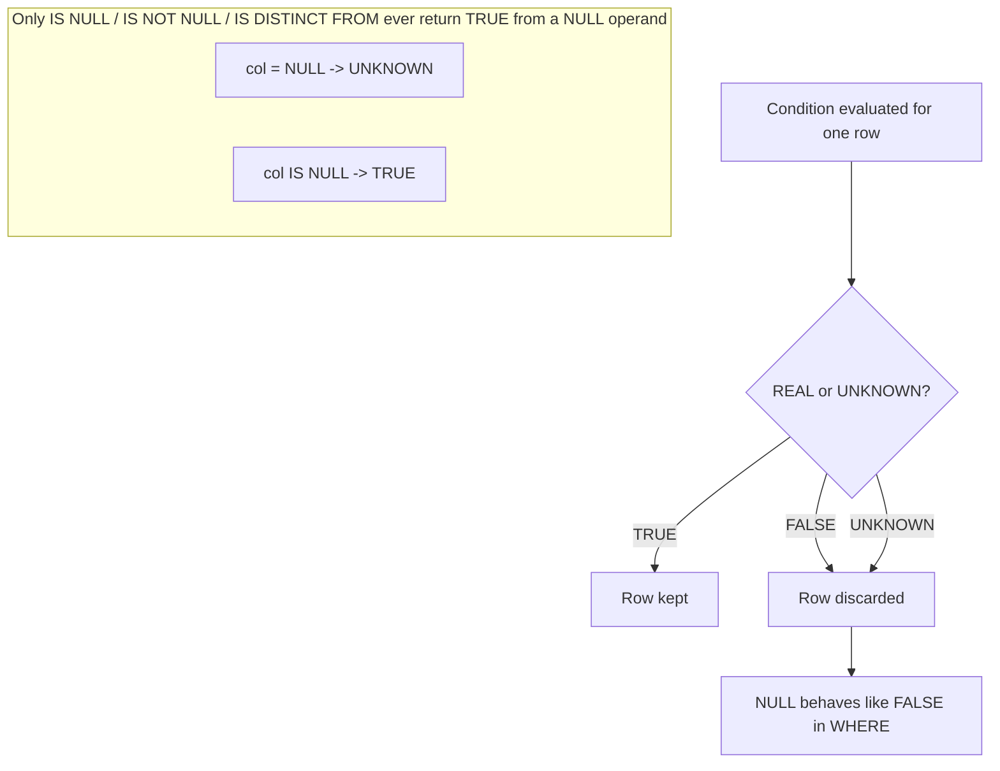

The placeholder file exists and is empty. I'll now write the full section.
Let me verify the file and fix two small artifacts I noticed while writing.
Generated `sql-handbook/2-NULL-and-Logic/09-NULL-Deep-Dive.md` (1,673 lines).

Covers:
- **Fundamentals:** what NULL is, storage, "absence" semantics, three-valued logic truth tables (AND/OR/NOT) + the `FALSE AND UNKNOWN` / `TRUE OR UNKNOWN` rules, and the 10 golden rules
- **Operators/functions:** comparison, `IS [NOT] NULL`, `IS [NOT] DISTINCT FROM` (with per-DB support matrix), `COALESCE`, `NULLIF`, arithmetic/concatenation (incl. Oracle's `''`==NULL and `'a' || NULL`), aggregates (`COUNT(*)`/`COUNT(col)`/`SUM` returning NULL), `GROUP BY`/`DISTINCT`/`UNION` NULL bucketing, `ORDER BY` defaults per engine, `IN`/`NOT IN` zero-rows trap, `EXISTS`/`NOT EXISTS`, JOINs + LEFT→INNER trap, window functions, `CASE`, constraints (`CHECK` lets NULL through), CRUD/`MERGE`
- **Realistic sample data** with grain stated, expected outputs for every example, BAD vs BETTER patterns, sargability table, `EXPLAIN` verification guidance (no absolute performance claims), DB-specific callouts, labeled misconceptions/traps/pitfalls, Mermaid decision diagram
- **Interview Questions:** 74 questions across all 8 requested categories (Beginner → Performance), including output-prediction prompts for the sample data, with answers withheld for practice.
es)
20. [NULL in CRUD: INSERT, UPDATE, MERGE](#null-in-crud-insert-update-merge)
21. [Empty String vs NULL](#empty-string-vs-null)
22. [Database-Specific Differences: PostgreSQL, MySQL, SQL Server, Oracle](#database-specific-differences-postgresql-mysql-sql-server-oracle)
23. [Performance Implications](#performance-implications)
24. [BAD Approach vs BETTER Approach](#bad-approach-vs-better-approach)
25. [Common Mistakes](#common-mistakes)
26. [Production Pitfalls](#production-pitfalls)
27. [Best Practices](#best-practices)
28. [Interview Questions](#interview-questions)

---

## What Is NULL?

`NULL` is the SQL marker for **"no value"** — an unknown, missing, inapplicable, or not-yet-assigned value.

It is **not**:

- zero (`0`)
- an empty string (`''`)
- a space (`' '`)
- `false`
- an empty array

> **Common misconception**
> "NULL is just another value, like an empty string or zero." — It is not. `NULL` is proof of *absence*. Almost every SQL engine stores it specially (a null bitmap, a byte in the row header, an indicator in the file format), and every operator must handle it specially because there is nothing to compare.

> **Common misconception**
> "There is one NULL anywhere in the database." — Every column cell is independently NULL or not. `NULL` is not a shared object like a number; it is a *per-cell flag* meaning "no value here."

### What NULL means semantically

Exactly what "no value" means is your job as the designer. It typically means one of:

| Meaning | Example |
|---------|---------|
| Unknown | `salary` is not known yet for a new hire |
| Missing | No `email` was ever provided |
| Inapplicable / Not applicable | A person with no manager has `manager_id = NULL` |
| Not yet set | `shipped_date` is NULL until the order ships |
| Suppressed | Data intentionally withheld (e.g. a redacted field) |

This is why you should never treat NULL and `''` as interchangeable: `''` is a *known* empty value; NULL says *we don't know or there is none*.

> **Grain reminder:** NULL operates at the *cell* level and never changes the number of rows a query sees — except indirectly through `WHERE`, `HAVING`, `ON`, and `JOIN` filters, which discard rows. Always ask: "Which rows did the filter drop because of NULL, and is that what I intended?"

---

## Three-Valued Logic — The Truth Tables

SQL does not use the two-valued logic of most programming languages. Every comparison produces one of three results:

| Result | Meaning |
|--------|---------|
| `TRUE`   | The comparison holds |
| `FALSE`  | The comparison does not hold |
| `UNKNOWN`| The comparison involves NULL, so the truth cannot be determined |

In SQL, `UNKNOWN` is often written as `NULL` when the result is *returned as a value*, but inside the engine the filter logic distinguishes three states: `TRUE`, `FALSE`, `UNKNOWN`.

### Late binding — the golden rule

> **The golden rule of NULL:** Any comparison or arithmetic where **either operand is NULL** produces `UNKNOWN` (and any expression whose operands are UNKNOWN is UNKNOWN) — **except** the dedicated NULL predicates `IS NULL`, `IS NOT NULL`, `IS [NOT] DISTINCT FROM`, and (mostly) `NULLIF` and `COALESCE`.

### The AND / OR / NOT truth tables

| A | B | A AND B | A OR B |
|---|---|---------|--------|
| TRUE  | TRUE    | TRUE    | TRUE    |
| TRUE  | FALSE   | FALSE   | TRUE    |
| TRUE  | UNKNOWN | UNKNOWN | TRUE    |
| FALSE | TRUE    | FALSE   | TRUE    |
| FALSE | FALSE   | FALSE   | FALSE   |
| FALSE | UNKNOWN | FALSE  | UNKNOWN |
| UNKNOWN | TRUE  | UNKNOWN | TRUE    |
| UNKNOWN | FALSE | FALSE  | UNKNOWN |
| UNKNOWN | UNKNOWN | UNKNOWN | UNKNOWN |

| A | NOT A |
|---|-------|
| TRUE    | FALSE    |
| FALSE   | TRUE     |
| UNKNOWN | UNKNOWN  |

**Two rows to memorize** (they are the source of most interview surprises):

| Expression | Result | Why |
|------------|--------|-----|
| `FALSE AND UNKNOWN` | `FALSE` | A false fact is false no matter what the unknown was |
| `TRUE OR UNKNOWN`   | `TRUE`  | A true fact is true no matter what the unknown was |

### Why these two rows exist

`AND UNKNOWN` can only ever resolve to `TRUE` if the UNKNOWN flips to `TRUE`. If the other operand is `FALSE`, the conjunction is `FALSE` in every world, so the DB short-circuits and answers `FALSE`. Symmetrically, `TRUE OR UNKNOWN` is `TRUE` in every world.

This is **not** an optimization quirk. It is the semantics of two-value-independent reasoning, and it affects which rows your `WHERE` keeps:

```sql
-- Every row where either (salary > 80000) is TRUE, OR (dept_id IS NULL).
-- Grace has dept_id = NULL and salary = NULL:
--   (NULL > 80000)  = UNKNOWN
--   (NULL IS NULL)  = TRUE
--   UNKNOWN OR TRUE = TRUE  -> row is KEPT
SELECT name FROM employees
WHERE salary > 80000 OR dept_id IS NULL;
```

```sql
-- Every row where (salary > 80000) AND the team is the dev team.
-- Frank has dept_id = NULL and salary = 55000:
--   (55000 > 80000)  = FALSE
--   FALSE AND UNKNOWN = FALSE -> row is DROPPED
SELECT name FROM employees
WHERE salary > 80000 AND dept_id = 1;
```



> **Interview trap**
> "A filter with `WHERE col = NULL` returns every row whose column is empty." — No: it matches nothing. `col = NULL` is `UNKNOWN` for *every* row, and `WHERE` keeps only `TRUE`.

---

## The Golden Rules of NULL

| # | Rule | Consequence |
|---|------|-------------|
| 1 | `NULL = NULL` is `UNKNOWN`, not `TRUE` | NULL is never "equal to" anything, not even itself |
| 2 | `NULL <> NULL` is `UNKNOWN`, not `FALSE` | NULL is never "not equal to" anything either |
| 3 | `WHERE`, `HAVING`, `ON`, and `JOIN` conditions keep a row **only** when the condition is `TRUE` | FALSE *and* UNKNOWN rows disappear |
| 4 | Aggregates ignore NULLs | `SUM`, `AVG`, `MIN`, `MAX`, `COUNT(col)` skip NULL cells |
| 5 | `COUNT(*)` counts rows; `COUNT(col)` counts non-NULL cells | The two disagree exactly by the NULL count |
| 6 | NULL propagates through expressions | `NULL + 1 = NULL`, `UPPER(NULL) = NULL`, `'a' || NULL` is NULL except in Oracle |
| 7 | NULL groups together | `GROUP BY`, `DISTINCT`, `UNION` place all NULLs in one bucket |
| 8 | NULL breaks `NOT IN` (and most `<>`) semantics | Use `NOT EXISTS` or `IS NOT DISTINCT FROM` instead |
| 9 | Only 3 predicates return `TRUE` for a NULL operand: `IS NULL`, `IS NOT NULL`, and `IS [NOT] DISTINCT FROM` | For everything else, NULL means UNKNOWN |
| 10 | Sort order of NULLs is database-defined and may differ | Always verify per engine, or force it explicitly |

---

## Comparison Operators and NULL

### What they are

`=`, `<>`, `!=`, `<`, `>`, `<=`, `>=`, `BETWEEN`, `LIKE` — all of them return `TRUE`, `FALSE`, or `UNKNOWN`, and **all** of them return `UNKNOWN` when either operand is NULL.

### Syntax

```sql
SELECT name, salary
FROM employees
WHERE salary > 80000;      -- UNKNOWN rows are dropped

SELECT name, salary
FROM employees
WHERE salary = 88000;      -- UNKNOWN rows are dropped

SELECT name, salary
FROM employees
WHERE salary <> 88000;     -- UNKNOWN rows are dropped, including NULL salaries!
```

### How it works internally

The engine computes the left expression, computes the right expression, then applies the operator. If no NULL is involved, the result is `TRUE`/`FALSE`. If either side is NULL, the result is `UNKNOWN`. `UNKNOWN` fails both states: a row is not included (not `TRUE`) and is also not explicitly excluded from correctness — it is simply dropped by the filter.

### Example on realistic data

```sql
SELECT name, salary
FROM employees
WHERE salary < 100000;
```

`employees`:

| id | name    | dept_id | salary | manager_id |
|----|---------|---------|--------|------------|
| 1  | Alice   | 1       | 95000  | NULL       |
| 2  | Bob     | 1       | 72000  | 1          |
| 3  | Charlie | 2       | 88000  | 1          |
| 4  | Diana   | 2       | NULL   | 3          |
| 5  | Eve     | 3       | 110000 | NULL       |
| 6  | Frank   | NULL    | 55000  | NULL       |
| 7  | Grace   | NULL    | NULL   | NULL       |

**Grain:** One row = one employee.

**Expected output:**

| name    | salary |
|---------|--------|
| Alice   | 95000  |
| Bob     | 72000  |
| Charlie | 88000  |
| Frank   | 55000  |

> Diana (NULL salary) and Grace (NULL salary) are **not** returned even though "NULL is smaller than 100000" feels obvious to a human. `NULL < 100000` is `UNKNOWN`, so they are dropped.

### Bounded range queries and NULL boundaries

```sql
SELECT name
FROM employees
WHERE salary BETWEEN 70000 AND 90000;
```

Same rule: Diana and Grace are absent, because `NULL BETWEEN ...` is `UNKNOWN`. The `BETWEEN` with a NULL *boundary* also yields UNKNOWN for every row:

```sql
SELECT name FROM employees WHERE salary BETWEEN 70000 AND NULL;   -- 0 rows
```

---

## IS NULL and IS NOT NULL

### What they are

These are the **only** predicates that answer a question about a NULL operand themselves. They return plain `TRUE`/`FALSE` and never `UNKNOWN`.

### Syntax

```sql
expr IS NULL
expr IS NOT NULL
```

### How they work

- `expr IS NULL` → `TRUE` if `expr` evaluates to NULL, else `FALSE`.
- `expr IS NOT NULL` → `TRUE` if `expr` is not NULL, else `FALSE`.

They are *predicates*, so they can appear wherever a condition can: `WHERE`, `HAVING`, `ON`, `CASE WHEN`, `CHECK`, `JOIN ... ON`.

### Why they exist

Because `= NULL` is `UNKNOWN`, SQL needs dedicated syntax to ask "is it missing?" without going through the comparison machinery.

### Examples

```sql
-- Everyone whose salary has not been recorded yet
SELECT name
FROM employees
WHERE salary IS NULL;
```

| name  | salary |
|-------|--------|
| Diana | NULL   |
| Grace | NULL   |

```sql
-- Everyone for whom we have a recorded salary
SELECT name, salary
FROM employees
WHERE salary IS NOT NULL;
```

| name    | salary |
|---------|--------|
| Alice   | 95000  |
| Bob     | 72000  |
| Charlie | 88000  |
| Eve     | 110000 |
| Frank   | 55000  |

```sql
-- People who report to nobody (CEO or unassigned), i.e. manager_id IS NULL
SELECT name
FROM employees
WHERE manager_id IS NULL;
```

| name  |
|-------|
| Alice |
| Eve   |
| Frank |
| Grace |

### NULL checks are *not* equality

| Expression | TRUE when | FALSE when |
|------------|-----------|------------|
| `col = 5`     | `col = 5` | `col <> 5` and `col = NULL` (UNKNOWN → dropped) |
| `col IS NULL` | `col` is NULL | `col` is any real value |
| `col = NULL`  | never | `UNKNOWN` for every row → **0 rows** |

> **Interview trap**
> `SELECT * FROM t WHERE col = NULL;` compiles without error and returns zero rows. Beginners assume an error; there is none — the query is just vacuously FALSE/UNKNOWN for every row. People who "fix" it with `col <> NULL` "fix" nothing.

---

## IS [NOT] DISTINCT FROM

### What it is

A NULL-aware comparison that returns real `TRUE`/`FALSE` (never `UNKNOWN`). It asks: "are these two values *distinguishable*?"

| Operator | Meaning | Returns |
|----------|---------|---------|
| `a IS DISTINCT FROM b`     | a and b differ, treating NULL as its own value | TRUE if one is NULL and the other is not, or both real and different |
| `a IS NOT DISTINCT FROM b` | a and b are the same, treating NULL as its own value | TRUE if both NULL, or both real and equal |

### Syntax (ANSI SQL:1999)

```sql
a IS DISTINCT FROM b
a IS NOT DISTINCT FROM b
```

### Support matrix

| Database | `IS [NOT] DISTINCT FROM` | Null-safe alternative |
|----------|--------------------------|-----------------------|
| PostgreSQL | Yes | `IS NOT DISTINCT FROM`, `IS DISTINCT FROM` |
| MariaDB    | Yes (10.x+) | same |
| MySQL      | No (as of common 8.0.x) | `<=>` null-safe equality operator |
| SQL Server | No | hand-rolled boolean expression (below) |
| Oracle     | No (pre-23 historical); check your version | `DECODE`/`NVL2`-style expressions or `NOT (a = b)` wrapping |

> **PostgreSQL**
> PostgreSQL has full support: `a IS DISTINCT FROM b` and `a IS NOT DISTINCT FROM b`, both usable in `WHERE`, `ON`, `CASE`, and again in `GROUP BY`/`PARTITION BY` contexts where a boolean-based rewrite becomes ambiguous.

> **MySQL**
> MySQL lacks the syntax but has the null-safe equality operator `<=>`: `a <=> b` is TRUE if both are NULL or both equal; `NOT (a <=> b)` is exactly `a IS DISTINCT FROM b`.

> **SQL Server**
> SQL Server (as of the widely deployed versions) does not support `IS DISTINCT FROM`. The standard portable emulation of `IS NOT DISTINCT FROM` (null-safe equality) is:

```sql
/* IS NOT DISTINCT FROM  ==  COALESCE(a = b, FALSE) OR (a IS NULL AND b IS NULL) */
SELECT name
FROM employees e
JOIN employees m ON COALESCE(e.manager_id = m.id, FALSE) OR (e.manager_id IS NULL AND m.id IS NULL);
```

### Why it matters

The classic "join management chain including the top of the pyramid" problem:

```sql
-- BAD: never matches the CEO, because manager_id = NULL never joins
SELECT e.name AS employee, m.name AS manager
FROM employees e
LEFT JOIN employees m ON e.manager_id = m.id;

-- BETTER (PostgreSQL/MariaDB)
SELECT e.name AS employee, m.name AS manager
FROM employees e
LEFT JOIN employees m ON e.manager_id IS NOT DISTINCT FROM m.id;
```

With the plain `LEFT JOIN`, the CEO row comes back with `manager = NULL` (which is usually fine in an outer join — see [JOIN section](#null-in-joins-and-the-left-join--inner-join-trap)). The trap is the moment you add `WHERE m.name = 'Alice'` or filter on the manager side, which turns the LEFT JOIN into an INNER JOIN and silently drops the CEO. `IS NOT DISTINCT FROM` is useful when the domain really treats "no manager recorded" as a joinable key (careful: only when that matches the business rule).

### Edge cases

| Expression | Result | Why |
|------------|--------|-----|
| `1 IS DISTINCT FROM 2`        | TRUE   | different values |
| `1 IS DISTINCT FROM 1`        | FALSE  | equal |
| `1 IS DISTINCT FROM NULL`     | TRUE   | one NULL, one not |
| `NULL IS DISTINCT FROM NULL`  | FALSE  | both NULL → not distinguishable |
| `1 IS NOT DISTINCT FROM NULL` | FALSE  | distinguishable |
| `NULL IS NOT DISTINCT FROM NULL` | TRUE | both NULL → same |

---

## COALESCE

### What it is

A function that returns the **first non-NULL** argument, walking left to right. If every argument is NULL, it returns NULL.

### Syntax

```sql
COALESCE(value_1, value_2, ..., value_n)   -- >= 1 argument
```

Equivalent to a searched `CASE`:

```sql
CASE
  WHEN value_1 IS NOT NULL THEN value_1
  WHEN value_2 IS NOT NULL THEN value_2
  ...
  ELSE NULL
END
```

### How it works

- Evaluates arguments, returns the first that is not NULL.
- Stops as soon as a non-NULL is found (engines implement it as the `CASE` above; argument evaluation is effectively left-to-right).
- The type must be *common-compatible* across arguments; if not, `CAST` explicitly.

### Examples

```sql
-- Display "No phone on file" instead of NULL
SELECT name,
       COALESCE(nickname, email, 'no contact on file') AS contact
FROM employees;
```

| name    | contact             |
|---------|---------------------|
| Alice   | Ali                 |
| Bob     | bob@corp.com        |

### Use cases

1. **Display fallback:** `COALESCE(nickname, name)` to avoid NULL in a UI.
2. **Aggregate zeroing:** `COALESCE(SUM(amount), 0)` so a no-match group shows `0`, not NULL.
3. **Date fallback:** `COALESCE(shipped_date, order_date)` to treat unshipped orders as shipped-today — but *only* if business rules allow it.
4. **Pivot defaults:** `COALESCE(SUM(CASE WHEN region='North' THEN amount END), 0)`.

### BAD vs BETTER

```sql
-- BAD: If status is NULL, the row disappears from the aggregate (see aggregate rules later)
SELECT COUNT(*) FROM orders WHERE status IN ('shipped','pending');

-- BETTER: explicitly decide what NULL means before counting
SELECT COUNT(*) FROM orders WHERE COALESCE(status, 'unknown') IN ('shipped','pending');
```

But note the *performance* side: `COALESCE(status, 'unknown') IN (...)` wraps the column in a function, which can defeat an index on `status`. The sargable equivalent:

```sql
SELECT COUNT(*) FROM orders WHERE status IN ('shipped','pending') OR status IS NULL;
```

Which approach is faster depends on indexes, statistics, cardinality, and the optimizer; **verify with an execution plan** rather than guessing. See [Performance Implications](#performance-implications).

### Edge cases

| Expression | Result |
|------------|--------|
| `COALESCE(NULL, NULL)`      | NULL |
| `COALESCE(NULL, 0)`         | 0    |
| `COALESCE('a', NULL)`       | 'a'  |
| `COALESCE(0, 5)`            | 0 (0 is a valid, non-NULL value) |
| `COALESCE('', 'fallback')`  | `''` (empty string is not NULL) |

> **Common misconception**
> "COALESCE returns the first *truthy* value." — No. It returns the first **non-NULL** value. `0`, `''`, and `false` are non-NULL and will be returned.

> **PostgreSQL / MySQL / SQL Server / Oracle**
> All four support `COALESCE`. Oracle also has an older synonym `NVL(a, b)` (two arguments only) and `NVL2`. SQL Server has `ISNULL(a, b)` (two arguments only), which is *not* identical in type inference, so `COALESCE` is preferred for portability. MySQL also has `IFNULL(a, b)`.

> **Interview trap**
> `SELECT COALESCE(NULL, NULL, 1, NULL);` → `1`. Many candidates stumble by thinking COALESCE *multiplies* or *joins*; it only picks the first non-NULL.

---

## NULLIF

### What it is

The inverse of COALESCE in spirit: `NULLIF(a, b)` returns `a` when `a = b`, otherwise returns `a`. In other words, it converts one specific value into NULL.

### Syntax

```sql
NULLIF(expr_a, expr_b)
```

### How it works

- If `a` equals `b` under SQL equality → returns NULL.
- Otherwise → returns `a`.
- If either `a` or `b` is NULL → `a = b` is `UNKNOWN` → returns `a` (which may itself be NULL if `a` is NULL).

### Examples

```sql
-- In product import, empty-string codes arrive as ''; convert them to NULL for the NOT NULL-unsafe schema
SELECT product_id, NULLIF(sku_code, '') AS sku
FROM products;
```

| product_id | sku   |
|-----------|-------|
| P1        | W-001 |
| P2        | NULL  |
| P3        | G-002 |

Correct output:

| product_id | sku   |
|-----------|-------|
| P1        | W-001 |
| P2        | NULL  |
| P3        | G-002 |

### The classic safe-division pattern

```sql
-- BAD: division by zero -> error in most engines
SELECT order_id, qty, revenue / qty AS revenue_per_unit
FROM order_lines;

-- BETTER: turn zero qtys into NULL
SELECT order_id, qty, revenue / NULLIF(qty, 0) AS revenue_per_unit_or_unknown
FROM order_lines;
```

`revenue / NULLIF(qty, 0)`:
- `qty = 5` → `revenue / 5` normal division.
- `qty = 0` → `NULLIF(0, 0)` → NULL → `revenue / NULL` → **NULL**, not an error.
- `qty = NULL` → `NULLIF(NULL, 0)` → NULL → NULL.

The consumer then decides: filter NULLs via `IS NOT NULL`, or `COALESCE(...)`, or leave NULL to report "unknown".

> **Production pitfall**
> `NULLIF(0, 0)` returning NULL *silently* lives in a report and is easy to mistake for missing data. Decide explicitly what the report should show for zero-quantity lines (NULL vs 0 vs an error), and document it.

### Edge cases

| Expression | Result | Why |
|------------|--------|-----|
| `NULLIF(1, 1)`       | NULL   | equal |
| `NULLIF(1, 2)`       | 1      | not equal |
| `NULLIF(NULL, 1)`    | NULL   | `NULL = 1` is UNKNOWN → returns first arg, which is NULL |
| `NULLIF(1, NULL)`    | 1      | `1 = NULL` is UNKNOWN → returns first arg |
| `NULLIF(NULL, NULL)` | NULL   | returns first arg (NULL) |

> **Interview trap**
> `NULLIF(NULL, NULL)`. Intuitively "equal, so NULL" — true here only because the returned value is `a` itself. But `NULLIF(1, NULL)` is **1**, not NULL: SQL's `=` never treats NULLs as equal.

---

## NULL in Arithmetic and String Concatenation

### What happens

Any arithmetic operator or most scalar functions with a NULL operand produce NULL.

```sql
SELECT
    1 + NULL        AS a,   -- NULL
    NULL * 5        AS b,   -- NULL
    10 - NULL       AS c,   -- NULL
    NULL / 2        AS d,   -- NULL
    LENGTH(NULL)    AS e,   -- NULL (Oracle: also NULL)
    UPPER(NULL)     AS f,   -- NULL
    NULL::int       AS g;   -- NULL,  but a typed NULL
```

All engines return NULL for these.

### String concatenation differs between engines

| Engine | `'a' \|\| NULL` / `'a' + NULL` | `CONCAT('a', NULL)` |
|--------|-------------------------------|---------------------|
| PostgreSQL | NULL (operator `\|\|`) | NULL |
| MySQL | NULL (`CONCAT`) | NULL (`CONCAT` returns NULL if any arg is NULL; `CONCAT_WS` skips NULLs) |
| SQL Server | NULL (`+`) — `CONCAT('a', NULL)` returns `'a'`, though | n/a |
| Oracle | `'a'` (!!)            | n/a (`\|\|`) |

> **Oracle**
> Oracle treats NULL and the empty string as the same value in many contexts: `'a' || NULL` yields `'a'`, whereas the same expression yields NULL in PostgreSQL. This is famous and a common porting bug when moving Oracle queries to PostgreSQL/MySQL.

```sql
-- PostgreSQL/MySQL/SQL Server
SELECT 'x' || NULL;   -- NULL

-- Oracle
SELECT 'x' || NULL FROM dual;   -- 'x' (NULL collapses to empty string)
```

### Safe concatenation pattern

```sql
-- BAD (PostgreSQL): a missing first name nukes the whole label
SELECT CONCAT(first_name, ' ', last_name) AS full_name FROM staff;

-- BETTER: treat missing pieces as empty parts explicitly
SELECT CONCAT_WS(' ',
                 NULLIF(first_name, ''),
                 NULLIF(last_name, '')) AS full_name
FROM staff;
```

`CONCAT_WS` (PostgreSQL 9.1+ / MySQL) skips NULLs. SQL Server's `CONCAT()` also skips NULLs (treats them as empty strings). Oracle's `\|\|` needs `NVL`/`COALESCE` wrappers because of its NULL peasant-as-empty-string behavior.

> **Interview trap**
> `SELECT 'a' || NULL;` — the "correct" answer depends on the engine. If the interviewer says "it's NULL," they assume standard SQL/PostgreSQL behavior. If they stress Oracle, expect `'a'`.

---

## NULL in Aggregates: COUNT, SUM, AVG, MIN, MAX

### The single most important aggregate rule

> **Aggregates ignore NULL values.** The only aggregate that does not is `COUNT(*)`.

### Comparison table

| Function | NULL handling | All-NULL / empty-set result |
|----------|---------------|-----------------------------|
| `COUNT(*)` | counts every row regardless | `0` |
| `COUNT(col)` | counts only non-NULL cells | `0` |
| `COUNT(DISTINCT col)` | counts distinct non-NULL values | `0` |
| `SUM(col)` | sums non-NULL values | `NULL` |
| `AVG(col)` | average over non-NULL values only (`= SUM / COUNT(col)`, not `SUM / COUNT(*)`) | `NULL` |
| `MIN(col)` / `MAX(col)` | ignore NULLs | `NULL` |
| `STDDEV` / `VARIANCE` / percentiles | ignore NULLs | `NULL` |

### Why NULLs are ignored (the reasoning)

`SUM`-ing NULLs is impossible: you cannot add an unknown quantity. `AVG` over a group must not treat NULL as 0 — that would drag the mean down with fake zeroes. So aggregates are defined over the *known* values only, and `AVG(col) = SUM(col) / COUNT(col)`.

### Examples

```sql
SELECT
    COUNT(*)                  AS rows_thrown_through_where,
    COUNT(salary)             AS salaries_recorded,
    COUNT(DISTINCT dept_id)   AS distinct_depts_recorded,
    SUM(salary)               AS payroll,
    AVG(salary)               AS avg_salary,
    MIN(salary)               AS min_salary,
    MAX(salary)               AS max_salary
FROM employees;
```

**Grain reminder:** the whole table = one group. These numbers are over *employees*, and `COUNT(salary)` answers "how many employees have a salary on file."

**Expected output:**

| rows_thrown_through_where | salaries_recorded | distinct_depts_recorded | payroll | avg_salary | min_salary | max_salary |
|---------------------------|-------------------|-------------------------|---------|------------|------------|------------|
| 7 | 5 | 3 | 420000 | 84000 | 55000 | 110000 |

Check: 7 rows, 5 with non-NULL salary (Diana, Grace have NULL), payroll = 95000+72000+88000+110000+55000 = 420000, avg = 84000 (over 5, not 7), distinct depts recorded = {1,2,3} → 3 (Frank's and Grace's NULL dept_id counted as NULL, excluded from distinct).

### The `SUM(...) = NULL` bug in reports

```sql
-- BAD: months with no orders disappear or show NULL instead of 0
SELECT DATE_TRUNC('month', order_date) AS month,
       SUM(amount) AS revenue
FROM orders
WHERE status = 'shipped'
GROUP BY 1
ORDER BY 1;

-- BETTER: explicitly render missing as zero
SELECT DATE_TRUNC('month', order_date) AS month,
       COALESCE(SUM(amount), 0) AS revenue
FROM orders
WHERE status = 'shipped'
GROUP BY 1
ORDER BY 1;
```

> **Production pitfall**
> `SUM()` returning `NULL` for an empty group silently poisons downstream math — `SUM(amount) * 0.08` stays NULL. Dashboard frameworks may blank the cell instead of showing 0 (or show 0 when the true answer should be "no data"). Always normalize with `COALESCE` at the boundary.

### Case-inside-aggregate NULL trap

```sql
-- Count of orders in each status bucket; NULL status lands in NO bucket.
SELECT status, COUNT(*) AS cnt
FROM orders
GROUP BY status;
```

Groups shown: `shipped`, `pending`, `cancelled`, and a `NULL` group (for the row with `status = NULL`). If you `WHERE status IS NOT NULL`, the NULL bucket disappears entirely — this is desired or not depending on the analysis.

### A clean rowcount/coalesce identity

> **Interview trap**
> `COUNT(col) = COUNT(foo)` is a cheap NULL-detector: if they differ, `col` contains NULLs. Corollary: `COUNT(*) - COUNT(col)` tells you how many rows have NULL in `col`.

---

## NULL in GROUP BY, DISTINCT, and UNION

### GROUP BY

All NULLs in the grouping column form **one** group.

```sql
SELECT dept_id, COUNT(*) AS headcount
FROM employees
GROUP BY dept_id;
```

| dept_id | headcount |
|---------|-----------|
| 1       | 2         |
| 2       | 3         |
| 3       | 1         |
| NULL    | 2         |   -- Frank + Grace

> Note: `GROUP BY` on a column whose group key is NULL does **not** use `=`; it uses grouping equality, where all NULLs are equal to each other. That is why NULLs merge into one bucket here even though `NULL = NULL` is UNKNOWN in regular comparisons.

### GROUP BY with COALESCE — changing semantics

```sql
-- BAD: silently renames the "no department assigned" group
SELECT COALESCE(dept_id, 0) AS dept, COUNT(*)
FROM employees
GROUP BY COALESCE(dept_id, 0);
```

Better: keep the NULL group visible and let the report label it:

```sql
SELECT dept_id, COUNT(*)
FROM employees
GROUP BY dept_id;
```

### DISTINCT

`DISTINCT` also groups NULLs as one value:

```sql
SELECT DISTINCT dept_id FROM employees;
```
→ `1, 2, 3, NULL` — exactly one row for all NULL-dept employees.

### UNION and UNION ALL

`UNION` deduplicates, applying the same NULL-equal-to-NULL rule. `UNION ALL` keeps both sides (no NULL logic involved, but they will show NULL for both sides — indistinguishable in output).

```sql
SELECT dept_id FROM employees
UNION                      -- dedupes, NULL appears once
SELECT id FROM departments;
```

> **Interview trap**
> "UNION loses NULLs" — no. `UNION` dedupes them into one row; `UNION ALL` keeps every row. Only `DISTINCT`, `UNION`, `GROUP BY`, and set operators collapse NULLs to a single occurrence *of the NULL marker* in output.

---

## ORDER BY with NULL — Database-Specific Sort Order

The ANSI standard says NULLs sorting is *undefined by default*. It then introduced `NULLS FIRST` / `NULLS LAST` as the portable explicit syntax.

### Default behavior per engine

| Engine | `ORDER BY col ASC` | `ORDER BY col DESC` | `NULLS FIRST/LAST` clause? |
|--------|--------------------|--------------------|----------------------------|
| PostgreSQL | NULLs last | NULLs first | Yes |
| Oracle | NULLs last | NULLs first | Yes |
| SQL Server | NULLs first | NULLs last | No (emulate) |
| MySQL | NULLs first | NULLs last | No (MariaDB 10.x adds the clause; MySQL 8.0 core still lacks it) |

> **Production pitfall**
> Same query, two engines, two different default orders. A "top 10 cheapest products" report can silently demote your NULL-price rows to the back on PostgreSQL while MySQL puts them at the front. Always write the sort explicitly when NULL handling matters:

```sql
-- portable "NULLs last" ascending
SELECT name, price
FROM products
ORDER BY (price IS NULL), price;
```
- `(price IS NULL)` is `TRUE=1 / FALSE=0`, so FALSE (non-NULL) sorts first, then real prices ascending; NULL real-price rows sort last.

```sql
-- portable "NULLs first" ascending
SELECT name, price
FROM products
ORDER BY (price IS NOT NULL), price;
```

### Where the default matters most: pagination

- `NULLS LAST` vs `NULLS FIRST` flips which page contains your NULL rows.
- When the sort column is NULL for several rows, their *relative order* is unspecified → pagination can skip/duplicate rows across pages.

---

## WHERE, HAVING, and ON: Filters Only Keep TRUE

### The rule

Every filter step in the logical query order — `ON` (during join), `WHERE`, and `HAVING` — retains a row **if and only if** the condition evaluates to `TRUE`. `FALSE` and `UNKNOWN` are both discarded.

This is the single most consequential NULL fact in the language:

```sql
-- A carefully spaced OR that "should" include everyone:
SELECT name FROM employees
WHERE salary > 80000 OR dept_id IS NULL OR manager_id IS NULL;
```

Let's trace Grace (`salary = NULL, dept_id = NULL, manager_id = NULL`):
- `(NULL > 80000)` → UNKNOWN
- `dept_id IS NULL` → TRUE
- `OR TRUE` → TRUE → **Grace is included.**

Now a naive rewrite without the IS NULL terms:

```sql
SELECT name FROM employees
WHERE salary > 80000 OR dept_id = NULL;   -- BAD
```
- `(NULL > 80000)` → UNKNOWN
- `(NULL = NULL)` → UNKNOWN
- → UNKNOWN → **Grace is dropped**, and so is every NULL-salary employee.

### WHERE vs HAVING and NULL

- `WHERE` runs before grouping: it can filter on raw `col IS NULL` and on non-aggregates.
- `HAVING` runs after grouping: it filters groups. `HAVING COUNT(*) > 1` etc.
- A NULL in `HAVING col IS NULL` behaves identically to WHERE: only `TRUE` keeps the group.

```sql
SELECT dept_id, COUNT(*) AS n
FROM employees
GROUP BY dept_id
HAVING COUNT(*) >= 2;
```

| dept_id | n |
|---------|---|
| 1 | 2 |
| 2 | 3 |

The NULL dept group has `COUNT(*) = 2`, so it would also qualify: `HAVING COUNT(*) >= 2 OR dept_id IS NULL`. Designers often intentionally do `HAVING dept_id IS NOT NULL` to exclude the unassigned bucket from a management report — a NULL-driven decision, not an accident.

### ON vs WHERE

The same TRUE-only rule applies inside `ON`, but its interaction with outer joins is special. See [the JOIN section](#null-in-joins-and-the-left-join--inner-join-trap).

---

## IN / NOT IN and the NULL Trap

### IN semantics

`x IN (list)` desugars to `x = v1 OR x = v2 OR ...`. For each row the truth follows the OR table.

Let's use:

```sql
SELECT name FROM employees
WHERE dept_id IN (1, 2);
```
= `dept_id = 1 OR dept_id = 2`.

- Frank/`NULL` → `UNKNOWN OR UNKNOWN` → UNKNOWN → dropped. Good.
- NULL *inside the list*:

```sql
SELECT name FROM employees WHERE dept_id IN (1, NULL);
```
= `dept_id = 1 OR dept_id = NULL`.

- Employees with `dept_id = 1` → TRUE → returned.
- Employees with dept 2 → FALSE OR UNKNOWN = UNKNOWN → dropped.
- Employees with NULL dept → UNKNOWN → dropped.

So: **a NULL inside the IN-list never matches a NULL row.** `IN (NULL)` matches nothing, ever.

### NOT IN is where the real trap lives

```sql
SELECT name FROM employees WHERE dept_id NOT IN (1, 2);
```
= `dept_id <> 1 AND dept_id <> 2`.

- Diana/2 → FALSE AND ... = FALSE → dropped (correct).
- Frank/NULL → UNKNOWN AND UNKNOWN = UNKNOWN → dropped (correct: unknown dept is not provably outside {1,2}).

Now the famous killer — **empty subquery results with NULL inside**:

```sql
-- Which employees are NOT in any department that has a budget cut?
SELECT name
FROM employees
WHERE dept_id NOT IN (SELECT dept_id FROM departments WHERE budget < 0);
```

If the subquery returns zero or several rows, no problem. But if it returns a set **containing NULL**, e.g. `SELECT dept_id FROM employees WHERE manager_id IS NULL`:

```sql
-- BAD: returns 0 rows almost always
SELECT name
FROM employees
WHERE dept_id NOT IN (SELECT dept_id FROM employees WHERE manager_id IS NULL);
```
The subquery yields `{NULL, 1, 1, 1}` — manager_id IS NULL for Alice, Eve, Frank, Grace whose dept_ids are 1,3,NULL,NULL. So the set is `{1, 3, NULL}`.

`dept_id NOT IN (1, 3, NULL)` = `dept_id <> 1 AND dept_id <> 3 AND dept_id <> NULL`.

- Alice (dept 1) → FALSE → dropped (correct, she is in the set).
- Bob (dept 1) → FALSE → dropped (correct: Bob *is* in a listed dept).
- Diana (dept 2) → TRUE AND TRUE AND UNKNOWN = UNKNOWN → **dropped — wrong!** Diana belongs to no listed department, so the query should return her.
- The NULL rows → UNKNOWN → dropped regardless.

Because `NOT (TRUE) = FALSE` and `NOT (UNKNOWN) = UNKNOWN`, a NULL somewhere in the subquery result makes `NOT IN` return *zero rows* even when there are perfectly valid matches.

### The rule of thumb

| Pattern | NULL-safe? |
|---------|-----------|
| `x IN (list-without-NULL)` | yes |
| `x IN (subquery)` | safe *unless* the subquery can return NULL **or** `x` is NULL (x NULL → UNKNOWN → dropped) |
| `x NOT IN (list)` | problematic if any element is NULL |
| `x NOT IN (subquery)` | **assume broken if the inner set can contain NULL or x can be NULL** |
| `NOT EXISTS` | always NULL-safe |

### The fix: NOT EXISTS

```sql
-- BETTER
SELECT e.name
FROM employees e
WHERE NOT EXISTS (
    SELECT 1
    FROM employees m
    WHERE m.manager_id IS NULL
      AND m.dept_id = e.dept_id
);
```

Semantics: for each candidate row `e`, the correlated subquery asks "is there at least one listed dept that equals your dept?" If the answer is "no rows exist," `NOT EXISTS` is TRUE → row returned. NULLs never poison `EXISTS`, because `EXISTS` only cares whether rows (regardless of their NULL content) match the equality.

> **PostgreSQL / MySQL / SQL Server / Oracle**
> All four honor the NULL semantics above identically: `NOT IN` with a NULL in the inner set yields zero rows. `NOT EXISTS` is the portable, NULL-safe form. Performance differs by optimizer (see [Performance Implications](#performance-implications)); correctness always favors `NOT EXISTS` here.

> **Common misconception**
> "NOT IN is just NOT (IN), so flipping the condition fixes NULLs." — `NOT (x IN (...))` inherits the same UNKNOWN. There is no arithmetic negation that rescues it. The fix is a different predicate: `NOT EXISTS`.

---

## EXISTS / NOT EXISTS — The NULL-Safe Anti-Join

### What they are

`EXISTS (subquery)` returns `TRUE` if the subquery produces **at least one row**; `NOT EXISTS` returns `TRUE` if it produces **zero rows**. The *values* in the returned rows — including NULLs — are irrelevant; only row cardinality matters.

### Why they are NULL-safe

Because `EXISTS` never compares the outer row to NULL via `=`. The standard trick is that `EXISTS` ignores the SELECT list entirely in many engines, so `SELECT *` vs `SELECT 1/1` changes nothing for correctness:

```sql
SELECT 1 FROM departments WHERE id = e.dept_id
```
One engine will still *evaluate* the join predicate per candidate but a NULL `e.dept_id` simply yields no matching rows → `NOT EXISTS` = TRUE (correct: an employee with no department cannot be in a department list).

### EXISTS vs NOT EXISTS vs IN vs NOT IN — decision table

| Task | Preferred | Why |
|------|-----------|-----|
| Does at least one related row exist? | `EXISTS` | NULL-safe, stops early on first match |
| Is this row linked to any listed value? | `IN` / `= ANY` | convenient and NULL-safe enough when inner set has no NULLs (still use EXISTS in doubt) |
| Is this row NOT linked to anything in the list? | `NOT EXISTS` | NULL-safe where `NOT IN` is not |
| Is this row NOT in a small literal list (no NULLs)? | `NOT IN` | readable; literals rarely have NULLs |

**But performance is not a law:**

> Not a guarantee: `EXISTS` is not *always* faster than `IN`, and `NOT EXISTS` is not *always* faster than `NOT IN`. The optimizer can flatten `IN` subqueries into joins, `EXISTS` into semi-joins, `NOT EXISTS` into anti-joins, and may still pick sequential scans. Always run the equivalent `EXPLAIN`/execution plan and compare actual row estimates. The only unconditional claim is **correctness**: `NOT EXISTS` is NULL-safe; `NOT IN` is not.

### Anti-join caveat with NULLs on the inner side

Even `NOT EXISTS` can surprise you if your *business rule* really means "not present *and* we have a value":

```sql
-- List customers with no shipped order rows
SELECT DISTINCT c.name
FROM customers c
WHERE NOT EXISTS (
   SELECT 1 FROM orders o
   WHERE o.customer_id = c.id AND o.status = 'shipped'
);
```
If a customer has only `status = NULL` orders, the subquery returns zero rows → the customer is returned, even though they do have orders whose status is unknown. That is *correct* for "no confirmed shipped order" but *wrong* for "customer has no orders at all." The NULL is not a bug here; it is your rule. Be explicit about which you want.

---

## NULL in JOINs and the LEFT JOIN → INNER JOIN Trap

### ON uses =, so NULL keys never join

```sql
-- BAD: Frank (dept_id NULL) and Grace (dept_id NULL)
-- never match a row in departments. They fall to the "no match" side of an outer join.
SELECT e.name, d.name AS dept
FROM employees e
LEFT JOIN departments d ON e.dept_id = d.id;
```

**Expected output:**

| name    | dept        |
|---------|-------------|
| Alice   | Engineering |
| Bob     | Engineering |
| Charlie | Marketing   |
| Diana   | Marketing   |
| Eve     | Executive   |
| Frank   | NULL        |   -- no matching dept row
| Grace   | NULL        |

Note: an INNER JOIN would *drop* Frank and Grace entirely (their `ON` conditions are UNKNOWN). That is why `employees LEFT JOIN departments` loses NULL-dept employees only if you switch to INNER JOIN.

### The trap: conditions on the right side in WHERE

```sql
-- BAD: intended "all employees and their dept budget"
SELECT e.name, d.name AS dept, d.budget
FROM employees e
LEFT JOIN departments d ON e.dept_id = d.id
WHERE d.budget >= 400000;      -- silently converts to INNER JOIN!

-- BETTER: push the condition into ON, preserving non-matching employees
SELECT e.name, d.name AS dept, d.budget
FROM employees e
LEFT JOIN departments d ON e.dept_id = d.id AND d.budget >= 400000;
```

**Result of the BAD version:** Alice, Charlie, Eve survive (their depts match AND budget >= 400000). Bob/Diana drop (their depts *match*, but Marketing 300000 < 400000). Frank/Grace drop entirely — because `d.budget` is NULL for their unmatched rows → `WHERE NULL >= 400000` = UNKNOWN → dropped. Result: 3 rows.

**Result of the BETTER version:** all 7 employees, with unmatched/NULL dept rows showing NULL for `d.name` and `d.budget`.

The rule: anything that filters the **preserved side** (the right side of a LEFT JOIN) belongs in `ON`. Conditions on the driving table's own columns can stay in `WHERE`; conditions touching a nullable foreign value poison the outer join.

> **Interview trap**
> A LEFT JOIN that "returns fewer rows than the left table" is a red flag that a right-side column was filtered in `WHERE` (or that the left table had rows filtered by a WHERE on the left table itself). Both are common.

### COUNT(*) fan-out with NULL right-side values

```sql
-- Count customers per region
SELECT c.region, COUNT(*) AS customers
FROM customers c
GROUP BY c.region;
```
If `region` can be NULL, the NULL region groups into one row. If you want "unknown/blank" as its own label, use `COALESCE(region, 'unknown')` — but remember this changes the *grouping key*, not the grain of the individual rows.

---

## NULL in Window Functions

### Basics

- Window `ORDER BY` uses the engine's normal NULL sort default (PostgreSQL/Oracle: NULLS LAST asc; SQL Server/MySQL: NULLS FIRST asc). Use `ORDER BY col NULLS FIRST/LAST` or `ORDER BY (col IS NULL)` for portability.
- `PARTITION BY` treats NULLs as one bucket (like `GROUP BY`).
- `RANK()` / `DENSE_RANK()` consider NULLs equal in the ordering: rows whose order-by values are all NULL tie for the same rank.
- Aggregate window functions (`SUM(...) OVER (...)`, `COUNT(col) OVER (...)`) ignore NULLs exactly like their non-window versions.

### Example

```sql
SELECT name, salary,
       RANK()       OVER (ORDER BY salary DESC)      AS salary_rank,
       DENSE_RANK() OVER (ORDER BY salary DESC)      AS dense_rank,
       ROW_NUMBER() OVER (ORDER BY salary DESC)      AS rn,
       SUM(salary)  OVER (ORDER BY salary DESC)      AS running_payroll
FROM employees;
```

For employees with NULL salary (Diana, Grace): in PostgreSQL `ORDER BY salary DESC` puts NULLs first, so Diana and Grace tie at rank 1... In SQL Server NULLs are last descending... no wait SQL Server: `DESC` puts NULLs *last*. So the same query produces different ranks per engine. This is a classic "output prediction" trap — the NULL ordering default changes the answer across engines.

```sql
-- portable "NULLs last regardless of direction, and no NULL ties unless you want them":
SELECT name, salary,
       ROW_NUMBER() OVER (ORDER BY salary DESC NULLS LAST) AS rn
FROM employees;
```
`NULLS LAST` is supported by PostgreSQL and Oracle; the portable alternative is `ORDER BY (salary IS NULL), salary DESC`.

### NULL ordering and unstable pagination

Pagination on a column that can be NULL (e.g. `ORDER BY last_login DESC`) silently groups all NULL rows together — the rows among them have arbitrary internal order. Add a deterministic tie-breaker (`ORDER BY last_login DESC, id DESC`) or a row-number with a unique key, or you risk duplicate/skipped rows across pages.

---

## NULL in CASE and Conditional Logic

### The simple-CASE NULL trap

Simple `CASE` compares the subject with `=`. A `WHEN NULL` clause never fires:

```sql
-- BAD: never matches NULL salaries
SELECT name,
       CASE salary
           WHEN NULL THEN 'unpaid'
           ELSE 'paid'
       END AS pay_flag
FROM employees;

-- BETTER: searched CASE
SELECT name,
       CASE WHEN salary IS NULL THEN 'unpaid'
            ELSE 'paid'
       END AS pay_flag
FROM employees;
```

> **Interview trap**
> `CASE x WHEN NULL THEN ...` — never an error, always dead code. Searched `CASE` (`CASE WHEN x IS NULL ...`) is the correct form.

### CASE and aggregation: the conditional-count pattern

```sql
SELECT
    COUNT(*)                                     AS total,
    COUNT(CASE WHEN status IS NULL THEN 1 END)   AS count_status_unknown,
    COUNT(CASE WHEN status = 'shipped' THEN 1 END)  AS shipped
FROM orders;
```

`COUNT()` over `CASE` that yields `1` or NULL counts only the non-NULL results — the standard way to count in buckets. See [08 — CASE Expressions](./../1-Fundamentals/08-CASE-Expressions.md) for the full treatment.

---

## NULL in Constraints and Indexes

### NOT NULL

```sql
CREATE TABLE employees (
    id      INT PRIMARY KEY,          -- PRIMARY KEY implies NOT NULL in every engine
    name    TEXT NOT NULL,
    email   TEXT,                     -- nullable by default
    CONSTRAINT chk_salary_nonneg CHECK (salary >= 0)
);
```

### PRIMARY KEY

A `PRIMARY KEY` column can never be NULL — every engine enforces it. `id` in the sample rows is NULL-proof.

### UNIQUE (many NULLs allowed — by default)

`UNIQUE` constraints/indexes allow **multiple NULLs** by default in PostgreSQL, MySQL, SQL Server, and Oracle. Only the *non-NULL* values must be distinct.

```sql
CREATE UNIQUE INDEX idx_emp_email ON employees(email);
-- Alice: alice@corp.com   OK
-- Bob: NULL               OK
-- Grace: NULL             OK  -- second NULL is also accepted
```

PostgreSQL 15+ adds `NULLS NOT DISTINCT` for `UNIQUE` constraints and unique indexes, which forbids multiple NULLs:

```sql
-- PostgreSQL 15+
CREATE UNIQUE INDEX idx_emp_email_nd ON employees(email) NULLS NOT DISTINCT;
```

> **MySQL / Oracle / SQL Server**
> MySQL (InnoDB): multiple NULLs allowed in a UNIQUE index. Oracle: multiple NULLs allowed in a UNIQUE constraint/index. SQL Server: multiple NULLs allowed in a UNIQUE constraint and index. Note Oracle additionally treats `''` as NULL, so "empty email" quietly becomes a NULL and is not constrained.

### CHECK lets NULL through — the ugly truth

`CHECK (salary > 0)` does **not** reject NULL, because `NULL > 0` is UNKNOWN, and a CHECK only rejects rows where the predicate evaluates to **FALSE**. This is a leading source of "why can I insert garbage?" bugs.

```sql
-- BAD: nullable salary can hold NULL (and therefore nothing is rejected)
CONSTRAINT chk_salary CHECK (salary > 0)

-- BETTER when NULL is not allowed at all:
salary DECIMAL(10,2) NOT NULL CONSTRAINT chk_salary CHECK (salary > 0)

-- BETTER when NULL is allowed but non-NULLs must be positive:
CONSTRAINT chk_salary CHECK (salary IS NULL OR salary > 0)
```

> **Common misconception**
> "CHECK (col > 0) guarantees col can't be NULL." — Wrong. CHECK only rejects `FALSE`, and `NULL > 0` is UNKNOWN. Add `NOT NULL` or an explicit `IS NULL OR` guard.

### Foreign keys and NULL

- The referenced (parent) column must be UNIQUE or a PK.
- The referencing (child) column **may be NULL** — a NULL FK means "no reference," which never violates the FK. In our `orders`, `customer_id NULL` for order #5 is legal because of exactly this.

### Indexes and NULL

- B-tree indexes store rows whose indexed key is NULL (PostgreSQL, MySQL/InnoDB, SQL Server, Oracle all do for the common cases).
- `col = NULL` can never hit an index — it matches nothing.
- `col IS NULL` is sargable and can use an index range scan in all four engines (verify with EXPLAIN).
- Partial indexes (PostgreSQL) / filtered indexes (SQL Server) can index *only* the NULL rows:

```sql
-- PostgreSQL: fast lookup of employees with no recorded salary
CREATE INDEX idx_nul_salary ON employees (id) WHERE salary IS NULL;
```

---

## NULL in CRUD: INSERT, UPDATE, MERGE

### INSERT

```sql
-- BAD: column omitted -> relies on default NULL
INSERT INTO employees (id, name) VALUES (8, 'Hank');   -- salary, dept_id, manager_id default NULL

-- GOOD: explicit NULL communicates intent
INSERT INTO employees (id, name, salary, dept_id, manager_id)
VALUES (9, 'Iris', NULL, NULL, NULL);
```

- Omitting a column applies its default or NULL.
- Inserting NULL into a NOT NULL column raises a constraint violation.
- Many engines let you override defaults with `DEFAULT` keyword: `VALUES (8, 'Hank', DEFAULT)` vs `NULL` — be deliberate about which you type.

### UPDATE

```sql
-- Setting a value to NULL
UPDATE employees SET manager_id = NULL WHERE id = 4;

-- Conditionally null-out (payroll freeze)
UPDATE employees SET salary = NULL
WHERE salary IS NOT NULL AND dept_id = 2;
```

> Note the second query uses `salary IS NOT NULL` — `salary <> NULL` would match nothing.

### MERGE / UPSERT and NULL

In `MERGE` (and Postgres `ON CONFLICT`) the join keys that are NULL never match — same UNKNOWN rule.

```sql
-- Postgres: this never fires the conflict branch for a NULL email
INSERT INTO employees (id, name, email)
VALUES (10, 'Jade', NULL)
ON CONFLICT (email) DO NOTHING;   -- NULL never conflicts with NULL
```

If you want NULL email to be treated as "duplicate", you need `NULLS NOT DISTINCT` semantics (Postgres 15+ unique index option) or a `WHERE` in the conflict target.

### CHECK / NOT NULL enforcement timing

Constraint violations from NULL surface at the DML statement (immediate) or at commit when `DEFERRABLE ... INITIALLY DEFERRED`. Not a NULL-specific concept, but a common setup for bulk loads.

---

## Empty String vs NULL

`''` is a real, known value; NULL means absent. They are different and are handled differently by every engine — except Oracle.

| Engine | `''` distinct from NULL? | Consequences |
|--------|--------------------------|--------------|
| PostgreSQL | Yes | `'' IS NULL` → FALSE; `LENGTH('')` = 0 |
| MySQL | Yes | `''` stored distinctly; `'' IS NULL` → FALSE |
| SQL Server | Yes | `LEN('')` = 0; `'' IS NULL` → FALSE |
| Oracle | **No** | Oracle treats `''` as NULL for VARCHAR2; `'' IS NULL` → TRUE; `LENGTH('')` → NULL |

> **Oracle**
> Oracle's famous quirk: `''` is `NULL`. When you store `''`, it becomes NULL; `WHERE col <> ''` misses NULL columns; and `UNIQUE` lets multiple empty-string rows coexist. Porting Oracle data to PostgreSQL requires translating NULL ↔ '' carefully.

### Practical diffs

```sql
-- Count of "unknown" vs "empty" e-mail
SELECT
    COUNT(*) FILTER (WHERE email IS NULL)          AS is_null,      -- Postgres
    COUNT(*) FILTER (WHERE email = '')             AS is_empty,     -- Postgres
    COUNT(*) FILTER (WHERE NULLIF(email, '') IS NULL) AS empty_or_null
FROM employees;
```

Oracle would report `is_empty = 0` for everything, because there *is* no empty string. Watch for this when writing portable reports.

---

## Database-Specific Differences: PostgreSQL, MySQL, SQL Server, Oracle

| Feature | PostgreSQL | MySQL | SQL Server | Oracle |
|---------|-----------|-------|------------|--------|
| `NULL = NULL` | UNKNOWN | UNKNOWN | UNKNOWN | UNKNOWN |
| `IS [NOT] DISTINCT FROM` | Yes | No (`<=>`) | No | No (pre-23) |
| `COALESCE` | Yes | Yes | Yes | Yes (+ `NVL`) |
| `NULLIF` | Yes | Yes | Yes | Yes |
| `''` handled as NULL | No | No | No | **Yes** |
| `'a' \|\| NULL` | NULL | NULL | NULL | **'a'** |
| `CONCAT('a', NULL)` | NULL | NULL | **'a'** | n/a |
| Default NULL sort, ASC | NULLS LAST | NULLS FIRST | NULLS FIRST | NULLS LAST |
| Default NULL sort, DESC | NULLS FIRST | NULLS LAST | NULLS LAST | NULLS FIRST |
| `NULLS FIRST/LAST` clause | Yes | No (MariaDB: yes) | No | Yes |
| Multiple NULLs in UNIQUE | Yes (15<sup>+</sup>: `NULLS NOT DISTINCT` opt) | Yes | Yes | Yes |
| `CHECK` rejects `NULL` | No | No | No | No |
| `COUNT(col)` ignores NULL | Yes | Yes | Yes | Yes |
| NULL-safe eq operator name | `IS NOT DISTINCT FROM` | `<=>` | (hand-rolled) | (hand-rolled) |
| `NULLIF(x, x)` | NULL | NULL | NULL | NULL |

> **Verification note:** engine releases move. The MySQL/MariaDB `NULLS FIRST/LAST` and Oracle `IS DISTINCT FROM` availability differ by version; confirm against your server’s docs and run a trivial probe against your target version before relying on them.

---

## Performance Implications

### What to assume vs verify

Two unconditional truths:

1. `col = NULL` never matches anything → an index on `col` is useless for that predicate, and the engine may warn ("dubious" in some tools).
2. Wrapping a column in `COALESCE(col, ...)`, `ISNULL(col, ...)`, or any function in a `WHERE` predicate turns the predicate **non-sargable** — it can usually no longer be answered directly from a B-tree index.

Everything else must be confirmed with the execution plan:

- `EXISTS` vs `IN` vs `NOT IN` vs `NOT EXISTS` vs `JOIN`: the optimizer picks differently based on statistics, cardinality, NULL-bearing columns, join types (semi/anti/hash/merge/nested-loop) — there is **no** always-faster winner.
- `IS NULL` on its own is an indexable predicate (range scan) in PostgreSQL, InnoDB, SQL Server, and Oracle B-trees — but only help if the query needs to *filter* on it; a `NULLS LAST` sort still needs a matching index order, etc. Verify with `EXPLAIN`.

### EXPLAIN/EXPLAIN ANALYZE equivalents

| Engine | Equivalent |
|--------|-----------|
| PostgreSQL | `EXPLAIN` / `EXPLAIN (ANALYZE, BUFFERS)` |
| MySQL | `EXPLAIN` / `EXPLAIN ANALYZE` (8.0.18+) |
| SQL Server | `SET STATISTICS IO, TIME ON;` + actual execution plan (`SHOWPLAN_ALL`) |
| Oracle | `EXPLAIN PLAN` / DBMS_XPLAN, or SQL Monitor |

Compare plans for the before/after of every "optimization" below.

### The sargability table

| Predicate | Sargable? | Typical effect |
|-----------|-----------|---------------|
| `col IS NULL` | Yes | may use an index scan/seek for NULL rows |
| `col = value` | Yes | index seek |
| `col = NULL` | (matches nothing — vacuous) | no index benefit; matches 0 rows |
| `col <> value` | Partial | often needs a scan or scan+filter |
| `COALESCE(col, x) = v` | No | full scan/filter typically |
| `ISNULL(col, 0) = 0` (SQL Server) | No | full scan/filter typically |
| `col = v OR col IS NULL` | Depends | can use OR-expansion / bitmap OR (InnoDB) or two index branches |
| `UPPER(col) = 'X'` | No | unless expression index |
| `col IN (NULL, 1)` | effectively `col = 1 OR (NULL...)` | same as `col IN (1)` matches + loses NULL rows |

Add an index where useful:

```sql
-- PostgreSQL partial index aimed at the "unshipped" case
CREATE INDEX idx_orders_unshipped ON orders (order_date) WHERE shipped_date IS NULL;

SELECT * FROM orders
WHERE shipped_date IS NULL AND order_date < CURRENT_DATE;
```

### Verify, then trust

> Not an absolute claim: "partial indexes always beat regular ones" or "EXISTS always beats NOT IN". Run:
>
> ```sql
> EXPLAIN (ANALYZE, BUFFERS)
> SELECT ... FROM employees e
> WHERE NOT EXISTS (SELECT 1 FROM departments d WHERE ...);
> ```
> and compare against the `NOT IN` variant on *your* data, indexes, and statistics.

---

## BAD Approach vs BETTER Approach

### 1. Checking for "no value"

```sql
-- BAD (matches nothing)
WHERE dept_id = NULL;

-- BAD (matches nothing — same thing disguised)
WHERE dept_id <> NULL;

-- GOOD
WHERE dept_id IS NULL;
```

Why: `= NULL` and `<> NULL` are UNKNOWN for every row.

### 2. Counting everything vs counting known values

```sql
-- BAD: forgets Diana and Grace
SELECT COUNT(salary) FROM employees;   -- 5

-- GOOD (when you want employees-with-payroll)
SELECT COUNT(salary) FROM employees;

-- GOOD (when you want every employee)
SELECT COUNT(*) FROM employees;        -- 7

-- GOOD (when you need the gap explicitly)
SELECT COUNT(*) - COUNT(salary) AS missing_salaries FROM employees;   -- 2
```

### 3. Payroll report that must include NULL-salary employees

```sql
-- BAD: NULL salaries silently vanish from the banding
SELECT
  CASE WHEN salary < 80000 THEN 'junior'
       WHEN salary BETWEEN 80000 AND 100000 THEN 'senior'
       ELSE 'lead' END AS band,
  COUNT(*) AS n
FROM employees
GROUP BY 1;

-- BETTER: decide what NULL means in the band
SELECT
  CASE
    WHEN salary IS NULL THEN 'salary_unknown'
    WHEN salary < 80000 THEN 'junior'
    WHEN salary <= 100000 THEN 'senior'
    ELSE 'lead'
  END AS band,
  COUNT(*) AS n
FROM employees
GROUP BY 1;
```

### 4. Safe division

```sql
-- BAD: DIVISION BY ZERO in most engines when qty = 0; NULL qty returns NULL gracefully
SELECT revenue / qty AS per_unit FROM sales;

-- BETTER
SELECT revenue / NULLIF(qty, 0) AS per_unit_or_unknown FROM sales;
```

### 5. Anti-join with a possibly-NULL inner set

```sql
-- BAD: zero rows when the inner set can contain NULL
SELECT name FROM employees
WHERE dept_id NOT IN (SELECT dept_id FROM an_unreliable_table);

-- BETTER
SELECT name FROM employees e
WHERE NOT EXISTS (SELECT 1 FROM an_unreliable_table u WHERE u.dept_id = e.dept_id);
```

### 6. LEFT JOIN preservation

```sql
-- BAD: the WHERE clause turns the LEFT JOIN into an INNER JOIN,
-- silently dropping Frank and Grace
SELECT e.name, d.budget
FROM employees e
LEFT JOIN departments d ON e.dept_id = d.id
WHERE d.budget > 1;    -- matches only real depts; NULL budgets fail

-- BETTER: move the right-side filter into ON
SELECT e.name, d.budget
FROM employees e
LEFT JOIN departments d ON e.dept_id = d.id AND d.budget > 1;
```

> In practice, write the intent-laden version even if it costs an extra predicate: `WHERE e.dept_id IS NOT NULL AND (d.budget > 1 OR d.budget IS NULL)` when you truly must keep unmatched employees *and* filter budgets. Document the rule.

### 7. Window ranking with NULLs

```sql
-- BAD: ties/order silently flip between engines
ROW_NUMBER() OVER (ORDER BY salary DESC)

-- BETTER: explicit, portable NULL handling
ROW_NUMBER() OVER (ORDER BY (salary IS NULL), salary DESC)
```

---

## Common Mistakes

1. `WHERE col = NULL` / `col <> NULL` — matches nothing.
2. `WHERE col NOT IN (subquery-that-can-return-NULL)` — zero-row syndrome.
3. `COUNT(col)` when you meant `COUNT(*)`.
4. `SUM(col)` / `AVG(col)` forgetting that empty and all-NULL groups return NULL, not 0.
5. Putting a right-side condition of a LEFT JOIN in `WHERE`.
6. `CASE col WHEN NULL THEN ...` — dead `WHEN`.
7. Assuming `CHECK (col > 0)` blocks NULL.
8. Assuming `''` and NULL are interchangeable (anywhere except Oracle).
9. Using `GROUP BY COALESCE(col, 0)` thinking it's just a label change (it changes the NULL bucket's identity).
10. Guessing the default `ORDER BY` NULL position without checking the engine.
11. `UPDATE t SET col = NULL WHERE col <> 5` — never touches `col = NULL` rows.
12. Believing `NOT IN` semantics are the negation of `IN` semantics for NULL (`NOT (x IN (…))` inherits the UNKNOWNs).
13. Treating `EXISTS` as if it must check `SELECT *` values (it checks row existence only — `SELECT 1` is idiomatic).
14. Using `IS NULL` to mean "empty string" in Oracle, or `''` checks for NULL in non-Oracle.

---

## Production Pitfalls

1. **Dashboards that silently drop rows** — a `WHERE status IN (...)` or `status = 'x'` filter that never includes `status IS NULL` shrinks cohorts without a trace. Add visible "unknown" buckets.
2. **NOT IN zero-row join cache key** — a "fetch missing customers over a derived set" that returns zero rows forever because the derived set contains NULLs. Use `NOT EXISTS`.
3. **GROUP BY NULL bucketing a single "no value" group** that merges very different semantics (missing, redacted, not-applicable) into one row. Consider separate sentinel values or an `is_known` flag instead of mixing meanings under one NULL.
4. **Sort-page flips between engines** — NULL default order differs; paginated endpoints must use a deterministic `ORDER BY` with a unique tie-breaker, or users see shifting pages.
5. **UNIQUE-with-NULL data quality gap** — multiple NULL emails / SKUs allowed by default; enforce `NULLS NOT DISTINCT` (Postgres 15+) or use `COALESCE(email, '<sentinel>')`-based unique ID if the domain demands uniqueness even for empty values.
6. **CHECK that permits junk** — `CHECK (qty > 0)` doesn't reject NULL qty. Guard with `NOT NULL` or an `IS NULL OR` branch.
7. **Division-by-zero via NULLIF** — NULL results that flow into finance reports; document and normalize explicitly.
8. **Oracle `''`==NULL** — importing "empty" strings into Oracle stores NULL, and exporting them to other engines changes `''` ↔ NULL. Handle at the ETL boundary.
9. **Indexes on `col = NULL`** — someone "indexes" the wrong thing; `col IS NULL` (and possibly a partial index) is what actually serves the query.

---

## Best Practices

1. Default to `col IS NULL` / `IS NOT NULL` when the question is about presence.
2. Use `NOT EXISTS` for anti-joins; reserve `NOT IN` for literal lists known to contain no NULLs.
3. Aggregate with intent: `COUNT(*)` when counting entities, `COUNT(col)` when counting known values, `COALESCE(SUM(...), 0)` at report boundaries.
4. Decide *what NULL means* in every domain and document it (unknown vs not-applicable vs suppressed). Consider separate flags (`is_redacted`) when NULL would be ambiguous.
5. Keep `WHERE`/`HAVING` pronounced: emit NULL rows deliberately labeled, never accidentally.
6. In JOINs, put right-side conditions in `ON`, left-table filters in `WHERE`, and verify row counts stay stable.
7. Use `NULLS FIRST/LAST` (where supported) or the `(col IS NULL)` ordering trick when NULL position matters — never leave it to the engine default.
8. Use `NULLIF(x, '')` sparingly and at the ingestion boundary, not scattered thoughtlessly in analytic queries.
9. Document `IS NOT DISTINCT FROM` usage — it is genuinely NULL-safe equality and worth a comment in reviews.
10. Constrain the schema: `NOT NULL` for columns where absence is invalid, `NULLS NOT DISTINCT` unique for key-like columns that must never be empty, and `CHECK (col IS NULL OR <rule>)` for business validation.
11. Always re-validate NULL-sensitive queries with an execution plan and run both correctness + performance tests on representative data (including rows with NULLs).

---

## Interview Questions

### Beginner

1. What is NULL in SQL, and why is it not the same as `0`, `''`, or `false`?
2. What does `WHERE col = NULL` return, and why?
3. What is the difference between `COUNT(*)` and `COUNT(col)`?
4. What does `SUM(col)` return when a group has only NULL values? Why?
5. What is the difference between `IS NULL` and `=`?
6. Does a `UNIQUE` constraint allow multiple NULLs in MySQL? In Oracle? In SQL Server? In PostgreSQL?
7. What does `COALESCE(NULL, 0, 1)` return? And `COALESCE(NULL, NULL)`?
8. What does `NULL IF NULL` style `NULLIF(2, 2)` return? What about `NULLIF(2, 3)`?
9. Can a PRIMARY KEY column be NULL? Can a row inserted with NULL in that column be accepted?
10. Does a `CHECK (salary > 0)` constraint reject a NULL salary? Why or why not?

### Intermediate

11. Explain three-valued logic. When does the result of a comparison become UNKNOWN?
12. In `WHERE a = 5 OR b = 10`, with `a = 5` TRUE and `b = NULL`, is the row kept? Explain using the OR truth table.
13. In `WHERE a = 5 AND b = 10`, with `a = 5` and `b = NULL`, is the row kept? Explain.
14. Why does `x NOT IN (1, 2, NULL)` return zero rows (when x is not 1 or 2)?
15. You have customers with NULL `region`. Write a query that groups them into an "unknown" bucket.
16. Compare `NOT IN` and `NOT EXISTS` for correctness with NULLs. When is `NOT IN` acceptable?
17. What is the default NULL sort position for an ascending `ORDER BY` in PostgreSQL vs MySQL vs SQL Server vs Oracle?
18. Using `ORDER BY (col IS NULL), col`, what ordering does that produce, and why?
19. Does `DISTINCT` treat multiple NULLs as the same or different? What about `UNION`?
20. Write a query that counts how many employees have no email recorded using `COUNT`.
21. `NULL` appears in a `PARTITION BY`. Into how many buckets does it group? Why?
22. What does `AVG(salary)` over a table where 2 of 7 salaries are NULL actually divide by?
23. Is `WHERE col IN (1, NULL)` the same as `WHERE col = 1`? What are the differences in returned rows when `col` itself is NULL?
24. What happens if you `UPDATE ... SET salary = NULL WHERE salary <> 90000`? Does it affect employees whose salary is NULL? Why or why not?
25. What is the difference between grouping semantics (`GROUP BY` merging NULLs) and comparison semantics (`NULL = NULL` being UNKNOWN)?

### Advanced

26. Derive `IS DISTINCT FROM` semantics from `=` and `IS NULL`. Write `a IS DISTINCT FROM b` without using the operator.
27. Explain `NULLIF(a, b)` when `a = NULL` and `b = NULL` vs when `a = 1` and `b = NULL`. Which returns NULL and why?
28. Design `COALESCE(a, b)` behavior as a `CASE`. What happens to type inference when arguments are different types, per engine?
29. PostgreSQL 15 introduced `UNIQUE ... NULLS NOT DISTINCT`. What historical bug does it solve, and what alternative exists on other engines?
30. Explain the interaction between a LEFT JOIN and a condition on the right table's column in `WHERE`; give the query that preserves all left rows.
31. Write a query using window functions that ranks employees by salary with NULLs forced last, and explain why `RANK()`/`DENSE_RANK()` behave identically on NULL rows.
32. When might the optimizer still be forced away from a semi-join/anti-join plan because of NULL handling, and how would you confirm with `EXPLAIN`?
33. Is `COUNT(DISTINCT a, b)` NULL-safe? What does it return for a row `(NULL, NULL)` in PostgreSQL? And how would SQL Server express the same?
34. Explain the difference between treating NULL as "no value" in a domain column vs in a join key, giving a schema where both appear.
35. Write portable ordering that puts NULLs last for both ASC and DESC without the `NULLS FIRST/LAST` clause.

### Scenario Based

36. A report is missing 40% of orders. Query was `WHERE shipped_date < NOW()`. Orders that haven't shipped (`shipped_date = NULL`) are dropped. Fix it to include them.
37. Your team counts "customers who have made at least one payment." Using `orders LEFT JOIN payments ... WHERE payment.id IS NOT NULL`. Explain whether NULL payments match, and how to count customers correctly.
38. Analysts see a payroll report where months with zero sales show no row. Why does that happen with `GROUP BY` + `SUM`? Fix it to show 0.
39. Product import: `sku = ''` for some rows, `sku = NULL` for others. One team insists they're the same. Given Oracle vs PostgreSQL, explain the correct handling.
40. You paginate a leaderboard ordered by `points DESC` where points can be NULL. Users report inconsistent page transitions. What is the cause and the fix?
41. A marketing query `NOT IN (SELECT user_id FROM blacklist)` returns 0 rows. The blacklist contains an entry with `user_id NULL`. Debug and rewrite it.
42. Employees table has `manager_id` NULL for the CEO. The query "each employee's manager name" returns NULL manager for the CEO via `LEFT JOIN`. Is that acceptable? What would change if you used `INNER JOIN`?

### Tricky

43. What is the output of `SELECT NULL = NULL;`?
44. What is the output of `SELECT NULL <> NULL;`?
45. What is the output of `SELECT NULL AND TRUE, NULL OR FALSE;`?
46. What does `SELECT * FROM t WHERE 1 = 1;` return for a table containing NULLs? And `WHERE 1 = NULL;`?
47. `SELECT COALESCE(NULL, NULL, 3, 5);`?
48. `SELECT NULLIF(NULLIF(10, 10), NULL);` — evaluate carefully.
49. `SELECT COUNT(*), COUNT(col), MIN(col), MAX(col), SUM(col), AVG(col) FROM t WHERE col IS NULL;` — what are the six outputs?
50. `SELECT x FROM t WHERE x IN (NULL);` — is there any row where x equals NULL in this comparison? Explain.

### Output Prediction

Predict the output (rows and values) for each query against:

```sql
-- employees: Alice(1, 95000, mgr NULL), Bob(1, 72000, mgr 1), Charlie(2, 88000, mgr 1),
-- Diana(2, NULL, mgr 3), Eve(3, 110000, mgr NULL), Frank(NULL, 55000, mgr NULL), Grace(NULL, NULL, mgr NULL)
```

51. `SELECT name FROM employees WHERE salary > 80000;`
52. `SELECT name FROM employees WHERE dept_id <> 2;`
53. `SELECT name FROM employees WHERE dept_id IS NOT NULL;`
54. `SELECT name FROM employees WHERE salary > 80000 OR dept_id IS NULL;`
55. `SELECT name FROM employees WHERE salary > 80000 AND dept_id = 1;`
56. `SELECT COUNT(*), COUNT(salary) FROM employees;`
57. `SELECT dept_id, COUNT(*) FROM employees GROUP BY dept_id;`
58. `SELECT name FROM employees WHERE dept_id NOT IN (1, 2);`
59. `SELECT name FROM employees WHERE dept_id NOT IN (SELECT dept_id FROM employees WHERE manager_id IS NULL);`
60. `SELECT name FROM employees ORDER BY salary DESC;` — in PostgreSQL vs in MySQL, list the first two names.

### Debugging

61. This query should return employees with no manager but returns nothing. Fix it:
```sql
SELECT * FROM employees WHERE manager_id = NULL;
```
62. This query is meant to find customers who never purchased but returns zero rows:
```sql
SELECT * FROM customers
WHERE id NOT IN (SELECT customer_id FROM orders WHERE customer_id IS NOT NULL AND status = 'completed');
```
Where can NULL still break it?
63. A `LEFT JOIN` query returns fewer rows than the left table:
```sql
SELECT e.name, d.budget
FROM employees e
LEFT JOIN departments d ON e.dept_id = d.id
WHERE d.budget > 100000;  -- BAD
```
Fix it and explain what happened to Frank and Grace.
64. `COUNT(salary)` returns 5 but the business expects 7 rows "because employees exist." Diagnose.
65. `SELECT COALESCE(amount, 0) FROM orders;` still shows 0 in a report that should say "N/A" — explain what COALESCE did and what the user probably wanted.
66. The following returns a division error:
```sql
SELECT revenue / qty FROM sales;
```
Rewrite without crashing and explain the resulting NULL.
67. `UPDATE employees SET dept_id = NULL WHERE dept_id <> 1;` — did rows with NULL dept_id get touched? Confirm the correct update that catches them.

### Performance

68. Would an index on `salary` help `WHERE salary = NULL`? What about `WHERE salary IS NULL`? Justify.
69. `WHERE COALESCE(status, 'x') = 'shipped'` vs `WHERE status = 'shipped' OR status IS NULL` — which is more likely to use an index on `status`, and how would you confirm?
70. Compare the plans you expect for `NOT IN (subquery)` vs `NOT EXISTS (subquery)` and which statistics/cardinality facts decide a hash anti-join vs nested-loop anti-join.
71. Design a PostgreSQL partial index or SQL Server filtered index that serves `WHERE shipped_date IS NULL AND order_date < '2026-01-01'`. What would `EXPLAIN` need to show for it to be used?
72. Why might a `NOT IN`-based query on a 50M-row table scan both sides even though both columns are indexed? What NULL-related semantics could block an anti-semi join plan?
73. You add a `NULLS NOT DISTINCT` unique index to a high-write table. What are the write-path costs vs a regular unique index, and when is it worth it?
74. `SUM(amount) OVER (PARTITION BY region)` on a column with NULL regions and NULL amounts — what rows does each NULL bucket include, and how might an index on `region` help or not?