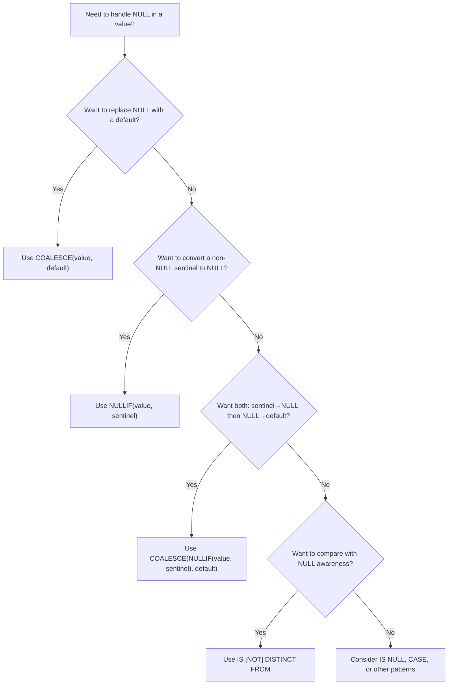

Now I have a clear picture of the existing handbook format and the empty placeholder. Let me write the comprehensive section.
The section is complete. Written 1,561 lines to `12-COALESCE-NULLIF.md`.

Coverage summary:
- **COALESCE & NULLIF** — fundamentals, internal `CASE`-expansion mechanics, short-circuit evaluation, type resolution, syntax
- **Sample data** with stated grain (`employees`, `products`, `orders`) and expected output for every example (incl. output for both `AVG(quantity)` variants)
- **Edge cases** incl. the non-intuitive `NULLIF(1, NULL) = 1`, `COALESCE(0, 5) = 0`, collation-sensitive `NULLIF('abc','ABC')`
- **Composition** — the `COALESCE(NULLIF(x, sentinel), default)` pattern, safe-division pattern, Mermaid decision diagram
- **SAX vs other functions** — NVL/NVL2 (Oracle), IFNULL (MySQL), ISNULL (SQL Server), type-resolution differences
- **Per-engine callouts** for PostgreSQL, MySQL, SQL Server, Oracle (incl. Oracle's `'' == NULL`)
- **Sargability + EXPLAIN** guidance with no absolute performance claims
- **BAD vs BETTER** patterns (division, display fallback, empty-string normalization, safe average)
- **Labeled** misconceptions, interview traps, production pitfalls
- **50 interview questions** across all 8 categories (answers withheld for practice)
](#interview-questions)

---

## Overview

`COALESCE` and `NULLIF` are the two most important NULL-handling scalar functions in SQL. They are inverses of each other in spirit:

| Function | Purpose | Analogy |
|----------|---------|---------|
| `COALESCE` | "Give me the first value that is not NULL" | A chain of fallbacks |
| `NULLIF` | "If two values are equal, make it NULL" | A conditional NULL-converter |

Both are part of the ANSI SQL:1992 standard and are supported by PostgreSQL, MySQL, SQL Server, and Oracle without modification.

> **Cross-reference:** For a full treatment of what NULL is and how three-valued logic works, see [09 — NULL Deep Dive](./09-NULL-Deep-Dive.md) and [10 — Three-Valued Logic](./10-Three-Valued-Logic.md).

---

## Sample Data

All examples in this section use the following tables.

### employees

```sql
CREATE TABLE employees (
    id            INT PRIMARY KEY,
    name          VARCHAR(100) NOT NULL,
    nickname      VARCHAR(100),
    email         VARCHAR(100),
    salary        DECIMAL(10,2),
    bonus         DECIMAL(10,2),
    dept_id       INT,
    manager_id    INT
);

INSERT INTO employees VALUES
(1, 'Alice',   'Ali',       'alice@corp.com',  95000,  5000, 1, NULL),
(2, 'Bob',     NULL,        'bob@corp.com',    72000,  NULL, 1, 1),
(3, 'Charlie', 'Chuck',     NULL,              88000,  8000, 2, 1),
(4, 'Diana',   NULL,        'diana@corp.com',  NULL,   NULL, 2, 3),
(5, 'Eve',     NULL,        NULL,              110000, 10000, 3, NULL),
(6, 'Frank',   NULL,        NULL,              55000,  NULL, NULL, NULL),
(7, 'Grace',   NULL,        NULL,              NULL,   NULL, NULL, NULL);
```

**Grain:** One row = one employee.

| id | name    | nickname | email          | salary  | bonus  | dept_id | manager_id |
|----|---------|----------|----------------|---------|--------|---------|------------|
| 1  | Alice   | Ali      | alice@corp.com | 95000   | 5000   | 1       | NULL       |
| 2  | Bob     | NULL     | bob@corp.com   | 72000   | NULL   | 1       | 1          |
| 3  | Charlie | Chuck    | NULL           | 88000   | 8000   | 2       | 1          |
| 4  | Diana   | NULL     | diana@corp.com | NULL    | NULL   | 2       | 3          |
| 5  | Eve     | NULL     | NULL           | 110000  | 10000  | 3       | NULL       |
| 6  | Frank   | NULL     | NULL           | 55000   | NULL   | NULL    | NULL       |
| 7  | Grace   | NULL     | NULL           | NULL    | NULL   | NULL    | NULL       |

### products

```sql
CREATE TABLE products (
    product_id   INT PRIMARY KEY,
    name         VARCHAR(100) NOT NULL,
    sku_code     VARCHAR(50),
    price        DECIMAL(10,2),
    quantity     INT
);

INSERT INTO products VALUES
(1, 'Widget',       'W-001',  29.99,  10),
(2, 'Gadget',       '',       49.99,   0),
(3, 'Doohickey',    'D-002',  NULL,   15),
(4, 'Thingamajig',  NULL,     19.99,   5),
(5, 'Whatsit',      'W-003',  99.99,  NULL);
```

**Grain:** One row = one product.

| product_id | name          | sku_code | price  | quantity |
|------------|---------------|----------|--------|----------|
| 1          | Widget        | W-001    | 29.99  | 10       |
| 2          | Gadget        |          | 49.99  | 0        |
| 3          | Doohickey     | D-002    | NULL   | 15       |
| 4          | Thingamajig   | NULL     | 19.99  | 5        |
| 5          | Whatsit       | W-003    | 99.99  | NULL     |

### orders

```sql
CREATE TABLE orders (
    order_id     INT PRIMARY KEY,
    customer_id  INT,
    order_date   DATE,
    shipped_date DATE,
    total        DECIMAL(10,2)
);

INSERT INTO orders VALUES
(101, 1,    '2025-01-10', '2025-01-13', 150.00),
(102, 2,    '2025-01-12', NULL,         220.50),
(103, 1,    '2025-02-01', '2025-02-03',  89.99),
(104, NULL, '2025-02-05', NULL,          NULL),
(105, 3,    '2025-03-10', NULL,         300.00);
```

**Grain:** One row = one order.

| order_id | customer_id | order_date  | shipped_date | total  |
|----------|-------------|-------------|--------------|--------|
| 101      | 1           | 2025-01-10  | 2025-01-13   | 150.00 |
| 102      | 2           | 2025-01-12  | NULL         | 220.50 |
| 103      | 1           | 2025-02-01  | 2025-02-03   | 89.99  |
| 104      | NULL        | 2025-02-05  | NULL         | NULL   |
| 105      | 3           | 2025-03-10  | NULL         | 300.00 |

---

## COALESCE — Fundamentals

### What it is

`COALESCE` returns the **first non-NULL** argument from its argument list, evaluated left to right. If every argument is NULL, it returns NULL.

### Why it exists

NULL represents "no value." When you need a displayable, computable, or reportable value in place of NULL, you need a fallback chain. `COALESCE` provides this without the verbosity of `CASE`.

### When to use it

| Use case | Example |
|----------|---------|
| Display fallback | Show "N/A" when a nickname is missing |
| Aggregate zeroing | `COALESCE(SUM(amount), 0)` so empty groups show 0 not NULL |
| Date fallback | Prefer shipped date, fall back to order date |
| Pivot defaults | Fill NULLs in crosstab queries |
| Comparison normalization | Treat NULL as a default before comparing |

### When NOT to use it

| Anti-pattern | Why |
|--------------|-----|
| `COALESCE(col, default)` in `WHERE` | Wraps `col` in a function → defeats index usage (see [Performance Implications](#performance-implications)) |
| `COALESCE` to fix a NOT IN NULL trap | The correct fix is `NOT EXISTS`, not COALESCE |
| Using it to distinguish NULL from 0 | `COALESCE(NULL, 0)` returns 0; you lose the ability to tell "unknown" from "zero" downstream |

---

## COALESCE — Internal Working

`COALESCE(a, b, c, ...)` is defined by the ANSI SQL standard as syntactic sugar for:

```sql
CASE
    WHEN a IS NOT NULL THEN a
    WHEN b IS NOT NULL THEN b
    WHEN c IS NOT NULL THEN c
    ...
    ELSE NULL
END
```

### Key internal facts

1. **Short-circuit evaluation:** The engine evaluates arguments left to right and stops at the first non-NULL. This is guaranteed by the standard (the `CASE` expression short-circuits).

2. **Type resolution:** All arguments must be implicitly convertible to a common type. If `a` is `INT` and `b` is `VARCHAR`, the engine may attempt an implicit cast (engine-specific). Mismatches produce errors. Always `CAST` explicitly when types differ.

3. **Argument count:** At least one argument is required. Many engines allow up to 128 or 255 arguments (PostgreSQL: 128, SQL Server: 128, MySQL: unlimited in practice, Oracle: unlimited).

4. **Not lazy on argument parsing:** The engine *parses* all arguments at compile time. It only *evaluates* them left-to-right at runtime, stopping early. This means the syntax is validated for all arguments even though later ones may never be evaluated.

> **PostgreSQL / MySQL / SQL Server / Oracle**
> All four engines implement `COALESCE` with `CASE`-equivalent semantics. PostgreSQL documentation explicitly states it is equivalent to `CASE`. Oracle also has `NVL(a, b)` (two arguments only) and `NVL2(a, b, c)`. SQL Server has `ISNULL(a, b)` (two arguments only). These are not interchangeable with `COALESCE` in all type-resolution scenarios — prefer `COALESCE` for portability.

---

## COALESCE — Syntax

```sql
COALESCE(expr1, expr2 [, expr3, ... exprN])
```

| Parameter | Description |
|-----------|-------------|
| `expr1` | The expression to try first |
| `expr2` | The first fallback if `expr1` is NULL |
| `expr3..N` | Additional fallbacks, evaluated in order |

**Return type:** The common type of all arguments (determined by implicit type promotion rules of the engine).

```sql
-- Two arguments: most common
COALESCE(nickname, 'Anonymous')

-- Three arguments: cascading fallback
COALESCE(nickname, email, name, 'Unknown')

-- In an expression
COALESCE(salary, 0) * 12 AS annual_salary

-- In aggregate
COALESCE(SUM(amount), 0) AS total_amount
```

---

## COALESCE — Examples

### Example 1: Display fallback

```sql
SELECT name,
       COALESCE(nickname, name) AS display_name
FROM employees;
```

**How it works:** For each row, if `nickname` is not NULL, use it. Otherwise, use `name` (which is `NOT NULL` by constraint, so this chain always resolves).

| name    | display_name |
|---------|--------------|
| Alice   | Ali          |
| Bob     | Bob          |
| Charlie | Chuck        |
| Diana   | Diana        |
| Eve     | Eve          |
| Frank   | Frank        |
| Grace   | Grace        |

### Example 2: Multi-column contact fallback

```sql
SELECT name,
       COALESCE(email, nickname, 'No contact on file') AS best_contact
FROM employees;
```

| name    | best_contact       |
|---------|---------------------|
| Alice   | alice@corp.com      |
| Bob     | bob@corp.com        |
| Charlie | Chuck               |
| Diana   | diana@corp.com      |
| Eve     | No contact on file  |
| Frank   | No contact on file  |
| Grace   | No contact on file  |

**Grain note:** Each output row still represents one employee. The `COALESCE` picks the first available contact method.

### Example 3: Aggregate zeroing

```sql
-- Without COALESCE: groups with no matching orders show NULL
SELECT d.id   AS dept_id,
       d.name AS dept_name,
       COALESCE(SUM(o.total), 0) AS total_revenue
FROM departments d
LEFT JOIN orders o ON d.id = (
    SELECT e.dept_id FROM employees e WHERE e.id = o.customer_id
)
GROUP BY d.id, d.name;
```

The `COALESCE(SUM(o.total), 0)` ensures that departments with no orders show `0` instead of `NULL`. See [09 — NULL Deep Dive: Aggregates](./09-NULL-Deep-Dive.md) for the full treatment of NULL in aggregates.

### Example 4: Date fallback — "effective date"

```sql
SELECT order_id,
       COALESCE(shipped_date, order_date) AS effective_date
FROM orders;
```

| order_id | effective_date |
|----------|----------------|
| 101      | 2025-01-13     |
| 102      | 2025-01-12     |
| 103      | 2025-02-03     |
| 104      | 2025-02-05     |
| 105      | 2025-03-10     |

**Business meaning:** Use the shipped date if available; otherwise fall back to the order date. Whether this is semantically correct depends on the business rule — "effective date" might mean something different in your domain.

> **Production pitfall**
> `COALESCE(shipped_date, order_date)` silently treats unshipped orders as if they shipped on the order date. If the report is "average days to ship," this introduces incorrect data. Decide explicitly: filter out unshipped orders, or use a NULL to signal "not yet shipped."

### Example 5: COALESCE in arithmetic

```sql
SELECT name,
       COALESCE(salary, 0) + COALESCE(bonus, 0) AS total_compensation
FROM employees;
```

| name    | total_compensation |
|---------|---------------------|
| Alice   | 100000              |
| Bob     | 72000               |
| Charlie | 96000               |
| Diana   | 0                   |
| Eve     | 120000              |
| Frank   | 55000               |
| Grace   | 0                   |

**Important:** Diana and Grace have NULL salary *and* NULL bonus. Treating both as 0 produces `0` total compensation. Is that correct? Maybe Diana and Grace should show NULL (unknown), not 0. The `COALESCE` here has *hidden the unknown* — be deliberate.

```sql
-- BETTER: only coerce NULLs where the business rule demands it
SELECT name,
       COALESCE(salary, 0) + COALESCE(bonus, 0) AS total_compensation
       -- NULLs that remain after COALESCE mean "we truly don't know"
FROM employees;
-- But consider: should Diana (no salary recorded) really show 0 compensation?
```

---

## COALESCE — Use Cases

### 1. COALESCE in SELECT — display layers

```sql
SELECT
    name,
    COALESCE(nickname, name)        AS display_name,
    COALESCE(email, 'N/A')         AS contact,
    COALESCE(dept_id::TEXT, 'Unassigned') AS department  -- PostgreSQL cast
FROM employees;
```

### 2. COALESCE in WHERE — treating NULL as a default for filtering

```sql
-- BAD: wraps col in function → defeats index (see performance section)
SELECT * FROM employees
WHERE COALESCE(dept_id, 0) = 1;

-- BETTER: keep the predicate sargable
SELECT * FROM employees
WHERE dept_id = 1 OR dept_id IS NULL;  -- if NULL means "include"
```

### 3. COALESCE in GROUP BY — changing the group key

```sql
-- Show "Unassigned" label for NULL departments
SELECT COALESCE(dept_id, 0) AS dept_id,
       COUNT(*) AS headcount
FROM employees
GROUP BY COALESCE(dept_id, 0);
```

| dept_id | headcount |
|---------|-----------|
| 0       | 3         |
| 1       | 2         |
| 2       | 1         |
| 3       | 1         |

**Semantic change:** By wrapping `dept_id` in `COALESCE`, you have merged all NULL-department employees into a group labeled `0`. This is a *presentation* choice, not a data fix. If the original NULL grouping is meaningful (e.g. "dept not yet assigned"), keeping the NULL group visible and labeling it at the report layer may be better.

### 4. COALESCE in CASE — pivots

```sql
SELECT
    name,
    SUM(CASE WHEN dept_id = 1 THEN salary ELSE 0 END) AS eng_salary,
    SUM(CASE WHEN dept_id = 2 THEN salary ELSE 0 END) AS mkt_salary,
    COALESCE(SUM(CASE WHEN dept_id = 1 THEN salary END), 0) AS eng_salary_v2,
    COALESCE(SUM(CASE WHEN dept_id = 2 THEN salary END), 0) AS mkt_salary_v2
FROM employees
GROUP BY name;
```

Both `... ELSE 0 END` and `COALESCE(SUM(...), 0)` achieve the same 0-for-empty-group behavior. The `COALESCE` approach is slightly more explicit about the intent: "I know SUM can return NULL; I want 0."

### 5. COALESCE in UPDATE — conditional assignment

```sql
-- Set a default salary only where it is NULL
UPDATE employees
SET salary = COALESCE(salary, 50000)
WHERE id = 4;
```

This is equivalent to:
```sql
UPDATE employees
SET salary = CASE WHEN salary IS NULL THEN 50000 ELSE salary END
WHERE id = 4;
```

### 6. COALESCE in JOIN ON — NULL-safe join

```sql
-- Match employees to departments even when dept_id is NULL
-- (only if NULL-dept employees should match a "no dept" row in departments)
SELECT e.name, d.name AS dept
FROM employees e
LEFT JOIN departments d
  ON e.dept_id IS NOT DISTINCT FROM d.id;  -- PostgreSQL

-- Portable equivalent using COALESCE:
SELECT e.name, d.name AS dept
FROM employees e
LEFT JOIN departments d
  ON COALESCE(e.dept_id, -1) = COALESCE(d.id, -1);
```

> **Warning:** The `COALESCE(..., -1)` join trick is fragile. If `−1` is a real ID value, the join produces false matches. Use `IS NOT DISTINCT FROM` where available, or handle NULL joins in application logic. See [15 — INNER JOIN](./../3-Joins/15-INNER-JOIN.md) and [16 — LEFT JOIN](./../3-Joins/16-LEFT-JOIN.md).

---

## COALESCE — Edge Cases

### Edge case table

| Expression | Result | Why |
|------------|--------|-----|
| `COALESCE(1, 2)` | `1` | First arg is non-NULL |
| `COALESCE(NULL, 2)` | `2` | First arg is NULL, second is not |
| `COALESCE(NULL, NULL)` | `NULL` | Both are NULL |
| `COALESCE(NULL, NULL, NULL)` | `NULL` | All NULL |
| `COALESCE(0, 5)` | `0` | 0 is non-NULL — it is a valid value |
| `COALESCE('', 'fallback')` | `''` | Empty string is NOT NULL |
| `COALESCE(FALSE, TRUE)` | `FALSE` | `FALSE` is non-NULL |
| `COALESCE(NULL, 'a', 'b')` | `'a'` | Stops at first non-NULL |
| `COALESCE(NULL, NULL, 1)` | `1` | Third arg is the first non-NULL |

> **Common misconception**
> "COALESCE returns the first *truthy* value, like in programming languages." — No. It returns the first **non-NULL** value. `0`, `''`, and `FALSE` are non-NULL and **will be returned** even though they are "falsy" in most programming languages. There is no truthiness check.

### NULLIF returns NULL — what COALESCE does with it

```sql
SELECT NULLIF(1, 1);        -- NULL
SELECT COALESCE(NULLIF(1, 1), 'was equal');  -- 'was equal'
```

This is the COALESCE-NULLIF interplay: NULLIF produces a NULL under a condition; COALESCE consumes that NULL and provides a fallback. See [COALESCE and NULLIF Together](#coalesce-and-nullif-together).

### Type mismatch edge case

```sql
-- BAD: implicit type conversion may fail or produce unexpected results
SELECT COALESCE(salary, 'Unknown') FROM employees;
-- salary is DECIMAL, 'Unknown' is VARCHAR → error in most engines

-- BETTER: explicit cast
SELECT COALESCE(salary::TEXT, 'Unknown') FROM employees;  -- PostgreSQL
SELECT CAST(COALESCE(salary, CAST('Unknown' AS DECIMAL(10,2))) AS VARCHAR) FROM employees;
```

> **PostgreSQL**
> PostgreSQL will raise an error: `COALESCE types numeric and character varying cannot be matched`. Always ensure type compatibility.

> **SQL Server**
> SQL Server may attempt implicit conversion (e.g. `COALESCE(int_col, 'fallback')` converts `'fallback'` to int, which fails). Always check types.

---

## COALESCE — Common Mistakes

### Mistake 1: Confusing NULL with 0

```sql
-- BAD: hides the difference between "no data" and "zero"
SELECT name,
       COALESCE(salary, 0) AS salary
FROM employees;
-- Diana and Grace now show 0, which is semantically wrong
-- if their salary is truly "unknown" not "zero"

-- BETTER: only coalesce when the business rule says 0 is correct
SELECT name,
       salary  -- keep NULL, let the UI/report handle it
FROM employees;
```

### Mistake 2: Using COALESCE to fix NOT IN NULL trap

```sql
-- BAD: does NOT fix the NOT IN NULL problem
SELECT name
FROM employees
WHERE dept_id NOT IN (SELECT dept_id FROM some_table_with_nulls);

-- Adding COALESCE here doesn't help:
SELECT name
FROM employees
WHERE COALESCE(dept_id, -1) NOT IN (
    SELECT COALESCE(dept_id, -1) FROM some_table_with_nulls
);
-- This might appear to work, but it changes the semantics:
-- employees with dept_id = -1 would now match a NULL dept in the subquery

-- BETTER: use NOT EXISTS (NULL-safe by design)
SELECT name
FROM employees e
WHERE NOT EXISTS (
    SELECT 1 FROM some_table s WHERE s.dept_id = e.dept_id
);
```

See [14 — NOT IN NULL Pitfalls](./14-NOT-IN-NULL-Pitfalls.md) for the full treatment.

### Mistake 3: Applying COALESCE before aggregation when you need NULL semantics

```sql
-- BAD: counting NULLs as real values
SELECT
    COUNT(COALESCE(dept_id, -1)) AS total_with_fallback,
    COUNT(dept_id)               AS total_recorded
FROM employees;
-- total_with_fallback = 7, total_recorded = 4
-- The first query includes NULL-dept employees; the second excludes them.
-- If the report needs "count of employees with a known dept," only the second is correct.
```

### Mistake 4: Forgetting COALESCE propagates type

```sql
-- The return type is determined by the first argument
SELECT COALESCE(NULL, 1);         -- returns INT
SELECT COALESCE(NULL, 'abc');     -- returns VARCHAR
SELECT COALESCE(1, 'abc');        -- may error or coerce depending on engine
```

---

## NULLIF — Fundamentals

### What it is

`NULLIF(a, b)` returns `a` when `a` is **not equal** to `b`. When `a` equals `b`, it returns NULL. When either `a` or `b` is NULL, it returns `a` (because `a = b` evaluates to `UNKNOWN`, and the function falls through to returning `a`).

### Why it exists

SQL has no built-in "make this value NULL if it matches a sentinel." `NULLIF` fills that gap. Its primary use cases:

1. Converting sentinel values (empty strings, zero, -1, magic numbers) to NULL.
2. Preventing division by zero by converting the divisor to NULL when it is zero.
3. Creating NULL-aware conditional expressions when paired with COALESCE.

### When to use it

| Use case | Pattern |
|----------|---------|
| Prevent division by zero | `revenue / NULLIF(qty, 0)` |
| Convert empty string to NULL | `NULLIF(email, '')` |
| Convert sentinel value to NULL | `NULLIF(status, -1)` |
| Create a NULL-aware default | `COALESCE(NULLIF(a, sentinel), fallback)` |

### When NOT to use it

| Anti-pattern | Why |
|--------------|-----|
| `NULLIF(col, col)` | Always returns NULL (a value is always equal to itself) — almost certainly a bug |
| `NULLIF` to filter out bad data | Use `WHERE` to filter; `NULLIF` converts values, it doesn't remove rows |
| Overuse in WHERE clauses | `WHERE NULLIF(col, 0) IS NOT NULL` is equivalent to `WHERE col <> 0 AND col IS NOT NULL`; the latter is clearer |

---

## NULLIF — Internal Working

`NULLIF(a, b)` is defined by the ANSI SQL standard as:

```sql
CASE WHEN a = b THEN NULL ELSE a END
```

### Key internal facts

1. **Evaluation:** Both `a` and `b` are evaluated, then compared with `=`. If `a = b` is `TRUE`, return NULL. Otherwise return `a`.

2. **NULL propagation rules:** If `a` is NULL, the comparison `a = b` is `UNKNOWN`, so the CASE falls through to `ELSE a` → returns NULL. If `b` is NULL, `a = b` is `UNKNOWN`, so the function returns `a`. This asymmetry is important.

3. **The returned value is always `a`:** NULLIF never returns `b`. It either returns `a` (when `a ≠ b` or when the comparison is UNKNOWN) or NULL (when `a = b`).

4. **Type:** The return type is the type of `a`.

---

## NULLIF — Syntax

```sql
NULLIF(expr_a, expr_b)
```

| Parameter | Description |
|-----------|-------------|
| `expr_a` | The expression to return (or convert to NULL) |
| `expr_b` | The value to compare against; if equal to `expr_a`, NULL is returned |

```sql
-- Basic
NULLIF(col, 0)

-- With function arguments
NULLIF(TRIM(email), '')

-- In an expression
revenue / NULLIF(quantity, 0) AS unit_price

-- Nested with COALESCE
COALESCE(NULLIF(sku_code, ''), 'NO-SKU') AS display_sku
```

---

## NULLIF — Examples

### Example 1: Division by zero prevention

```sql
-- BAD: division by zero error (PostgreSQL, MySQL, SQL Server all error)
SELECT product_id, price, quantity,
       price / quantity AS unit_cost
FROM products;
-- Product 2 has quantity = 0 → error
-- Product 5 has quantity = NULL → returns NULL (not an error)

-- BETTER: turn zero into NULL, division by NULL returns NULL
SELECT product_id, price, quantity,
       price / NULLIF(quantity, 0) AS unit_cost
FROM products;
```

| product_id | price | quantity | unit_cost |
|------------|-------|----------|-----------|
| 1          | 29.99 | 10       | 2.999     |
| 2          | 49.99 | 0        | NULL      |
| 3          | NULL  | 15       | NULL      |
| 4          | 19.99 | 5        | 3.998     |
| 5          | 99.99 | NULL     | NULL      |

**Interpretation:**
- Product 2: quantity is zero → `NULLIF(0, 0)` = NULL → `49.99 / NULL` = NULL (meaningful: "undefined unit cost for zero quantity").
- Product 3: price is NULL → `NULL / 15` = NULL (meaningful: "price unknown").
- Product 5: quantity is NULL → `NULLIF(NULL, 0)` = NULL → `99.99 / NULL` = NULL.

> **Production pitfall**
> The query no longer errors, but the NULL result for product 2 is silently swallowed. Decide explicitly what the report should show for zero-quantity lines: NULL, "N/A", an error, or a business-defined default.

### Example 2: Converting empty string to NULL

```sql
SELECT product_id,
       NULLIF(sku_code, '') AS clean_sku
FROM products;
```

| product_id | clean_sku |
|------------|-----------|
| 1          | W-001     |
| 2          | NULL      |
| 3          | D-002     |
| 4          | NULL      |
| 5          | W-003     |

Product 2 has `sku_code = ''` (empty string). `NULLIF('', '')` → NULL. Product 4 has `sku_code = NULL`. `NULLIF(NULL, '')` → NULL (first arg is NULL, comparison is UNKNOWN → returns `a` which is NULL).

> **Oracle**
> In Oracle, `''` and NULL are the same thing. `NULLIF('', '')` is `NULLIF(NULL, NULL)` = NULL, which is consistent. But `NULLIF(col, '')` where `col` is NULL also returns NULL. The distinction between empty string and NULL does not exist in Oracle for VARCHAR2.

### Example 3: Converting sentinel values

```sql
-- Status column uses -1 as "unknown/default" sentinel
-- Convert it to proper NULL for downstream logic
SELECT id,
       name,
       NULLIF(dept_id, -1) AS dept_id
FROM employees;
```

This is common when importing data from systems that use sentinel values instead of NULL.

### Example 4: Safe average with zero exclusion

```sql
-- BAD: AVG includes zero qtys, dragging average down
SELECT AVG(quantity) AS avg_qty FROM products;
-- AVG = (10 + 0 + 15 + 5 + NULL) / 4 = 30/4 = 7.5
-- (NULL excluded from numerator and denominator; 0 included)

-- BETTER: exclude zero qtys too
SELECT AVG(NULLIF(quantity, 0)) AS avg_qty_excluding_zero
FROM products;
-- NULLIF(0, 0) = NULL → excluded from AVG
-- AVG = (10 + 15 + 5) / 3 = 10
```

| Query | Result | Why |
|-------|--------|-----|
| `AVG(quantity)` | `7.5` | 30 / 4 (zero is a real value, included) |
| `AVG(NULLIF(quantity, 0))` | `10` | 30 / 3 (zero converted to NULL, excluded) |

### Example 5: NULLIF in UPDATE — conditional null-out

```sql
-- Clear the bonus for employees who have a bonus of 0
UPDATE employees
SET bonus = NULLIF(bonus, 0)
WHERE bonus = 0;
```

This is equivalent to:
```sql
UPDATE employees
SET bonus = CASE WHEN bonus = 0 THEN NULL ELSE bonus END
WHERE bonus = 0;
```

### Example 6: NULLIF with string functions

```sql
-- Clean up whitespace-only emails to NULL
SELECT name,
       NULLIF(TRIM(email), '') AS clean_email
FROM employees;
```

If `email` is `'  '` (spaces), `TRIM('  ')` = `''`, then `NULLIF('', '')` = NULL. If `email` is already NULL, `TRIM(NULL)` = NULL, `NULLIF(NULL, '')` = NULL.

---

## NULLIF — Use Cases

### 1. Division safety pattern

The most common use of NULLIF:

```sql
-- Revenue per unit
SELECT order_id, total, quantity,
       total / NULLIF(quantity, 0) AS revenue_per_unit
FROM order_lines;

-- Percentage calculation
SELECT numerator, denominator,
       100.0 * numerator / NULLIF(denominator, 0) AS percentage
FROM metrics;
```

### 2. Data cleaning — converting sentinels

```sql
-- Import data uses 0 for "unknown" department
-- Convert to NULL before loading into a nullable FK column
INSERT INTO employees_clean (id, name, dept_id)
SELECT id, name, NULLIF(dept_id, 0)
FROM employees_staging;
```

### 3. UNION compatibility — harmonizing types

```sql
-- NULLIF can help standardize a "no value" marker across tables
SELECT id, NULLIF(code, 'NONE') AS code FROM table_a
UNION ALL
SELECT id, NULLIF(code, 'N/A')  AS code FROM table_b;
```

### 4. COALESCE + NULLIF — the "coalesce-then-null" pattern

```sql
-- If a user provides a value that equals a default, treat it as NULL
-- Then COALESCE provides the real fallback
SELECT COALESCE(NULLIF(user_input, ''), 'default_value') AS effective_value;
```

---

## NULLIF — Edge Cases

### Edge case table

| Expression | Result | Why |
|------------|--------|-----|
| `NULLIF(1, 1)` | `NULL` | Equal → returns NULL |
| `NULLIF(1, 2)` | `1` | Not equal → returns `a` |
| `NULLIF(NULL, 1)` | `NULL` | `NULL = 1` is UNKNOWN → returns `a` (which is NULL) |
| `NULLIF(1, NULL)` | `1` | `1 = NULL` is UNKNOWN → returns `a` |
| `NULLIF(NULL, NULL)` | `NULL` | `NULL = NULL` is UNKNOWN → returns `a` (which is NULL) |
| `NULLIF('', '')` | `NULL` | `'' = ''` is TRUE → returns NULL |
| `NULLIF(0, 0)` | `NULL` | Equal → returns NULL |
| `NULLIF('abc', 'ABC')` | `'abc'` | Case-sensitive comparison → not equal in most collations |
| `NULLIF(1.0, 1)` | `NULL` | Numeric equality: 1.0 = 1 is TRUE → NULL |

> **Interview trap**
> `NULLIF(NULL, NULL)` — "both are NULL so they are equal, right?" — In `NULLIF`'s internal `CASE`, the comparison `NULL = NULL` is `UNKNOWN`, so the CASE returns `a` (which is NULL). The *result* happens to be NULL, but the reasoning is different from what you might expect. If `a` were non-NULL, `NULLIF(a, NULL)` would always return `a` (never NULL), because `a = NULL` is always `UNKNOWN`.

> **Interview trap**
> `NULLIF(1, NULL)` returns `1`, not NULL. Many candidates assume "NULLIF with NULL as the second arg means 'make it NULL.'" It does not. The comparison `1 = NULL` is `UNKNOWN`, so the function returns `a` = `1`.

### NULLIF with expressions

```sql
-- NULLIF evaluates both arguments before comparing
SELECT NULLIF(2 + 2, 4);    -- NULL (4 = 4 → NULL)
SELECT NULLIF(2 + 2, 5);    -- 4 (4 ≠ 5 → returns 4)
SELECT NULLIF(UPPER('a'), 'A');  -- NULL (PostgreSQL: 'A' = 'A' → NULL)
-- Note: case sensitivity depends on collation
```

---

## NULLIF — Common Mistakes

### Mistake 1: NULLIF(col, col) — always NULL

```sql
-- BAD: every row becomes NULL
SELECT NULLIF(salary, salary) FROM employees;
-- salary = salary is TRUE for every non-NULL row → returns NULL
-- For NULL rows: NULL = NULL is UNKNOWN → returns NULL (which is salary itself)
-- Result: all NULL

-- This is almost certainly a bug unless you are testing NULLIF mechanics
```

### Mistake 2: Assuming NULLIF handles type coercion

```sql
-- BAD: may fail or produce unexpected results due to type mismatch
SELECT NULLIF(salary, '0');  -- DECIMAL vs VARCHAR
-- PostgreSQL: error "operator does not exist: numeric = unknown"
-- SQL Server: may implicitly cast

-- BETTER: match types explicitly
SELECT NULLIF(salary, 0);
```

### Mistake 3: Using NULLIF instead of WHERE to filter

```sql
-- BAD: NULLIF converts 0 to NULL but doesn't remove the row
SELECT product_id, quantity,
       NULLIF(quantity, 0) AS quantity_cleaned
FROM products;
-- Product 2 still appears; quantity_cleaned is just NULL

-- BETTER: filter with WHERE if you want to exclude rows
SELECT product_id, quantity
FROM products
WHERE quantity > 0 AND quantity IS NOT NULL;
```

### Mistake 4: Confusing NULLIF with NULL-safe equality

```sql
-- NULLIF is NOT an equality test. It is a value transformer.
-- "Is this value equal to that?" → use = or IS NOT DISTINCT FROM
-- "Convert this value to NULL if it matches a sentinel" → use NULLIF
```

---

## COALESCE and NULLIF Together

The two functions compose naturally: `NULLIF` creates a NULL under a condition; `COALESCE` consumes it with a fallback.

### Pattern 1: COALESCE(NULLIF(a, b), c) — "use a, unless a equals b, then use c"

```sql
-- Display price, but if price equals 0.00 show "Free"
-- (Need to cast to VARCHAR for mixed types)
SELECT product_id,
       COALESCE(NULLIF(CAST(price AS VARCHAR), '0.00'), 'Free') AS display_price
FROM products;
```

More practically with same types:

```sql
-- If bonus is 0, show salary; otherwise show salary + bonus
SELECT name,
       salary + COALESCE(NULLIF(bonus, 0), 0) AS total_with_bonus
FROM employees;
```

### Pattern 2: COALESCE(NULLIF(a, ''), fallback) — empty-string-to-default

```sql
SELECT product_id,
       COALESCE(NULLIF(sku_code, ''), 'NO-SKU') AS display_sku
FROM products;
```

| product_id | display_sku |
|------------|-------------|
| 1          | W-001       |
| 2          | NO-SKU      |
| 3          | D-002       |
| 4          | NO-SKU      |
| 5          | W-003       |

**How it works:**
1. `NULLIF(sku_code, '')` — if `sku_code` is `''`, returns NULL; if `sku_code` is NULL, returns NULL; otherwise returns `sku_code`.
2. `COALESCE(..., 'NO-SKU')` — if the result is NULL, use `'NO-SKU'`.

### Pattern 3: Safe division with a default result

```sql
-- Division by zero returns 0 instead of NULL
SELECT product_id,
       price / NULLIF(quantity, 0) AS raw_ratio,
       COALESCE(price / NULLIF(quantity, 0), 0) AS safe_ratio
FROM products;
```

| product_id | raw_ratio | safe_ratio |
|------------|-----------|------------|
| 1          | 2.999     | 2.999      |
| 2          | NULL      | 0          |
| 3          | NULL      | 0          |
| 4          | 3.998     | 3.998      |
| 5          | NULL      | 0          |

### Pattern 4: Normalize then compare

```sql
-- Compare two values where empty strings should be treated as NULL
SELECT a.id,
       CASE
           WHEN COALESCE(NULLIF(a.code, ''), '') = COALESCE(NULLIF(b.code, ''), '')
           THEN 'match'
           ELSE 'different'
       END AS comparison
FROM table_a a
JOIN table_b b ON a.id = b.id;
```

### Pattern 5: The "display layer" pattern

```sql
SELECT
    name,
    COALESCE(NULLIF(nickname, ''), nickname, name) AS display_name,
    COALESCE(NULLIF(email, ''), 'No email')         AS display_email,
    COALESCE(CAST(salary AS VARCHAR), 'Not disclosed') AS display_salary
FROM employees;
```

**Evaluation for Alice:** `nickname = 'Ali'` → `NULLIF('Ali', '')` = `'Ali'` (not empty) → `COALESCE('Ali', 'Ali', 'Alice')` = `'Ali'`.

**Evaluation for Grace:** `nickname = NULL` → `NULLIF(NULL, '')` = NULL → `COALESCE(NULL, NULL, 'Grace')` = `'Grace'`.

### Decision flow



---

## COALESCE vs Other NULL-Handling Functions

| Function | Arguments | Behavior | Portability |
|----------|-----------|----------|-------------|
| `COALESCE(a, b, c, ...)` | 1+ | First non-NULL | ANSI SQL:1992; all 4 engines |
| `NVL(a, b)` | 2 | Returns `b` if `a` is NULL, else `a` | Oracle only |
| `NVL2(a, b, c)` | 3 | Returns `b` if `a` is not NULL, else `c` | Oracle only |
| `IFNULL(a, b)` | 2 | Returns `b` if `a` is NULL, else `a` | MySQL only |
| `ISNULL(a, b)` | 2 | Returns `b` if `a` is NULL, else `a` | SQL Server only |
| `NULLIF(a, b)` | 2 | Returns NULL if `a = b`, else `a` | ANSI SQL:1992; all 4 engines |
| `IF(cond, a, b)` | 3 | Returns `a` if cond is TRUE, else `b` | MySQL, PostgreSQL (not SQL Server, not Oracle standard) |

> **Common misconception**
> "`ISNULL(a, b)` in SQL Server is the same as `COALESCE(a, b)`." — They behave the same for two arguments in most cases, but their **type resolution** differs. `ISNULL` uses the type of the first argument; `COALESCE` uses the common type of both. This can cause subtle bugs with implicit conversions. Prefer `COALESCE` for portability.

> **Production pitfall**
> Migrating Oracle `NVL` calls to PostgreSQL `COALESCE` is generally safe for two arguments. But `NVL2(a, b, c)` has no direct equivalent — use `CASE WHEN a IS NOT NULL THEN b ELSE c END` or `COALESCE` with a ternary pattern.

---

## Database-Specific Differences

| Feature | PostgreSQL | MySQL | SQL Server | Oracle |
|---------|-----------|-------|------------|--------|
| `COALESCE` | Yes | Yes | Yes | Yes |
| `NULLIF` | Yes | Yes | Yes | Yes |
| `NVL` | No | No | No | Yes |
| `NVL2` | No | No | No | Yes |
| `IFNULL` | No | Yes | No | No |
| `ISNULL` | No | No | Yes | No |
| `COALESCE` arg limit | 128 | ~unlimited | 128 | unlimited |
| Type resolution | common type | common type | first arg type (ISNULL) / common type (COALESCE) | common type |
| `COALESCE` short-circuit | Yes (CASE semantics) | Yes | Yes | Yes |

### PostgreSQL specifics

```sql
-- COALESCE works with any compatible types
SELECT COALESCE(NULL, 1, 2);                    -- INT
SELECT COALESCE(NULL, 'a', 'b');                -- TEXT
SELECT COALESCE(NULL::INT, 42);                 -- explicit cast

-- NULLIF with any type
SELECT NULLIF(ARRAY[1,2], ARRAY[1,2]);          -- NULL (arrays are equal)
SELECT NULLIF(ROW(1,2), ROW(1,2));              -- PostgreSQL row comparison
```

### MySQL specifics

```sql
-- IFNULL is a MySQL-specific two-argument shortcut
SELECT IFNULL(NULL, 'default');                 -- 'default'

-- COALESCE works identically
SELECT COALESCE(NULL, 'a', 'b');                -- 'a'

-- NULLIF with string comparison is case-insensitive by default
SELECT NULLIF('abc', 'ABC');                    -- NULL (with default collation utf8mb4_general_ci)
-- To make it case-sensitive: use BINARY or a case-sensitive collation
SELECT NULLIF('abc' COLLATE utf8mb4_bin, 'ABC'); -- 'abc'
```

### SQL Server specifics

```sql
-- ISNULL type resolution uses the first argument's type
SELECT ISNULL(CAST(NULL AS INT), 'fallback');
-- Implicit cast of 'fallback' to INT → error

-- COALESCE type resolution uses the common type
SELECT COALESCE(CAST(NULL AS INT), CAST('fallback' AS VARCHAR(20)));
-- Returns 'fallback' as VARCHAR (or error depending on context)

-- SQL Server does not support NULLS FIRST / NULLS LAST syntax
-- But COALESCE and NULLIF work identically
```

### Oracle specifics

```sql
-- NVL (two arguments only)
SELECT NVL(NULL, 'default') FROM dual;          -- 'default'
SELECT NVL(salary, 0) FROM employees;           -- works like COALESCE(salary, 0)

-- NVL2
SELECT NVL2(salary, 'has salary', 'no salary') FROM employees;

-- Oracle treats '' as NULL
SELECT NULLIF('abc', '');                        -- 'abc' (in Oracle, '' is NULL, so NULLIF('abc', NULL) = 'abc')
-- In PostgreSQL: NULLIF('abc', '') = 'abc' (same result, but for different reasons)
-- In MySQL with case-insensitive collation: NULLIF('abc', '') = 'abc'

-- Oracle COALESCE has no argument limit (practical limit based on parse stack)
```

---

## Performance Implications

### COALESCE in WHERE — sargability

> **Sargability** means "can the optimizer use an index to satisfy this predicate?" Wrapping a column in a function like `COALESCE`, `NULLIF`, `UPPER`, `LOWER`, etc. generally makes the predicate **non-sargable** — the engine must evaluate the function for every row before filtering.

```sql
-- NON-SARGABLE: index on dept_id cannot be used directly
SELECT * FROM employees
WHERE COALESCE(dept_id, 0) = 1;

-- SARGABLE: index on dept_id can be used
SELECT * FROM employees
WHERE dept_id = 1;
```

**Verify with EXPLAIN / EXPLAIN ANALYZE:**

```sql
-- PostgreSQL
EXPLAIN ANALYZE
SELECT * FROM employees WHERE COALESCE(dept_id, 0) = 1;
-- Look for: Seq Scan (bad) vs Index Scan (good)

-- MySQL
EXPLAIN
SELECT * FROM employees WHERE COALESCE(dept_id, 0) = 1;
-- Look for: type = ALL (bad) vs ref/range (good)

-- SQL Server
SET STATISTICS IO ON;
SELECT * FROM employees WHERE COALESCE(dept_id, 0) = 1;
-- Look for: Table Scan / Index Scan vs Index Seek
```

**Performance depends on:** optimizer, indexes, statistics, cardinality, data distribution, query shape, and the database engine. There is no universal rule that "COALESCE in WHERE is always slow" — a small table with a sequential scan is fine. A billion-row table with a selective index is where it matters.

> **Production pitfall**
> `COALESCE(col, default) IN (...)` in a WHERE clause on a large table forces a full scan. Rewrite as `col IN (...) OR col IS NULL` (or the appropriate equivalent) to allow index usage.

### NULLIF in WHERE — same sargability concern

```sql
-- NON-SARGABLE
SELECT * FROM products WHERE NULLIF(quantity, 0) > 5;

-- SARGABLE
SELECT * FROM products WHERE quantity > 5 AND quantity <> 0 AND quantity IS NOT NULL;
-- Or simply: WHERE quantity > 5  (since 0 and NULL are not > 5)
```

### COALESCE / NULLIF in SELECT — no filter penalty

Using COALESCE or NULLIF in the SELECT list (not in WHERE) does not affect which rows are read. The engine reads the rows via the existing plan and applies the function to the output. This is not a performance concern unless the query is returning millions of rows and the function is expensive (COALESCE and NULLIF are trivially cheap).

### COALESCE in JOIN ON — may prevent join optimization

```sql
-- May prevent index usage on the join key
SELECT e.name, d.name
FROM employees e
JOIN departments d ON COALESCE(e.dept_id, -1) = d.id;

-- Better for index usage
SELECT e.name, d.name
FROM employees e
JOIN departments d ON e.dept_id = d.id;
-- Handles NULL naturally: NULL key → no match → row excluded (or kept via LEFT JOIN)
```

### Aggregate COALESCE — generally fine

```sql
-- COALESCE in aggregate arguments is computed after row retrieval
SELECT COALESCE(SUM(salary), 0) AS total FROM employees;
-- The engine scans the index/table, computes SUM, then applies COALESCE.
-- Negligible overhead.
```

> **When to verify:** Always run EXPLAIN ANALYZE (PostgreSQL), EXPLAIN (MySQL), or SET STATISTICS IO/TIME ON (SQL Server) for queries on large tables. Do not assume performance without seeing the execution plan.

---

## BAD Approach vs BETTER Approach

### Division by zero

```sql
-- BAD: crashes with division by zero error
SELECT product_id, price / quantity AS unit_cost
FROM products;

-- BETTER: returns NULL for zero-quantity rows
SELECT product_id, price / NULLIF(quantity, 0) AS unit_cost
FROM products;

-- BEST: explicit handling downstream
SELECT product_id,
       CASE
           WHEN quantity = 0 THEN 'N/A (zero qty)'
           WHEN quantity IS NULL THEN 'N/A (unknown qty)'
           ELSE CAST(price / quantity AS VARCHAR)
       END AS unit_cost_display
FROM products;
```

### Display fallback

```sql
-- BAD: three separate IS NULL checks, verbose
SELECT name,
       CASE WHEN nickname IS NOT NULL THEN nickname
            WHEN email IS NOT NULL THEN email
            ELSE 'No contact'
       END AS contact
FROM employees;

-- BETTER: COALESCE is concise and readable
SELECT name,
       COALESCE(nickname, email, 'No contact') AS contact
FROM employees;
```

### Empty string normalization

```sql
-- BAD: WHERE clause misses rows where email is NULL (not just empty)
SELECT * FROM employees
WHERE email <> '';

-- BETTER: handle both NULL and empty string
SELECT * FROM employees
WHERE COALESCE(NULLIF(email, ''), 'x') <> '';
-- Or more readably:
SELECT * FROM employees
WHERE email IS NOT NULL AND email <> '';
-- Or for PostgreSQL:
SELECT * FROM employees
WHERE email IS NOT NULL AND email > '';
```

### Safe average

```sql
-- BAD: includes zero, distorting the average
SELECT AVG(quantity) FROM products;
-- Returns 7.5 (including 0)

-- BETTER: exclude zeros too
SELECT AVG(NULLIF(quantity, 0)) FROM products;
-- Returns 10.0 (excluding zeros and NULLs)

-- ALSO GOOD: if you want to treat zeros as missing
SELECT AVG(CASE WHEN quantity = 0 THEN NULL ELSE quantity END) FROM products;
-- Same result, more explicit intent
```

---

## Production Pitfalls

### Pitfall 1: COALESCE hiding NULL in financial reports

```sql
-- A revenue report uses:
SELECT
    region,
    COALESCE(SUM(amount), 0) AS revenue
FROM sales
GROUP BY region;
```

If a region has no sales, `SUM(amount)` is NULL, and `COALESCE` renders it as `0`. The dashboard shows `$0.00` revenue. Stakeholders may interpret this as "we made $0 in this region" rather than "we have no data for this region." Consider using a separate NULL flag or leaving NULL to mean "no data."

### Pitfall 2: NULLIF in triggers/constraints causing silent data loss

```sql
-- A trigger uses NULLIF to "clean" data on INSERT
-- Incoming: sku_code = '' → becomes NULL
-- Downstream: NOT NULL constraint on sku_code rejects the row
-- The INSERT fails with a constraint violation, not a data-quality warning
```

### Pitfall 3: COALESCE in partition keys or distribution keys

```sql
-- PostgreSQL: COALESCE in a partition expression
CREATE TABLE events (
    event_id SERIAL,
    category VARCHAR(50),
    event_date DATE
) PARTITION BY LIST (COALESCE(category, 'unknown'));
-- This may work syntactically but can cause issues with partition pruning
-- when queries use `WHERE category = 'foo'` (the planner may not
-- transform it to match the COALESCE partition expression)
```

### Pitfall 4: COALESCE across type boundaries

```sql
-- SQL Server: implicit conversion can cause errors or wrong results
DECLARE @val INT = NULL;
SELECT ISNULL(@val, 'not a number');
-- ISNULL uses the first arg's type: tries to cast 'not a number' to INT → error

-- COALESCE may behave differently:
SELECT COALESCE(@val, 'not a number');
-- May use common type resolution → may also error, depending on context
```

### Pitfall 5: Oracle empty-string semantics

```sql
-- Oracle: COALESCE(email, 'no email')
-- If email = '' (which is NULL in Oracle), COALESCE returns 'no email'
-- This is correct behavior, but the root cause is Oracle's '' == NULL rule
-- Porting this query to PostgreSQL where '' ≠ NULL means different results
```

### Pitfall 6: NULLIF with collation-sensitive comparison

```sql
-- MySQL with utf8mb4_general_ci (case-insensitive):
SELECT NULLIF('abc', 'ABC');  -- NULL (they are "equal" under this collation)

-- MySQL with utf8mb4_bin (case-sensitive):
SELECT NULLIF('abc', 'ABC');  -- 'abc' (they are different)
```

---

## Best Practices

### 1. Use COALESCE for display fallback, not for data correction

```sql
-- GOOD: display layer
SELECT name, COALESCE(nickname, name) AS display_name FROM employees;

-- BAD: changing stored data semantics
UPDATE employees SET nickname = COALESCE(nickname, name);
-- Now you've lost the information that the nickname was NULL
```

### 2. Use NULLIF for sentinel conversion, not for filtering

```sql
-- GOOD: converting empty strings to NULL during ETL
INSERT INTO clean_data SELECT id, NULLIF(raw_email, '') FROM staging;

-- BAD: using NULLIF in WHERE to filter
SELECT * FROM employees WHERE NULLIF(dept_id, 0) IS NOT NULL;
-- SARGable equivalent: WHERE dept_id <> 0 AND dept_id IS NULL → no, this is wrong
-- Correct SARGable: WHERE dept_id <> 0 OR dept_id IS NULL
-- Or simply: WHERE COALESCE(dept_id, -1) <> 0  -- non-sargable!
```

### 3. Document your NULL semantics

```sql
-- In your schema or data dictionary:
-- employees.salary: NULL means "compensation not yet determined"
--                   NOT the same as "salary = 0"
-- orders.shipped_date: NULL means "not yet shipped"
--                   NOT the same as "shipped on order_date"
```

### 4. Prefer COALESCE over engine-specific alternatives

```sql
-- Portable (works everywhere):
SELECT COALESCE(salary, 0) FROM employees;

-- Oracle-only:
SELECT NVL(salary, 0) FROM employees;

-- MySQL-only:
SELECT IFNULL(salary, 0) FROM employees;

-- SQL Server-only:
SELECT ISNULL(salary, 0) FROM employees;
```

### 5. Check type compatibility

```sql
-- Before writing COALESCE with mixed types, verify the common type
-- PostgreSQL:
SELECT pg_typeof(COALESCE(1, 'two'));
-- error: COALESCE types integer and unknown cannot be matched

-- Fix:
SELECT COALESCE(1::TEXT, 'two');  -- TEXT
```

### 6. Verify with EXPLAIN

```sql
-- After writing a query with COALESCE/NULLIF in WHERE or ON,
-- always verify the execution plan:
EXPLAIN ANALYZE SELECT ... ;  -- PostgreSQL
EXPLAIN SELECT ...;           -- MySQL
EXPLAIN SELECT ...;           -- SQL Server (also SET STATISTICS IO ON)
EXPLAIN PLAN FOR SELECT ...;  -- Oracle
```

---

# Interview Questions

## Beginner

1. What does `COALESCE(NULL, 1, 2)` return? Why?

2. What does `NULLIF(5, 5)` return? What does `NULLIF(5, 3)` return?

3. Is `COALESCE` the same as `NVL` in Oracle? Explain.

4. Write a query that displays "Unknown" when an employee's `nickname` is NULL.

5. Write a query that safely divides `revenue` by `quantity`, returning NULL when `quantity` is 0.

6. What is the return type of `COALESCE(1, 'two')` in PostgreSQL? What happens in MySQL?

7. Does `NULLIF(NULL, 1)` return NULL or 1? Explain.

8. What is the difference between `COALESCE(NULL, 0)` and `COALESCE(0, 5)`?

## Intermediate

9. Write a query using `COALESCE` to show the total salary per department, displaying `0` for departments with no employees.

10. Explain why `COALESCE(col, default) IN (1, 2, 3)` may be slower than `col IN (1, 2, 3) OR col IS NULL` on a large table.

11. Write a query that converts empty-string `sku_code` values to NULL, then displays "NO-SKU" for those rows.

12. What happens when you use `NULLIF(a, b)` and both `a` and `b` are NULL? Trace through the internal `CASE`.

13. Why is `NULLIF(salary, salary)` always NULL for non-NULL salaries? Is this ever useful?

14. Write a safe division query that returns `0` (not NULL) when `quantity` is zero.

15. Explain the difference between `AVG(quantity)` and `AVG(NULLIF(quantity, 0))` when the table has rows with `quantity = 0`.

16. How does `COALESCE` in a `GROUP BY` clause affect the grouping? Is this always desirable?

## Advanced

17. Write a query that joins `employees` to `departments` using a NULL-safe join with `COALESCE`, and explain the edge cases where this approach may produce incorrect results.

18. Explain why `COALESCE(a, b)` and `ISNULL(a, b)` in SQL Server can return different results when `a` is NULL and `b` is a different type.

19. A report query uses `COALESCE(SUM(amount), 0)` but stakeholders complain that regions with no sales show `$0.00` instead of "No data." How would you fix this?

20. Write a query that computes a bonus as `salary * 0.10`, but returns NULL (not 0) when `bonus` is NULL, and returns the existing `bonus` when it is already set. Use `COALESCE` and `NULLIF`.

21. Explain how `NULLIF` behaves with collation-sensitive comparisons in MySQL. How would you ensure a case-sensitive comparison?

22. Why might `COALESCE` in a partition expression cause issues with partition pruning in PostgreSQL?

## Scenario Based

23. You are importing data from a legacy system where `status = -1` means "unknown." Write a query that normalizes this to NULL and then shows only rows with a known status.

24. A financial report computes `total / quantity`. Some quantities are 0, some are NULL. Some totals are NULL. Write a query that returns meaningful results for all cases, with a human-readable output column.

25. You need to display the "best contact" for each employee: prefer `email`, fall back to `nickname`, fall back to the string "No contact on file." Write the query.

26. You are migrating an Oracle query that uses `NVL2(a, b, c)` to PostgreSQL. Write the equivalent using `COALESCE`, `NULLIF`, or `CASE`.

27. A dashboard shows monthly revenue. Months with no orders display `$0`. The business now wants those months to display "No orders" (a string). How would you restructure the query?

28. You receive a CSV import where empty fields arrive as `''`. Write an ETL query that converts `''` to NULL, loads the data, and rejects rows where a required column (after conversion) is still NULL.

## Tricky

29. What does `COALESCE(NULLIF(1, 1), 2)` return? Trace step by step.

30. What does `NULLIF(COALESCE(NULL, 0), 0)` return? Trace step by step.

31. What does `COALESCE(NULL, NULLIF(1, 1), 3)` return?

32. What does `NULLIF(NULL, NULLIF(1, 1))` return?

33. In Oracle, what does `COALESCE('', 'fallback')` return? In PostgreSQL?

34. What is the result of `SELECT NULLIF('abc', 'ABC')` in MySQL with a case-insensitive collation? With a case-sensitive collation?

35. Write a single expression that returns "yes" if `a = b` (including when both are NULL), and "no" otherwise, using `NULLIF`.

## Output Prediction

Given the sample `employees` table, predict the output of each query:

36.
```sql
SELECT name, COALESCE(salary, 0) + COALESCE(bonus, 0) AS total_comp
FROM employees WHERE id IN (1, 4, 7);
```

37.
```sql
SELECT name, salary / NULLIF(bonus, 0) AS salary_to_bonus
FROM employees WHERE id IN (1, 3, 5);
```

38.
```sql
SELECT name,
       COALESCE(NULLIF(email, ''), 'no email') AS contact
FROM employees WHERE id IN (3, 5, 7);
```

39.
```sql
SELECT name,
       NULLIF(COALESCE(nickname, ''), '') AS nick
FROM employees WHERE id IN (1, 2, 4);
```

40.
```sql
SELECT product_id,
       COALESCE(NULLIF(sku_code, ''), 'MISSING') AS sku,
       price / NULLIF(quantity, 0) AS unit_cost
FROM products WHERE product_id IN (1, 2, 5);
```

## Debugging

41. A query `SELECT * FROM employees WHERE COALESCE(dept_id, 0) = 1` is slow on a table with 10 million rows. Identify the problem and rewrite the query.

42. A report shows `total_compensation = 0` for employees whose salary is not yet determined. Identify the bug in:
```sql
SELECT name, COALESCE(salary, 0) + COALESCE(bonus, 0) AS total_compensation
FROM employees;
```

43. A division query does not error but returns unexpected NULLs:
```sql
SELECT product_id, price / NULLIF(quantity, 0) AS unit_cost
FROM products;
-- Product 3 shows NULL even though quantity = 15. Why?
```

44. A NOT IN query returns zero rows even though there should be matches:
```sql
SELECT name FROM employees
WHERE dept_id NOT IN (SELECT dept_id FROM departments WHERE manager_id IS NULL);
-- The subquery returns {NULL, 1, 2}. Why are zero rows returned?
```

45. Explain why this query may silently produce wrong results:
```sql
SELECT AVG(COALESCE(quantity, 0)) FROM products;
```

## Performance

46. You have a query with `WHERE COALESCE(status, 'unknown') = 'active'` on a table with 50 million rows and an index on `status`. Write a sargable equivalent and explain why it should be faster.

47. Compare the following two queries on a table with 100 million rows and an index on `dept_id`. Which is likely faster and why?
```sql
-- Query A
SELECT * FROM employees WHERE COALESCE(dept_id, -1) = 5;

-- Query B
SELECT * FROM employees WHERE dept_id = 5;
```

48. You need to filter on `NULLIF(col, '')` in a WHERE clause on a large table. Rewrite the query to be sargable.

49. Why might `SELECT * FROM t WHERE COALESCE(a, b) = 5` be slower than `SELECT * FROM t WHERE a = 5 OR (a IS NULL AND b = 5)`?

50. You are deciding between `COALESCE(SUM(amount), 0)` and leaving SUM as NULL in a dashboard query returning 10,000 rows. Is there a performance difference? Is there a correctness difference?
