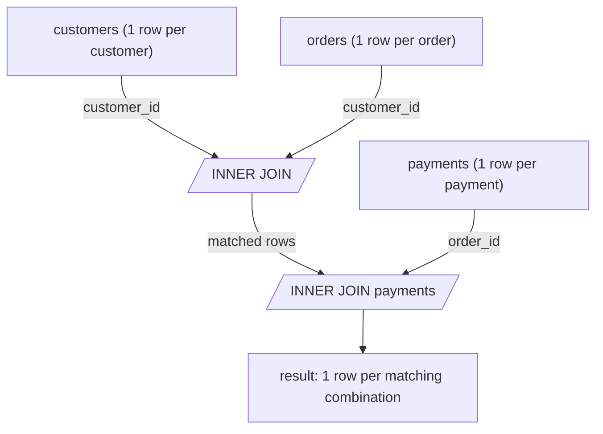

The section file is empty. I'll write the full INNER JOIN section matching the handbook's established style.
Written the complete INNER JOIN section to `sql-handbook/3-Joins/15-INNER-JOIN.md` (~700 lines).

It covers: fundamentals, grain-based mental model, ANSI + comma syntax, internal working (nested loop / hash / merge with EXPLAIN guidance), NULL behavior, ON vs WHERE, fan-out/double-counting, many-to-many, edge cases, comparison tables, best practices, a Mermaid diagram, dialect notes, and the full Interview Questions set (Beginner → Performance, no answers given for practice items).
**only the rows from both tables that satisfy the join condition**. Rows in either table with no match in the other table are excluded from the result.

### Why it exists

Relational databases split data into normalized tables so that each fact is stored once (see [Normalization section]). But analysis and applications usually need data that lives across several tables together. The JOIN is the mechanism that re-combines that data along relationships (like a foreign key).

### The mental model

Think of an INNER JOIN as a **filtered Cartesian product**:

1. Compute every possible combination of rows from table A and table B (the Cartesian product).
2. Keep only the combinations where the join condition evaluates to `TRUE`.
3. Discard everything else.

That is exactly how it behaves **logically**. Physically, an optimizer never materializes the full Cartesian product — it uses smarter algorithms (see [Internal Working]).

```
A ⋈ B  =  { (a, b) : a ∈ A, b ∈ B, AND condition(a, b) = TRUE }
```

### Venn diagram intuition

```
+------------+          +------------+
|     A      |          |    B       |
|   +-------------+     |            |
|   |   INNER    |     |            |
|   |   JOIN     |     |            |
|   +-------------+     |            |
+------------+          +------------+
     Only the intersection (matching rows) is returned.
```

> The classic "Venn diagram" of an INNER JOIN as an intersection is a useful intuition, but it is a **simplification**. A JOIN is not set intersection — it produces a combination of rows, and if either side contains duplicate keys, the result contains multiple combinations (fan-out), not a set.

---

## "One row in <table> represents one ..."

Always state the grain of each table before joining. It prevents most JOIN bugs. Throughout this section we use:

**customers** — *one row per customer.*

| customer_id | name    | country  |
|-------------|---------|----------|
| 1           | Alice   | USA      |
| 2           | Bob     | UK       |
| 3           | Carol   | Germany  |
| 4           | Dave    | NULL     |

**orders** — *one row per order.*

| order_id | customer_id | order_date  | amount |
|----------|-------------|-------------|--------|
| 101      | 1           | 2026-01-05  | 250.00 |
| 102      | 2           | 2026-01-07  | 120.50 |
| 103      | 1           | 2026-01-12  |  89.99 |
| 104      | 3           | 2026-01-20  | 450.00 |
| 105      | NULL        | 2026-02-01  |  30.00 |
| 106      | 5           | 2026-02-03  | 610.00 |

**Grain check:** `orders.customer_id` references `customers.customer_id`. Customer 4 (Dave) has no orders; order 105 has no customer; order 106 references customer 5, who does not exist in customers.

---

## Syntax

### ANSI SQL

```sql
SELECT columns
FROM table_A
INNER JOIN table_B
    ON table_A.key = table_B.key
WHERE <filters>;
```

`INNER` is optional — `JOIN` by itself means an inner join in all major databases.

```sql
SELECT columns
FROM table_A
JOIN table_B
    ON table_A.key = table_B.key;
```

### Order of clauses (logical processing)

The logical processing order is important (see [Logical Query Processing Order section]):

1. `FROM` (including `JOIN` and `ON`)
2. `WHERE`
3. `SELECT`
4. `ORDER BY`

The join happens **before** the `WHERE` filter. For an INNER JOIN this ordering often does not change the final result — you can mostly move predicates between `ON` and `WHERE` — but it matters for other JOIN types, and it matters for which rows the optimizer estimates.

### Simple example

```sql
SELECT c.name, o.order_id, o.amount
FROM customers c
JOIN orders o
    ON o.customer_id = c.customer_id;
```

### Expected result

| name  | order_id | amount |
|-------|----------|--------|
| Alice | 101      | 250.00 |
| Bob   | 102      | 120.50 |
| Alice | 103      |  89.99 |
| Carol | 104      | 450.00 |

**What happened:**

- Dave (customer 4) has no order → excluded.
- Order 105 has `customer_id = NULL` → excluded (see [NULL Behavior]).
- Order 106 references customer 5, which does not exist → excluded.

4 of 4 customers **with** orders appear; 2 customers are absent; 2 unmatchable orders are absent. **Readable as:** "every match between customers and orders."

---

## The Legacy Comma Syntax

Before the ANSI-92 `JOIN` syntax, joins were written with a comma and a `WHERE` condition:

```sql
-- Old, deprecated style
SELECT c.name, o.amount
FROM customers c, orders o
WHERE c.customer_id = o.customer_id;
```

> Production pitfall: If you forget the `WHERE` in comma-style joins, you silently get a Cartesian product. With explicit `JOIN ... ON`, forgetting the condition is a syntax error instead of a silent data bug. Always prefer the ANSI `JOIN` syntax.

There are also queries where you genuinely want a Cartesian product — but you should write it deliberately as `CROSS JOIN` so the intent is explicit.

---

## Internal Working

The engine evaluates an INNER JOIN with one of three physical algorithms chosen by the **optimizer**. You must never assume which one runs — inspect the **execution plan** (`EXPLAIN` / `EXPLAIN ANALYZE`, or the equivalent in your engine).

### 1. Nested Loop Join

For each row of the outer (driving) table, scan the inner table and check the condition.

- Good when one side is small and the other is indexed on the join column.
- This is what you get if `orders.customer_id` is indexed: for each customer, the engine performs an index lookup.

### 2. Hash Join

- Build a hash table on the smaller side, then probe it with rows from the larger side.
- Excels on large tables joined on equality, and on joins with no useful index, including inequality is not supported well (hash joins are equality-only in most engines).
- Common choice in production for big equi-joins.

### 3. Merge Join (Sort-Merge Join)

- Sorts both inputs on the join column (or reuses an existing index order), then walks both in lockstep.
- Requires equality (and sometimes inequality) conditions.
- Good when both sides are already sorted (e.g., an index that matches the ordering).
- Note: `MERGE JOIN` in SQL Server has a different meaning; the algorithm there is often called a **merge join / sort-merge join** too.

### Query shape → plan is a black box

Which algorithm wins depends on:

- optimizer version and settings
- indexes
- statistics / cardinality estimates
- data distribution (skew)
- available memory (`work_mem` in PostgreSQL, hash area in Oracle, `join_buffer_size` in MySQL)
- degrees of parallelism

> Common misconception: "The database always uses a specific join algorithm for INNER JOIN." Wrong. The optimizer picks per query. Two identical-looking queries can get completely different plans on different data volumes.

### How to look instead of guess

```sql
EXPLAIN ANALYZE
SELECT c.name, o.amount
FROM customers c
JOIN orders o ON o.customer_id = c.customer_id;
```

> PostgreSQL and MySQL
> `EXPLAIN ANALYZE` actually runs the query and reports actual rows and timings.

> SQL Server
> Use "Include Actual Execution Plan" in SSMS, or `SET STATISTICS IO, TIME ON;` and `SET SHOWPLAN_ALL ON;`.

> Oracle
> Use `EXPLAIN PLAN FOR` then `SELECT * FROM TABLE(DBMS_XPLAN.DISPLAY);`, or `DBMS_XPLAN.DISPLAY_CURSOR` for the actual plan.

The plan tells you the algorithm, whether an index was used, how many rows were estimated vs. actually produced, and where the cost lies.

---

## NULL Behavior

This is one of the most important subtleties of INNER JOIN.

**Example.** The rows with `customer_id = NULL` (order 105) and the missing customer 5 (order 106) are both dropped. But note the difference:

| Order | customer_id | Why dropped |
|-------|-------------|-------------|
| 105   | NULL        | `NULL = NULL` is UNKNOWN, never TRUE. |
| 106   | 5           | No row with `customer_id = 5` exists in customers. |

For a join condition `o.customer_id = c.customer_id`:

- If either side is `NULL`, the comparison evaluates to **UNKNOWN** (three-valued logic, see [NULL and Three-Valued Logic section]).
- INNER JOIN keeps a combination **only if the condition is TRUE**. Unknown is treated as false.
- Therefore **a NULL never matches anything, including another NULL.**

That is exactly the behavior of equality you saw in [NULL Comparisons section]. There is no default way to say "NULL matches NULL" in a plain join — you need `IS NOT DISTINCT FROM` (see [IS DISTINCT FROM section]) if you want NULLs to pair up:

```sql
SELECT c.name, o.amount
FROM customers c
JOIN orders o
    ON o.customer_id IS NOT DISTINCT FROM c.customer_id;
```

> Common misconception: "A NULL will match a NULL in a join because they look the same." It will not. Equality with NULL is UNKNOWN, and INNER JOIN requires TRUE.

> PostgreSQL, SQLite 3.39+, and some others support `IS NOT DISTINCT FROM`. MySQL older versions use `<=>`. Oracle supports `IS [NOT] DISTINCT FROM` only from 23c onward.

---

## When to Use INNER JOIN

Use an INNER JOIN when you need **columns from both tables** and you want **only rows that match**.

- Attach denormalized display data (customer name to an order).
- Combine facts that share a key (orders + payments).
- Validate that a reference actually exists (an order whose customer still exists).
- Build the working set for an aggregation that spans two tables.

## When NOT to Use INNER JOIN

- You need every row of the left table even without a match → use LEFT JOIN.
- You only need to know *whether* a match exists, not any columns from the other table → consider `EXISTS` (`EXISTS` stops at the first match and may be cheaper; see performance section).
- You want all combinations regardless of match → `CROSS JOIN`.
- You want rows that do *not* match → anti-join patterns: `LEFT JOIN ... WHERE ... IS NULL` or `NOT EXISTS`.

---

## Scenario-Based Examples

### Scenario 1: Attach customer information to orders

```sql
SELECT o.order_id, c.name AS customer, o.amount, o.order_date
FROM orders o
JOIN customers c ON c.customer_id = o.customer_id
ORDER BY o.order_id;
```

**Result** (5 rows, as shown in the syntax example). Orders without a matching customer are dropped.

### Scenario 2: Only customers who have placed at least one order

```sql
SELECT DISTINCT c.customer_id, c.name
FROM customers c
JOIN orders o ON o.customer_id = c.customer_id;
```

**Result:** Alice, Bob, Carol. Dave is absent because he has no orders. That is precisely "customers with at least one order."

An equivalent `WHERE EXISTS` form:

```sql
SELECT c.customer_id, c.name
FROM customers c
WHERE EXISTS (
    SELECT 1 FROM orders o WHERE o.customer_id = c.customer_id
);
```

Both are logically equivalent here, but evaluation strategy differs (see [Performance Implications]).

### Scenario 3: Aggregate across two tables — pay attention to grain

**orders** — *one row per order* (as above).

**payments** — *one row per payment.*

| payment_id | order_id | amount | paid_at    |
|------------|----------|--------|------------|
| 1          | 101      | 100.00 | 2026-01-06 |
| 2          | 101      | 150.00 | 2026-01-08 |
| 3          | 102      | 120.50 | 2026-01-09 |

Order 101 was paid in **two installments** — one-to-many. Joining orders to payments **multiplies** order 101 into two rows before aggregating.

```sql
SELECT o.order_id,
       o.amount        AS order_amount,
       SUM(p.amount)   AS paid_amount
FROM orders o
JOIN payments p ON p.order_id = o.order_id
GROUP BY o.order_id, o.amount;
```

**Result:**

| order_id | order_amount | paid_amount |
|----------|--------------|-------------|
| 101      | 250.00       | 250.00      |
| 102      | 120.50       | 120.50      |

**But watch the trap:** if you aggregate `SUM(o.amount)` in this same query instead of selecting it raw, the one-to-many join **double-counts** the order amount:

```sql
-- WRONG: order_amount is counted once per payment, so order 101 contributes 500.
SELECT o.order_id,
       SUM(o.amount) AS order_amount,   -- double counted!
       SUM(p.amount) AS paid_amount
FROM orders o
JOIN payments p ON p.order_id = o.order_id
GROUP BY o.order_id;
```

| order_id | order_amount | paid_amount |
|----------|--------------|-------------|
| 101      | 500.00       | 250.00      |

> Production pitfall: This is the **fan-out / double-counting** bug. Joining a one-to-many table and then aggregating a column from the *one* side inflates numbers. Best practice: aggregate the *many* side in a subquery/CTE first, then join:

```sql
SELECT o.order_id,
       o.amount      AS order_amount,
       p.paid_amount
FROM orders o
JOIN (
    SELECT order_id, SUM(amount) AS paid_amount
    FROM payments
    GROUP BY order_id
) p ON p.order_id = o.order_id;
```

Now order 101 appears once with `order_amount = 250` and `paid_amount = 250`.

### Scenario 4: Many-to-many join

**employees** — *one row per employee.*

| employee_id | name |
|-------------|------|
| 1           | Alice |
| 2           | Bob   |
| 3           | Carol |

**projects** — *one row per project.*

| project_id | project_name |
|------------|--------------|
| 10         | Apollo |
| 20         | Orion  |

**assignments** — *one row per (employee, project) pair.*

| employee_id | project_id |
|-------------|------------|
| 1           | 10         |
| 1           | 20         |
| 2           | 10         |

```sql
SELECT e.name, p.project_name
FROM employees e
JOIN assignments a ON a.employee_id = e.employee_id
JOIN projects p     ON p.project_id  = a.project_id
ORDER BY e.name, p.project_name;
```

**Result:**

| name  | project_name |
|-------|--------------|
| Alice | Apollo       |
| Alice | Orion        |
| Bob   | Apollo       |

Carol appears in no assignment, and Orion has no Bob — both correctly excluded. Multi-way joins chain through the assignment bridge table; each JOIN can multiply rows, so keep the grain in mind at every step.

---

## ON vs WHERE for INNER JOIN

For an INNER JOIN, moving a predicate between `ON` and `WHERE` **usually produces the same final result**, but their semantics and cost implications differ.

```sql
-- Same logical result:
SELECT c.name, o.amount
FROM customers c
JOIN orders o ON o.customer_id = c.customer_id AND o.amount > 100;

SELECT c.name, o.amount
FROM customers c
JOIN orders o ON o.customer_id = c.customer_id
WHERE o.amount > 100;
```

Both return Alice's 250/89.99 orders filtered to 250 and Bob's 120.50.

The difference matters for **outer** joins (see the LEFT JOIN section: moving a filter on the nullable side into `WHERE` converts it into an INNER JOIN), and for **optimizer statistics**: separate `ON` and `WHERE` predicates are easier for the optimizer than a single complex `ON` expression, so prefer the second form — put the join predicate in `ON`, filters in `WHERE`.

> Best practice: keep `ON` for the join relationship and `WHERE` for row filters.

> Interview trap: "Does `WHERE` before or after `JOIN` change the result of an INNER JOIN?" No — logically they are equivalent here. The distinction becomes critical with OUTER JOINs.

---

## Edge Cases

### 1. Empty table on one side

```sql
SELECT COUNT(*)
FROM customers c
JOIN (SELECT * FROM orders WHERE 1 = 0) o ON o.customer_id = c.customer_id;
```

**Result:** 0. An INNER JOIN against an empty set is empty regardless of the other side's size.

### 2. No matches at all

Joining customers to a table of orders placed by "signature-required" flags where none match still produces zero rows — **not** a NULL-extended row (that is LEFT JOIN behavior).

### 3. Duplicate keys in both tables

If duplicate keys exist on **both** sides, the result contains the product of the counts:

```sql
-- table u: (1), (1)   table v: (1), (1)
SELECT COUNT(*)
FROM u JOIN v ON u.k = v.k;   -- 4 rows
```

This is often an unexpected **deduplication of data** on row matching.

### 4. Out of order join conditions

`A JOIN B JOIN C` — with INNER JOIN, the associativity doesn't change the final result (all rows must satisfy all conditions), but it changes the *intermediate* row counts the optimizer sees, and thus potentially the chosen plan.

---

## Common Mistakes

1. **Forgetting the `ON` condition with comma syntax** → Cartesian product.
2. **Wrong join column** — joining `orders.customer_id = customers.customer_id` is correct, but joining `orders.order_id = customers.customer_id` is a silent logic error (types may even match, so it won't error).
3. **Assuming the join deduplicates** — duplicate keys multiply rows; the result can contain more rows than the largest table.
4. **Aggregating a column from the "one" side after a one-to-many join** → double counting.
5. **Not qualifying columns** — ambiguous column names raise errors in strict mode, but in some databases (MySQL) you may not get an error until you add certain conditions; always qualify.
6. **Mixing nullable and non-null keys** → NULL rows silently vanish.
7. **Joins on string columns with different collation/case** — matches may silently fail depending on collation.
8. **Joining with `OR` conditions** — can defeat index usage and produce less obvious plans. Compare with `UNION` of two joins.
9. **Implicit type conversion** — joining an int key to a varchar key requires the optimizer to cast, losing index usefulness (non-SARGable, see [sargability]).

---

## Performance Implications

Performance **depends** on:

- optimizer
- indexes
- statistics
- cardinality
- data distribution
- query shape
- database engine and version
- execution plan

There is no universal "fastest" join. Always verify with `EXPLAIN`/`EXPLAIN ANALYZE`.

### What helps

- **Index on the join column of the inner (probed) side** — enables index nested-loop joins. Without it, a large table gets a scan per probing row (as in a nested loop with full scans).
- **Statistics fresh** — the optimizer's row estimates drive hash/merge vs loop decisions; stale stats lead to bad plans.
- **Equality on the join key** — simplest conditions give the optimizer the most flexibility (hash/merge).
- **Filtered driving side** — shrink the result with `WHERE` early so the join processes fewer rows.

### SARGability reminder

A predicate that applies a function to the column (e.g., `ON EXTRACT(YEAR FROM o.order_date) = c.yr`) typically prevents an index seek and forces a scan on that column. Wrapping the join column in a function destroys its index usefulness. Prefer the raw column form:

```sql
-- BAD (wraps indexed column)
o.order_date > CURRENT_DATE - INTERVAL '30 days'

-- GOOD (column intact)
o.order_date > CURRENT_DATE - INTERVAL '30 days'
```

(Here both are SARGable; the point is: keep the bare column on its own side.)

### INNER JOIN vs EXISTS

When you join only to verify existence, you do not need the other table's columns. `EXISTS` can stop after the first matching row and duplicates don't fan out. You would verify with an execution plan, but as a starting hypothesis:

```sql
-- Hypothesis to test: better when you don't need customer columns
SELECT 1
FROM customers c
WHERE EXISTS (SELECT 1 FROM orders o WHERE o.customer_id = c.customer_id);
```

vs.

```sql
SELECT DISTINCT c.customer_id
FROM customers c
JOIN orders o ON o.customer_id = c.customer_id;
```

The second may scan all matching order rows and require a dedup. The first may return after the first match per customer. These can differ dramatically on large fan-outs — but only the plan proves it.

### Cartesian disaster

A forgotten `ON` causes a Cartesian product. With 1M customers and 3M orders that is 3 trillion rows before filtering. The plan would show a huge nested loop with no join key, or a cross join node.

---

## Comparison Table

| Operation | What it returns | NULL handling | When to prefer |
|-----------|----------------|---------------|----------------|
| `INNER JOIN ... ON` | Combines rows with `TRUE` condition | NULLs never match | Need columns from both; only matching rows |
| `LEFT JOIN ... ON` | All rows from left, NULLs for unmatched right | Left NULLs are padded | Preserve left rows even without match |
| `RIGHT JOIN` | Mirror of LEFT | Right rows padded | Rarely; flip the tables instead |
| `FULL OUTER JOIN` | Both sides preserved | Both padded | Compare two sets incl. differences |
| `CROSS JOIN` | Every combination | All combinations | Deliberate Cartesian products |
| `WHERE EXISTS` | No join duplication; existence test only | Uses equality semantics | Existence checks; avoid fan-out |
| `IN` / subquery | Set membership (see NULL caveats in NOT IN section) | NULLs can poison `NOT IN` | Membership checks |

---

## Best Practices

1. **Always state the grain** of each input table before writing the join.
2. **Use explicit `INNER JOIN ... ON`** instead of comma syntax.
3. **Alias all tables** (`FROM customers c`) and qualify every column (`c.name`).
4. **Keep `ON` for join relationships, `WHERE` for filters.**
5. **Verify with a count sanity check** before and after the join, especially when aggregating.
6. **Check for fan-out**: if `COUNT(*)` grows more than you expect, ask which table has duplicate keys.
7. **Never aggregate the "one" side of a one-to-many join without pre-aggregating the "many" side.**
8. **Use `EXPLAIN ANALYZE`** to confirm the plan, not guesses.
9. **Prefer equality joins** when possible.
10. **Match collation and types** of the join columns.

---

## Mermaid Diagram — Multi-table INNER JOIN flow



---

## A Note on ANSI vs Dialects

The `INNER JOIN ... ON` syntax is standard ANSI SQL and is supported uniformly across PostgreSQL, MySQL, SQL Server, and Oracle. Differences mostly surface in:

- `IS NOT DISTINCT FROM` / `<=>` (NULL matching),
- collation behavior on text keys,
- `EXPLAIN` output format,
- join algorithm availability (e.g., hash joins in MySQL 8/5.7; merge joins in PostgreSQL; parallel hash in some).

The SQL itself is portable.

---

# Interview Questions

## Beginner

1. Write a query that lists every order with its customer's name, using `orders` and `customers` joined on `customer_id`.
2. What is the difference between `JOIN` and `INNER JOIN`?
3. What happens to a customer who has no orders when you run an INNER JOIN between `customers` and `orders`?
4. What can go wrong if you write `FROM customers c, orders o` and forget the `WHERE` clause?
5. Write the same join using the legacy comma syntax and then using ANSI `JOIN`. Which is preferred and why?

## Intermediate

6. Given a one-to-many relationship `orders` → `payments`, why does `SUM(o.amount)` become wrong after the join?
7. Under what circumstances does an INNER JOIN return more rows than either input table?
8. What is the difference between putting a filter in the `ON` clause versus the `WHERE` clause of an INNER JOIN, if any?
9. Explain why a row where the joined key is `NULL` is excluded from an INNER JOIN — even if two NULLs "look the same".
10. When would you use `WHERE EXISTS` instead of an INNER JOIN even though both can express "customers with at least one order"?

## Advanced

11. Describe the three physical join algorithms a database may use for an INNER JOIN, and the conditions under which each typically wins.
12. A query joining two tables with duplicate keys on both sides produces unexpected rows. Explain the math of the fan-out and how to fix the design.
13. How would you refactor `SUM()` and `GROUP BY` across a one-to-many join to avoid double-counting, without pre-aggregation subqueries? What are the trade-offs?
14. Explain how `EXPLAIN ANALYZE` output (rows estimated vs actual, join node type) helps you decide between `NOT EXISTS`, a `LEFT JOIN`, and an INNER JOIN for a "find customers with no orders" problem.
15. A join on a `VARCHAR` key with a `COLLATE` mismatch silently misses rows. What is going on, and how would you detect it?

## Scenario Based

16. You have `orders` (grain: one row per order) and `payments` (grain: one row per payment). Write a query reporting total per-order amount paid, without inflating the order amount — and explain your approach.
17. A fraud analyst asks for "all customers who paid in full." Payments can be split. Write the query and warn about the double-counting trap.
18. Sales reports use an INNER JOIN and suddenly show fewer rows after a data migration. What would you investigate? List your checks in order.

## Tricky

19. What does this return, given the tables above?

    ```sql
    SELECT COUNT(*)
    FROM customers c
    JOIN orders o ON o.customer_id = c.customer_id
    JOIN orders o2 ON o2.customer_id = c.customer_id;
    ```

20. What is the output of joining a table to itself (`self-join`) on `a.id = b.id` when `id` values are `1,1,2,3,NULL`? Explain with row counts.
21. Why is this query likely wrong, and what does it return?

    ```sql
    SELECT o.order_id, o.amount
    FROM orders o
    JOIN customers c ON c.country = o.country;  -- 'country' doesn't even exist on orders
    ```

22. Predict the number of rows from an INNER JOIN on each column type: integer key with duplicates, nullable key, text key with a trailing-space mismatch.

## Output Prediction

23. Given the sample tables above, predict the exact rows returned by:

    ```sql
    SELECT c.name, o.amount
    FROM customers c
    JOIN orders o ON o.customer_id = c.customer_id
    WHERE c.country = 'USA';
    ```

24. Predict the result of:

    ```sql
    SELECT c.name, COUNT(o.order_id) AS orders
    FROM customers c
    JOIN orders o ON o.customer_id = c.customer_id
    GROUP BY c.name
    HAVING COUNT(o.order_id) >= 2;
    ```

## Debugging

25. A report shows double-counted revenue. The query joins `orders` to `payments` and sums both `orders.amount` and `payments.amount`. Where is the bug and how do you fix it?
26. A developer claims "the INNER JOIN dropped all my zero-revenue customers." Explain why that is expected and what join they should use to keep them.
27. The result has an unexpected 1,000 rows from 10 customers and 100 orders. What is the likely cause and how do you confirm it?

## Performance

28. On a large `orders` table, an INNER JOIN against `customers` runs a nested loop with full table scans. What would you change and what would you verify in the plan?
29. Compare joining with `EXISTS` vs an INNER JOIN with `SELECT DISTINCT` for "list customers who ordered." Design a test to measure which is faster on your database and data.
30. A join on a function-wrapped column (`TRIM(o.customer_id)`) ignores an index. Explain the non-SARGable issue and rewrite it, then say how you would confirm the index is used.