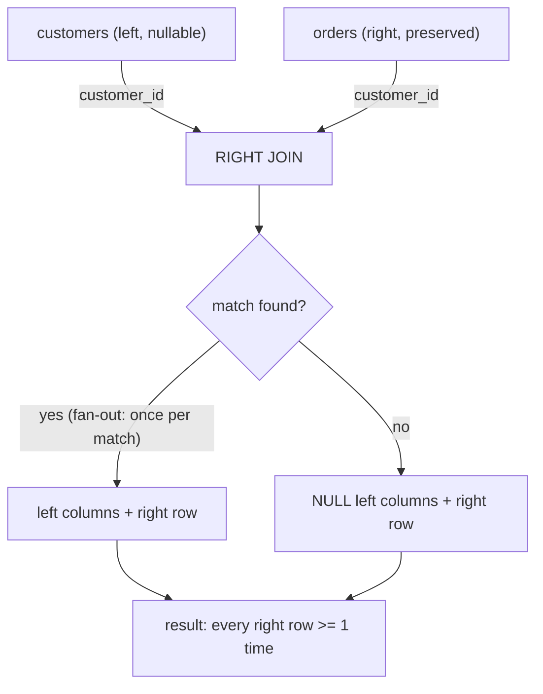
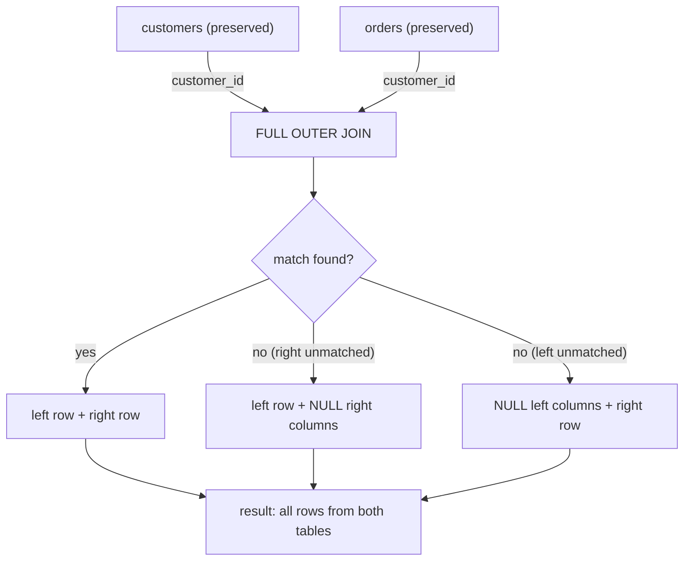
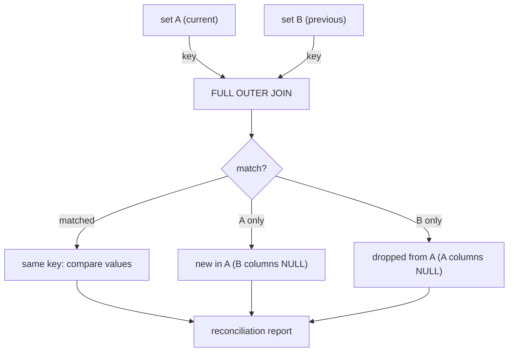

# 17 — RIGHT JOIN & FULL OUTER JOIN

A **RIGHT JOIN** (a.k.a. RIGHT OUTER JOIN) returns **every row from the right tablWrote the complete RIGHT & FULL JOIN section to `sql-handbook/3-Joins/17-RIGHT-FULL-JOIN.md`, consistent with the INNER/LEFT JOIN sections' style.

Key coverage:
- **Mental model** — both joins as preserved-side logic; FULL as both-sides preserved; `LEFT UNION RIGHT` vs true FULL
- **Grain check + sample tables** — reused from prior sections for direct contrast
- **RIGHT JOIN internals** — optimizer rewrites it to a LEFT JOIN internally (plan shows "Left" nodes), confirmed via EXPLAIN
- **FULL OUTER JOIN internals** — hash/merge full join; **MySQL lacks FULL OUTER JOIN** with a `UNION`-based emulation (and the `UNION ALL` dedup trap)
- **ON vs WHERE** — the silent RIGHT→INNER and FULL→INNER conversion traps
- **NULL behavior** — NULL padding from both sides, NULL keys never matching, country-group edge case
- **Scenarios** — empty departments + unassigned employees, slowly-changing dimension diff, two-system reconciliation, headcount with `COALESCE('Unassigned')`
- **Comparison tables, Mermaid diagrams, common mistakes, best practices, performance (EXPLAIN-verified)**
- **Interview Questions** — Beginner → Performance (36 items, left unanswered for practice)
 for matches in the left table using the `ON` condition.
3. If zero matches: emit the right row with all left columns `NULL`. If one or more matches: emit once per match (fan-out).

```
RIGHT(A, B) =
   { (a, b) : a ∈ A, b ∈ B, condition(a,b) = TRUE }
   ∪
   { (NULL..., b) : b ∈ B, and no a ∈ A satisfies condition(a,b) }
```

### FULL OUTER JOIN

The union of LEFT JOIN and RIGHT JOIN:

1. Start from **both** tables — every row from *either* side survives at least once.
2. Match rows where the `ON` condition is `TRUE`.
3. Unmatched rows from **both** sides are NULL-padded.

```
FULL(A, B) =
   { (a, b) : a ∈ A, b ∈ B, condition(a,b) = TRUE }
   ∪
   { (a, NULL...) : a ∈ A, and no b ∈ B satisfies condition(a,b) }
   ∪
   { (NULL..., b) : b ∈ B, and no a ∈ A satisfies condition(a,b) }
```

> Common misconception: "FULL OUTER JOIN is just a LEFT JOIN plus a RIGHT JOIN." It is not two separate joins stitched together — it is a single operation that preserves both sides simultaneously. A `LEFT JOIN UNION RIGHT JOIN` approximation works only if you carefully handle the overlap (matched rows appear in both halves and must be deduplicated with `UNION`, not `UNION ALL`).

---

## Grain Check — The Sample Tables

**customers** — *one row per customer.*

| customer_id | name  | country |
|-------------|-------|---------|
| 1           | Alice | USA     |
| 2           | Bob   | UK      |
| 3           | Carol | Germany |
| 4           | Dave  | NULL    |

**orders** — *one row per order.*

| order_id | customer_id | order_date | amount |
|----------|-------------|------------|--------|
| 101      | 1           | 2026-01-05 | 250.00 |
| 102      | 2           | 2026-01-07 | 120.50 |
| 103      | 1           | 2026-01-12 |  89.99 |
| 104      | 3           | 2026-01-20 | 450.00 |
| 105      | NULL        | 2026-02-01 |  30.00 |
| 106      | 5           | 2026-02-03 | 610.00 |

**departments** — *one row per department.*

| department_id | dept_name   |
|---------------|-------------|
| 10            | Engineering |
| 20            | Sales       |
| 30            | Marketing   |

**employees** — *one row per employee.*

| employee_id | name  | department_id |
|-------------|-------|---------------|
| 1           | Alice | 10            |
| 2           | Bob   | 10            |
| 3           | Carol | 20            |
| 4           | Dave  | NULL          |

**Key grain notes:**

- `customers` → `orders` is one-to-many.
- Dave (customer 4) has **no** orders; order 105 has a NULL `customer_id`; order 106 references nonexistent customer 5.
- `employees.department_id` can be NULL (Dave); Marketing (department 30) has **no** employees.

---

## Syntax

### RIGHT JOIN — ANSI SQL

```sql
SELECT <columns from A and/or B>
FROM table_A A
RIGHT JOIN table_B B
    ON A.key = B.key;
```

`RIGHT OUTER JOIN` is a synonym — `OUTER` is optional and adds no behavior.

### FULL OUTER JOIN — ANSI SQL

```sql
SELECT <columns from A and/or B>
FROM table_A A
FULL OUTER JOIN table_B B
    ON A.key = B.key;
```

`FULL JOIN` is a synonym (the `OUTER` keyword is optional).

### Oracle legacy syntax

Oracle pre-ANSI used the `(+)` marker on the nullable side:

```sql
-- RIGHT JOIN via (+) — Oracle legacy, avoid in new code
SELECT c.name, o.order_id
FROM customers c, orders o
WHERE c.customer_id(+) = o.customer_id;   -- (+) on the left side -> RIGHT JOIN

-- FULL OUTER JOIN: Oracle legacy had no direct (+) syntax for FULL.
-- You must UNION two queries:
SELECT c.name, o.order_id
FROM customers c, orders o
WHERE c.customer_id(+) = o.customer_id
UNION
SELECT c.name, o.order_id
FROM customers c, orders o
WHERE c.customer_id = o.customer_id(+);
```

> Production pitfall: Oracle's `(+)` syntax cannot express a FULL OUTER JOIN directly. If you see the `UNION` workaround in legacy Oracle code, that is why. In new code, use `FULL OUTER JOIN`.

---

## RIGHT JOIN — Simple Example

### Basic RIGHT JOIN: every order with its customer

```sql
SELECT c.customer_id, c.name, o.order_id, o.amount
FROM customers c
RIGHT JOIN orders o
    ON o.customer_id = c.customer_id
ORDER BY o.order_id;
```

**Expected result:**

| customer_id | name  | order_id | amount |
|-------------|-------|----------|--------|
| 1           | Alice | 101      | 250.00 |
| 2           | Bob   | 102      | 120.50 |
| 1           | Alice | 103      |  89.99 |
| 3           | Carol | 104      | 450.00 |
| NULL        | NULL  | 105      |  30.00 |
| NULL        | NULL  | 106      | 610.00 |

**What happened:**

- All 6 orders survive (right table is preserved).
- Order 105: `customer_id` is NULL → no match in customers → left columns are NULL-padded.
- Order 106: `customer_id` is 5, which does not exist in customers → NULL-padded.
- Dave (customer 4) has no orders → he is **not** in the result because he is on the left side and the RIGHT JOIN only preserves the right.

**Compare with LEFT JOIN:** if you flipped this to `orders LEFT JOIN customers`, you would get the same result. This is the key insight about RIGHT JOIN.

---

## FULL OUTER JOIN — Simple Example

### Every customer and every order, preserving both sides

```sql
SELECT c.customer_id, c.name, o.order_id, o.amount
FROM customers c
FULL OUTER JOIN orders o
    ON o.customer_id = c.customer_id
ORDER BY COALESCE(o.order_id, 9999), c.customer_id;
```

**Expected result:**

| customer_id | name  | order_id | amount |
|-------------|-------|----------|--------|
| 1           | Alice | 101      | 250.00 |
| 2           | Bob   | 102      | 120.50 |
| 1           | Alice | 103      |  89.99 |
| 3           | Carol | 104      | 450.00 |
| NULL        | NULL  | 105      |  30.00 |
| NULL        | NULL  | 106      | 610.00 |
| 4           | Dave  | NULL     | NULL   |

**What happened:**

- Every order is present (right-preserved): orders 101–106.
- Every customer is present (left-preserved): Alice, Bob, Carol, Dave.
- Dave has no order → his `order_id` and `amount` are NULL-padded.
- Orders 105 and 106 have no matching customer → their `customer_id` and `name` are NULL-padded.
- **7 rows** — more than either table alone. The FULL OUTER JOIN is the only join that can produce unmatched rows from *both* sides.

> Interview trap: "How many rows does a FULL OUTER JOIN return?" It depends — between `max(|A|, |B|)` and `|A| × |B|` in the worst case (with duplicates). It is not simply "the sum of both tables" or "the union."

---

## Internal Working

Like LEFT JOIN and INNER JOIN, the engine executes RIGHT JOIN and FULL OUTER JOIN using physical algorithms chosen by the optimizer. Always confirm with `EXPLAIN` / `EXPLAIN ANALYZE`.

### RIGHT JOIN internals

A RIGHT JOIN is logically a LEFT JOIN with the tables reversed. Most optimizers **physically rewrite** a RIGHT JOIN into a LEFT JOIN by flipping the table order internally. The plan will typically show a `Left Outer Join` node even when you wrote `RIGHT JOIN`:

```sql
EXPLAIN ANALYZE
SELECT c.name, o.order_id
FROM customers c
RIGHT JOIN orders o ON o.customer_id = c.customer_id;
```

> PostgreSQL: the plan node says `Hash Left Join` or `Nested Loop Left Join` — not "Right." The optimizer internally flips the join.
>
> SQL Server: the operator may appear as `Left Outer Join` with the build and probe inputs swapped.
>
> MySQL: `EXPLAIN` shows the join type; the actual algorithm depends on version and optimizer settings.

**Implication:** the physical row-reduction characteristics are identical to a LEFT JOIN — only the preserved side changes. The same three algorithms apply:

1. **Nested Loop** — iterate the preserved (right) table, probe the left with an index.
2. **Hash Join** — build on one side, probe with the other, retain unmatched preserved-side rows.
3. **Merge Join** — both sorted; unmatched preserved rows are null-extended.

### FULL OUTER JOIN internals

FULL OUTER JOIN is **more expensive** than LEFT or RIGHT JOIN because the engine must:

1. Find all matches (same as INNER JOIN).
2. Emit unmatched rows from **both** sides with NULL-padding.

Physical strategies:

- **Hash Full Outer Join** — build hash tables on both sides; probe each against the other; emit unmatched rows from both hash tables. This is the most common algorithm.
- **Merge Full Outer Join** — both inputs sorted; walk in lockstep emitting matches, then emit any remaining rows from either side with NULL-padding.

> PostgreSQL supports `FULL OUTER JOIN` natively with hash and merge strategies.
>
> **MySQL does NOT support `FULL OUTER JOIN` syntax** (as of MySQL 8.x). You must emulate it with `LEFT JOIN UNION RIGHT JOIN` (see [Emulating FULL OUTER JOIN in MySQL]).
>
> SQL Server supports `FULL OUTER JOIN` natively.
>
> Oracle supports `FULL OUTER JOIN` natively from 9i onward.

### Reading the plan

```sql
EXPLAIN ANALYZE
SELECT c.name, o.order_id
FROM customers c
FULL OUTER JOIN orders o ON o.customer_id = c.customer_id;
```

In PostgreSQL, look for a `Hash Full Join` or `Merge Full Join` node. In SQL Server, look for the `Full Outer Join` operator. The plan will show unmatched-row retention on **both** sides of the join.

---

## ON vs WHERE — Does It Matter for RIGHT and FULL?

The same rules as LEFT JOIN apply, but mirrored for RIGHT JOIN and doubled for FULL OUTER JOIN.

### RIGHT JOIN

A filter on the **left** table in `WHERE` (the non-preserved side) can silently convert the RIGHT JOIN into an INNER JOIN — the same trap as LEFT JOIN, just on the opposite side:

```sql
-- BAD: WHERE on the non-preserved side drops unmatched right rows
SELECT c.name, o.order_id
FROM customers c
RIGHT JOIN orders o ON o.customer_id = c.customer_id
WHERE c.country = 'USA';
```

Dave has no orders, so this does not affect Dave directly (he is on the non-preserved side). But if a right row (order) had no matching customer, the `c.country = 'USA'` test evaluates `NULL = 'USA'` → UNKNOWN → the row is dropped. The RIGHT JOIN degenerates to INNER JOIN for unmatched right rows.

**Fix:** put the filter on the left table in `ON` if you want to preserve all right rows:

```sql
SELECT c.name, o.order_id
FROM customers c
RIGHT JOIN orders o
    ON o.customer_id = c.customer_id
   AND c.country = 'USA'
ORDER BY o.order_id;
```

Now unmatched orders (105, 106) survive with NULL customer columns.

### FULL OUTER JOIN

Both sides can be NULL-padded, so `WHERE` filters on **either** side can drop unmatched rows:

```sql
-- Drops unmatched rows from BOTH sides
SELECT c.name, o.order_id
FROM customers c
FULL OUTER JOIN orders o ON o.customer_id = c.customer_id
WHERE c.country = 'USA' AND o.amount > 100;
```

- Dave (no orders) → `c.country = 'USA'` is UNKNOWN (NULL) → dropped.
- Orders 105, 106 (no customer) → `c.country = 'USA'` is UNKNOWN → dropped.

The query becomes an INNER JOIN. If you want to preserve unmatched rows from one or both sides, place filters in `ON`:

```sql
-- Preserve all customers AND all orders over 100
SELECT c.name, o.order_id, o.amount
FROM customers c
FULL OUTER JOIN orders o
    ON o.customer_id = c.customer_id
   AND o.amount > 100
ORDER BY c.customer_id, o.order_id;
```

> Production pitfall: FULL OUTER JOIN queries with complex `WHERE` clauses are extremely error-prone. Every filter on a nullable (padded) column risks silently converting the outer join into an inner join. Always verify with row counts.

---

## NULL Behavior

NULLs arise in RIGHT JOIN and FULL OUTER JOIN from three distinct causes, just like LEFT JOIN — but now from **both** sides.

### RIGHT JOIN — NULLs come from the left (non-preserved) side

```sql
SELECT c.name, o.order_id, o.amount
FROM customers c
RIGHT JOIN orders o ON o.customer_id = c.customer_id
ORDER BY o.order_id;
```

| order_id | name  | amount |
|----------|-------|--------|
| 101      | Alice | 250.00 |
| 102      | Bob   | 120.50 |
| 103      | Alice |  89.99 |
| 104      | Carol | 450.00 |
| 105      | NULL  |  30.00 |
| 106      | NULL  | 610.00 |

- Order 105: `customer_id` is NULL → no match → `c.name` is NULL-padded.
- Order 106: `customer_id` is 5, no match → NULL-padded.

### FULL OUTER JOIN — NULLs from both sides

```sql
SELECT c.name, o.order_id
FROM customers c
FULL OUTER JOIN orders o ON o.customer_id = c.customer_id
ORDER BY COALESCE(o.order_id, 9999);
```

- Dave: `o.order_id` = NULL (no match on right) — left row preserved, right side NULL.
- Orders 105, 106: `c.name` = NULL (no match on left) — right rows preserved, left side NULL.

### NULL join keys

If the right table's join key is NULL (order 105), the condition `o.customer_id = c.customer_id` evaluates to `NULL = anything` → UNKNOWN → no match. **NULL never matches anything in a plain equality join, including another NULL.** To match NULLs to NULLs, use `IS NOT DISTINCT FROM` (PostgreSQL, SQLite 3.39+), `<=>` (MySQL), or `IS [NOT] DISTINCT FROM` (Oracle 23c+).

### FULL OUTER JOIN with NULL keys on both sides

```sql
-- If both customers and orders can have NULL in the join key
-- NULL customers and NULL orders will NOT match each other with =
-- Both will appear as unmatched (NULL-padded on the other side)
```

> This is almost never the desired behavior. If NULL keys are common, consider defaulting them to a sentinel value (e.g., -1) before joining, or use `IS NOT DISTINCT FROM` — but beware that every NULL will then pair with every NULL, potentially creating a Cartesian product of NULLs.

---

## Scenario-Based Examples

### Scenario A — Every department with its employees, including empty departments and unassigned employees

```sql
SELECT d.dept_name, e.name
FROM departments d
FULL OUTER JOIN employees e ON e.department_id = d.department_id
ORDER BY d.dept_name, e.name;
```

**Expected result:**

| dept_name   | name  |
|-------------|-------|
| Engineering | Alice |
| Engineering | Bob   |
| Marketing   | NULL  |
| Sales       | Carol |
| NULL        | Dave  |

**What happened:**

- Engineering: 2 employees matched.
- Sales: 1 employee matched.
- Marketing: no employees → `e.name` = NULL. Department preserved (FULL).
- Dave: `department_id` is NULL → no match → `d.dept_name` = NULL. Employee preserved (FULL).

This is the canonical use case for FULL OUTER JOIN: **two dimensions with orphans on both sides.**

Compare with `departments LEFT JOIN employees`: Marketing would appear but Dave would not. Compare with `departments RIGHT JOIN employees`: Dave would appear but Marketing would not. Only FULL OUTER JOIN shows both.

### Scenario B — Compare two versions of a dimension (slowly changing)

**current_products** — *one row per product (current catalog).*

| product_id | product_name | price |
|------------|--------------|-------|
| 1          | Widget       | 10.00 |
| 2          | Gadget       | 25.00 |
| 3          | Gizmo        | 15.00 |

**previous_products** — *one row per product (last quarter's catalog).*

| product_id | product_name | price |
|------------|--------------|-------|
| 1          | Widget       |  8.00 |
| 2          | Gadget       | 25.00 |
| 4          | Doohickey    | 30.00 |

```sql
SELECT
    COALESCE(c.product_id, p.product_id) AS product_id,
    c.product_name                       AS current_name,
    p.product_name                       AS previous_name,
    c.price                              AS current_price,
    p.price                              AS previous_price
FROM current_products c
FULL OUTER JOIN previous_products p ON p.product_id = c.product_id
ORDER BY product_id;
```

**Expected result:**

| product_id | current_name | previous_name | current_price | previous_price |
|------------|--------------|---------------|---------------|----------------|
| 1          | Widget       | Widget        | 10.00         | 8.00           |
| 2          | Gadget       | Gadget        | 25.00         | 25.00          |
| 3          | Gizmo        | NULL          | 15.00         | NULL           |
| 4          | NULL         | Doohickey     | NULL          | 30.00          |

- Product 1: price changed (8 → 10).
- Product 2: unchanged.
- Product 3: new in current (no previous) → `previous_name`/`previous_price` = NULL.
- Product 4: discontinued (no current) → `current_name`/`current_price` = NULL.

> Production pitfall: this pattern is extremely useful for data reconciliation, audit, and slowly changing dimension analysis. It is one of the strongest reasons to learn FULL OUTER JOIN.

### Scenario C — Reconciliation: find mismatches between two systems

```sql
-- orders in system A but not in system B, and vice versa
SELECT
    COALESCE(a.order_id, b.order_id) AS order_id,
    a.amount AS amount_a,
    b.amount AS amount_b
FROM system_a_orders a
FULL OUTER JOIN system_b_orders b ON b.order_id = a.order_id
WHERE a.order_id IS NULL        -- in B but not A
   OR b.order_id IS NULL        -- in A but not B
   OR a.amount <> b.amount;     -- in both but different
```

> This "diff" pattern is a core production use case for FULL OUTER JOIN.

### Scenario D — RIGHT JOIN to emphasize the "right" table as the subject

Sometimes RIGHT JOIN reads more naturally when the right table is the focus:

```sql
-- "Show every order, and which customer placed it, if any"
SELECT c.name AS customer, o.order_id, o.amount
FROM customers c
RIGHT JOIN orders o ON o.customer_id = c.customer_id
ORDER BY o.order_id;
```

This is semantically identical to:

```sql
SELECT c.name AS customer, o.order_id, o.amount
FROM orders o
LEFT JOIN customers c ON c.customer_id = o.customer_id
ORDER BY o.order_id;
```

> Best practice: prefer LEFT JOIN for readability. Most SQL developers find `FROM primary_table LEFT JOIN secondary_table` easier to follow than RIGHT JOIN. Use RIGHT JOIN only when it makes the query meaningfully clearer (e.g., when the right table is already written first in a complex subquery chain).

### Scenario E — Headcount report with unassigned employees

```sql
SELECT
    COALESCE(d.dept_name, 'Unassigned') AS department,
    COUNT(e.employee_id)                AS headcount
FROM departments d
FULL OUTER JOIN employees e ON e.department_id = d.department_id
GROUP BY COALESCE(d.dept_name, 'Unassigned')
ORDER BY headcount DESC;
```

**Expected result:**

| department   | headcount |
|--------------|-----------|
| Engineering  | 2         |
| Sales        | 1         |
| Unassigned   | 1         |
| Marketing    | 0         |

Both empty departments (Marketing) and unassigned employees (Dave) are visible. A `departments LEFT JOIN employees` would miss Dave; an `employees LEFT JOIN departments` would miss Marketing.

---

## Emulating FULL OUTER JOIN in MySQL

MySQL does not support `FULL OUTER JOIN` syntax. The standard emulation uses `LEFT JOIN UNION RIGHT JOIN`:

```sql
SELECT c.customer_id, c.name, o.order_id, o.amount
FROM customers c
LEFT JOIN orders o ON o.customer_id = c.customer_id

UNION

SELECT c.customer_id, c.name, o.order_id, o.amount
FROM customers c
RIGHT JOIN orders o ON o.customer_id = c.customer_id;
```

`UNION` (not `UNION ALL`) deduplicates matched rows that appear in both halves. This is logically correct but:

- `UNION` adds a deduplication step (sorting or hashing), which has a cost.
- The two halves are independent scans/joins, so the optimizer cannot merge them into a single pass.

> Production pitfall: if you use `UNION ALL` instead of `UNION`, matched rows appear twice — once from the LEFT JOIN half and once from the RIGHT JOIN half. Always use `UNION` for this emulation.

A workaround that avoids the double-join:

```sql
SELECT COALESCE(c.customer_id, o.customer_id) AS customer_id,
       c.name, o.order_id, o.amount
FROM customers c
LEFT JOIN orders o ON o.customer_id = c.customer_id

UNION ALL

SELECT o.customer_id, NULL, o.order_id, o.amount
FROM orders o
LEFT JOIN customers c ON c.customer_id = o.customer_id
WHERE c.customer_id IS NULL;    -- only the unmatched right rows
```

This is more efficient: the LEFT JOIN handles all matched rows plus unmatched customers, and the second half adds only unmatched orders.

---

## Edge Cases

### 1. Empty table on one side — FULL OUTER JOIN

```sql
SELECT c.name, o.order_id
FROM customers c
FULL OUTER JOIN (SELECT * FROM orders WHERE 1 = 0) o
    ON o.customer_id = c.customer_id;
```

Every customer appears with NULL order columns. The empty right side contributes no rows. A FULL OUTER JOIN against an empty table degrades to a LEFT JOIN in behavior.

### 2. Both sides empty

```sql
FROM (SELECT * FROM customers WHERE 1 = 0) c
FULL OUTER JOIN (SELECT * FROM orders WHERE 1 = 0) o ON 1 = 1;
```

Zero rows. Neither side has anything to preserve.

### 3. All rows match (FULL OUTER JOIN = INNER JOIN)

If every row in both tables has a match, the FULL OUTER JOIN returns exactly the same result as an INNER JOIN. The NULL-padded sections are empty because there are no unmatched rows. This is a useful sanity check: if your FULL OUTER JOIN returns more rows than your INNER JOIN, there are orphans on one or both sides.

### 4. Duplicate keys — fan-out on both sides

If both tables have duplicate join keys, the result contains the **Cartesian product** of the duplicates:

```sql
-- If customers has two rows with customer_id=1
-- and orders has three rows with customer_id=1
-- FULL OUTER JOIN produces 2 × 3 = 6 rows for customer_id=1
```

Additionally, unmatched rows from both sides are NULL-padded. The result can be much larger than either input.

### 5. RIGHT JOIN with chained joins

```sql
FROM customers c
RIGHT JOIN orders o ON o.customer_id = c.customer_id
LEFT JOIN payments p ON p.order_id = o.order_id;
```

The RIGHT JOIN preserves every order. The subsequent LEFT JOIN then tries to match payments. If the LEFT JOIN's `ON` condition references a NULL-padded column (from an unmatched customer), it evaluates to UNKNOWN and the LEFT JOIN does not match — `p` columns become NULL. Chained outer joins propagate NULL-padding forward.

### 6. FULL OUTER JOIN with GROUP BY

```sql
SELECT c.country, COUNT(o.order_id) AS order_count
FROM customers c
FULL OUTER JOIN orders o ON o.customer_id = c.customer_id
GROUP BY c.country;
```

- Countries with customers who have orders → positive count.
- Countries with customers who have no orders → count is 0 (if using `COUNT(o.order_id)`).
- Orders with NULL customer (country is NULL) → grouped under NULL country.

> Edge case: `COUNT(*)` counts the NULL-padded row for Dave → Dave's country shows `1` even though he has no orders. Use `COUNT(o.order_id)` for correct counts.

### 7. FULL OUTER JOIN on a self-referencing comparison

```sql
-- Compare this year's sales to last year's, per product
SELECT COALESCE(this.product_id, prev.product_id) AS product_id,
       COALESCE(this.sales, 0) AS this_year,
       COALESCE(prev.sales, 0) AS last_year
FROM (SELECT product_id, SUM(amount) AS sales FROM orders
      WHERE order_date >= '2026-01-01' GROUP BY product_id) this
FULL OUTER JOIN (SELECT product_id, SUM(amount) AS sales FROM orders
      WHERE order_date < '2026-01-01' GROUP BY product_id) prev
    ON prev.product_id = this.product_id
ORDER BY product_id;
```

Products new this year: `last_year` = 0. Products discontinued: `this_year` = 0.

---

## Common Mistakes

1. **Forgetting that MySQL does not support FULL OUTER JOIN** → syntax error. Use the `LEFT JOIN UNION RIGHT JOIN` emulation.
2. **Using `UNION ALL` instead of `UNION` in the MySQL emulation** → duplicate matched rows.
3. **Filtering on the non-preserved side in WHERE** → silently converts RIGHT/FULL to INNER JOIN.
4. **Assuming FULL OUTER JOIN deduplicates** → it does not; duplicate keys cause fan-out.
5. **Using `COUNT(*)` to count matches** → counts NULL-padded rows; use `COUNT(table.key)`.
6. **Not using COALESCE for the join key in SELECT** → the key can be NULL from either side in a FULL OUTER JOIN; unqualified references may be ambiguous.
7. **Choosing RIGHT JOIN when LEFT JOIN reads better** → maintainability suffers; most developers expect `FROM primary LEFT JOIN secondary`.
8. **Chaining outer joins without understanding NULL propagation** → a NULL from the first join can silently prevent matches in subsequent joins.
9. **Forgetting that FULL OUTER JOIN includes unmatched rows from BOTH sides** → can produce surprise duplicates if the data has orphans you did not expect.
10. **Joining on the wrong column** → always verify the join key references the correct relationship.

---

## Comparison Table

| Operation | Preserved side(s) | NULL-padded side(s) | Typical use |
|-----------|-------------------|----------------------|-------------|
| `INNER JOIN` | Neither (only matches) | Neither | Combine matched data only |
| `LEFT JOIN` | Left | Right | "All of A, with B if any" |
| `RIGHT JOIN` | Right | Left | "All of B, with A if any" (prefer flipping to LEFT) |
| `FULL OUTER JOIN` | Both | Both | Compare two sets; show orphans on both sides |

### RIGHT JOIN vs LEFT JOIN (flipped)

```sql
-- These produce the same result:
SELECT c.name, o.order_id
FROM customers c RIGHT JOIN orders o ON o.customer_id = c.customer_id;

SELECT c.name, o.order_id
FROM orders o LEFT JOIN customers c ON c.customer_id = o.customer_id;
```

> Best practice: prefer LEFT JOIN. The mental model "FROM primary LEFT JOIN secondary" is more widely understood.

### FULL OUTER JOIN vs LEFT JOIN UNION RIGHT JOIN

| Approach | Pros | Cons |
|----------|------|------|
| `FULL OUTER JOIN` | Single operation; optimizer can choose best plan; clean syntax | Not supported in MySQL |
| `LEFT JOIN UNION RIGHT JOIN` | Works everywhere | Two scans; `UNION` dedup overhead; more verbose |

### Join type cheat sheet

| I need… | Use |
|---------|-----|
| Only rows both tables agree on | `INNER JOIN` |
| All rows from A, with B if any | `LEFT JOIN` |
| All rows from B, with A if any | `RIGHT JOIN` (or flip to LEFT) |
| All rows from both, with the other if any | `FULL OUTER JOIN` |
| Rows in A with no B | `LEFT JOIN ... WHERE B.key IS NULL` or `NOT EXISTS` |
| Rows in B with no A | `RIGHT JOIN ... WHERE A.key IS NULL` or `LEFT JOIN` (flipped) |
| Rows in either with no match in the other | `FULL OUTER JOIN ... WHERE A.key IS NULL OR B.key IS NULL` |

---

## When to Use RIGHT JOIN

- The right table is the **primary subject** of the query, and you want every right row with left data if available.
- The query reads more naturally with the right table driving (e.g., when the right table comes from a subquery that is already written first).
- **Rarely in practice** — in most cases, flipping the table order and using LEFT JOIN is clearer.

## When NOT to Use RIGHT JOIN

- A LEFT JOIN with flipped tables achieves the same result more readably.
- You only need matching rows → INNER JOIN.
- You need both sides preserved → FULL OUTER JOIN.
- You are doing existence checks → `EXISTS` avoids fan-out.

## When to Use FULL OUTER JOIN

- Comparing two sets for differences (data reconciliation, auditing, versioning).
- Reports that must include orphans from **both** sides (empty departments AND unassigned employees).
- Slowly changing dimension analysis (current vs. previous).
- Set operations where you need to see what is missing from each side.

## When NOT to Use FULL OUTER JOIN

- You only care about one side's completeness → LEFT or RIGHT JOIN.
- You only need existence checks → `EXISTS` / `NOT EXISTS`.
- The database is MySQL (and you cannot use the emulation efficiently for large datasets — consider restructuring).
- Performance-critical paths where the FULL OUTER JOIN's dual unmatched-row scans are too expensive (verify with EXPLAIN).

---

## Performance Implications

Performance depends on optimizer, indexes, statistics, cardinality, data distribution, query shape, engine, and execution plan. **Never claim "FULL OUTER JOIN is faster/slower than X" without verifying with `EXPLAIN ANALYZE`.**

### What typically helps

- **Indexes on the join columns of both tables** — enable nested-loop strategies; without them, hash or merge may be forced.
- **Fresh statistics** — FULL OUTER JOIN row estimates are complex; stale stats lead to poor algorithm choices.
- **Filtering early** — reduce the input to the join before the FULL OUTER JOIN runs.
- **Pre-aggregating** — if the FULL OUTER JOIN feeds a GROUP BY, pre-aggregate in CTEs/subqueries to reduce the join's input size.

### FULL OUTER JOIN vs two LEFT JOINs (UNION)

A FULL OUTER JOIN is a single pass. The MySQL emulation (`LEFT JOIN UNION RIGHT JOIN`) is two passes plus a dedup step. On large tables, the emulation can be significantly slower — but the only way to do it in MySQL.

### RIGHT JOIN performance

Since optimizers rewrite RIGHT JOIN to LEFT JOIN internally, the performance is identical. There is no performance reason to prefer one over the other — choose based on readability.

### Degenerate FULL OUTER JOIN

```sql
FROM a FULL OUTER JOIN b ON 1 = 1;
```

This produces every combination of rows from both tables (Cartesian product), plus unmatched rows from both sides. On 1M × 1M tables, this is catastrophic. The plan shows a cross-join node with no usable key.

> Production pitfall: a FULL OUTER JOIN with a complex or always-true ON condition can be just as dangerous as a forgotten JOIN condition. Always verify the ON condition uses the correct join key.

---

## Mermaid Diagrams

### RIGHT JOIN flow



### FULL OUTER JOIN flow



### FULL OUTER JOIN reconciliation pattern



---

# Interview Questions

Use the sample tables above (`customers`, `orders`, `employees`, `departments`, with their stated grains).

## Beginner

1. What is the difference between a LEFT JOIN and a RIGHT JOIN?
2. Write a query using RIGHT JOIN that returns every order with the customer name (if any).
3. Write the same query as question 2 using LEFT JOIN instead. Do the results differ?
4. Why does order 105 show a NULL customer name in `customers RIGHT JOIN orders`?
5. What does `FULL OUTER JOIN` guarantee that neither LEFT nor RIGHT JOIN alone can?

## Intermediate

6. Write a FULL OUTER JOIN between `departments` and `employees` that shows every department with its employees, including empty departments and employees with no department. What does the result look like?
7. Why does `WHERE c.country = 'USA'` after a `FULL OUTER JOIN` potentially remove unmatched rows from *both* sides?
8. Explain the MySQL emulation of FULL OUTER JOIN. Why must you use `UNION` and not `UNION ALL`?
9. In a FULL OUTER JOIN between `customers` and `orders`, how many rows does the result contain for the sample data? Walk through each row.
10. Write an anti-join pattern using FULL OUTER JOIN: find customers with no orders AND orders with no customers in a single query.

## Advanced

11. Describe how the optimizer physically handles a RIGHT JOIN. Does it scan the right table first? How would you confirm with `EXPLAIN`?
12. What is the difference in physical work between a FULL OUTER JOIN and a LEFT JOIN UNION RIGHT JOIN with `UNION` (not `UNION ALL`)?
13. Design a data reconciliation query using FULL OUTER JOIN that detects: (a) records in system A but not B, (b) records in B but not A, (c) records in both with differing values.
14. When does a FULL OUTER JOIN produce the same result as an INNER JOIN? Under what conditions does it produce more rows than the sum of both input tables?
15. A FULL OUTER JOIN on two large tables is slow. Walk through the factors you would investigate: indexes, statistics, query shape, and the execution plan. What specific plan features would you look for?

## Scenario Based

16. A product manager wants a report showing "every product from this quarter and last quarter, with sales from each." Products new this quarter should show zero for last quarter; discontinued products should show zero for this quarter. Write the query.
17. Your team maintains two copies of a customer table in different systems. Write a FULL OUTER JOIN query that finds: customers only in system A, customers only in system B, and customers in both with mismatched names.
18. An HR report needs "every department with headcount, including empty departments, plus employees with no department assigned." Show the query and explain why LEFT JOIN alone is insufficient.
19. A FULL OUTER JOIN between `orders` and `payments` should show every order with its total paid amount, every payment with its order, and orders with no payments. Write it correctly (watch the fan-out).
20. Explain why a `FULL OUTER JOIN ... WHERE a.key IS NULL OR b.key IS NULL` is the standard pattern for finding mismatches, and why `WHERE a.key <> b.key` alone is insufficient.

## Tricky

21. True or false: "A RIGHT JOIN always returns at least as many rows as the right table." Justify with examples.
22. What does this return for the sample data?

    ```sql
    SELECT d.dept_name, e.name
    FROM departments d
    FULL OUTER JOIN employees e ON e.department_id = d.department_id
    WHERE d.dept_name IS NOT NULL AND e.name IS NOT NULL;
    ```

23. Can a FULL OUTER JOIN return fewer rows than an INNER JOIN on the same tables? When or why not?
24. What is the result of `FULL OUTER JOIN` between a table with 3 rows (all matching) and a table with 3 rows (all matching) on the same key? Compare with INNER JOIN.
25. A colleague writes: `SELECT * FROM a FULL OUTER JOIN b ON a.id = b.id FULL OUTER JOIN c ON c.id = a.id`. Explain the NULL-propagation issue and how the second FULL OUTER JOIN handles (or mishandles) unmatched rows from the first.

## Output Prediction

26. Given the sample data, give the **exact rows** for:

    ```sql
    SELECT c.name, o.order_id
    FROM customers c
    RIGHT JOIN orders o ON o.customer_id = c.customer_id
    WHERE c.country = 'USA';
    ```

27. Exact result for:

    ```sql
    SELECT COALESCE(c.name, 'Unknown') AS customer,
           COALESCE(o.order_id, 0) AS order_id
    FROM customers c
    FULL OUTER JOIN orders o ON o.customer_id = c.customer_id
    ORDER BY c.customer_id NULLS LAST, o.order_id;
    ```

28. Predict the output:

    ```sql
    SELECT d.dept_name, COUNT(e.employee_id) AS headcount
    FROM departments d
    FULL OUTER JOIN employees e ON e.department_id = d.department_id
    GROUP BY d.dept_name
    ORDER BY d.dept_name;
    ```

## Debugging

29. A FULL OUTER JOIN report suddenly shows only matched rows (like an INNER JOIN). What `WHERE` clause likely caused this, and how would you fix it?
30. A MySQL user gets a syntax error when writing `FULL OUTER JOIN`. What is the fix, and what hidden performance trap does the emulation introduce?
31. A data reconciliation query using FULL OUTER JOIN shows duplicate rows. Walk through the likely cause and the fix.
32. `SELECT * FROM a FULL OUTER JOIN b ON a.id = b.id` — a NULL `id` in both tables produces two output rows (one unmatched from each side) instead of one matched row. Explain why and how `IS NOT DISTINCT FROM` changes this.

## Performance

33. Compare the execution plans of `FULL OUTER JOIN` vs `LEFT JOIN UNION RIGHT JOIN` on the same tables. What nodes do you expect, and where does the cost differ?
34. A FULL OUTER JOIN between two 10M-row tables is slow. You add an index on the join column of one table. Does this help? Under what algorithm? What would you look for in the plan before and after?
35. Explain why pre-aggregating both sides of a FULL OUTER JOIN in CTEs before joining can dramatically reduce execution time. Design a test to measure the improvement.
36. A RIGHT JOIN is found in production code. The developer insists it reads better. What are the arguments for and against rewriting it as a LEFT JOIN, considering readability, optimizer behavior, and team conventions?
