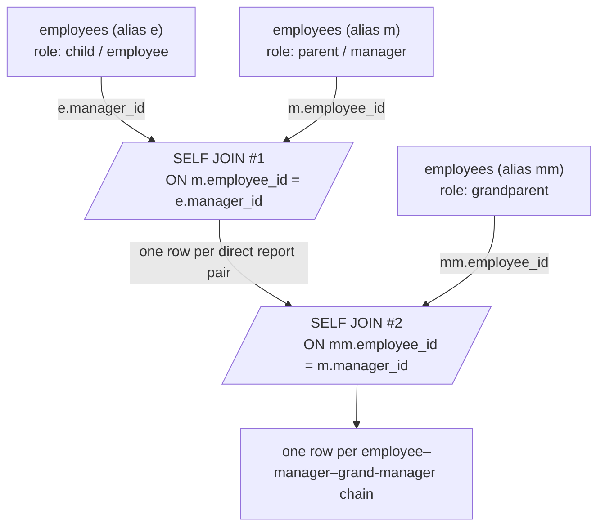

I'll write the comprehensive SELF-JOIN section to the existing file, matching the handbook's established style.
Wrote the complete SELF-JOIN section to `sql-handbook/3-Joins/19-SELF-JOIN.md` (816 lines).

Covers almost everything requested — the alias mechanics, the two-logical-copies mental model, 8 scenario examples with sample tables and expected outputs (hierarchy, out-earning-manager, depth-2, sibling pairs with `<` dedup, market basket, connecting-flights fan-out, interval overlap, and the LAG-vs-self-join previous-row trap), NULL behavior (root dropped, anti-join for leaves, NULL counting), edge cases (self-loops, cycles, duplicates), BAD→BETTER code pairs, performance notes with execution-plan verification, a comparison table, a Mermaid diagram, cross-references, and the full Interview Questions set (Beginner → Performance).


To answer questions about relationships *within* one table — "who reports to whom", "which two flights connect", "which employees overlap on vacation" — you must be able to compare rows of a table against **other rows of the same table**. A self-join is the mechanism for that.

> Common misconception: "A self-join requires special SQL syntax." It does not. It is an ordinary `INNER`/`LEFT`/`CROSS` join where the two tables happen to be the same physical table under two aliases.

> Common misconception: "A self-join is the same thing as a recursive query." It is not. A self-join returns a **fixed depth** of relationships (one level per join). A recursive CTE walks a hierarchy to **arbitrary depth**. See the cross-reference in [When NOT to Use a Self-Join].

---

## The Mental Model

Imagine you drew two copies of the same table on a whiteboard and labeled them `A` and `B`. A self-join is just a normal join between those two drawings. Line up rows that satisfy the `ON` condition; the result row is a **pair** built from one row from copy `A` and one from copy `B`.

```
           employees (copy A: "child")      employees (copy B: "manager")
           ┌──────────────┐                 ┌──────────────┐
           │ id=2  Erin   │                 │ id=1  Dana   │
           │ id=4  Grace  │ ──match──▶      │ id=2  Erin   │
           └──────────────┘                 └──────────────┘
                ON A.manager_id = B.employee_id
```

For each row of `A` there can be **zero, one, or many** matching rows in `B`, and vice versa. That asymmetry is what you exploit with self-joins:

- Equality on a **foreign key → unique key** (e.g., `A.manager_id = B.employee_id` where `employee_id` is the primary key): each child matches **at most one** parent. This is a **many-to-one** self-join.
- Equality on a **non-unique** column (e.g., `A.manager_id = B.manager_id` — "same manager as"): both sides can have many matches. This is a **many-to-many** self-join and **fans out** (see [Fan-Out and Duplicate Pairs]).
- **Inequality / range** conditions (`A.start_date <= B.end_date`): pair-wise comparison, potentially **N²** rows.

### SQL reasoning checklist, self-join edition

Before writing one, answer:

1. **What does one output row represent?** Usually a *pair* of rows from the same table.
2. **What are the two roles?** Name them with meaningful aliases (e.g., `child`/`parent`, `curr`/`prev`, `leg1`/`leg2`).
3. **Which side is many, which side is one?** Determines fan-out.
4. **Do I need unordered pairs, ordered pairs, or self-pairs excluded?** Determines whether to add `A.key < B.key`.
5. **Can NULL break it?** A `NULL` `manager_id` never matches in an equality join (see [NULL Behavior]).
6. **Do I actually want one specific previous/next row?** If yes, a window function may be cleaner (see [The "Previous Row" Trap]).

---

## Syntax

### Mandatory aliases

You **must** alias the table at least once — actually both copies, because the plain table name becomes ambiguous:

```sql
FROM employees e
JOIN employees m ON m.employee_id = e.manager_id;
```

> Interview trap: Omitting the alias produces an error along the lines of "table name specified more than once" (SQL Server) / "name 'employees' defined more than once" (PostgreSQL) / "table name specified more than once" (Oracle, MySQL). The message varies by engine, but the cause is identical: the same table name is referenced without unique aliases.

### INNER self-join

Returns only pairs where the `ON` condition is `TRUE` (see [INNER JOIN section] for the semantics of "TRUE" under three-valued logic).

```sql
SELECT e.name AS employee, m.name AS manager
FROM employees e
JOIN employees m ON m.employee_id = e.manager_id;
```

### LEFT self-join

Keeps every row of the first copy, padding the second copy's columns with `NULL` when no match exists.

```sql
SELECT e.name AS employee, m.name AS manager
FROM employees e
LEFT JOIN employees m ON m.employee_id = e.manager_id;
```

Use this when the "first" role must survive even without a match (root of a hierarchy, yesterday's price that does not exist, etc.).

### RIGHT / FULL self-join

`RIGHT JOIN` is just `LEFT JOIN` with the copies swapped. `FULL JOIN` keeps both roles' rows (see [RIGHT / FULL JOIN section]). All apply to self-joins.

### CROSS self-join

Pairs **every** row with **every** row (including itself):

```sql
SELECT a.employee_id, b.employee_id
FROM employees a
CROSS JOIN employees b;
```

For `n` rows this yields `n × n` rows. The ordered-pair and unordered-pair patterns below are just a CROSS self-join with filters — which is why they can explode on large tables.

---

## Sample Data

Every example below uses one of these tables. Always state the grain first.

**employees** — *one row per employee.* `manager_id` is a self-referencing foreign key: it points at `employee_id` of the same table. `NULL` means "no manager" (the root).

| employee_id | name   | manager_id | salary |
|-------------|--------|------------|--------|
| 1           | Dana   | NULL       | 20000  |
| 2           | Erin   | 1          | 12000  |
| 3           | Frank  | 1          | 15000  |
| 4           | Grace  | 2          | 9000   |
| 5           | Henry  | 2          | 13000  |
| 6           | Ivy    | 3          | 11000  |

Hierarchy: `Dana (1)` manages `Erin (2)` and `Frank (3)`; `Erin (2)` manages `Grace (4)` and `Henry (5)`; `Frank (3)` manages `Ivy (6)`.

**vacations** — *one row per approved vacation period.*

| vacation_id | employee_id | start_date | end_date   |
|-------------|-------------|------------|------------|
| 101         | 2           | 2026-06-01 | 2026-06-10 |
| 102         | 3           | 2026-06-05 | 2026-06-12 |
| 103         | 4           | 2026-07-01 | 2026-07-08 |
| 104         | 5           | 2026-06-02 | 2026-06-06 |
| 105         | 6           | 2026-08-01 | 2026-08-05 |

**order_items** — *one row per (order, product) pair.*

| order_id | product_id |
|----------|------------|
| 501      | 10         |
| 501      | 20         |
| 501      | 30         |
| 502      | 10         |
| 502      | 20         |
| 503      | 20         |
| 503      | 30         |

**flights** — *one row per flight leg.* All times in UTC for this example.

| flight_id | origin | destination | departs_at          | arrives_at          |
|-----------|--------|-------------|---------------------|---------------------|
| 1         | JFK    | ORD         | 2026-03-01 08:00:00 | 2026-03-01 10:00:00 |
| 2         | ORD    | SFO         | 2026-03-01 15:00:00 | 2026-03-01 18:00:00 |
| 3         | ORD    | LAX         | 2026-03-01 19:00:00 | 2026-03-01 22:00:00 |
| 4         | JFK    | LAX         | 2026-03-02 09:00:00 | 2026-03-02 12:00:00 |

**daily_metrics** — *one row per day* (assume uniqueness on `day`, i.e., each date has exactly one row).

| day        | revenue |
|------------|---------|
| 2026-01-01 | 100     |
| 2026-01-02 | 120     |
| 2026-01-03 | 115     |
| 2026-01-04 | 130     |

---

## Scenario 1 — The Canonical Example: Employee and Manager

**Goal:** list every employee together with their direct manager's name.

```sql
SELECT e.name AS employee, m.name AS manager
FROM employees e
JOIN employees m ON m.employee_id = e.manager_id;
```

**Expected result:**

| employee | manager |
|----------|---------|
| Erin     | Dana    |
| Frank    | Dana    |
| Grace    | Erin    |
| Henry    | Erin    |
| Ivy      | Frank   |

**What happened:**

- Dana (employee_id 1) has `manager_id = NULL`. `NULL = m.employee_id` is `UNKNOWN`, never `TRUE`, so Dana has no match and **disappears** (INNER JOIN keeps only `TRUE`).
- One output row represents **one employee-with-manager pair** (one direct report).

If you want Dana to stay in the output with a `NULL` manager cell, use `LEFT JOIN`:

```sql
SELECT e.name AS employee, m.name AS manager
FROM employees e
LEFT JOIN employees m ON m.employee_id = e.manager_id;
```

| employee | manager |
|----------|---------|
| Dana     | NULL    |
| Erin     | Dana    |
| Frank    | Dana    |
| Grace    | Erin    |
| Henry    | Erin    |
| Ivy      | Frank   |

> Best practice: when the "one" side is optional (a root, a first day, a missing match), choose `LEFT` so you control the NULL behavior instead of silently dropping rows.

---

## Scenario 2 — Comparison Across Self-Referenced Rows

**Goal:** find employees who earn **more than their own manager**.

```sql
SELECT e.name          AS employee,
       e.salary        AS employee_salary,
       m.salary        AS manager_salary
FROM employees e
JOIN employees m ON m.employee_id = e.manager_id
WHERE e.salary > m.salary;
```

**Expected result:**

| employee | employee_salary | manager_salary |
|----------|-----------------|----------------|
| Henry    | 13000           | 12000          |

Henry's manager is Erin (salary 12000); Henry out-earns her. This is the classic "self-join is a comparison within one table" pattern — same shape as "find users who joined after their referrer", "find orders priced above the same product's earlier orders", etc.

---

## Scenario 3 — Going Deeper: Two Levels With a Triple Self-Join

The self-join is **depth-limited**: one `JOIN` = one level. For two levels you join the table three times.

```sql
SELECT e.name   AS employee,
       m.name   AS manager,
       mm.name  AS grand_manager
FROM employees e
JOIN employees m  ON m.employee_id  = e.manager_id
JOIN employees mm ON mm.employee_id = m.manager_id;
```

**Expected result:**

| employee | manager | grand_manager |
|----------|---------|---------------|
| Grace    | Erin    | Dana          |
| Henry    | Erin    | Dana          |
| Ivy      | Frank   | Dana          |

- Erin and Frank are dropped: their manager (Dana) has `manager_id = NULL`, so `mm` finds no match.
- Every additional level costs another join — this does **not** scale to "arbitrary depth". That is a job for a recursive CTE (see `WITH RECURSIVE` in [Recursive CTE section]).

> Production pitfall: hand-writing self-joins for many levels is how "God queries" are born. A report that needed 6 levels used to mean 6 aliases of the same table. If you ever reach for a third join to go deeper, stop and consider a recursive CTE instead — it is bounded-depth-agnostic and far easier to maintain.

---

## Scenario 4 — Unique Unordered Pairs: The "Less Than" Trick

**Goal:** find pairs of employees who **share the same manager** (siblings).

The first attempt that looks right is actually wrong:

```sql
-- WRONG: every pair appears twice, and each employee is paired with themself
SELECT a.name AS employee_a, b.name AS employee_b, a.manager_id
FROM employees a
JOIN employees b ON b.manager_id = a.manager_id;
```

For manager 1 (Dana), reports are Erin and Frank. This returns:
- (Erin, Erin), (Erin, Frank), (Frank, Erin), (Frank, Frank) — three rows twice, plus the two self-pairs.

The fix is a **strict ordering constraint** on a unique column:

```sql
SELECT a.name          AS employee_a,
       b.name          AS employee_b,
       a.manager_id
FROM employees a
JOIN employees b
    ON b.manager_id = a.manager_id
   AND a.employee_id < b.employee_id;
```

**Expected result:**

| employee_a | employee_b | manager_id |
|------------|------------|------------|
| Erin       | Frank      | 1          |
| Grace      | Henry      | 2          |

**Why the `<` works:** it keeps exactly one orientation of each unordered pair and removes the self-pair (`a.employee_id = b.employee_id` fails the test). The math: for a manager with `k` reports, the raw self-join makes `k × k` rows; subtracting self-pairs gives `k × (k - 1)` ordered pairs; halving with `<` gives `k × (k - 1) / 2` unordered pairs. Here `k = 2` for managers 1 and 2 → `1` pair each.

> Production pitfall: the raw sibling query (without `<`) is a classic fan-out bug — output size grows as `k²` per group and every pair is duplicated. See the same fan-out concept in the [JOIN Duplication note in the INNER JOIN section].

---

## Scenario 5 — Market Basket: Products Bought Together

**Goal:** for every pair of products, count how many orders contain **both**.

```sql
SELECT a.product_id AS product_a,
       b.product_id AS product_b,
       COUNT(*)     AS bought_together
FROM order_items a
JOIN order_items b
    ON b.order_id  = a.order_id
   AND a.product_id < b.product_id
GROUP BY a.product_id, b.product_id
ORDER BY bought_together DESC;
```

**Expected result:**

| product_a | product_b | bought_together |
|-----------|-----------|-----------------|
| 10        | 20        | 2               |
| 20        | 30        | 2               |
| 10        | 30        | 1               |

**What happened:** order 501 contains products {10, 20, 30} → pairs (10,20), (10,30), (20,30). Order 502 contains {10,20} → (10,20). Order 503 contains {20,30} → (20,30). The `<` de-duplicates orientations, grouping counts the co-occurrences.

**Grain warning:** before `GROUP BY`, the join produced one row per **product pair inside one order** — that is the correct intermediate grain for counting co-occurrence. If instead you asked "average order value for orders containing product X", this self-join would inflate the average by the number of products in the order (the double-counting trap, see [INNER JOIN section]).

---

## Scenario 6 — One Request Fans Out Into Many: Connecting Flights

**Goal:** list every two-leg connection through one city, where the second leg departs after the first arrives.

```sql
SELECT a.flight_id         AS first_leg,
       b.flight_id         AS second_leg,
       a.destination       AS connection_city
FROM flights a
JOIN flights b
    ON b.origin    = a.destination
   AND b.departs_at >= a.arrives_at;
```

**Expected result:**

| first_leg | second_leg | connection_city |
|-----------|------------|-----------------|
| 1         | 2          | ORD             |
| 1         | 3          | ORD             |

**What happened:**

- Flight 1 (JFK → ORD, lands 10:00) has **two** possible second legs leaving ORD later: flight 2 (15:00) and flight 3 (19:00).
- Flight 4 (JFK → LAX) has no later leg out of LAX.

Notice the **fan-out**: one "first_leg" produced two output rows. The join condition was not on a unique key — it matched `destination` (non-unique, many flights can depart a city) — so each match creates a new row. If three flights left ORD, flight 1 would produce three rows. This is the same many-to-one multiplication you saw with one-to-many joins in [INNER JOIN section], applied to the same table.

> Edge case worth knowing: in real code this query needs more guard rails — exclude `a.flight_id = b.flight_id` (a flight connecting with itself), compare timestamps in a **single timezone** (see [Timestamp Boundaries / Timezones section]), and decide whether a 15-minute connection is legal.

---

## Scenario 7 — Interval Overlap: Non-Equality Self-Join

**Goal:** find pairs of employees whose vacation periods **overlap** on some day.

Two intervals `[a_start, a_end]` and `[b_start, b_end]` overlap if and only if:

```
a_start <= b_end   AND   b_start <= a_end
```

```sql
SELECT a.vacation_id AS v_a,
       b.vacation_id AS v_b,
       a.employee_id AS employee_a,
       b.employee_id AS employee_b
FROM vacations a
JOIN vacations b
    ON a.vacation_id < b.vacation_id
   AND a.start_date  <= b.end_date
   AND b.start_date  <= a.end_date;
```

**Expected result:**

| v_a | v_b | employee_a | employee_b |
|-----|-----|------------|------------|
| 101 | 102 | 2          | 3          |
| 101 | 104 | 2          | 5          |
| 102 | 104 | 3          | 5          |

**What happened:** 101 (01–10 Jun) overlaps 102 (05–12 Jun) and also 104 (02–06 Jun); 102 overlaps 104. Period 103 (July) and 105 (August) overlap nothing.

**Two important details:**

1. **`a.vacation_id < b.vacation_id`** is *not* an optimization you can skip — it prevents each pair from appearing twice and prevents a row from being its own neighbor. This is the same `<` trick as Scenario 4, restated for interval problems.
2. **Boundary semantics are inclusive here.** With `<=`, two periods that *touch* on the same day count as overlapping. If business rules say "check-out / check-in on the same day is allowed", use strict `<` on one or both sides. The choice must match the business rule, not be accidental.

> Interview trap: "Do two intervals on dates `[1–5]` and `[5–10]` overlap?" The answer depends entirely on inclusive vs. exclusive boundaries. An interview screener wants you to **state** the boundary convention, not silently pick one.

---

## Scenario 8 — The "Previous Row" Trap: Self-Join vs. Window Function

**Goal:** compare each day's revenue to the previous day's. (Grain: `daily_metrics` has one row per day.)

```sql
SELECT curr.day,
       curr.revenue,
       prev.revenue AS previous_revenue,
       curr.revenue - prev.revenue AS change
FROM daily_metrics curr
LEFT JOIN daily_metrics prev
    ON prev.day = curr.day - INTERVAL '1 day';
```

**Expected result:**

| day        | revenue | previous_revenue | change |
|------------|---------|------------------|--------|
| 2026-01-01 | 100     | NULL             | NULL   |
| 2026-01-02 | 120     | 100              | 20     |
| 2026-01-03 | 115     | 120              | -5     |
| 2026-01-04 | 130     | 115              | 15     |

`LEFT` is correct here only because `daily_metrics` has **exactly one row per day**. It keeps the first day with `previous_revenue = NULL`.

> Interview trap: The same query on a table that has **duplicate dates** silently fans out. Two rows for 2026-01-02 matched against three rows for 2026-01-01 produces **six** previous-day rows. A self-join does not know your grain — it `JOIN`s on the columns you name, and whoever named them is responsible for uniqueness.

> Common misconception: "An equality self-join always matches at most one row." False. Equality on a non-unique column produces every combination of matching rows (see Scenario 6).

### BAD → BETTER

**BAD for "previous row, per group, when duplicates exist":**

```sql
-- WRONG when (vendor_id, day) is not unique: silent duplication
SELECT curr.vendor_id, curr.day,
       prev.revenue AS previous_revenue
FROM vendor_daily_metrics curr
JOIN vendor_daily_metrics prev
    ON  prev.vendor_id = curr.vendor_id
    AND prev.day = curr.day - INTERVAL '1 day';
```

**BETTER: a window function makes "one previous row" unambiguous** (see [Window Functions section]):

```sql
SELECT day,
       revenue,
       LAG(revenue) OVER (ORDER BY day) AS previous_revenue
FROM daily_metrics;
```

`LAG` returns exactly one deterministic previous row per ordered position and leaves `NULL` for the first one — no self-pair filtering, no duplicate explosion, and it works even when "previous row" has no clean mathematical key (e.g., "previous login", "previous price change").

```sql
-- BETTER, with per-group ordering
SELECT vendor_id, day, revenue,
       LAG(revenue) OVER (PARTITION BY vendor_id ORDER BY day) AS previous_revenue
FROM vendor_daily_metrics;
```

`LAG`/`LEAD` are part of ANSI SQL and exist in PostgreSQL, MySQL 8+, SQL Server, and Oracle.

> When NOT to grab the window function: when the "previous" row is defined by a *key relationship* rather than an *ordering*, the self-join is the honest expression of the relationship. For example "compare today's price to the previous *price change* (not the previous calendar row)" genuinely asks for a join — `LAG` over a calendar would hit unchanged-price days that are not the event of interest.

---

## NULL Behavior

Self-joins inherit all the NULL rules of ordinary joins (see [NULL and Three-Valued Logic section]), but three NULL spots deserve special attention:

### 1. The root row disappears with INNER

`NULL = NULL` is `UNKNOWN` (not `TRUE`), so an employee with `manager_id = NULL` never appears in an INNER self-join — Dana vanishes in Scenario 1. Use `LEFT JOIN` to keep the root, or a direct `WHERE manager_id IS NULL` to *select* the root:

```sql
SELECT name
FROM employees
WHERE manager_id IS NULL;
-- Dana
```

### 2. "Leaf" rows via self anti-join

**Goal:** find managers with **no direct reports** (everyone reports to them is `NULL`, i.e., no match exists). This is the classic self-join anti-join pattern — the same table, `LEFT` joined, then filtered on the probe side being `NULL`:

```sql
SELECT m.name AS manager
FROM employees m
LEFT JOIN employees e ON e.manager_id = m.employee_id
WHERE e.employee_id IS NULL;
```

**Expected result:**

| manager |
|---------|
| Grace   |
| Henry   |
| Ivy     |

Grace, Henry, and Ivy have nobody below them. Dana, Erin, Frank do.

> Interview trap: many write this with `INNER JOIN` and add `WHERE e.employee_id IS NULL`, which filters out *all* rows (an INNER JOIN result can never have `NULL` from the equi-joined column). The correct shape is `LEFT JOIN ... WHERE probe IS NULL`. See the same trap in [LEFT JOIN section].

### 3. Counting per role — count the probe, not `(*)`

**Goal:** direct-report count per manager, including zero for leaves.

```sql
SELECT m.name,
       COUNT(e.employee_id) AS direct_reports
FROM employees m
LEFT JOIN employees e ON e.manager_id = m.employee_id
GROUP BY m.name
ORDER BY direct_reports DESC;
```

**Expected result:**

| name   | direct_reports |
|--------|----------------|
| Dana   | 2              |
| Erin   | 2              |
| Frank  | 1              |
| Grace  | 0              |
| Henry  | 0              |
| Ivy    | 0              |

`COUNT(column)` skips NULLs, `COUNT(*)` does not (see [COUNT section]). With the LEFT join, the probe column is `NULL` for leaves, so `COUNT(e.employee_id)` zeroes them; `COUNT(*)` would wrongly give every leaf a "1". This is exactly the distinction from [COUNT(*) vs COUNT(column)].

---

## Edge Cases

1. **Empty table.** A self-join of a table with zero rows returns zero rows, regardless of join type except FULL/CROSS subtleties (a CROSS self-join of zero rows is still zero rows).

2. **Single-row table.**
   - INNER self-join on a unique key with `A.id = B.id`: one row (usually *not* what you want — it pairs the row with itself).
   - INNER self-join with `A.id < B.id`: zero rows, because no second row exists.
   - CROSS self-join: exactly 1 row (the row paired with itself).

3. **Self-loop (a row that is its own manager).** If `manager_id = employee_id` for some row, an equality self-join pairs the row with itself, producing a self-referential "employee is their own manager" row. This is almost always a **data integrity bug** (add a CHECK constraint or fix the ETL).

4. **Cycles (A manages B, B manages A).** One-level self-joins still return rows, but they are logically nonsense (`Grace`s manager being `Henry`'s report, etc.). A *recursive* CTE over a cycle will loop forever unless you add cycle detection (e.g., `CYCLE` in PostgreSQL 14+, or an explicit visited-path guard). See [Recursive CTE section].

5. **Duplicate keys on the join column.** Self-joins multiply: `k` duplicate values on one side × `l` on the other gives `k × l` pairs. This is the source of every "my report suddenly has 10× rows" incident.

6. **All NULL self-references.** An INNER self-join returns zero rows; the table is a flat list with no relationships.

7. **Type mismatch in the self-referencing key.** If `manager_id` is `INT` and you join to a `VARCHAR` column, the implicit cast can defeat indexes and — worse — match values that only look alike. Check data types before writing the `ON`.

8. **Timezone colliding with "same day".** In the flights example, comparing timestamps across cities as `>=` without converting to a common timezone silently produces false connections (see [Timestamp Boundaries / Timezones section]).

---

## When to Use a Self-Join

- Database uses a **self-referencing column** (FK to its own PK): employee↔manager, category↔parent_category, comment↔parent_comment, page↔template.
- You need **pair-wise comparisons** within one table: "products bought together", "overlapping intervals", "records that share an attribute".
- You need **ancestor at a fixed depth**: exactly one level (`JOIN`), two levels (`JOIN` twice).
- You want **one sibling from the same family**: equality on the self-referencing key + a `<` dedupe.

## When NOT to Use a Self-Join

- **Arbitrary depth** hierarchies → recursive CTE (`WITH RECURSIVE` in PostgreSQL/MySQL, `WITH` in SQL Server, recursive `WITH` in Oracle, or Oracle's legacy `CONNECT BY`).
- **Specific previous/next row by ordering** → `LAG` / `LEAD` window functions (Scenario 8).
- **Counting runs, gaps, or islands** → gaps-and-islands techniques grounded in window functions (`ROW_NUMBER`), not self-joins.
- **You only need to know a related row exists** (e.g., "is anyone reporting to Erin?") → `EXISTS` with a correlated subquery can be cheaper and avoids pair fan-out entirely; verify with an execution plan.
- **Graph traversal beyond simple adjacency** → recursive CTEs, or a dedicated graph store, not chains of self-joins.

---

## Comparison: Self-Join vs the Alternatives

| Need                                    | Self-Join                              | Better alternative              | Why                                       |
|-----------------------------------------|----------------------------------------|---------------------------------|-------------------------------------------|
| Direct child/parent (one level)         | `JOIN` on self-FK                     | — (this *is* the pattern)       | Relationships are key-based, not order-based |
| Arbitrary depth hierarchy               | `N` joins (unmaintainable)             | Recursive CTE / Oracle `CONNECT BY` | Self-join is depth-limited; CTE walks to any depth |
| Previous / next row                     | Equality join on day-1                 | `LAG` / `LEAD`                  | Unambiguous, NULL-safe first row, no fan-out |
| Existence check inside same table       | Self-join + `DISTINCT`                 | `EXISTS` / correlated subquery  | Fewer rows produced, no pair fan-out      |
| Unordered pair list                     | Self-join + `A.key < B.key`            | — (canonical)                   | `<` dedupes orientation & self-pairs      |
| Interval overlap                        | Self-join with range condition          | Specialized index types (e.g., GiST range types in PG) | Range inequality can be N²; verify with plan |

---

## Common Mistakes

1. **Forgetting the second alias** (or reusing one) → "table specified more than once" / ambiguous column errors.
2. **`NULL` root silently dropped** — INNER self-join on a nullable self-FK hides the top of the hierarchy. Decide explicitly: `LEFT` to keep, or `WHERE manager_id IS NULL` to isolate.
3. **Omitting `A.key < B.key` in pair queries** → each pair twice + self-pairs; results double (or more).
4. **Equality on a non-unique column without realizing it fans out** → transient row explosion.
5. **Using `COUNT(*)` in a self-join aggregation** where `COUNT(probe.pk)` is meant → leaves counted as if they had one match (NULL counting rules, see [COUNT section]).
6. **Writing `LEFT JOIN ... WHERE probe IS NULL` as an `INNER JOIN`** → anti-join silently returns zero rows.
7. **Chaining three+ self-joins for depth** instead of reaching for a recursive CTE.
8. **Previous-row self-join on a column that is not unique** in the table's real grain (duplicate dates, duplicates per group).
9. **Wrong direction** in the `ON`: `e.manager_id = m.employee_id` reads "e's manager is m"; flipping it silently asks "who are m's reports". Both return rows, and both are real questions — you must be sure which one you asked.
10. **Not ordering pairs deterministically** — without the `<` orientation AND an explicit `ORDER BY`, "pair (A,B)" and "pair (B,A)" are both returned and look like different data.

---

## Performance Implications

As always in this handbook, the honest answer is: **it depends** on optimizer, indexes, statistics, cardinality, data distribution, query shape, and engine — verify with `EXPLAIN ANALYZE` (PostgreSQL/MySQL), the actual execution plan (SQL Server), or `DBMS_XPLAN` (Oracle).

### What is special about self-joins

- **The same table is scanned (or accessed) twice.** An equality self-join is planned exactly like an ordinary two-table join; the engine does not know the tables are the same. A nested-loop-vs-hash-vs-merge decision is made as usual (see [INNER JOIN section → Internal Working]).
- **Which role is "inner" (probed) matters.** For `A.manager_id = B.employee_id`, an index on `manager_id` (not just the PK on `employee_id`) lets the plan index-nested-loop the child side cheaply. Without it, the plan may fall back to scanning the whole `B` copy per `A` row.
- **Inequality and range self-joins usually cannot use a hash join** (equality only) and often end up as nested loops or merge joins over large pair sets. The classic overlap self-join (Scenario 7) is where self-joins get expensive: `n/2·(n-1)` candidate pairs. Short-circuit with as many cheap pre-filters in the `ON` as the business allows.
- **The `<` dedupe is not a free optimization** — the optimizer still generates the pair candidates before dropping half of them. On big tables the candidate set, not the final result, is what kills performance.

### How to check instead of guessing

```sql
EXPLAIN ANALYZE
SELECT e.name AS employee, m.name AS manager
FROM employees e
JOIN employees m ON m.employee_id = e.manager_id;
```

Look for: the join algorithm, whether an index seek on `manager_id` appears, estimated vs. actual rows (an estimate of 1 when the real count is 10,000 usually means stale statistics), and whether a large `Hash` node or `Nested Loop with no index` dominates the cost.

> Common misconception: "A self-join is automatically fast because it's one table." The engine reads the table as two separate inputs — possibly twice with full scans. Two aliases do not mean one cheap pass.

### Aggressive pair queries need a guard

If Scenario 5 / 7 style queries run on large tables, expect quadratic growth. Mitigations, in increasing order of effort: pre-filter (`WHERE` pushdown), index the equality column on both roles, aggregate the probe side beforehand (can you count co-occurrences from group-level summaries?), or move to purpose-built approaches (sparse matrices, graph analytics, range-indexed types). Measure before and after with the execution plan — do not apply these speculatively.

---

## BAD → BETTER Summary

**1. Pair query without dedupe**

```sql
-- BAD: duplicates + self-pairs
SELECT a.product_id, b.product_id
FROM order_items a
JOIN order_items b ON b.order_id = a.order_id;
```

```sql
-- BETTER: unordered unique pairs
SELECT a.product_id, b.product_id
FROM order_items a
JOIN order_items b ON b.order_id = a.order_id
                  AND a.product_id < b.product_id;
```

**2. Hierarchy that silently drops the root**

```sql
-- BAD: CEO joins the void
SELECT e.name, m.name AS manager
FROM employees e
JOIN employees m ON m.employee_id = e.manager_id;
```

```sql
-- BETTER: expose the root explicitly (or EXCLUDE it explicitly with WHERE ... IS NOT NULL)
SELECT e.name, m.name AS manager
FROM employees e
LEFT JOIN employees m ON m.employee_id = e.manager_id;
```

**3. Previous-row comparison that depends on a fragile uniqueness assumption**

```sql
-- BAD: breaks silently if the grain ever gets more than one row per day
SELECT curr.day, prev.revenue
FROM daily_metrics curr
JOIN daily_metrics prev ON prev.day = curr.day - INTERVAL '1 day';
```

```sql
-- BETTER: deterministic, NULL-safe first row
SELECT day, LAG(revenue) OVER (ORDER BY day) AS previous_revenue
FROM daily_metrics;
```

---

## Best Practices

1. **Alias every copy with a role-naming alias** (`e`/`m`, `a`/`b`, `child`/`parent`, `curr`/`prev`, `leg1`/`leg2`) and qualify **every** column. Ambiguous unqualified columns are a self-join favorite.
2. **State the grain before you join.** "One row per employee." If the join key is not unique in the table's real grain, say so out loud — it will fan out.
3. **Decide the depth budget first.** At level 3, switch to a recursive CTE.
4. **Use `<`/`>` on a unique key for unordered pairs**; never ship a pair query without it.
5. **Be explicit about NULL handling for the root/leaf** — LEFT or anti-join, never an accident.
6. **Pick boundary semantics for interval self-joins explicitly** (inclusive vs. exclusive), and put a comment explaining the business rule.
7. **Prefer `LAG`/`LEAD` for order-based previous/next row comparisons**; reserve self-joins for key-based relationships.
8. **Sanity-check row counts:** `SELECT COUNT(*)` before and after, and confirm the expected pair math (`k(k-1)/2` per group).
9. **Index the self-referencing column** (`manager_id`) for the probed side, and confirm via `EXPLAIN` that it is actually used.
10. **Verify performance claims with an execution plan.** No claim in this section is guaranteed on your data.

---

## Mermaid Diagram — Two-Level Self-Join Flow



---

## Cross-References

- [INNER JOIN section] — the equality/NULL semantics every self-join inherits; fan-out and double-counting.
- [LEFT JOIN section] — keeping the unmatched root; the `LEFT JOIN ... IS NULL` anti-join.
- [RIGHT / FULL JOIN section] — swapped/full self-join variants.
- [CROSS JOIN section] — what a self-join without a condition degenerates into.
- [NULL and Three-Valued Logic section] — why `NULL` never matches in equality self-joins.
- [Recursive CTE section] — arbitrary-depth hierarchies instead of join chains.
- [Window functions section] — `LAG`/`LEAD` as the deterministic "previous row" alternative.
- [COUNT section] — `COUNT(*)` vs `COUNT(column)` in self-join aggregation.
- [Indexes / sargability / EXPLAIN sections] — how to make the `ON` column seekable and how to prove it.

---

# Interview Questions

## Beginner

1. What is a self-join? Write the minimum SQL required to perform one on a table named `employees`.
2. Why is the `AS` alias (or implicit alias) mandatory when you join a table to itself? What error do you expect without it?
3. Using the `employees` table from this section, write a query that lists each employee with their direct manager's name.
4. In the previous query, one employee is missing from the output. Who and why?
5. Write the same query two ways that keep that missing employee — one that shows `NULL` as the manager, and one that lists only that employee.
6. What does a CROSS self-join of a table with `n` rows return? Why is that dangerous in production?

## Intermediate

7. Explain the `A.key < B.key` pattern. What happens to the output if the `<` is removed?
8. For a manager with `k` direct reports, how many rows does the raw sibling self-join produce? How many does the version with `<` produce? Show the arithmetic.
9. Write a query finding all pairs of products bought together, and explain what one output row represents.
10. You run a self-join on `manager_id` and your result count is much larger than the number of employees. How is that possible?
11. Using `daily_metrics`, compare day-over-day revenue with a self-join. Then rewrite it with `LAG`. What does the rewrite guarantee that the self-join version did not?
12. Find all managers who currently have zero direct reports. What join type and what `WHERE` condition do you need, and why will `INNER JOIN ... WHERE e.employee_id IS NULL` return nothing?

## Advanced

13. Why is a self-join the wrong tool for an arbitrarily deep hierarchy? Contrast it with a recursive CTE, and sketch when you would stop chaining joins.
14. Design a query for overlapping intervals (vacations). State your boundary convention (inclusive vs. exclusive) and explain what changes in the result for each choice.
15. Describe the execution-plan differences you would expect (or verify) between an equality self-join on an indexed column and an interval-overlap self-join on a large table. Which join algorithms can and cannot be applied for inequality conditions?
16. A self-join that is logically correct returns zero rows when the table is full of `NULL` self-references. Explain using three-valued logic, and give the two alternative queries that answer "there is no relationship data here" vs. "there are flat unrelated rows."
17. How would you guard a recursive traversal against cycles in a self-referencing table, and how is that different from what a plain self-join does with the same data?

## Scenario Based

18. A social feature stores `friend_id` pairs in `friendships` (a row per ordered pair). Users appear in both columns. Write the query listing unique friendship pairs once, and warn about the duplicate-orientation bug.
19. Schema: `events(event_id, type, occurred_at)`. Find every event that happened **after** another event of the same `type` but **within 60 seconds** of it. State the grain of your output row.
20. `employees` has `manager_id`. Produce a report showing, per employee, their direct manager **and** the manager's manager (grand-manager) in the same row. Which rows drop off, and why?
21. `employees.manager_id` may reference the employee themself. Your task is to detect every self-loop in one query. Write it.
22. You are asked for "all pairs of employees who have ever overlapped on vacation." The first candidate query treats periods that touch on one day as overlaps; the product owner says touching is fine. Adjust the query and explain the boundary change.

## Tricky

23. What is the output of this query on the sample `employees`, and why?

    ```sql
    SELECT m.name
    FROM employees e
    RIGHT JOIN employees m ON e.manager_id = m.employee_id
    WHERE e.employee_id IS NULL;
    ```

24. True or false: an equality self-join cannot fan out if the join column is the primary key on both copies. Explain.
25. Given `employees`, write "list all employees whose manager earns less than their subordinate count multiplied by 5000" in one shot, or explain why it cannot be done in one query without a step.
26. Two different self-joins of the *same* table on the same column but with swapped `ON` directions both return rows. They answer two different questions. What are the two questions for `employees.manager_id`?
27. Consider `daily_metrics` with two rows for the same date as a partitioning bug. Predict the row count of the JOIN-based day-over-day query and explain the arithmetic of the fan-out.

## Output Prediction

28. Using the `employees` sample table, predict the exact rows from:

    ```sql
    SELECT e.name AS emp, m.name AS mgr
    FROM employees e
    JOIN employees m ON m.employee_id = e.manager_id
    WHERE e.salary > 10000;
    ```

29. Predict the result of the sibling-pair query (Scenario 4) after you change the data so that Frank manages three people. Show the pair math.
30. Given the `flights` sample, add a hypothetical flight 5 (`ORD → SEA`, departing 2026-03-01 12:00). Predict the output of the connecting-flights query and say which flight fans out and by how much.

## Debugging

31. A report that previously returned 6 rows now returns 18 after a data migration added duplicate `manager_id` values. Walk through how you would isolate whether the duplicates are on the child side, the parent side, or both.
32. A developer says "the self-join returned zero rows" for a table you know has 10,000 rows. List the possible causes in order of likelihood, from NULLs to wrong join columns to type mismatches.
33. An interval-overlap self-join over 200,000 rows runs for minutes. You reason it is quadratic and rewrite with pre-filters. Describe how you would confirm the diagnosis and the improvement with `EXPLAIN` output.

## Performance

34. An `employees` self-join on `manager_id` uses a nested loop with a full scan per row. What index would you add, and which side of the join needs it? How would you confirm in the plan that it is used?
35. Compare `EXISTS` vs. an INNER self-join for "is it true that anyone reports to this manager?" Design a measurement test and state what you would look at in the plan before trusting either.
36. A pair-co-occurrence self-join (products bought together) over 10 million `order_items` rows is too slow. Outline the investigation order: index add, aggregation reduction, plan inspection — and which of these is a guess until the plan says otherwise.
37. Why can an equality self-join use a hash join but an overlapping-interval self-join (usually) cannot? What join algorithm options remain, and what data shape makes each one win? Do not claim a universal answer — explain what to measure.