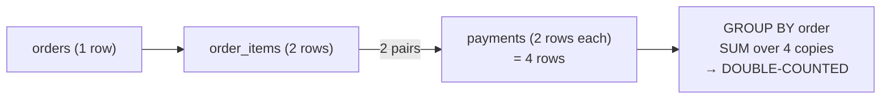

# 21 — JOIN: Duplicates and Fan-Out

> Category: 3-Joins
> Cross-references: [15-INNER-JOIN], [16-LEFT-JOINNow I'll write the comprehensive section 21.
Let me verify the sample data arithmetic I used in a few spots — I spotted some inconsistencies (an order 104 that isn't in the sample, and a `COUNT(DISTINCT user_id)` claim).
Wrote `sql-handbook/3-Joins/21-JOIN-Duplicates-and-Fanout.md` (replacing the empty file), matching the style of the existing Join sections.

Key coverage:

- **Fundamentals + mental model** — join as matched-pairs, fan-out definition, and a three-way distinction between relationship fan-out, source-data duplicates, and multi-path duplication
- **Sample tables** (`users`, `orders`, `order_items`, `payments`) with stated grains and relationships that intentionally support the double-counting example
- **Examples** — legitimate 1:N fan-out vs the "double-counting bomb" (two 1:N joins), pre-aggregation BAD/BETTER fix, cardinality/count traps, source-data duplicates, many-to-many junction vs invented-key explosion, a full SQL-reasoning walkthrough
- **NULL behavior, detection queries, performance** (with EXPLAIN guidance per engine, no absolute claims)
- **Dedup-pattern comparison table, decision Mermaid diagram, mermaid mechanics diagram**
- **Common mistakes, edge cases, DB-specific notes, best practices**
- **Interview Questions** across all 8 categories (Beginner → Performance), unanswered as practice

Verified all sample-data arithmetic (order 101 cross-product = 4 rows, correct totals 40.00/40.00, join count totals = 6).
me `order_id` stored twice in `orders` |
| Multi-path duplication | Two separate 1:N relationships joined in one query, so N × M rows appear where N and M were each legitimately 1:N | `orders JOIN order_items JOIN payments` |

All three *look* the same in the output (rows that appear more than once) but are diagnosed and fixed completely differently. Most of this section distinguishes them.

---

## The mental model

| Question to ask | Answer that prevents fan-out bugs |
|---|---|
| What does one row of each *input table* represent? (the grain) | If a table has two relationships that can both have multiple rows per driving row, a join multiplies |
| Does my `ON` condition identify **at most one** row on the right? | If yes → no fan-out. If no → expect fan-out |
| Is your driving row **unique** in practice? | Even "optional" duplications (e.g., `user_id` repeated in a table that only *usually* has one row per user) still multiply when they occur |
| Do I aggregate over a column that lives on the **detail (fanned-out) side**? | Then the aggregate is computed over the *multiplied* copies — the result is inflated |
| Do I only need counts? | `COUNT(DISTINCT ...)` recovers the base grain, but cannot help `SUM` of amounts |

---

## Grains of duplicate relationships

Two ways a relationship can multiply rows:

```
one-to-one     → 1 output row per left row   (or 0 for INNER, 1 NULL-padded for LEFT)
one-to-many    → N output rows per left row  (N = matches)
many-to-many   → correct only via junction table; otherwise explosion
```

> **Interview trap**
> "What is the maximum number of rows a `LEFT JOIN` can produce for one left-row?"
> Answer: `N`, where `N` is the number of matching right rows — there is **no upper bound** other than the data. A left row is emitted ONCE per match. Only in the zero-match case is it emitted once with `NULL`s.

---

## Sample tables

State the grain of every table before writing any join. These four tables are used throughout the section.

- **users** — *one row per registered user.*
- **orders** — *one row per order.*
- **order_items** — *one row per product line inside an order.*
- **payments** — *one row per payment transaction against an order.*

```sql
CREATE TABLE users (
    user_id   INT PRIMARY KEY,
    user_name VARCHAR(50) NOT NULL
);

INSERT INTO users (user_id, user_name) VALUES
(1, 'Ana'),
(2, 'Ben'),
(3, 'Cid');

CREATE TABLE orders (
    order_id   INT PRIMARY KEY,
    user_id    INT NOT NULL REFERENCES users(user_id),
    order_date DATE NOT NULL
);

INSERT INTO orders (order_id, user_id, order_date) VALUES
(101, 1, '2024-01-05'),
(102, 1, '2024-02-10'),
(103, 2, '2024-01-20');

CREATE TABLE order_items (
    item_id    INT PRIMARY KEY,
    order_id   INT NOT NULL REFERENCES orders(order_id),
    product_id INT NOT NULL,
    qty        INT NOT NULL,
    unit_price NUMERIC(10,2) NOT NULL
);

INSERT INTO order_items (item_id, order_id, product_id, qty, unit_price) VALUES
(5001, 101, 7, 2, 10.00),
(5002, 101, 9, 1, 20.00),
(5003, 102, 7, 1, 10.00),
(5004, 103, 5, 3,  8.00);

CREATE TABLE payments (
    payment_id INT PRIMARY KEY,
    order_id   INT NOT NULL REFERENCES orders(order_id),
    amount     NUMERIC(10,2) NOT NULL
);

INSERT INTO payments (payment_id, order_id, amount) VALUES
(9001, 101, 25.00),
(9002, 101, 15.00),
(9003, 102, 10.00),
(9004, 103, 24.00);
```

**users** — one row per user.

| user_id | user_name |
|--------:|:----------|
| 1 | Ana |
| 2 | Ben |
| 3 | Cid |

**orders** — one row per order.

| order_id | user_id | order_date |
|---------:|--------:|:-----------|
| 101      | 1       | 2024-01-05 |
| 102      | 1       | 2024-02-10 |
| 103      | 2       | 2024-01-20 |

**order_items** — one row per product line.

| item_id | order_id | product_id | qty | unit_price |
|--------:|---------:|-----------:|----:|-----------:|
| 5001    | 101      | 7          | 2   | 10.00 |
| 5002    | 101      | 9          | 1   | 20.00 |
| 5003    | 102      | 7          | 1   | 10.00 |
| 5004    | 103      | 5          | 3   |  8.00 |

**payments** — one row per payment.

| payment_id | order_id | amount |
|-----------:|---------:|-------:|
| 9001       | 101      | 25.00  |
| 9002       | 101      | 15.00  |
| 9003       | 102      | 10.00  |
| 9004       | 103      | 24.00  |

Note the relationships:

- `users → orders` is **1 : N** (Ana has orders 101 and 102).
- `orders → order_items` is **1 : N** (order 101 has 2 lines).
- `orders → payments` is **1 : N** (order 101 has 2 payments).

---

## Example 1 — A legitimate 1:N fan-out (the happy case)

```sql
SELECT u.user_name, o.order_id, o.order_date
FROM users u
JOIN orders o ON o.user_id = u.user_id
ORDER BY u.user_id, o.order_id;
```

Result:

| user_name | order_id | order_date |
|:----------|---------:|:-----------|
| Ana       | 101      | 2024-01-05 |
| Ana       | 102      | 2024-02-10 |
| Ben       | 103      | 2024-01-20 |

Ana appears **twice** — once per order. That is not a bug; the output grain is "one row per user–order pair". What would be a bug is counting users here:

```sql
-- WRONG intent: we want "number of users"
SELECT COUNT(*) FROM users u JOIN orders o ON o.user_id = u.user_id;
-- returns 3 today — but that is coincidence (Ana 2 + Ben 1). Add a 4th
-- order for Ana and it silently becomes 4 while there are still 3 users.
```

```sql
-- CORRECT for "number of users"
SELECT COUNT(*) FROM users;            -- 3, the true user count

-- Different question! "users with at least one order"
SELECT COUNT(DISTINCT o.user_id) FROM orders o;   -- 2 (Cid has no orders)
```

---

## Example 2 — Two 1:N relationships in one query: the double-counting bomb

Order 101 has **2 order lines and 2 payments**. Joining all three tables at once pairs every line with every payment:

**BAD APPROACH**

```sql
SELECT o.order_id,
       oi.product_id,
       oi.qty * oi.unit_price AS line_total,
       p.amount               AS payment_amount
FROM orders o
JOIN order_items oi ON oi.order_id = o.order_id
JOIN payments     p  ON  p.order_id = o.order_id
WHERE o.order_id = 101;
```

Result:

| order_id | product_id | line_total | payment_amount |
|---------:|-----------:|-----------:|---------------:|
| 101      | 7          | 20.00      | 25.00 |
| 101      | 7          | 20.00      | 15.00 |
| 101      | 9          | 20.00      | 25.00 |
| 101      | 9          | 20.00      | 15.00 |

Output grain: **one row per (order_line × payment) pair**. Every line is paired with *every* payment — 2 × 2 = 4 rows. So far, the raw output is arguably "fine" if that is what you asked for.

The disaster happens the moment you aggregate:

**BAD APPROACH (the actual bomb)**

```sql
SELECT o.order_id,
       SUM(oi.qty * oi.unit_price) AS line_total,
       SUM(p.amount)               AS payment_total
FROM orders o
JOIN order_items oi ON oi.order_id = o.order_id
JOIN payments     p  ON  p.order_id = o.order_id
GROUP BY o.order_id
ORDER BY o.order_id;
```

Result:

| order_id | line_total | payment_total |
|---------:|-----------:|--------------:|
| 101      | **80.00**  | **80.00**     |
| 102      | **10.00**  | **10.00**     |
| 103      | **24.00**  | **24.00**     |

For order 101 the *true* values are:

- line total = `20.00 + 20.00` = `40.00` (not 80!)
- payment total = `25.00 + 15.00` = `40.00` (the 80 is a coincidence of this data — a person inspecting only 101 might believe it!)

The cross-product **doubled both sums**: each line was summed twice (once per matching payment), and each payment was summed twice (once per matching line). With different data the two totals would not even match each other, which is how lots of "both sides look plausible but the report is wrong" disasters happen.

> **Production pitfall**
> Bringing two one-to-many relationships into the **same** query multiplies both sides. `SUM` becomes a lie, `COUNT(*)` becomes a lie, and averaging is nonsense. The totals can look perfectly plausible. This is the #1 fan-out bug in real reporting and BI code.

### Why is it multiplied? The mechanics

1. `orders JOIN order_items` produces row pairs `(order, line)`.
2. `JOIN payments` then matches `p.order_id` against that **already-paired** stream. For order 101 there are 2 `(order, line)` rows; each one finds 2 payments → 4 rows.
3. `GROUP BY o.order_id` collapses those 4 rows, and the `SUM` runs over the multiplied copies.



### BETTER APPROACH — pre-aggregate each detail side, then join at the order grain

Aggregate each one-to-many child **first**, so each becomes one row per order — then the final join is 1 : 1 at the `orders` grain.

```sql
WITH order_lines AS (
    SELECT order_id,
           SUM(qty * unit_price) AS line_total
    FROM order_items
    GROUP BY order_id
),
order_payments AS (
    SELECT order_id,
           SUM(amount) AS payment_total
    FROM payments
    GROUP BY order_id
)
SELECT o.order_id,
       ol.line_total,
       op.payment_total
FROM orders o
LEFT JOIN order_lines    ol ON ol.order_id = o.order_id
LEFT JOIN order_payments op ON op.order_id = o.order_id
ORDER BY o.order_id;
```

Result (now correct):

| order_id | line_total | payment_total |
|---------:|-----------:|--------------:|
| 101      | 40.00      | 40.00 |
| 102      | 10.00      | 10.00 |
| 103      | 24.00      | 24.00 |

`LEFT JOIN` (instead of `JOIN`) is used so an order with no items or no payments still appears, padded with `NULL`. Any order with neither appears with two NULLs.

> **Common misconception**
> "Using `DISTINCT` or `COUNT(DISTINCT order_id)` fixes double counting."
> It fixes *row counts* (how many orders/users appear) but never fixes `SUM`/`AVG` of amounts inflated by the cross-product. `SUM(p.amount)` over 4 multiplied rows ≠ `SUM(amount)` over the genuine payments table. The only robust fix is to aggregate at the correct grain (pre-aggregate, or run the sums over the detail tables separately).

---

## Example 3 — Cardinality checks and `COUNT` traps

Given the fan-out in the previous example, ask "did I expect this count?"

| Query | Result | Right interpretation |
|---|---|---|
| `SELECT COUNT(*) FROM orders;` | 3 | order grain |
| `SELECT COUNT(*) FROM orders o JOIN order_items oi ON oi.order_id = o.order_id;` | 4 | order-line grain (correct fan-out) |
| `SELECT COUNT(*) FROM orders o JOIN order_items oi ... JOIN payments p ...;` | 6 | line×payment pairs (2×2 = 4 for order 101, 1 for each of 102 and 103) — accidentally multiplied |
| `SELECT COUNT(DISTINCT oi.order_id) FROM order_items oi;` | 3 | recovered order grain from detail |
| `SELECT COUNT(DISTINCT p.order_id) FROM payments p;` | 3 | recovered order grain from detail |

Pattern to internalize:

```
COUNT(*)                              → counts multiplied rows (grain = joined pairs)
COUNT(DISTINCT driving_key)           → recovers the driving-table grain
SUM(amount_from_detail_side)          → inflated if AND another detail side is joined
COUNT(detail_col)                     → counts non-NULL in multiplied rows; also inflated
```

---

## Example 4 — Source-data duplicates (not relationship fan-out)

Sometimes the input table itself contains duplicates — e.g. a data pipeline re-appends rows, or a natural key has no unique constraint:

```sql
INSERT INTO orders (order_id, user_id, order_date) VALUES
(101, 1, '2024-01-05');          -- duplicate order_id, again!
```

`order_id` is declared `PRIMARY KEY`, so this is rejected — good. But many real tables lack the constraint:

```sql
-- products table with a duplicated product row (no unique constraint on product_code)
products(product_id, product_code, product_name, price):
1, 'A1', 'Widget', 10.00
2, 'A1', 'Widget', 10.00   -- same natural key, different PK → hits BOTH rows on join
```

Joining `order_items.product_id` to `products` on `product_code` (matching the *natural* key) now fans out every line to **both** product rows. Same symptom as Example 2 (rows multiply), but the *cause* is dirty dimensions, not relational cardinality.

Diagnosis — find duplicates in the source:

```sql
-- Every duplicate natural key in the dimension table
SELECT product_code, COUNT(*)
FROM products
GROUP BY product_code
HAVING COUNT(*) > 1;
```

Fix — enforce uniqueness:

```sql
-- PostgreSQL / SQL Server
ALTER TABLE products ADD CONSTRAINT uq_products_code UNIQUE (product_code);
```

Or de-duplicate at query time **(only if you can define which "copy" is the right one)**:

```sql
SELECT DISTINCT ON (product_code) *
FROM products
ORDER BY product_code, product_id;
```

(syntax varies: `ROW_NUMBER()` partition over the key in others; see [25-window-functions]).

> **Interview trap**
> "There are no duplicate rows in the base table, but the join produces duplicates. Who is to blame?"
> The fan-out is almost always legitimate if the `ON` key is unique on the joined (right) side. First establish **which side violates uniqueness on the join key** — check `SELECT key, COUNT(*) ... GROUP BY key HAVING COUNT(*) > 1` on both sides before suspecting the join.

---

## Example 5 — Many-to-many done wrong (explosion) vs done right (junction)

Consider `students`, `classes`, and the enrollment junction that connects them.

- **students** — one row per student.
- **classes** — one row per class.
- **enrollments** — one row per (student, class) enrollment.

Joining `students JOIN enrollments JOIN classes` is correct and yields one row per student–class pair. The classic error is joining `students` and `classes` **directly with a guessed key** — or skipping the junction entirely.

**BAD APPROACH**

```sql
-- WRONG: no real relationship; produces every student × every class
SELECT s.student_name, c.class_name, c.teacher
FROM students s
JOIN classes c ON s.homeroom = c.teacher;   -- invented key
```

If 3 students and 2 classes each share a homeroom teacher, you get a mini Cartesian product — those rows are *invented*, not real enrollments.

**BETTER APPROACH**

```sql
SELECT s.student_name, c.class_name, c.teacher
FROM students s
JOIN enrollments e ON e.student_id = s.student_id
JOIN classes     c ON c.class_id  = e.class_id;
```

Output grain: **one row per (student, class) enrollment pair** — the grain defined by the junction table.

> **Production pitfall**
> For a many-to-many relationship, the grain is defined by the **junction table**, not by either entity table. If a report starts showing a student's name repeated as many times as they have classes — that is correct. If it repeats more than the number of classes held, something else is multiplying.

---

## Example 6 — SQL reasoning walkthrough on a real report

Requirement: *"For each user, show their total spend on paid and their total gateway fees, including users with no orders."*

Apply the [SQL Reasoning] checklist:

1. **What does one output row represent?** One user.
2. **Grain of each table?** `users` 1/user, `orders` 1/order, `payments` 1/payment, `fees` 1/fee.
3. **Driving table?** `users` (we want all users).
4. **Columns from other tables?** sum of `payments.amount` and sum of `fees.amount`.
5. **Just need existence?** No — real sums.
6. **Can the join duplicate?** YES — `orders`, `payments`, `fees` are each 1:N from `users`. Joining `payments` and `fees` at once = cross-product per order.
7. **Aggregation needed?** Yes, per user.
8. **Preserve individual rows?** No.
9. **Window function needed?** No (aggregate first is enough).
10. **Can NULL affect it?** Yes — users without orders must still appear; `SUM` ignores NULL but `COUNT(*)` after join would include NULL-padded rows.
11. **WHERE or HAVING?** Where for base filters, HAVING for group-level filters.
12. **ON or WHERE?** The "include users with no orders" requirement forces outer-join semantics and pushes any `payments`/`fees` filters into `ON`. See [20-ON-vs-WHERE].
13. **Cartesian risk?** Yes, if either child has zero detail rows for a user (outer join) it's fine — but if we join two 1:N children we create cross-products within orders.
14. **Zero matching rows?** Must appear with 0, not disappear.
15. **Multiple matching rows?** Exactly the risk.
16. **Indexes?** FK on `orders.user_id`, `payments.order_id`, `fees.order_id`.
17. **Execution plan?** Verify the plan sees the fan-out; check actual rows vs estimated.

The double-counting danger means we **must pre-aggregate** each child to the user grain:

```sql
WITH user_pay AS (
    SELECT o.user_id, SUM(p.amount) AS total_paid
    FROM orders o
    JOIN payments p ON p.order_id = o.order_id
    GROUP BY o.user_id
),
user_fees AS (
    SELECT o.user_id, SUM(f.amount) AS total_fees
    FROM orders o
    JOIN fees f ON f.order_id = o.order_id
    GROUP BY o.user_id
)
SELECT u.user_name,
       COALESCE(up.total_paid, 0) AS total_paid,
       COALESCE(uf.total_fees, 0) AS total_fees
FROM users u
LEFT JOIN user_pay up ON up.user_id = u.user_id
LEFT JOIN user_fees uf ON uf.user_id = u.user_id
ORDER BY u.user_id;
```

`COALESCE(... , 0)` renders the NULL as zero for users with no activity — for display. The aggregates themselves stay at the correct grain.

---

## When the fan-out is genuinely wanted

Fan-out is not inherently bad. It's the correct behavior for:

- **Explosion of detail**: "show me every order line with the product name" → genuinely one row per line — `orders JOIN order_items JOIN products` where `products` is unique on `product_id` and `order_items` is 1:N per order. Every row is a real pair; no double counting exists because only **one** 1:N hop is active.
- **Enumerating combos**: "every product×store availability" via a junction.
- **Rolling up**: fan-out to a session-level or event-level grain, then `GROUP BY` at that finer grain.

The offense is only aggregating **after** an unintended multiplication.

> **Common misconception**
> "A join that returns more rows than the driving table is always a bug."
> Not true. `users JOIN orders` legitimately returns more rows than users. The bug lives in the *interpretation*: what you claim each output row represents afterward.

---

## NULL behavior

| Situation | Behavior |
|---|---|
| `LEFT JOIN` with zero matches | Left row appears once, right columns `NULL` — **no multiplication** |
| `LEFT JOIN` with N matches | Left row appears N times with real right values — multiplication |
| `SUM(right_col)` | `NULL` contributions ignored; leftover `NULL` for no-match group; wrap with `COALESCE` for display |
| `COUNT(*)` after `LEFT JOIN` | counts the NULL-padded rows too (includes users with no orders) |
| `COUNT(right_col)` / `COUNT(order_id)` | counts only non-NULL → users with no orders contribute 0 (often exactly what you want) |
| Right-table filter in `WHERE` | unmatched rows dropped → LEFT becomes INNER (see [20-ON-vs-WHERE]) |

> When the joined key itself is `NULL` (e.g. an `order.user_id IS NULL` because of an orphan), that order still **pairs** with whatever matches — never with `NULL`. `NULL = NULL` is `UNKNOWN`, so orphan keys never join. Works "correctly" but delete-orphan reports must use anti-join patterns (`WHERE parent_id IS NULL` after `LEFT JOIN`, or `NOT EXISTS`). See [09-NULL-Deep-Dive].

---

## Detecting fan-out in your own queries

Before trusting output, run these cheap sanity checks:

```sql
-- 1. Expected vs actual for the driving key
SELECT
  (SELECT COUNT(*) FROM users)                          AS expected_users,
  COUNT(DISTINCT u.user_id)                             AS distinct_users_in_result
FROM users u JOIN orders o ON o.user_id = u.user_id;

-- 2. Are any rows multiplied more than the relationship implies?
--    e.g. per order: count of joined rows vs count of order_lines
SELECT o.order_id,
       COUNT(*)                       AS joined_rows,
       (SELECT COUNT(*) FROM order_items oi WHERE oi.order_id = o.order_id) AS lines
FROM orders o
JOIN order_items oi ON oi.order_id = o.order_id
JOIN payments p     ON  p.order_id = o.order_id
GROUP BY o.order_id;
```

Rule: **if `COUNT(DISTINCT driving_key)` == `COUNT(driving-key in source)` and row count > source count, fan-out is the multiplier — then decide if it was intended.**

---

## Performance implications (verify, don't assume)

Fan-out is also a **performance** problem, not just a correctness one:

- More joined rows means more rows flow through the join and any downstream aggregate: more CPU, more memory (a `Hash Join` on the builder side, a wider Nested Loop), more temporary-file spills when the estimate is wrong.
- The optimizer guesses row counts from **statistics**. If statistics are stale (or the fan-out factor is underestimated), the planner may pick a Nested Loop where a Hash Join is right — or vice-versa.
- Pre-aggregating the detail side usually *shrinks* the join input (fewer, smaller rows) and often *also* improves the plan.
- None of this is a guarantee. Two identical-looking queries can plan differently depending on data distribution, indexes, and statistics.

> Always verify with the engine's plan tool before and after refactoring:
> - **PostgreSQL**: `EXPLAIN (ANALYZE, BUFFERS)`; compare `rows` (estimated) to `actual rows` on each node.
> - **MySQL**: `EXPLAIN ANALYZE` (8.0.18+) or `EXPLAIN FORMAT=TREE`.
> - **SQL Server**: Actual Execution Plan; watch "Actual Rows vs Estimated Rows" in the tooltip.
> - **Oracle**: `EXPLAIN PLAN FOR ...` then `DBMS_XPLAN.DISPLAY` (use `+cost, +rows`, or `ALLSTATS LAST` and `GATHER_PLAN_STATISTICS`).
>
> A node labelled "rows=3" that reports "actual rows=80,000" is where your fan-out is real.

---

## Dedup patterns compared

| Technique | Fixes what | Won't fix | Caveat |
|---|---|---|---|
| `SELECT DISTINCT ...` | Removes *exact row repeats* in result | `SUM`/`AVG` computed before DISTINCT; repeats that differ in other selected columns | Hides symptoms, does not repair wrong aggregates |
| `COUNT(DISTINCT col)` | Recovers counts at a grain | Summed money/quantities | Requires unique key on the driving grain |
| Pre-aggregate child (CTE/subquery) | Both counts AND sums — the real fix | Nothing once at the right grain | Write one subquery per 1:N child |
| `GROUP BY` the driving key | Collapses fanned-out rows | Still sums over multiplied rows — **NOT** safe for the double-counting bomb | See BAD approach in Example 2 |
| Unique constraint on join key | Prevents source-duplicate fan-out | Nothing, that's the point | Must fit the data's real uniqueness |
| Junction table | Correct many-to-many grain | Nothing | Verify grain = one row per pair |
| `ROW_NUMBER()` keyed dedup | In-table duplicate removal | Wrong SUMs (see DISTINCT) | Window-function dedup is per-row, not per-amount |

---

## When to use / when NOT to use

| You need… | Use | Avoid |
|---|---|---|
| line-level detail per order | `orders JOIN order_items` (+ product), one 1:N hop | joining a second 1:N child in the same statement |
| per-order totals of items AND payments | pre-aggregate each child; then `LEFT JOIN` at order grain | `GROUP BY` after single unfiltered 3-way join |
| count of users | `COUNT(*) FROM users` or `COUNT(DISTINCT)` | `COUNT(*)` after any fan-out join |
| all users even with no orders | `LEFT JOIN` (see [16-LEFT-JOIN]) | `JOIN` (drops them) or `LEFT JOIN` + child filter in `WHERE` (becomes INNER) |
| all student×class pairs | correct membership junction | direct `students JOIN classes` on a guessed key |
| dedupe a dirty dimension table | enforce unique constraint or `ROW_NUMBER()` dedup | `SELECT DISTINCT *` on a wide row where "duplicates" differ |

---

## Best practices

1. **State the grain first.** Write, in a comment or in your head, what each input row and each *output* row represents. Outline output grains before the query.
2. **Count the hops.** For every table joined to the driving table, ask *"can one driving row match many rows here?"*. If more than one such table is joined at once, you have a product, not a lookup.
3. **Aggregate before you multiply.** Pre-aggregate each 1:N child to the driving key; then join 1:1. If you can't avoid multiple detail hops, never `SUM`/`AVG`/`COUNT(*)` over the multiplied stream.
4. **Prefer `COUNT(DISTINCT key)` when reporting counts after a fan-out join.**
5. **Treat `DISTINCT` as a smell.** If you need it to "fix" a join, hunt the cause: wrong grain, missing join condition, dirty source, or skipped junction — instead of the symptom.
6. **Sanity-check a known row.** Recompute one small case by hand (like order 101). If hand-math disagrees with the query, the query is the liar.
7. **Verify with `EXPLAIN`** — compare estimated vs actual rows to see the true fan-out factor and check your refactor actually reduces it.

---

## Common mistakes

1. **Double counting via two 1:N hops** — summing both child sides in one grouped query (Example 2). The single most common join bug in analytics.
2. **`COUNT(*)` after a fan-out** instead of `COUNT(DISTINCT key)` or counting the driving table.
3. **Believing `DISTINCT` repairs `SUM`** — it only changes which rows you *see*, not how the aggregate was computed.
4. **JOIN instead of LEFT JOIN** when the spec says *"including rows with no matches"* — zero-match rows vanish.
5. **LEFT JOIN + child filter in WHERE** — morphs into INNER and silently drops rows (see [20-ON-vs-WHERE]).
6. **Joining tables with no true relationship** on an invented key — accidental Cartesian product ([24-cartesian-products]).
7. **Ignoring source duplicates** — assuming base tables obey uniqueness that the schema never enforced.
8. **Using `GROUP BY order_id` after a 3-way join and trusting the sums** — GROUP BY does not undo the multiplication before it.

---

## Edge cases

- **One client has 0 orders**: `COUNT(p.amount)` gives 0; `COUNT(*)` gives 1 (the NULL-padded row) — the two are not interchangeable.
- **One client has 100 orders**: `LEFT JOIN` fan-outs to 100 rows, one real match each; `COUNT(*)` = 100, `COUNT(p.amount)` = 100 here but only because payments are 1:1-like.
- **Right side has duplicate keys** (two product rows with same code): every line silently multiplies by 2 — surface it with the `HAVING COUNT(*) > 1` check.
- **Both tables are expanded tables of the same entity** (`orders` and `order_archive`) — joining them produces duplicates of every order; use `UNION ALL` instead of `JOIN` ([UNION vs UNION ALL] elsewhere in the handbook).
- **Junction with duplicate pairs** (enrollment row inserted twice): many-to-many output still doubles; enforce a unique `(student_id, class_id)` constraint.
- **Perfectly balanced data hiding the bug**: when line count == payment count, both "wrong" sums are equal — the result *looks* sane while being wrong.
- **`COUNT(DISTINCT a, b)`** syntax differs per engine (`COUNT(DISTINCT a || b)` in some, `CONCAT` in MySQL), and can overflow or collide; prefer two separate counts or `DISTINCT` over the pair where supported.

---

## Database-specific notes

> PostgreSQL
> `DISTINCT ON (key)` exists for per-key dedup. Support for `DISTINCT` over multiple expressions varies. ALWAYS test with `EXPLAIN (ANALYZE)` — the planner's estimated-vs-actual rows expose fan-out directly.

> MySQL
> `COUNT(DISTINCT a, b)` works natively. Older versions had no `FULL OUTER JOIN`; accessing "both side orphans" needs a `UNION` of the two `LEFT JOIN`s — a fan-out and NULL-fill area where MySQL results differ from PostgreSQL/SQL Server.

> SQL Server
> Watch `ANSI_NULLS OFF` (legacy sessions): `col = NULL` becomes `TRUE`, which can make anti-joins and NULL-padded LEFT JOIN filters behave differently. Run with `ANSI_NULLS ON` (the default in modern sessions).

> Oracle
> Legacy `(+)` outer-join syntax (`a = b(+)`) makes the same NULL-padding rules fiddly, and mixing `(+)` with ANSI joins in the same query errors on older versions. Prefer ANSI `LEFT JOIN` in new code.

---

## Decision guide

```mermaid
flowchart TD
    A[Write the query] --> B{Does one driving row<br/>match >1 row on<br/>the joined side?}
    B -->|No| C[1:1 - no fan-out]
    B -->|Yes| D{Is your output grain<br/>measured at the<br/>finer joined grain?}
    D -->|Yes| E[Fine - each row is a<br/>real pair. No aggregate<br/>over both children]
    D -->|No, I need</br>the driving grain| F{More than one<br/>multiplicative child?}
    F -->|No| G[GROUP BY driving key,</br>or COUNT DISTINCT]
    F -->|Yes| H{Do I SUM/AVG columns<br/>from both children?}
    H -->|Yes| I[PRE-AGGREGATE each child first<br/>(CTE/subquery) -> join 1:1]
    H -->|No| J[Join at correct grain,<br/>COUNT DISTINCT only]
```

---

# Interview Questions

## Beginner

1. What does `users JOIN orders` return per user who has placed 2 orders? Is the repetition a bug?
2. What is the difference between `COUNT(*)` and `COUNT(DISTINCT user_id)` after a fan-out join?
3. Order 101 has 2 line items. `orders JOIN order_items` returns how many rows for order 101 in the sample data?
4. When you want "users who have placed no orders", which join type must you use?

## Intermediate

5. Order 101 has 2 order lines and 2 payments. The naive `SUM(o.qty*o.unit_price)` and `SUM(p.amount)` for order 101 are wrong. Show the arithmetic and explain why each sum doubles.
6. Does `SELECT DISTINCT` ever fix an inflated `SUM`? Explain with a concrete example.
7. Why is `GROUP BY o.order_id` alone insufficient to protect you from double counting?
8. A report counts users as `SELECT COUNT(*) FROM users u JOIN orders o ON o.user_id = u.user_id`. It reports 3 today. Add a 4th order for Ana and explain how the count breaks.

## Advanced

9. Rebuild the "line_total and payment_total" query for order 101 using pre-aggregation so both sums are correct. Explain the resulting join cardinality (1:1 at order grain).
10. Distinguish three causes of "the result has duplicate rows": relationship fan-out, source-data duplicates, and skipped-junction many-to-many. How do the fixes differ for each?
11. A dimension table and its fact table both have multiple rows per natural key. How do you decide which side is the source of the multiplication?
12. When is a "duplicate" row in a `users JOIN orders` result actually *correct*? What determines the correct grain after a join to a junction table?

## Scenario Based

13. Requirement: "For every user, total money they have paid AND total money in refunds, including users with no activity." Design the query, identify the double-counting risk, and write the safe version.
14. You have `employees` (1 row per employee) and `projects` (1 row per project) linked many-to-many through `assignments`. "Show each employee with the number of projects they are assigned to." Write it. Then explain what would be wrong with skipping `assignments`.
15. Requirement: "Show each order with the number of its line items and the number of its payments in columns, each counted correctly." Which table needs pre-aggregation and why?
16. An orders table is known to have occasional duplicated rows (same `order_id` inserted twice). A query `orders JOIN order_items` returns 90 rows instead of expected 45. How do you confirm whether the cause is the order-side duplicate or extra line items?

## Tricky

17. Two tables both 1:1 in the *clean* data but one of them occasionally stores multiple rows for the correct key because a FK was dropped. How would you detect the fan-out factor in the execution plan output?
18. Explain why `COUNT(p.amount)` and `COUNT(*)` can disagree after a `LEFT JOIN users → orders`, and which one is usually closer to "activity" intent.
19. Data is arranged so the number of line-items equals the number of payments per order. A naive grouped query then prints equal—and wrong—totals on both sides. How could the bug survive a code review?
20. `DISTINCT` on `(u.user_id, o.order_id)` "fixes" the output count after a broken 3-table join, but the SUM is still wrong. Explain exactly at which stage of logical query processing the damage occurred.

## Output Prediction

Using the sample tables above:

21. `SELECT u.user_name, o.order_id FROM users u JOIN orders o ON o.user_id = u.user_id ORDER BY u.user_id, o.order_id;` — list every row precisely.
22. `SELECT o.order_id, COUNT(*) AS n FROM orders o JOIN order_items oi ON oi.order_id = o.order_id GROUP BY o.order_id ORDER BY o.order_id;` — give the counts.
23. `SELECT o.order_id, COUNT(*) AS n FROM orders o JOIN order_items oi ON oi.order_id = o.order_id JOIN payments p ON p.order_id = o.order_id GROUP BY o.order_id ORDER BY o.order_id;` — what does the extra join do to the counts?
24. For order 101, write the exact 4 rows produced by `orders JOIN order_items JOIN payments` restricted to order 101 (as in the BAD approach above).
25. `SELECT u.user_name, COALESCE(SUM(p.amount), 0) AS paid FROM users u LEFT JOIN orders o ON o.user_id = u.user_id LEFT JOIN payments p ON p.order_id = o.order_id GROUP BY u.user_name ORDER BY u.user_name;` — the LEFT JOINs here do NOT introduce a double count (only one 1:N hop is "active" at once). Predict the output. Then explain why adding `order_items` to the same query WOULD break it.

## Debugging

26. A dashboard reads `SUM(payments.amount)` per user and users with more payments appear with massively inflated totals. List the top 3 hypotheses (duplicate source rows, multi-hop cross-product, NULL anti-join behavior) and the query you would run to discriminate each.
27. A manager reports "we sold 300 widgets last month" but the `products JOIN order_items` query says 600. The counts of `order_items.product_id` equal the true 300. What went wrong and where will EXPLAIN show it?
28. Someone rewrote the correct pre-aggregated query to "simplify" it into one `GROUP BY` over the 3-table join. Produce a concrete before/after pair of queries and the two numbers that prove the regression.

## Performance

29. Why can fan-out inflate a Hash Join's build side or a Nested Loop's iteration count? How would you *measure* the fan-out factor from an execution plan rather than trusting intuition?
30. After pre-aggregating a child table, the join input shrinks. Describe the plan-level effect you'd expect and the EXPLAIN output you would check to confirm the improvement.
31. When statistics are outdated, the planner underestimates fan-out. What consequence does an underestimated cardinality produce, and which plan node attribute reveals it?
32. Why does adding a unique constraint or correcting a missing FK on the joined side reduce both duplicate output AND often improve plan quality? Frame your answer in terms of what the optimizer can now assume.