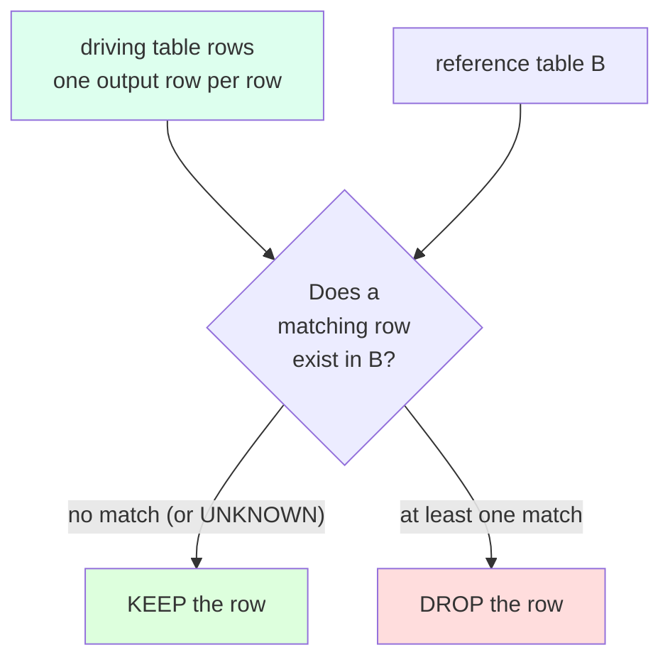
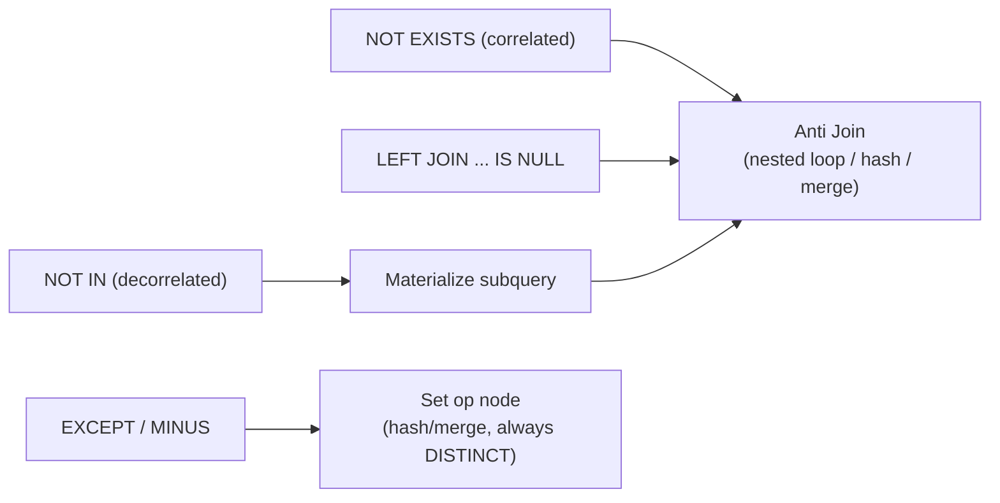

# Anti-Joins

## Table of Contents

- [Fundamentals](#fundamentals)
- [The Sample Tables (grain check)](#the-sample-tables-grain-chI've reviewed the conventions. Now I'll write the comprehensive Anti-Joins section.
Done. Wrote `sql-handbook/3-Joins/23-Anti-Joins.md` (~1,130 lines).

Covers: fundamentals & mental model, grain-stated sample tables, the four anti-join forms (`NOT EXISTS`, `NOT IN`, `LEFT JOIN ... IS NULL`, `EXCEPT`/`MINUS`) plus non-ANSI `ANTI JOIN`, physical internals (nested-loop/hash/merge anti + semi vs anti, per-engine plan nodes), the `NOT IN` NULL-poison with demonstrations, 8 scenario-based examples with BAD vs BETTER, edge cases, mistakes, production pitfalls, performance with plan-verification emphasis, comparison tables, mermaid diagrams, dialect notes, and an unanswered Interview Questions bank (Beginner → Performance) with exact output-prediction exercises tied to the shared dataset.
> "Which rows from table A have **no matching row** in table B?"

It is the *opposite* of a semi-join. A **semi-join** returns rows of A that **do** have a match. An **anti-join** returns rows of A that **do not**.

It is a **row-preserving** operation: it only ever emits rows from the driving table (`A`). It never emits a row from `B`, and it never emits *combinations* of `A` and `B` the way an INNER JOIN does. One input row from `A` produces **at most one output row**.

```
AntiJoin(A, B) = { a ∈ A : there is NO b ∈ B such that condition(a, b) = TRUE }
```

### Why it exists

Real queries constantly need this:

- Customers who have placed **no** orders.
- Courses with **no** enrolled students.
- Users who **never** logged in.
- Orders that were **never** paid.
- Products that were **never** sold.
- Orphan rows: rows whose foreign key points to a **non-existent** parent (referential-integrity checks).
- "All of X except for the ones that are Y."

You cannot express these with an INNER JOIN (INNER JOIN throws away the non-matching rows — exactly the ones you want) and you typically do not want a plain LEFT JOIN either, because a LEFT JOIN keeps the unmatched rows *along with* everything that matched, and it pads NULLs. The anti-join is the precise tool.

Note that SQL has **no dedicated anti-join keyword in the ANSI standard**. Instead, anti-joins are *expressed* with a small set of query patterns, and the optimizer usually recognizes those patterns and executes them with a dedicated physical **anti-join operator**.

### The mental model

The easiest way to think about it: an anti-join is a **filtered difference of sets**.

```
A "minus" the rows that match something in B
```

But — and this is the crucial caveat — SQL is *relationally* a set language, while your tables behave like *bags* (duplicate rows are possible). So:

- It preserves **multiplicity** of the driving table `A` (see [Edge Cases — duplicates on the left]).
- It never meshes data from `B` into the output.
- It is expressed as "NOT" something: `NOT EXISTS`, `NOT IN`, `LEFT JOIN ... IS NULL`, `EXCEPT`.

### The four families (and one bonus)

| Form | What it literally says | Pattern |
|---|---|---|
| `NOT EXISTS` | "there is no such matching row" | correlated subquery |
| `NOT IN` | "the value is not a member of this set" | subquery / list |
| `LEFT JOIN ... WHERE b.key IS NULL` | "no row on the right ever got attached" | outer join + filter |
| `EXCEPT` / `MINUS` | "rows in A that are not also in B", whole-row set difference | set operator |
| `ANTI JOIN` / `LEFT ANTI JOIN` (non-ANSI) | explicitly "keep A rows with no match" | DuckDB, Spark SQL, and friends |

Each behaves slightly differently under **NULLs** and **duplicates**. That difference is the whole art of anti-joins and most of the interview material in this section.

> Common misconception: "`NOT IN` is just the negation of `IN`, so it's interchangeable with `NOT EXISTS`." These two only agree when there are no NULLs in the subquery result set. With NULLs they can produce **completely different answers**, sometimes returning zero rows instead of the expected set. See [NULL Behavior].

---

## The Sample Tables (grain check)

We reuse the same dataset as the INNER JOIN and LEFT JOIN sections so you can compare directly. Always state the grain before querying.

**customers** — *one row per customer.*

| customer_id | name  | country |
|-------------|-------|---------|
| 1           | Alice | USA     |
| 2           | Bob   | UK      |
| 3           | Carol | Germany |
| 4           | Dave  | NULL    |

**orders** — *one row per order.*

| order_id | customer_id | order_date | amount |
|----------|-------------|------------|--------|
| 101      | 1           | 2026-01-05 | 250.00 |
| 102      | 2           | 2026-01-07 | 120.50 |
| 103      | 1           | 2026-01-12 |  89.99 |
| 104      | 3           | 2026-01-20 | 450.00 |
| 105      | NULL        | 2026-02-01 |  30.00 |
| 106      | 5           | 2026-02-03 | 610.00 |

**payments** — *one row per payment.*

| payment_id | order_id | amount | paid_at    |
|------------|----------|--------|------------|
| 1          | 101      | 100.00 | 2026-01-06 |
| 2          | 101      | 150.00 | 2026-01-08 |
| 3          | 102      | 120.50 | 2026-01-09 |

**logins** — *one row per login event.*

| login_id | customer_id | logged_at           |
|----------|-------------|---------------------|
| 1        | 1           | 2026-01-06 09:12:00 |
| 2        | 1           | 2026-01-09 18:45:00 |
| 3        | 2           | 2026-01-10 08:00:00 |

**products** — *one row per product.*

| product_id | product_name |
|------------|--------------|
| 10         | Keyboard     |
| 20         | Mouse        |
| 30         | Monitor      |
| 40         | Headset      |

**order_items** — *one row per line item.*

| order_item_id | order_id | product_id | quantity | unit_price |
|---------------|----------|------------|----------|------------|
| 1001          | 101      | 10         | 1        | 100.00     |
| 1002          | 101      | 30         | 2        |  70.00     |
| 1003          | 102      | 10         | 3        |  95.00     |
| 1004          | 103      | 40         | 1        |  40.00     |

**Grain check highlights:**
- Customer 4 (Dave) has no orders.
- Order 105 has `customer_id = NULL`.
- Order 106 references customer 5, who does not exist in `customers` (orphan).
- Orders 103, 104, 105, 106 have no payments.
- Customers 3 (Carol) and 4 (Dave) never logged in.
- Product 20 (Mouse) was never ordered.

---

## Syntax: Four Ways to Write an Anti-Join

All four of these SQL forms describe the *same logical set* on NULL-free data. They are **not** always the same when NULLs are present — see [NULL Behavior].

### 1. `NOT EXISTS`

```sql
SELECT c.customer_id, c.name
FROM customers c
WHERE NOT EXISTS (
    SELECT 1
    FROM orders o
    WHERE o.customer_id = c.customer_id
);
```

**Expected result:**

| customer_id | name |
|-------------|------|
| 4           | Dave |

`NOT EXISTS` is *correlated*: the inner query re-evaluates against each outer row. The optimizer usually turns this into an **anti join** operator.

### 2. `NOT IN`

```sql
SELECT c.customer_id, c.name
FROM customers c
WHERE c.customer_id NOT IN (
    SELECT o.customer_id
    FROM orders o
);
```

**Expected result: nothing — zero rows.**

Why? Because `orders.customer_id` contains a NULL (order 105), and one NULL in the right-hand set "poisons" the whole `NOT IN` (details in [NULL Behavior]). **This is the classic anti-join trap.**

### 3. `LEFT JOIN ... WHERE b.key IS NULL`

```sql
SELECT c.customer_id, c.name
FROM customers c
LEFT JOIN orders o ON o.customer_id = c.customer_id
WHERE o.order_id IS NULL;
```

**Expected result:**

| customer_id | name |
|-------------|------|
| 4           | Dave |

The unmatched customer keeps NULL-padded order columns; the `IS NULL` check on the right table's key picks out exactly those rows. The sentinel must be a **non-nullable** column of the right table — `order_id` here, not e.g. `amount`.

### 4. `EXCEPT` / `MINUS`

```sql
SELECT customer_id FROM customers
EXCEPT
SELECT customer_id FROM orders;
```

**Expected result:**

| customer_id |
|-------------|
| 4           |

(`EXCEPT` in PostgreSQL, SQL Server, and MySQL 8.0.31+; `MINUS` in Oracle.) Whole-row set difference: outputs the rows of the first result that don't appear in the second.

**Why this one returns Dave despite the NULL:** set operators treat NULL as a value for matching purposes — but here no *customer* has a NULL id, and no order's NULL can equal Dave's `4`, so `4` survives. The subtlety shows up when the **outer** side has NULL keys, covered later.

### 5. Explicit `ANTI JOIN` (non-ANSI)

Some engines expose an explicit keyword that makes intent obvious:

```sql
-- DuckDB
SELECT c.customer_id, c.name
FROM customers c
ANTI JOIN orders o ON o.customer_id = c.customer_id;

-- Spark SQL / Trino-style
SELECT c.customer_id, c.name
FROM customers c
LEFT ANTI JOIN orders o ON o.customer_id = c.customer_id;
```

> PostgreSQL, MySQL (classic), SQL Server, Oracle, SQLite: no such keyword — use one of the four standard forms above.

---

## Internal Working

### Semi-joins and anti-joins are physical operators

Optimizers look at your `NOT EXISTS` / `NOT IN` / `LEFT JOIN ... IS NULL` pattern and — when the shape allows it — execute it with a dedicated **anti-join** operator rather than doing a literal "run the subquery per row."

The operator family:

- **Semi-join**: emit an outer row if **at least one** match exists. Can stop scanning the inner side at the first match.
- **Anti-join**: emit an outer row if **zero** matches exist. (Also often implemented as a semi-join with inverted output filter.)

Common physical implementations, distinguished by the join algorithm used:

- **Nested Loop Anti Join** — outer scan + for each row, an index probe on the inner side looking for *any* match; stop at the first match (semi behavior) or find none (anti).
- **Hash Anti Join** — build a hash table on the inner side, then probe with the outer side; rows that hit nothing are emitted.
- **Merge Anti Join** — both sides sorted on the join key, then walked in lockstep emitting outer rows that never line up.

> These are what your *execution plan* should show instead of the raw SQL form. When you see a node named "Anti" (or "Anti Semi"), the optimizer has recognized your anti-join pattern.

### What the plan nodes look like (illustrative)

**PostgreSQL** — `NOT EXISTS` typically becomes an Anti Join:

```
Nested Loop Anti Join  (cost=... rows=4)
  Join Filter: (o.customer_id = c.customer_id)
  -> Seq Scan on customers c
  -> Index Only Scan using orders_customer_idx on orders o
       Index Cond: (customer_id = c.customer_id)
```

**PostgreSQL** — `LEFT JOIN ... IS NULL` typically becomes a `Hash Right Anti Join` (the optimizer flips the direction):

```
Hash Right Anti Join  (cost=... rows=4)
  Hash Cond: (o.customer_id = c.customer_id)
  -> Seq Scan on orders o
  -> Hash
     -> Seq Scan on customers c
```

**SQL Server** — the same patterns are executed as a **"Left Anti Semi Join"** node in the graphical/XML plan (shown here conceptually):

```
  Left Anti Semi Join
       Merge Interval
       ... estimated rows 4
```

**Oracle** — plans commonly show **`HASH JOIN ANTI`** (and `HASH JOIN ANTI SNA` for `NOT IN` where the subquery cannot be transformed), or `NESTED LOOPS ANTI`.

**MySQL (8.x)** — the optimizer has a set of *subquery strategies*. For `NOT IN` and `NOT EXISTS` it may use **materialization** (build the inner result once, then apply anti/semi semantics), **FirstMatch**, or an **`Not exists`** execution strategy; you will see this reflected in `EXPLAIN EXTENDED` / `EXPLAIN FORMAT=JSON` annotations. Whether a subquery is flattened depends as much on the query shape (e.g. `LIMIT` or `GROUP BY` inside) as on the version.

### When the pattern is NOT recognized

A few shapes defeat recognition and fall back to a literal "evaluate the subquery for every outer row" execution:

- Join predicates with `OR`.
- `NOT EXISTS` whose inner predicate is not an equality (very rough inequality conditions may still be compiled, but not always).
- Subqueries containing `LIMIT`, aggregates like `MAX()`, or window functions that prevent decorrelation.
- `NOT IN` with volatile elements (functions) inside the list.

In those cases the plan shows a regular (nested loop / hash) join or a materialized subquery with a filter — and you should expect very different costs. Check with `EXPLAIN ANALYZE`, never by reading the SQL flavor alone.

> Common misconception: "The engine just runs the subquery once and filters." It *might* — via subquery materialization — or it might build an Anti Join operator. Optimizers vary by engine, version, and statistics. The only reliable source of truth is the execution plan.

**How to inspect in each engine:**

> PostgreSQL: `EXPLAIN (ANALYZE) SELECT ...`
>
> MySQL: `EXPLAIN ANALYZE SELECT ...` or `EXPLAIN FORMAT=JSON ...`
>
> SQL Server: "Include Actual Execution Plan" in SSMS, or `SET STATISTICS IO, TIME ON;`
>
> Oracle: `EXPLAIN PLAN FOR ...` then `SELECT * FROM TABLE(DBMS_XPLAN.DISPLAY);`

---

## NULL Behavior — The Heart of the Section

Anti-joins are where **three-valued logic** bites hardest. Recall: `NULL = anything` yields **UNKNOWN**, never TRUE (see [NULL and Three-Valued Logic section]). The four forms do not agree on how they treat UNKNOWN, which is why they can return different results.

### Recap of the semantics

**`NOT EXISTS` and `LEFT JOIN ... IS NULL`** treat "the comparison is UNKNOWN" as "no match was found":

- If `a.x` is `NULL`, then `a.x = b.x` is UNKNOWN for every `b` → the inner query returns no rows → `EXISTS` is false → `NOT EXISTS` is **true** → the outer row is **kept**.
- In the LEFT JOIN version, a `NULL` outer key matches nothing → the row is NULL-padded → `b.key IS NULL` → **kept**.

Both therefore **keep** outer rows whose key is NULL.

**`NOT IN`** treats UNKNOWN as "not a member, therefore unknown membership":

```sql
a.x NOT IN (b1.x, b2.x, ...)
-- expands to  NOT (a.x = b1.x OR a.x = b2.x OR ...)
```

- If `a.x` is `NULL`: the whole `NOT (...) OR ...` chain is UNKNOWN → row **dropped**.
- If *any* `b.x` is `NULL` and no `b.x` equals `a.x`: the `OR` chain is `FALSE OR UNKNOWN ... = UNKNOWN` → `NOT UNKNOWN` = UNKNOWN → row **dropped**.

So **one NULL anywhere in the right-hand set drops every single row** — even rows whose key clearly has no match. This is the famous **"NOT IN poison."**

> Interview trap: `WHERE customer_id NOT IN (SELECT customer_id FROM orders)` returns *zero rows*, not "Dave," if any `orders.customer_id` is NULL — which is precisely our data. The query looks correct; it is not.

### The poison, demonstrated

```sql
-- returns 0 rows (set {1,2,3,NULL,5} contains a NULL)
SELECT c.name
FROM customers c
WHERE c.customer_id NOT IN (SELECT o.customer_id FROM orders o);

-- returns 'Dave' (NULL-safe)
SELECT c.name
FROM customers c
WHERE NOT EXISTS (SELECT 1 FROM orders o
                  WHERE o.customer_id = c.customer_id);

-- also returns 'Dave'
SELECT c.name
FROM customers c
LEFT JOIN orders o ON o.customer_id = c.customer_id
WHERE o.order_id IS NULL;
```

### When does `NOT IN` become safe?

Only when you can prove **the right-hand set never contains NULL** *and* you don't care about NULL keys on the left:

```sql
-- payments.order_id is a NOT NULL FK: safe
SELECT o.order_id
FROM orders o
WHERE o.order_id NOT IN (SELECT p.order_id FROM payments p);
```

**Expected result:** 103, 104, 105, 106 (orders with no payment). Here `NOT IN`, `NOT EXISTS`, `LEFT JOIN ... IS NULL`, and `EXCEPT` all agree.

The danger is dependencies. `customer_id` is nullable in our `orders` table (order 105), so the `NOT IN` version is fragile. If you *must* keep `NOT IN`, guard it:

```sql
SELECT c.name
FROM customers c
WHERE c.customer_id NOT IN (
    SELECT o.customer_id FROM orders o WHERE o.customer_id IS NOT NULL
);
```

But defending `NOT IN` with patches is futile complexity — prefer `NOT EXISTS`.

### NULL keys on the outer side — the asymmetry

Contrast the two questions with a customer whose *own* id is NULL (impossible in our PK, but conceivable with non-key columns):

| Outer key `a.x` | `NOT EXISTS` / `LEFT JOIN...IS NULL` | `NOT IN` |
|---|---|---|
| `NULL` | **kept** ("no match found") | **dropped** (UNKNOWN) |
| non-NULL, no match | kept | kept (if right set has no NULL) |
| non-NULL, no match, right set has a NULL | kept | **dropped** (poison) |

So the three forms diverge in two independent places: NULL outer keys and NULLs in the right set.

### `EXCEPT` and NULLs

Set operators (UNION/EXCEPT/INTERSECT, MINUS in Oracle) treat NULL as a **value equal to itself** for deduplication — the opposite of the `=` operator. Consequences for anti-joins:

```sql
-- PostgreSQL, SQL Server, MySQL 8.0.31+:
SELECT NULL AS x
EXCEPT
SELECT NULL AS x;
-- returns 0 rows: NULL "equals" NULL for set-difference purposes
```

```sql
-- consistent with NOT EXISTS here (customer ids are NOT NULL):
SELECT customer_id FROM customers
EXCEPT
SELECT customer_id FROM orders;
-- returns 4 (Dave)
```

But if the *outer* side had NULL ids, `EXCEPT` would remove NULL rows, whereas `NOT EXISTS`/`LEFT JOIN` would keep them. Behavior on NULLs in set operators is dialect-specific; treat it as "NULLs are deduplicated," but verify on your engine before relying on it in an anti-join.

### NULL behavior summary

| Situation | `NOT EXISTS` | `NOT IN` | `LEFT JOIN ... IS NULL` | `EXCEPT`/`MINUS` |
|---|---|---|---|---|
| Outer row key is NULL | kept | dropped | kept | dropped (NULL matches NULL in the set) |
| Right set contains a NULL, no match for the outer row | kept | **dropped (poison)** | kept | kept |
| Right set empty | all outer rows kept (incl. NULL keys) | all outer non-NULL rows kept; NULL keys dropped | all kept | all kept |
| Right set contains a match | row dropped | row dropped | row dropped | row dropped |

**Conclusion:** for production anti-joins, start from `NOT EXISTS` (or `LEFT JOIN ... IS NULL` with a NOT NULL sentinel). Treat `NOT IN` as a landmine and `EXCEPT` as "set semantics with NULL equality."

---

## Scenario-Based Examples

### Scenario 1 — Who are the customers that have placed no orders?

This is the canonical anti-join.

**BAD approach** — `NOT IN` with a potentially-nullable subquery:

```sql
SELECT c.customer_id, c.name
FROM customers c
WHERE c.customer_id NOT IN (SELECT o.customer_id FROM orders o);
```

**Result:** zero rows, silently. The subquery set `{1, 2, 3, NULL, 5}` contains a NULL (order 105) and poisons everything.

**BETTER approach** — `NOT EXISTS`:

```sql
SELECT c.customer_id, c.name
FROM customers c
WHERE NOT EXISTS (
    SELECT 1 FROM orders o WHERE o.customer_id = c.customer_id
);
```

**Result:**

| customer_id | name |
|-------------|------|
| 4           | Dave |

**Why better:** NULL-safe by construction, no fan-out, optimizer can build an Anti Join. Verify with the plan.

**Equivalent discipline version** — `LEFT JOIN ... IS NULL` (sentinel on the NOT NULL FK column):

```sql
SELECT c.customer_id, c.name
FROM customers c
LEFT JOIN orders o ON o.customer_id = c.customer_id
WHERE o.order_id IS NULL;
```

Same result, same NULL-safety.

### Scenario 2 — Orders that were never paid

**grain:** `orders` — one row per order; `payments` — one row per payment. Order 101 has two payments; 103, 104, 105, 106 have none.

```sql
SELECT o.order_id, o.amount, o.order_date
FROM orders o
WHERE NOT EXISTS (
    SELECT 1 FROM payments p WHERE p.order_id = o.order_id
)
ORDER BY o.order_id;
```

**Result:**

| order_id | amount | order_date |
|----------|--------|------------|
| 103      |  89.99 | 2026-01-12 |
| 104      | 450.00 | 2026-01-20 |
| 105      |  30.00 | 2026-02-01 |
| 106      | 610.00 | 2026-02-03 |

Note orders 101 and 102 are excluded even though 101 has *two* payments — semi/anti logic checks "does at least one exist," the row count of matches is irrelevant.

> Interview trap: a beginner writes `WHERE o.order_id NOT IN (SELECT p.order_id FROM payments p)` here and, because `payments.order_id` is NOT NULL, it happens to be correct. They may then generalize this wrongly to every situation. The correctness is *data-dependent*, not a property of `NOT IN`.

**BAD approach** that turns the anti-join into an INNER JOIN — filter the right table in `WHERE` instead of checking for NULL:

```sql
-- Intended: "orders with no payment"
-- Actually: "orders that have at least one payment after 2026-01-01"
SELECT o.order_id
FROM orders o
LEFT JOIN payments p ON p.order_id = o.order_id
WHERE p.paid_at > '2026-01-01';
```

**Result:** 101, 102 — the exact *opposite* of the intent. The `WHERE` predicate on the right table eliminated the NULL-padded rows, collapsing the LEFT JOIN into INNER JOIN semantics (see [JOIN: ON vs WHERE section]). An anti-join must filter on `IS NULL`, nothing else.

### Scenario 3 — Users who never logged in

**grain:** `customers` — one row per customer; `logins` — one row per login event. Alice logged in twice; Carol and Dave never did.

```sql
SELECT c.customer_id, c.name
FROM customers c
WHERE NOT EXISTS (
    SELECT 1 FROM logins l WHERE l.customer_id = c.customer_id
);
```

**Result:**

| customer_id | name  |
|-------------|-------|
| 3           | Carol |
| 4           | Dave  |

The fact that Alice appears in `logins` twice does not matter: anti/semi logic only asks "does a match exist."

Here `NOT IN` would also be safe (`logins.customer_id` is NOT NULL), but `NOT EXISTS` needs no proof.

### Scenario 4 — Products that were never sold

**grain:** `products` — one row per product; `order_items` — one row per line item. Only Mouse (20) was never ordered.

```sql
SELECT p.product_id, p.product_name
FROM products p
WHERE NOT EXISTS (
    SELECT 1 FROM order_items oi WHERE oi.product_id = p.product_id
);
```

**Result:**

| product_id | product_name |
|------------|--------------|
| 20         | Mouse        |

**BAD approach** — putting a condition on the inner side in the outer `WHERE`:

```sql
SELECT p.product_id, p.product_name
FROM products p
LEFT JOIN order_items oi ON oi.product_id = p.product_id
WHERE oi.product_id IS NULL AND oi.quantity > 0;
```

**Result:** zero rows. For unmatched products, `oi.quantity` is NULL (padded), and `NULL > 0` is UNKNOWN, so every anti-join row is filtered out.

> Rule: conditions that belong to the **right** side go *inside* the `EXISTS`/`NOT EXISTS` subquery (or in the `ON` of the LEFT JOIN variant). Never combine them with the `IS NULL` sentinel in `WHERE`.

Example with a condition inside:

```sql
-- Products with no line item of quantity >= 2
SELECT p.product_id, p.product_name
FROM products p
WHERE NOT EXISTS (
    SELECT 1 FROM order_items oi
    WHERE oi.product_id = p.product_id AND oi.quantity >= 2
);
```

**Result:**

| product_id | product_name |
|------------|--------------|
| 20         | Mouse        |
| 40         | Headset      |

(Keyboard appears in order 101 qty 1 and order 102 qty 3 → has a qty ≥ 2. Monitor has qty 2 → excluded.)

### Scenario 5 — Orphan rows (referential integrity check)

**Question:** which orders reference a customer that does not exist?

**grain:** `orders` — one row per order; `customers` — one row per customer.

```sql
SELECT o.order_id, o.customer_id
FROM orders o
LEFT JOIN customers c ON c.customer_id = o.customer_id
WHERE c.customer_id IS NULL;
```

**Result:**

| order_id | customer_id |
|----------|-------------|
| 105      | NULL        |
| 106      | 5           |

Two distinct causes of "orphan":

- Order 105: its FK is **NULL** (never assigned a customer).
- Order 106: its FK points to **customer 5, who was deleted/never existed**.

> Interview trap: "How many orphan orders are there?" The answer is 2 *only if you consider NULL FKs orphans*. If the business defines an orphan as "references a customer that doesn't exist," then order 105 (NULL) is *unassigned*, not orphaned, and the answer is 1:

```sql
SELECT o.order_id, o.customer_id
FROM orders o
LEFT JOIN customers c ON c.customer_id = o.customer_id
WHERE c.customer_id IS NULL
  AND o.customer_id IS NOT NULL;
```

**Result:** order 106 only. SQL can't decide this for you — semantics sit in the `IS NOT NULL` guard.

Equivalent with `NOT EXISTS` gives the inclusive count (105 + 106):

```sql
SELECT o.order_id, o.customer_id
FROM orders o
WHERE NOT EXISTS (
    SELECT 1 FROM customers c WHERE c.customer_id = o.customer_id
);
```

### Scenario 6 — Anti-join with a condition: "customers who have NO order above $100"

This is where `NOT EXISTS` shines. "No matching row" can carry any predicate:

```sql
SELECT c.customer_id, c.name
FROM customers c
WHERE NOT EXISTS (
    SELECT 1 FROM orders o
    WHERE o.customer_id = c.customer_id
      AND o.amount > 100
);
```

**Expected result:**

| customer_id | name |
|-------------|------|
| 4           | Dave |

Alice (250 and 89.99 → has one above 100), Bob (120.50 → above 100) and Carol (450 → above 100) are all excluded; Dave has no order at all, so *trivially* no order above $100 — and is kept.

**Key insight:** customers with only small orders (e.g. only an $89 order) would also be kept, because for them the *combined* predicate `customer_id = c.customer_id AND amount > 100` matches zero rows.

The `LEFT JOIN` variant moves the condition into `ON`:

```sql
SELECT DISTINCT c.customer_id, c.name
FROM customers c
LEFT JOIN orders o
    ON o.customer_id = c.customer_id AND o.amount > 100
WHERE o.order_id IS NULL;
```

Same result (the `DISTINCT` guards against fan-out when the same customer has several matching rows — here Alice would otherwise appear twice).

### Scenario 7 — Composite-key anti-join

With a two-column relationship you must correlate **every** key column. Consider:

**enrollments** — *one row per (student, course) pair.*

| student_id | course_id |
|------------|-----------|
| 1          | 10        |
| 1          | 20        |
| 2          | 10        |

**attendance** — *one row per attended class session (so duplicates by student+course are possible).*

| attendance_id | student_id | course_id | attended_at |
|---------------|------------|-----------|-------------|
| 1             | 1          | 10        | 2026-03-01  |
| 2             | 2          | 10        | 2026-03-01  |

Enrollments with **no** attendance record:

```sql
SELECT e.student_id, e.course_id
FROM enrollments e
WHERE NOT EXISTS (
    SELECT 1 FROM attendance a
    WHERE a.student_id = e.student_id
      AND a.course_id  = e.course_id
);
```

**Result:** `(1, 20)`.

LEFT JOIN variant — same two columns in `ON`, and note attendance having multiple rows for `(1,10)` is harmless:

```sql
SELECT DISTINCT e.student_id, e.course_id
FROM enrollments e
LEFT JOIN attendance a
    ON a.student_id = e.student_id
   AND a.course_id  = e.course_id
WHERE a.attendance_id IS NULL;
```

**Result:** `(1, 20)`. Correlating only one column (`ON a.student_id = e.student_id`) is a classic bug — it would wrongly flag enrollment `(2,10)` because student 2 has an attendance record (for course 10 → actually correct here), but would flip semantics whenever a student attends *any* course. Keep all key columns.

### Scenario 8 — Multi-hop anti-join: "customers who have never paid for anything"

This is the advanced trap. "Never paid" requires crossing `customers → orders → payments`.

**Correct** — nested `NOT EXISTS`:

```sql
SELECT c.customer_id, c.name
FROM customers c
WHERE NOT EXISTS (
    SELECT 1 FROM orders o
    WHERE o.customer_id = c.customer_id
      AND EXISTS (
          SELECT 1 FROM payments p
          WHERE p.order_id = o.order_id
      )
);
```

**Result:**

| customer_id | name  |
|-------------|-------|
| 3           | Carol |
| 4           | Dave  |

- Alice has order 101, which **is** paid → has paid → excluded.
- Bob has paid order 102 → excluded.
- Carol has order 104, unpaid → never paid → **kept**.
- Dave has no orders → never paid → **kept**.

**NAIVE approach** — chain LEFT JOINs and check the last table's NULL:

```sql
SELECT DISTINCT c.customer_id, c.name
FROM customers c
LEFT JOIN orders o    ON o.customer_id = c.customer_id
LEFT JOIN payments p  ON p.order_id    = o.order_id
WHERE p.payment_id IS NULL;
```

**Result:**

| customer_id | name  |
|-------------|-------|
| 1           | Alice |
| 3           | Carol |
| 4           | Dave  |

**Alice is wrong.** Her order 103 has no payment, so at the *row* level one of her combinations is NULL-padded and the query keeps her. The join-chain anti-join answers a **different question**: "customers with at least one order that has no payment." Multi-hop anti-joins need the anti condition at the *outermost* hop, not the last join.

> Production pitfall: this is silently wrong *and* looks reasonable. Always re-derive the semantics at every join: "does a NULL here mean no payment, or just no payment for *this particular order*?"

---

## Edge Cases

### 1. Empty right side

```sql
-- A customers where no order exists at all
SELECT COUNT(*) FROM customers c
WHERE NOT EXISTS (SELECT 1 FROM orders o WHERE 1 = 0);
```

`EXISTS (... WHERE 1=0)` is always false → `NOT EXISTS` true → **all 4 customers**. `NOT IN (...)SELECT nothing)` set-empty → every non-NULL key kept, NULL key rows dropped. `LEFT JOIN` → all 4. `EXCEPT` → all 4. They agree here because `customer_id` is NOT NULL; with NULL keys the NOT IN form would still drop the NULL row.

### 2. Right side is nothing but NULLs

`NOT IN` → **zero rows** (total poison). `NOT EXISTS` → all outer rows (including rows whose key is NULL). `LEFT JOIN ... IS NULL` → all outer rows. `EXCEPT` → all outer rows *except* those with a NULL key (NULL matches NULL in set difference).

### 3. Duplicate keys on the right — output safe, cost differs

If `orders` had 1,000 duplicate rows for customer 1, all three forms still output "Dave" exactly once. Anti/semi logic only cares about *existence*. However:

- `NOT EXISTS` may stop at the first match (plan-dependent).
- `LEFT JOIN` materializes all 1,000 combinations before filtering → more work.
- `EXCEPT` deduplicates the right input automatically (set semantics).

Same answer, different cost — verify with the plan.

### 4. Duplicate keys on the left — a real behavioral split

Each left row is evaluated independently, so:

- `NOT EXISTS` / `NOT IN` / `LEFT JOIN ... IS NULL` preserve left-table **multiplicity** (two identical unmatched rows → two output rows).
- `EXCEPT` returns **distinct** rows only.

If you need the raw row count, `EXCEPT` silently changes the grain. Use `EXCEPT` only when you want set semantics anyway.

### 5. The "nullable sentinel" bug

```sql
-- order_items.discount may legitimately be NULL
SELECT p.product_name
FROM products p
LEFT JOIN order_items oi ON oi.product_id = p.product_id
WHERE oi.discount IS NULL;
```

This mixes "never sold" (unmatched → NULL) with "sold, discount is unknown/NULL" — both produce NULL. The sentinel **must** be a NOT NULL column of the right side (preferably its PK/FK). Never use a genuinely nullable business column as the "no match" marker.

### 6. Putting the sentinel into `ON`

```sql
SELECT DISTINCT c.name
FROM customers c
LEFT JOIN orders o
    ON o.customer_id = c.customer_id AND o.order_id IS NULL
WHERE o.order_id IS NULL;
```

Broken: the `ON` predicate requires `order_id IS NULL`, which never matches a real order, so every customer looks "unmatched" → **all customers returned**. The `IS NULL` test lives in `WHERE`, never in `ON` (see [JOIN: ON vs WHERE section]).

### 7. Correlated vs non-correlated `NOT IN`

`NOT EXISTS` is correlated by nature; `NOT IN` usually takes a non-correlated subquery. An optimizer that cannot decorrelate a correlated `NOT IN` may degrade to per-row evaluation.

### 8. Type and collation mismatches

`WHERE product_id NOT IN (SELECT CAST(order_column AS VARCHAR))` or correlated columns with different collations can silently produce empty results (or errors). SQL Server's case-insensitive collations in particular can make string anti-joins match rows you didn't expect.

### 9. Aggregates inside the anti subquery

```sql
WHERE customer_id NOT IN (SELECT MAX(customer_id) FROM orders)
```

`MAX()` over a table containing any row returns a single non-NULL value unless no rows match the filter... but `MAX()` over an *empty* filtered set returns **NULL** → `NOT IN (NULL)` → **zero rows** for the whole query. A single-value subquery can quietly become `(NULL)` and poison everything.

---

## Common Mistakes

1. **`NOT IN` with a subquery that can return NULL** → the poison (highest-frequency bug in this whole section).
2. **Using a nullable business column as the `IS NULL` sentinel** in `LEFT JOIN` anti-joins.
3. **Adding a right-table filter in `WHERE`** alongside the `LEFT JOIN` → collapses to INNER JOIN and returns the opposite of the intent.
4. **Correlating only part of a composite key** in `NOT EXISTS`.
5. **Forgetting `DISTINCT`** when a LEFT JOIN anti version fans out before filtering (matters for `SELECT` output, not for correctness of row identity).
6. **Assuming `EXCEPT` preserves duplicates** — it does not; use it only for set semantics.
7. **Putting right-side conditions in the outer `WHERE`** of a `LEFT JOIN ... IS NULL` (the `quantity > 0` example).
8. **Thinking `NOT IN` is the same as `NOT EXISTS`** under NULLs.
9. **Writing the anti-join from the wrong side** — e.g. "products never sold" by anti-joining `order_items → products` instead of `products → order_items`; the *left* table defines the output rows.
10. **Not verifying** — assuming which physical operator runs without reading `EXPLAIN ANALYZE`.

---

## Production Pitfalls

1. **A NULL creeps in during a migration** (a `customer_id` set to NULL instead of deleted) and a `NOT IN`-based report silently flips from a few rows to **zero rows**. The dashboard looks "clean," which is worse than an error.
2. **`NOT IN` over a subquery that itself uses a LEFT JOIN** — the inner LEFT JOIN can emit NULLs, which poison the outer `NOT IN`. This is a two-layer trap hiding inside "clever" queries.
3. **Anti-join against a huge right side without an index** — a nested-loop anti join probing an unindexed inner table can degrade to repeated full scans (or a giant hash build). The plan will show it.
4. **Chained anti-joins** (Scenario 8) answer a subtly different question at each hop; a NULL at an intermediate level changes meaning.
5. **`EXCEPT` portability**: MySQL only added it in 8.0.31; earlier versions error out. Oracle spells it `MINUS`.
6. **Scheduling jobs that reverse-anti-join** (e.g. "rows in staging not in production") — with `EXCEPT` a row count mismatch between source and target quietly reports extra "differences" whenever NULL-comparison semantics differ from what an operator *expected* from the `=` behavior.
7. **Anti-join + aggregation in one pass** (e.g., counting "customers with no orders") from the wrong driving side inflates the count via fan-out; aggregate on the *left* grain only.

---

## Performance Implications

As everywhere in this handbook: **no form is universally fastest.** Which one wins depends on the optimizer, indexes, statistics, cardinality, data distribution, query shape, and engine — confirm with `EXPLAIN ANALYZE` and read the actual row estimates vs. actuals.

### What the optimizer does with each form

- `NOT EXISTS` is the shape most reliably converted into a true **Anti Join** operator (nested-loop/hash/merge depending on data size and index availability).
- `LEFT JOIN ... IS NULL` is often folded into a **hash ("right") anti join** or **Left Anti Semi Join**, but only after the optimizer proves the outer-join semantics are removable *because* of the `IS NULL` filter.
- `NOT IN` requires the subquery to be **decorrelated/materialized** first; engines differ (MySQL has a range of "semi-join" strategies, Oracle has `HASH JOIN ANTI`, etc.).
- `EXCEPT` is implemented as its own set-operator plan node (often hash-based on both sides) — with an **automatic deduplication pass** you may not want.

### What to look for in the plan

1. An **Anti / Anti Semi** node exists (good sign: the engine understood the semantics).
2. Estimated vs actual **rows** at every node — a gap means stale statistics.
3. Whether the **inner side** is probed by an **index seek** (nested-loop anti) or built into a **hash**.
4. Which side is the **hash build** side. In a hash anti join the engine typically builds on the inner (right) input; if you control the driving side, put the table whose rows you *want* as the outer/probe side.
5. Subquery **materialization** (a "Materialize"/"Subquery Scan" node) — using extra memory/temp storage; check whether an index would remove it.

### Index guidance (still needs a plan to confirm)

- An index on the *inner* correlated column (e.g. `orders(customer_id)`) enables an **index-only nested-loop anti join** — often the cheapest for "small outer × large inner" shapes.
- A **unique** index on that column gives the optimizer trustworthy cardinality, preventing catastrophic over/under-estimates.
- Duplicates in the inner key can inflate the LEFT JOIN's intermediate scan even though the anti output is unaffected; `NOT EXISTS` short-circuits at the first match (semi behavior), so it can be cheaper there — *hypothesis to verify*, not a law.

### The "pre-distinct" and "pre-aggregate" tricks

If the right side is big and heavily duplicated, you can reduce it before the anti:

```sql
SELECT c.name
FROM customers c
LEFT JOIN (SELECT DISTINCT customer_id FROM orders) o
       ON o.customer_id = c.customer_id
WHERE o.customer_id IS NULL;
```

This can shrink the built hash table. But note the optimizer may already deduplicate implicitly (e.g. via a hash anti join), so **benchmark it**: the explicit DISTINCT can also add an extra sorting/hashing stage. Never ship the added complexity without measuring.

### When anti-joins get expensive regardless

- Non-equality predicates inside the anti (e.g. `amount < 100`) can prevent the anti-join rewrite; the plan may show a full outer join plus filter, or a nested loop with poor estimates.
- `OR` conditions inside the `EXISTS` predicate frequently block flattening.
- `SELECT DISTINCT` at the top level to *hide* a fan-out is a smell; it can turn a cheap semi into a sort of the full product.

### Verify, don't guess

```sql
-- PostgreSQL
EXPLAIN (ANALYZE)
SELECT c.name FROM customers c
WHERE NOT EXISTS (SELECT 1 FROM orders o WHERE o.customer_id = c.customer_id);

-- Compare with:
EXPLAIN (ANALYZE)
SELECT DISTINCT c.name FROM customers c
LEFT JOIN orders o ON o.customer_id = c.customer_id
WHERE o.order_id IS NULL;
```

Read off: operator type, estimated vs actual rows, index usage, memory/disk spill, and wall time. Only then choose. Re-verify when data volume or distribution changes — plans are not stable across cardinalities.

---

## Comparison Tables

### The four forms, front to back

| Aspect | `NOT EXISTS` | `NOT IN` | `LEFT JOIN ... IS NULL` | `EXCEPT` / `MINUS` |
|---|---|---|---|---|
| Correlated? | yes | usually not | no | no |
| Output rows | driving table rows | driving table rows | driving table rows | distinct set rows |
| NULL in right set killing results? | no | **yes (poison)** | no | no (NULL drives set match) |
| Outer NULL key kept? | yes | no | yes | no |
| Left duplicates preserved? | yes | yes | yes | **no** (deduplicates) |
| Right duplicates cost | stops at first match (often) | membership test | materializes all matches | deduplicates right side |
| Clarity of intent | excellent | good (dangerous) | good, sentinel risk | good for whole-row diff |
| Typical plan node | Nested Loop / Hash **Anti Join** | Materialized + anti / anti-semi | Hash Right Anti Join / Left Anti Semi | Hash set-op / merge set-op |
| NULL-safe default? | ✅ | ❌ | ✅ (with NOT NULL sentinel) | ⚠ (NULL= in sets) |

### Choosing a physical anti-join algorithm (decision, *then* confirm with plan)

| Shape | Usually a candidate | Confirm via |
|---|---|---|
| Small outer × large indexed inner | Nested Loop Anti Join | plan shows index seek on inner |
| Large × large, equality keys | Hash Anti Join | plan shows "Hash" node, build side |
| Both sides already sorted / `ORDER BY` alignment | Merge Anti Join | plan shows merge/sort nodes |
| Right side huge with dupes | consider pre-DISTINCT subquery | rows in busy nodes drop |

---

## When to Use Each Form

**Use `NOT EXISTS`:**
- Default choice for "driving rows with no match in B."
- Outer keys (or right keys) can be NULL.
- The matching rule has extra predicates ("no order above $100").
- You want no duplication risk and the clearest semantics.

**Use `LEFT JOIN ... WHERE b.key IS NULL`:**
- When you already have the LEFT JOIN for other reasons (you need the left rows regardless).
- In engines where NOT EXISTS was historically optimized poorly (verify per version).
- You remember the two rules: sentinel is a NOT NULL column, predicate stays in `WHERE`.

**Use `NOT IN`:**
- Only for literal lists with no NULLs: `WHERE status NOT IN ('cancelled', 'refunded')`.
- For subqueries *only* when you can guarantee no NULLs can ever appear in the result set (NOT NULL constraints + filters), and outer NULL keys are irrelevant.
- Never as a reflex; if you think you need it, prefer `NOT EXISTS` unless you can prove it safe.

**Use `EXCEPT` / `MINUS`:**
- Whole-row set difference ("rows in A not in B") when you actually want set behavior: distinct output, NULL-as-value matching.
- Comparing two result sets of identical shape (data-reconciliation, staging-vs-prod drift).
- Not when row multiplicity matters.

**Use explicit `ANTI JOIN` / `LEFT ANTI JOIN`:**
- DuckDB / Spark SQL / Presto-family engines where the keyword exists and you want the intent printed in the query itself.

---

## Best Practices

1. **Ask "what is one output row?"** An anti-join output row is always *a driving-table row with no qualifying match* — never a combination.
2. **Prefer `NOT EXISTS`** as the default anti-join; it is NULL-safe and optimizer-friendly.
3. **If you use `LEFT JOIN ... IS NULL`:** sentinel = a NOT NULL PK/FK column of the right table; keep `IS NULL` in `WHERE`; keep right-side conditions in the `ON` (or inside an EXISTS).
4. **If you keep `NOT IN`:** add the safety filter `... WHERE col IS NOT NULL` in the subquery and re-verify after every schema or data change.
5. **State the grain first**; then confirm which table must drive the result (the left/outer one defines the output rows).
6. **Multi-hop anti-joins:** place the anti condition at the outermost hop and re-check meaning per level.
7. **Always run `EXPLAIN (ANALYZE)`** and look for the anti/semi node, the build/probe sides, and estimated-vs-actual row gaps before discussing "which is faster."
8. **Never mask fan-out with `SELECT DISTINCT`** without understanding why it fanned out.
9. **Guard against changes:** a nullable column added later, or a NULL default, can silently convert a working `NOT IN` into zero-row output. Log/alert on counts where it matters.
10. **Use `EXCEPT` deliberately** for set-difference comparisons, and note its NULL-equal and deduplicating behavior.

---

## Flow Diagram



### SQL shape → physical operator map



---

## Notes on ANSI vs Dialects

- **`NOT EXISTS` and `LEFT JOIN ... IS NULL`** are fully portable across PostgreSQL, MySQL, SQL Server, Oracle, SQLite — memory-safe forms wherever they run.
- **`NOT IN`** is portable, but its NULL-poisoning behavior is identical everywhere and always a hazard.
- **`EXCEPT`**: PostgreSQL, SQL Server, SQLite (3.30+), MySQL **8.0.31+**. Oracle uses **`MINUS`**. NULL-matching inside set operators is treated as "equal" for dedup — but confirm NULL behavior on your specific engine version before relying on it.
- **Explicit anti-join keywords** exist in DuckDB (`ANTI JOIN`) and Spark SQL / Trino-family (`LEFT ANTI JOIN`), not in the big four.
- **`IS [NOT] DISTINCT FROM`** (relevant to NULL matching in conditions): PostgreSQL, and Oracle 23c+, support `IS NOT DISTINCT FROM`; MySQL uses `<=>`. See the [IS DISTINCT FROM section]. In anti-join predicates, `IS DISTINCT FROM` inside `ON`/correlation changes which rows count as "matching" when NULLs are involved — use it only when you *want* NULLs to spread the anti behavior.
- MySQL rewrites subqueries through engine-specific **semi-join strategies** (materialization / first-match / exists), so check `EXPLAIN` per version; `LIMIT`, `GROUP BY`, or `ORDER BY` inside the subquery can force materialization and change the plan shape entirely.

---

# Interview Questions

Answers to the practice questions below are intentionally not provided — attempt them first.

## Beginner

1. What is an anti-join, and what is the canonical query it answers?
2. Write three syntactically different queries that return every customer with **no** orders, using `customers` and `orders`.
3. Copy the "customers with no orders" query using `NOT EXISTS`. Now write it using `LEFT JOIN`. What column did you check with `IS NULL`, and why that column?
4. What happens if you run the `LEFT JOIN ... IS NULL` anti-join but put `IS NULL` inside the `ON` clause instead of `WHERE`?
5. Why can't you write "customers with no orders" as an INNER JOIN?

## Intermediate

6. Given the sample data (order 105 has `customer_id = NULL`), what does `WHERE customer_id NOT IN (SELECT customer_id FROM orders)` return, and why?
7. Explain the "NOT IN poison": why does one NULL in the right-hand set remove *every* row?
8. In a `LEFT JOIN ... IS NULL` anti-join, why must the sentinel column be non-nullable? Give a concrete counterexample.
9. Write "orders with no payments" in all four forms (`NOT EXISTS`, `NOT IN`, `LEFT JOIN`, `EXCEPT`/`MINUS`). Which forms agree, and which one is fragile here — and why is it actually fine in *this* case?
10. Difference between a **semi-join** and an **anti-join**? Which physical operator does the engine usually pick for `NOT EXISTS`?

## Advanced

11. Compare the physical plans you expect for `NOT EXISTS`, `NOT IN`, and `LEFT JOIN ... IS NULL` on the same data. Which factors (indexes, statistics, cardinality) would flip your expectation?
12. A right table contains 5,000 duplicate keys. Explain why the *output* of the anti-join is identical across forms, but the *cost* can differ dramatically.
13. "Customers who have never paid" solved with two chained `LEFT JOIN`s returns Alice even though she has paid. Re-derive the semantics at every hop and write the correct nested `NOT EXISTS` version.
14. When does `EXCEPT` disagree with `NOT EXISTS`? Construct an example with NULL keys and duplicate left rows where the outputs differ, and explain the engine's deduplication behavior.
15. Why might a `NOT EXISTS` become a "hash anti join" on one dataset and a "nested loop anti join" on another? What would you read in the plan to confirm which was chosen and why?

## Scenario Based

16. **Fraud rule:** flag every order whose `amount` has **no** matching charge in a `charges` table, but only when `status <> 'hold'` — write it so the status condition can't leak into the wrong scope.
17. **Refund check:** list customers who purchased a product and later had the product removed from `products` (i.e., line items referencing non-existent products). What grain does your output have?
18. **Capacity planning:** a company emits a `users_expected` table (one row per user to contact) and a `deliveries` table (one row per successful delivery attempt). Produce "users who were never delivered to" and explain whether duplicate delivery attempts change your result.
19. **Data pipeline reconciliation:** write a query that shows only rows present in `staging` but not in `production`, using `EXCEPT`, and state what you must verify about NULL handling.

## Tricky

20. `EXISTS` with `max` subquery: why does `WHERE x NOT IN (SELECT MAX(y) FROM t)` return zero rows when `t` is empty, or when `y` is NULL for the only row?
21. Two anti-joins that "look equivalent": `WHERE NOT EXISTS (... o.amount > 100)` vs `WHERE NOT (EXISTS (... o.amount > 100))` — do they always return identical sets? When does the LEFT JOIN version need `DISTINCT` and why?
22. Your LEFT JOIN anti-join returns the correct rows, but your teammate changed the sentinel to `oi.discount IS NULL` because it "worked on the test data." What will break in production, and what check catches it?
23. `order_id` is NOT NULL, but the subquery `SELECT order_id FROM order_parts LEFT JOIN ...` returns NULLs anyway. Trace how the NULLs appear and what happens to the outer `NOT IN`.
24. Can an anti-join ever produce the same row twice for a single left row in `NOT EXISTS` form? `LEFT JOIN` form? `EXCEPT` form? Answer for both duplicate-rich right and left inputs.

## Output Prediction

For each of the following, predict the exact rows from the sample data in this section *before* running anything:

25. `SELECT name FROM customers c WHERE NOT EXISTS (SELECT 1 FROM orders o WHERE o.customer_id = c.customer_id);`
26. `SELECT name FROM customers c WHERE c.customer_id NOT IN (SELECT customer_id FROM orders);`
27. `SELECT o.order_id FROM orders o WHERE NOT EXISTS (SELECT 1 FROM payments p WHERE p.order_id = o.order_id);`
28. `SELECT product_name FROM products p WHERE NOT EXISTS (SELECT 1 FROM order_items oi WHERE oi.product_id = p.product_id AND oi.quantity >= 2);`
29. `SELECT customer_id FROM customers EXCEPT SELECT customer_id FROM orders;`
30. Same query as 29, but the customers table now contains an extra artificially-nullable `customer_id = NULL` row. Predict whether the NULL row survives, and compare with the `NOT EXISTS` version. (State your engine assumption.)

## Debugging

31. A nightly report titled "customers with no orders" suddenly returns **zero rows** for everyone. List the checks you run, first on data, then on the query, then on the plan.
32. A `LEFT JOIN` anti-join for "unpaid orders" now returns *only* paid orders. The query changed: `WHERE p.amount IS NULL` became `WHERE p.amount < p.due`. Explain the mechanism and recover the fix.
33. Development works, but production "products never sold" misses every product whose only order_items rows contain NULL quantities. Find the bug in the sentinel choice.
34. `EXPLAIN (ANALYZE)` shows `Rows Removed by Filter` at the join with `actual rows` wildly above `estimated rows`. What statistics problem does this indicate, and how does it affect which anti-join form wins?
35. Two engineers argue: "NOT EXISTS is always faster than NOT IN" vs "they're identical." How would you design a fair experiment on your engine that settles it for a *specific* dataset?

## Performance

36. Draft a comparison harness that, for "customers with no orders," runs `NOT EXISTS`, `LEFT JOIN ... IS NULL`, and `NOT IN` against a large dataset, and specify exactly which numbers from `EXPLAIN ANALYZE` you would compare (hint: estimated vs actual rows, node type, IO/page counts, timing).
37. Explain how an index on `orders(customer_id)` would change the plan node for `NOT EXISTS` and how the plan output would prove that an index is actually being used (vs. an index-only/implicit sort).
38. You anti-join a 100M-row table against an 80M-row table. Which plan shape is usually a candidate, what does "hash build side" mean, and what metric would make you materialize a `SELECT DISTINCT` subquery first?
39. A teammate wrapped the anti predicate as `WHERE NOT EXISTS (... OR ...)` — flattening failed and the plan degraded. What exactly did the optimizer need to refuse the rewrite, and what is the refactored shape?
40. Give a scenario where the cheapest correct plan is an `EXCEPT`, and one where it is the worst possible form even though it returns identical rows.