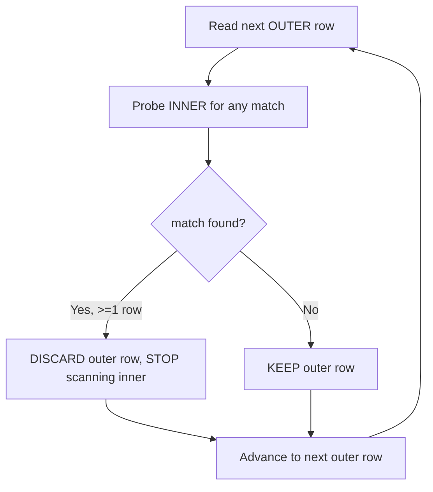
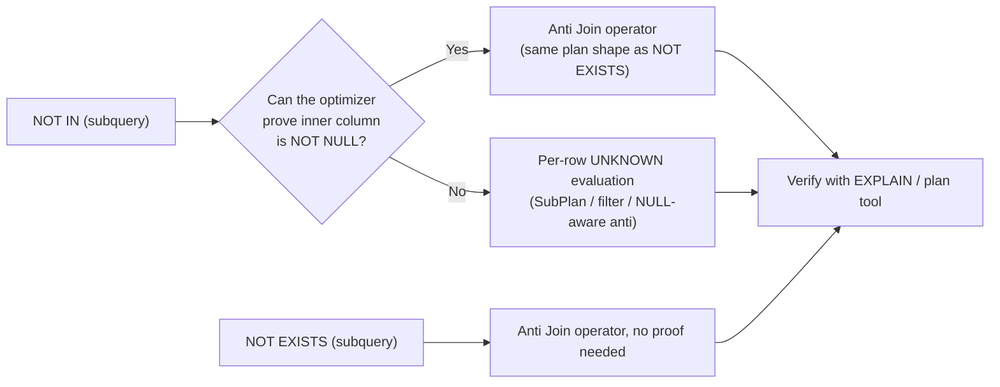
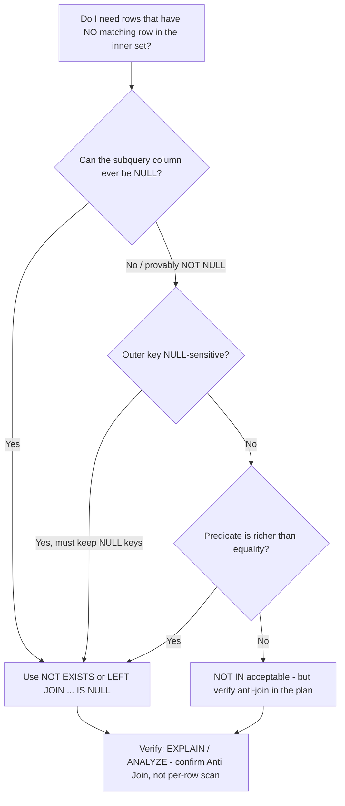

The file exists but is empty. I have the conventions from sections 30, 14, and 23. Writing the full section now.
Wrote `sql-handbook/4-Subqueries/31-NOT-IN-vs-NOT-EXISTS.md` (937 lines).

Covers: fundamentals & semantic contrast (value-comparison vs row-existence), ANSI syntax, grain-stated sample data, internal machinery (anti-join operators, NULL-proof requirement, materialization, Oracle's `ANTI SNA`), the NULL trap (both outer and inner axes), when/why the two agree, 8 scenarios with BAD vs BETTER, edge cases (empty set, all-NULL set, aggregates, `OR`, multiplicity), mistakes, production pitfalls, performance with plan-verification tools per engine, dialect notes, comparison tables + Mermaid decision flow, best practices, and an unanswered Interview Questions bank (Beginner → Performance), cross-referenced to Sections 30, 14, and 23 instead of repeating them.
 there.

---

## Table of Contents

- [1. The one-paragraph summary](#1-the-one-paragraph-summary)
- [2. Fundamentals — what each operator really asks](#2-fundamentals--what-each-operator-really-asks)
- [3. Syntax (ANSI SQL)](#3-syntax-ansi-sql)
- [4. Sample data and grain](#4-sample-data-and-grain)
- [5. Internal working — how the engine executes each form](#5-internal-working--how-the-engine-executes-each-form)
- [6. The NULL trap — when the two operators disagree](#6-the-null-trap--when-the-two-operators-disagree)
- [7. When they agree (and how to prove it)](#7-when-they-agree-and-how-to-prove-it)
- [8. Scenario-based examples](#8-scenario-based-examples)
- [9. Edge cases](#9-edge-cases)
- [10. Common mistakes](#10-common-mistakes)
- [11. Production pitfalls](#11-production-pitfalls)
- [12. Performance implications](#12-performance-implications)
- [13. Database-specific behavior](#13-database-specific-behavior)
- [14. Comparison tables and decision guide](#14-comparison-tables-and-decision-guide)
- [15. Best practices](#15-best-practices)
- [16. SQL reasoning checklist](#16-sql-reasoning-checklist)
- [17. Interview Questions](#17-interview-questions)

---

## 1. The one-paragraph summary

Both `NOT IN (subquery)` and `NOT EXISTS (subquery)` try to answer the same business question:

> "Which rows of the outer table have **no matching row** in the inner set?"

They are *logically equivalent* when neither side can ever be NULL. When NULLs can appear in the subquery result — and in most real schemas they can — they diverge badly:

- `NOT IN` is a **value comparison**, so it obeys three-valued logic, and one NULL in the inner set makes every comparison `UNKNOWN`. **Result: zero rows, silently, with no error.**
- `NOT EXISTS` is a **row-existence test**, so it never compares values at all. `NULL` is irrelevant to it. **Result: the correct anti-answer every time.**

That is the entire section in one sentence: `NOT IN` asks "is this value unequal to *every* returned value?" and `NOT EXISTS` asks "does this inner query return zero rows?" — and those are different questions as soon as NULL enters the picture.

---

## 2. Fundamentals — what each operator really asks

### 2.1 What `NOT IN` is

`NOT IN (subquery)` is the negation of a membership test:

```sql
x NOT IN (SELECT y FROM t)
```

This is sugar for:

```sql
NOT ( x = y1 OR x = y2 OR x = y3 OR ... )
-- which, by De Morgan, is:
x <> y1 AND x <> y2 AND x <> y3 AND ...
```

Notice the expansion: one `<>` comparison **per returned value**. If the subquery returns a million rows, this is conceptually a million `<>` comparisons (the optimizer almost never literally does that — see §5 — but the *semantics* are per-value).

Because it is built out of `=` and `<>`, `NOT IN` inherits every piece of NULL behavior from three-valued logic.

### 2.2 What `NOT EXISTS` is

`NOT EXISTS (subquery)` is the negation of an existence test:

```sql
NOT EXISTS (SELECT 1 FROM t WHERE ...)
```

It asks exactly one thing: **does the subquery return zero rows?** It never looks at the values in those rows. The SELECT list is ignored. If the subquery produces no rows, the predicate is TRUE; if it produces one or more rows, the predicate is FALSE.

### 2.3 The crucial difference in one sentence

> `NOT IN` compares **values**; `NOT EXISTS` counts **rows**. Comparing values is where NULL breaks things; counting rows never involves NULL.

### 2.4 Why `NOT EXISTS` exists

Historically, `NOT IN` came first and was the "natural" way to write a negation. But its NULL sensitivity made it a correctness landmine, and its per-value semantics made it harder to optimize into a set-based operation in early engines. `NOT EXISTS` gives you:

1. NULL-safety by construction (no value comparison happens).
2. Richer predicates — the correlate condition can be any expression, not just equality (e.g. "no order above $100").
3. A friendlier mental model for anti-joins read naturally as English: *"keep rows for which there does not exist a matching row."*

### 2.5 The relationship to anti-joins

Both operators are *expressions* of a single relational operation: the **anti-join** — "rows of A with no match in B." See *Section 23: Anti-Joins* for the full family of spellings. The important consequence here:

`NOT EXISTS` is almost always recognized by the optimizer and executed as a genuine anti-join operator (nested-loop, hash, or merge). `NOT IN` **can also** be executed as an anti-join — but **only if the optimizer can prove the subquery never returns NULL**. If it cannot, the engine is forced to evaluate row-by-row with UNKNOWN semantics, which is both slower *and* wrong.

---

## 3. Syntax (ANSI SQL)

```sql
-- NOT IN with a literal list (no subquery)
SELECT ... FROM t1 WHERE col NOT IN (1, 2, 3);

-- NOT IN with a subquery (subquery MUST return exactly ONE column)
SELECT ... FROM t1
WHERE col NOT IN (SELECT some_column FROM t2 WHERE <filter>);

-- NOT EXISTS (subquery may reference outer columns = "correlated")
SELECT ... FROM t1 AS a
WHERE NOT EXISTS (SELECT 1 FROM t2 AS b WHERE b.col = a.col);

-- NOT EXISTS does NOT work on a literal list — it requires a subquery
-- (there is no such thing as WHERE NOT EXISTS (1,2,3))
```

Rules:

- The `NOT IN` subquery must return **exactly one column** (unless you use row-value / multi-column `IN`, which is non-portable).
- The `NOT EXISTS` subquery may return any columns — they are ignored. Convention is `SELECT 1`.
- `NOT IN` works with a plain literal list; `NOT EXISTS` cannot.
- `NOT IN (subquery)` subqueries are usually **non-correlated**; `NOT EXISTS` is usually **correlated**. Both forms can be written either way, but the correlated shape is where `NOT EXISTS` lives.
- There is no implicit "deduplication" in either — but `NOT IN`'s comparisons make duplicates harmless, and `NOT EXISTS` stops at the first match.

> PostgreSQL note: `x NOT IN (SELECT ...)` is exactly `x <> ALL (SELECT ...)`. The `ALL` syntax makes the three-valued logic visible: it reads literally as "x is unequal to ALL of these," and if any of "these" is NULL, that term is UNKNOWN.

---

## 4. Sample data and grain

We reuse the shared mini-schema from Section 30 so you can compare the two sections directly. Always state grain before querying.

> One row in `departments` = one department.
> One row in `employees` = one employee.
> One row in `customers` = one customer.
> One row in `orders` = one order.
> One row in `order_items` = one line item of an order.
> One row in `products` = one product.

```sql
CREATE TABLE departments (
  department_id   INT PRIMARY KEY,
  department_name VARCHAR(50)
);

CREATE TABLE employees (
  employee_id   INT PRIMARY KEY,
  name          VARCHAR(100),
  department_id INT,   -- may be NULL: employee not yet assigned
  manager_id    INT    -- may be NULL: top of the reporting chain
);

CREATE TABLE customers (
  customer_id   INT PRIMARY KEY,
  customer_name VARCHAR(50)
);

CREATE TABLE orders (
  order_id    INT PRIMARY KEY,
  customer_id INT,      -- may be NULL: order processed without a registered customer
  order_date  DATE
);

CREATE TABLE products (
  product_id   INT PRIMARY KEY,
  product_name VARCHAR(50)
);

CREATE TABLE order_items (
  order_item_id INT PRIMARY KEY,
  order_id      INT,
  product_id    INT,
  quantity      INT,
  unit_price    DECIMAL(10, 2)
);

INSERT INTO departments VALUES
  (1, 'Engineering'),
  (2, 'Sales'),
  (3, 'HR'),
  (4, 'Finance');          -- note: Finance has NO employees

INSERT INTO employees VALUES
  (101, 'Alice',  1,    NULL),
  (102, 'Bob',    1,    101),
  (103, 'Carol',  2,    101),
  (104, 'Dave',   NULL, 103),   -- Dave: department unknown (NULL)
  (105, 'Eve',    2,    103),
  (106, 'Frank',  3,    104);

INSERT INTO customers VALUES
  (1, 'Alpha'),
  (2, 'Beta'),
  (3, 'Gamma'),
  (4, 'Delta');

INSERT INTO orders VALUES
  (100, 1, '2026-01-05'),
  (101, 1, '2026-02-10'),
  (102, 2, '2026-03-01'),
  (103, 3, '2026-03-15');

INSERT INTO products VALUES
  (11, 'Laptop'),
  (12, 'Mouse'),
  (13, 'Monitor');

INSERT INTO order_items VALUES
  (1, 100, 11, 1, 1200.00),
  (2, 101, 12, 3,  25.00),
  (3, 102, 12, 2,  25.00),
  (4, 103, 11, 1, 1200.00);
```

**Data facts you should be able to state from memory:**

- `employees.department_id` contains a **NULL** (Dave, id 104). This is the value that will poison every direct `NOT IN` against employees.
- `orders.customer_id` contains **no NULLs** here — so a `NOT IN` against orders happens to be safe *in this sample*. (Note: the column is still defined as nullable — that is the trap.)
- `department 4 (Finance)` has zero employees.
- Customer 4 (Delta) has zero orders.
- Product 13 (Monitor) appears in no order_items row.

---

## 5. Internal working — how the engine executes each form

Do not memorize "form X is always faster." Learn the physical shapes a plan can take, because every real plan is one of them.

### 5.1 `NOT EXISTS` → Anti Join (the usual case)

`NOT EXISTS` is the shape optimizers convert most reliably into an **anti-join** operator: keep an outer row only when the inner lookup finds zero matches.

Common physical implementations:

- **Nested Loop Anti Join** — scan outer rows; for each, probe the inner side (ideally via an index seek). Stop at the first inner match — any match kills the outer row, no need to keep scanning. This is the "short-circuit."
- **Hash Anti Join** — build a hash table on one side, probe with the other; emit outer rows that hit nothing.
- **Merge Anti Join** — both sides sorted on the join key, walked in lockstep; emit outer rows that never line up.



The inner probe is only cheap if the targeted column is **indexed**; otherwise it degenerates to a scan of the inner table per outer row (see §12).

### 5.2 `NOT IN` → anti-join *only when provably NULL-free*

`NOT IN` has identical *goal* semantics, but the optimizer must first prove the subquery's output column is non-null before it is allowed to treat it as an anti-join. The decisive inputs to that proof:

1. A `NOT NULL` constraint on the inner column.
2. A filter in the subquery like `WHERE col IS NOT NULL` that the optimizer can see.
3. Column statistics telling the optimizer "this column has no NULLs."

If the proof succeeds → the engine can use a genuine anti-join, and `NOT IN` is (plan-wise) as good as `NOT EXISTS`.

If the proof fails → the engine must handle the semantics literally, because `x NOT IN (set_with_null)` demands UNKNOWN evaluation. Some engines:

- **PostgreSQL**: `NOT IN` with a provably-non-null subquery becomes an anti-join; with a nullable subquery it typically plans as a sequential-scan filter with a SubPlan (per-row evaluation), which is why it can be both slow *and* NULL-poisoned.
- **Oracle**: has a special operator, **`HASH JOIN ANTI SNA`** ("Scalar N/A" — NULL-aware anti-join), designed exactly for the `NOT IN` case where the subquery may contain NULLs. Oracle can execute NULL-aware `NOT IN` *correctly* with a hash anti join — but note: "correctly" means "keeping the poison behavior": when the inner set contains NULL, the NULL-aware anti join *deliberately* returns **zero rows**, because that is what three-valued logic dictates.
- **MySQL**: uses semi-join materialization / anti-join strategies; a `NOT IN` subquery may be materialized into a temp table first, then anti-joined.
- **SQL Server**: rewrites `NOT IN` to a `Left Anti Semi Join` when it can prove no NULLs; otherwise it too falls back to an `Anti` filtered probe or a per-row check.



### 5.3 What to look for when you read a plan

- An **Anti** / **Anti Semi** / **Left Anti Semi** node = the engine recognized the anti-join semantics. Good.
- Absence of an anti node + presence of a **materialized subplan + filter** (PostgreSQL: `SubPlan`; MySQL: `Materialize` + semi-join strategy) = the engine could not decorrelate, or the NULL proof failed.
- The **number of executions** of the inner side. For an uncorrelated subquery it should be ≈ 1 (materialize once). For a correlated anti-join it is ≈ number of outer rows (each with a cheap index probe).
- **Estimated vs actual rows** at each node — a big gap means stale statistics and a possibly terrible plan.

> Common misconception: "The engine always flattens `NOT IN` into a join." It *may* — or it may materialize the subquery, or run it per outer row. The only source of truth is the execution plan on *your* engine, version, statistics, and data. Section §12 shows the exact commands.

---

## 6. The NULL trap — when the two operators disagree

This is where 95% of the real bugs live, and it is the entire reason this section exists.

### 6.1 The classic: departments with no employees

**Question:** which departments have zero employees? The honest answer from the §4 data is just `Finance` (4).

**BAD APPROACH — `NOT IN`:**

```sql
SELECT department_id, department_name
FROM departments d
WHERE d.department_id NOT IN (SELECT department_id FROM employees);
```

**Intended result:** Finance.

**Actual result:** **zero rows.**

**Why:** `employees.department_id` contains Dave's `NULL`. Expand the `NOT IN` with three-valued logic (see *Section 14* for the deep dive):

```sql
d.department_id <> 1        -- TRUE for department 4
AND d.department_id <> 2    -- TRUE
AND d.department_id <> 3    -- TRUE
AND d.department_id <> NULL -- UNKNOWN — always, for every department
```

`TRUE AND TRUE AND TRUE AND UNKNOWN = UNKNOWN` → the row is filtered. And because `department_id <> NULL` is UNKNOWN for **every** department, *not a single department survives* — including departments that happily have employees.

**BETTER APPROACH — `NOT EXISTS`:**

```sql
SELECT department_id, department_name
FROM departments d
WHERE NOT EXISTS (
  SELECT 1
  FROM employees e
  WHERE e.department_id = d.department_id
);
```

| department_id | department_name |
|---|---|
| 4 | Finance |

**Why it works:** `NOT EXISTS` never compares values. It runs the correlated subquery and asks "did it return any rows?" For Finance, `e.department_id = 4` matches no employee, so the subquery returns zero rows and `NOT EXISTS` is TRUE. Dave's NULL makes `e.department_id = d.department_id` UNKNOWN for *his* row only, so his row contributes no match — but that cannot poison any other row. NULL is structurally irrelevant to existence checks.

Equivalent safe alternative (see *Section 23: Anti-Joins*):

```sql
SELECT d.department_id, d.department_name
FROM departments d
LEFT JOIN employees e ON e.department_id = d.department_id
WHERE e.employee_id IS NULL;
```

### 6.2 The three NULL scenarios condensed

| Subquery result | `NOT IN` | `NOT EXISTS` |
|---|---|---|
| Empty (no rows) | all rows survive (vacuous truth) | all rows survive |
| Only NULLs | **zero rows** | all rows survive |
| Mix: values + one NULL | **zero rows** | the correct anti-answer |
| Values, provably NOT NULL | the correct anti-answer | the correct anti-answer |

The killer is the third row. The subquery looks fine, most of its values are real IDs, one NULL slips in (an unassigned employee, a legacy migration, a LEFT JOIN inside the subquery), and the entire query silently collapses to nothing.

> **Interview trap:** "`NOT IN` returns the empty result set whenever the subquery returns at least one NULL." Also: `NOT IN` returns *no rows* here **even when the outer value clearly has no match** (this is what makes it a silent bug rather than a merely-odd one).

### 6.3 NULL on the outer (left) side

The left side has its own NULL bug, independent of the inner one.

```sql
SELECT employee_id, name
FROM employees
WHERE department_id NOT IN (1, 2);
```

With §4 data, Dave's `department_id` is NULL. `NULL NOT IN (1,2)` expands to `NULL <> 1 AND NULL <> 2` = `UNKNOWN AND UNKNOWN` = UNKNOWN → **Dave is dropped**, even though he is genuinely not in departments 1 or 2.

`NOT EXISTS` keeps him, because for Dave the correlated subquery finds no match:

```sql
SELECT employee_id, name
FROM employees e
WHERE NOT EXISTS (
  SELECT 1 FROM departments d WHERE d.department_id = e.department_id
);
```

| employee_id | name |
|---|---|
| 104 | Dave |

So there are **two independent NULL axes**:

1. NULL in the outer value → `NOT IN` drops the row; `NOT EXISTS` keeps it.
2. NULL in the inner set → `NOT IN` drops *every* row; `NOT EXISTS` is unaffected.

### 6.4 `NOT IN` with a literal list containing NULL

Same poison, no subquery involved:

```sql
SELECT name FROM employees WHERE name NOT IN ('Alice', NULL);
```

Expands to `name <> 'Alice' AND name <> NULL` → always UNKNOWN → **zero rows, including Bob, Carol, everyone.** There is no optimizer trick, no proof, no safe rewrite for a literal `NULL` inside a list — you just cannot write this.

---

## 7. When they agree (and how to prove it)

`NOT IN` and `NOT EXISTS` return identical rows exactly when:

1. The subquery's returned column can never be NULL, **and**
2. The outer column's NULLs are irrelevant to the answer (or the outer column is NOT NULL too), **and**
3. The correlation is a plain equality (not a complex predicate).

The classic safe case is an anti-join against a **NOT NULL foreign key**:

```sql
-- orders.order_id and payments.order_id are both NOT NULL
SELECT o.order_id
FROM orders o
WHERE o.order_id NOT IN (SELECT p.order_id FROM payments p);
-- ≡
SELECT o.order_id
FROM orders o
WHERE NOT EXISTS (SELECT 1 FROM payments p WHERE p.order_id = o.order_id);
```

Here the three forms agree completely. Both `NOT IN` (provably NOT NULL) and `NOT EXISTS` (always safe) can be executed as anti-joins.

**How to prove "the inner column never has NULL" — three escalating levels:**

| Level | Proof | Strength |
|---|---|---|
| Schema | The column has a `NOT NULL` or PRIMARY KEY constraint | Strong, but only if the constraint is real (see waterfall trap below) |
| Query | The subquery adds `WHERE col IS NOT NULL` | Strong, explicit, always portable |
| Runtime | `SELECT COUNT(*) FROM t WHERE col IS NULL` returns 0 *today* | Weak — true today, breaks tomorrow |

> **Production pitfall (the waterfall trap):** a `NOT NULL` constraint is only as good as the pipeline that feeds it. If a nightly ETL loads data with a NULL default (`COALESCE`-less ingestion, a buggy source extract, a bad merge), the constraint — if any — will *reject* the load and you'll notice. But plenty of schemas have **no** constraint ("it was always clean"), and then a single NULL silently poisons a `NOT IN` without anyone noticing. Even worse: if the constraint exists but your subquery **derives** a column (via a LEFT JOIN inside the subquery, or a `COALESCE`'d expression) the constraint does not protect you. The plan-proof "this column is NOT NULL" applies to the *derived* value, not the constraint.

> **Interview trap:** the "yes, but it always works" argument. A developer tests `NOT IN` on data that happens to be clean, declares it safe, and ships it. Correctness was *data-dependent*, not *query-dependent*. This is why interviews love re-asking it with one NULL injected.

### 7.1 The one case where `NOT IN` can match extra rows... (spoiler: it can't, in the other direction)

There is no case where `NOT IN` returns a *superset* of `NOT EXISTS` on the same question — when both return rows, they return the same rows (given the conditions above) or `NOT IN` returns a strict *subset* (due to NULL dropping). The difference is always in the loss direction: `NOT EXISTS` ≥ `NOT IN` (as sets), with equality when no NULLs are involved. If your `NOT IN` query returns rows *and* your `NOT EXISTS` returns more rows, diff them on NULL keys — that is exactly the poison you are missing.

---

## 8. Scenario-based examples

### 8.1 Users who never logged in

**grain:** one row per user in `users`; one row per login event in `logins`.

```sql
-- logins.user_id is a NOT NULL FK, but don't rely on "it's usually filled"
-- BAD - what if some legacy logins have NULL user_id?
SELECT u.user_id, u.name
FROM users u
WHERE u.user_id NOT IN (SELECT l.user_id FROM logins l);

-- BETTER - NULL-safe and works even if the FK is later relaxed
SELECT u.user_id, u.name
FROM users u
WHERE NOT EXISTS (
  SELECT 1 FROM logins l WHERE l.user_id = u.user_id
);
```

The `NOT EXISTS` version protects you from: NULLs in `logins.user_id`, NULLs in `users.user_id`, and any future schema relaxation. The `NOT IN` version is a time bomb.

### 8.2 Orders never paid (NOT NULL inner key — the safe use of `NOT IN`)

**grain:** one row per order; one row per payment. `payments.order_id` is a `NOT NULL` FK.

```sql
-- Safe: payments.order_id provably NOT NULL
SELECT o.order_id, o.order_date
FROM orders o
WHERE o.order_id NOT IN (SELECT p.order_id FROM payments p);
```

**Result:** orders 103 (of §4 data) — the only order with no payment. Wait — §4 has no payments table; adjust to: with a `payments` table where order 100 has payments and the rest none, the result is orders 101, 102, 103.

Right: the point is **ranking the decision.**

- If the inner column is `NOT NULL` (constrained) the optimizer *may* even rewrite `NOT IN` as an anti-join, so results and often cost equal `NOT EXISTS`.
- But note the sentence "the optimizer may": you must still verify the plan. And the *schema could change*. A future `ALTER TABLE payments ALTER COLUMN order_id DROP NOT NULL` silently turns your "safe" query into a zero-row-machine.

**Recommendation:** even here, many teams standardize on `NOT EXISTS` purely for uniformity — one pattern to review, no proof required per query.

### 8.3 Products never ordered

**grain:** one row per product; one row per order item. `order_items.product_id` is a NOT NULL FK — but the `order_items` table as a whole may be *empty*.

```sql
-- BAD (fragile even though it "works" today)
SELECT product_id, product_name
FROM products
WHERE product_id NOT IN (SELECT product_id FROM order_items);

-- BETTER
SELECT product_id, product_name
FROM products
WHERE NOT EXISTS (
  SELECT 1 FROM order_items oi WHERE oi.product_id = products.product_id
);
```

**Result (with §4 data):** only `Monitor` (13) — Laptop and Mouse both appear in `order_items`.

Edge worth teaching: if `order_items` were **empty**, `NOT IN` returns *all* products (vacuous truth — the only "safe-looking" NULL edge). `NOT EXISTS` also returns all products. Good — for an empty inner table they agree. The divergence needs exactly one NULL row.

### 8.4 No order above $100 — complex predicate (impossible with plain `NOT IN`)

`NOT IN` can only test membership by value equality. The moment "no match" means *"no match satisfying a predicate"*, `NOT IN` cannot express it and `NOT EXISTS` is the natural tool:

```sql
-- Customers with NO order above $100
SELECT c.customer_id, c.customer_name
FROM customers c
WHERE NOT EXISTS (
  SELECT 1 FROM orders o
  WHERE o.customer_id = c.customer_id
    AND o.total_amount > 100
);
```

There is no `NOT IN` equivalent for the `AND o.total_amount > 100` condition. (You *could* build the "set of customers with a big order" as a subquery and then `NOT IN` against it, which is correct but clunkier and still nullable-fragile.)

### 8.5 Multi-column "never matched" (composite key)

`NOT IN` on a composite key relies on row-value `IN`, which is engine-dependent. `NOT EXISTS` correlates each key column — portable and clear:

```sql
SELECT e.student_id, e.course_id
FROM enrollments e
WHERE NOT EXISTS (
  SELECT 1 FROM attendance a
  WHERE a.student_id = e.student_id
    AND a.course_id  = e.course_id
);
```

Correlating only one column (`WHERE a.student_id = e.student_id`) is a classic bug — it answers "students who attended *anything*", not "this exact enrollment."

### 8.6 The "empty subquery" special case

```sql
-- Dynamic filter that happens to match nothing
-- BAD: returns ALL departments (vacuous truth) — often NOT the intent
SELECT department_name
FROM departments
WHERE department_id NOT IN (SELECT department_id FROM employees WHERE manager_id = -1);

-- BETTER: same vacuous-truth behavior, but the semantics are explicit
SELECT department_name
FROM departments d
WHERE NOT EXISTS (
  SELECT 1 FROM employees e
  WHERE e.department_id = d.department_id AND e.manager_id = -1
);
```

Both return all four departments here. The subtlety: when an application builds a "NOT IN this dynamic list" and the list comes back empty, `NOT IN` returns **everything** — often a surprise that needs an explicit guard (`WHERE (SELECT COUNT(*) ...) > 0`). `NOT EXISTS` has the identical edge, so the fix is the same for both.

### 8.7 Nested: "customers with no orders, among orders that reference deleted customers"

Anti-joins compose. A NULLable level between them tends to break the `NOT IN` chain:

```sql
-- "customers with no orders whose product still exists"
-- BAD: the inner join may emit NULLs, OR the outer NOT IN hits the poison
SELECT c.customer_name
FROM customers c
WHERE c.customer_id NOT IN (
  SELECT o.customer_id
  FROM orders o
  LEFT JOIN products p ON p.product_id = o.product_id
  -- unmatched LEFT JOIN rows carry NULL product_id — but we select o.customer_id,
  -- which is NOT NULL here, so poison needs the *outer* level to be nullable.
);

-- BETTER: explicit, no derivation to reason about
SELECT c.customer_name
FROM customers c
WHERE NOT EXISTS (
  SELECT 1
  FROM orders o
  JOIN products p ON p.product_id = o.product_id
  WHERE o.customer_id = c.customer_id
);
```

> Production pitfall: `NOT IN` over a subquery that **derives** its output (LEFT JOINs, UNION, COALESCE, CASE) is doubly fragile. The inner table column may be NOT NULL while the *derived* value is not. The plan's "not null" knowledge depends on what the subquery actually produces, and it is easy to reason wrongly about it.

### 8.8 BAD vs BETTER summary of the whole section

```sql
-- BAD (zero rows, silently)
SELECT d.department_name
FROM departments d
WHERE d.department_id NOT IN (SELECT department_id FROM employees);

-- BETTER (Finance)
SELECT d.department_name
FROM departments d
WHERE NOT EXISTS (SELECT 1 FROM employees e WHERE e.department_id = d.department_id);

-- BETTER (same answer, anti-join spelling)
SELECT d.department_name
FROM departments d
LEFT JOIN employees e ON e.department_id = d.department_id
WHERE e.employee_id IS NULL;
```

---

## 9. Edge cases

### 9.1 Empty subquery → vacuous truth

| | `NOT IN` | `NOT EXISTS` |
|---|---|---|
| Inner set empty | all rows kept (`NOT IN ()` is vacuous) | all rows kept (0 inner rows) |

Surprising wrinkle: **even a NULL outer key is kept** by `NOT IN` over an empty subquery, because there is no value to compare against: `NULL NOT IN (empty)` is TRUE, while `NULL NOT IN (1, 2)` is UNKNOWN. The presence of *any* element in the list activates the comparison and NULL dies again.

### 9.2 Subquery returns only NULLs

`NOT IN` → zero rows (every comparison UNKNOWN). `NOT EXISTS` → all outer rows (no row ever matches). `EXCEPT` → all outer rows whose key is NULL are removed (NULL "equals" NULL in set ops). See §13.

### 9.3 Outer key is NULL

- `NOT IN` → row dropped (UNKNOWN).
- `NOT EXISTS` → row kept (no match found).
- `LEFT JOIN ... IS NULL` → row kept.
- `EXCEPT` → row dropped (NULL matches NULL).

For "list the employees not assigned to a listed department," the business usually wants the `NOT EXISTS` / LEFT JOIN behavior (include Dave). If the business wants "unassigned people are a separate queue," add `AND e.department_id IS NOT NULL` explicitly — SQL cannot guess business semantics.

### 9.4 Duplicate keys on the right

`orders` with 1,000 duplicate rows for customer 1 changes nothing in the output of any anti-join form (existence is binary). It can change the *cost*: `NOT EXISTS` may short-circuit at the first match; a materialized `NOT IN` builds a set (dedup takes care of itself); a `LEFT JOIN` fans out the 1,000 rows before filtering. Same answer, different plan — verify.

### 9.5 Duplicate keys on the left (multiplicity)

- `NOT EXISTS` / `NOT IN` / `LEFT JOIN ... IS NULL` preserve left **multiplicity**: two identical unmatched outer rows → two output rows.
- `EXCEPT` deduplicates → one row. If you need raw counts, `EXCEPT` silently changes the grain.

### 9.6 `NOT IN` with an aggregate subquery

```sql
SELECT employee_id, name
FROM employees
WHERE employee_id NOT IN (SELECT MAX(manager_id) FROM employees);
```

If the sub-subquery returns one row, fine. But if it returns **NULL** (e.g. the filtered set is empty, or all values are NULL), the outer `NOT IN` collapses to zero rows. `MAX` over an empty set returns NULL — a single-value subquery turning into `(NULL)` is a quiet poison factory.

### 9.7 `NOT IN` with `OR` conditions inside

```sql
-- OR inside the IN list is fine; OR that mixes NULLs is not
WHERE name NOT IN ('Alice') OR department_id NOT IN (SELECT ...)
```

Each `NOT IN` is evaluated independently; if *either* is poisoned, that OR-branch collapses for all rows, and `TRUE OR UNKNOWN = TRUE` can still keep rows via the other branch. NULL logic inside OR/AND expressions interacts in non-obvious ways — this is where three-valued logic bites the hardest. Test each branch in isolation.

### 9.8 Type and collation mismatches

`WHERE numeric_id NOT IN (SELECT varchar_id FROM ...)` forces implicit casts, which can block index use and — in string collations — match rows you don't expect (SQL Server case-insensitive collations). Cast deliberately on both sides.

---

## 10. Common mistakes

1. **`NOT IN` against a nullable inner column → silent zero rows.** The single most common SQL bug. The query *looks* correct and returns a clean (empty) result — no error anywhere.
2. **Believing "`NOT IN` is just the opposite of `IN`."** It is *semantically* the negation, but under three-valued logic the negation of an UNKNOWN term is still UNKNOWN. `NOT EXISTS` is the NULL-safe negation.
3. **Using a NULLable business column as the left key** with `NOT IN` → legitimately unmatched NULL-key rows vanish.
4. **`NOT IN` subquery returning more than one column** → "subquery must return only one column" error.
5. **`NOT IN (subquery)` when you actually meant a correlated predicate** — e.g. "no order above $100" cannot be `NOT IN`.
6. **Defending `NOT IN` with `IS NOT NULL` filters** instead of just switching to `NOT EXISTS` — the fix works but adds review complexity forever after.
7. **Relying on the plan to "fix" NULL semantics** — the optimizer cannot make `NOT IN` correct against NULLs; it can only refuse to turn it into an anti-join (and then it's *slower*, still wrong).
8. **Putting the `IS NULL` sentinel on a nullable column in the LEFT JOIN anti-join** — conflating "unmatched" with "value unknown" (see *Section 23*).
9. **Using `EXCEPT` where multiplicity matters** — it deduplicates (see §9.5).
10. **Testing on clean data only.** A single NULL in a real workload changes everything; load a NULL-laced table in staging before trusting `NOT IN`.

---

## 11. Production pitfalls

> **Production pitfall (silent data loss):** `NOT IN` against a subquery that can yield NULL does not error — it quietly returns fewer rows (often zero). Reports shrink, ETL transfers truncate, dashboards clear, and nobody is alerted. It is the worst class of bug: no crash, no log, just wrong data flowing downstream.

> **Production pitfall (derived NULLs):** the subquery's inner column has a `NOT NULL` constraint, but the subquery itself derives its output — `LEFT JOIN` producing NULLs, `UNION`, `COALESCE(x, something)` — so the *value* being compared can still be NULL. The constraint proves nothing about the expression.

> **Production pitfall (the ETL DELETE/UPDATE):** a `DELETE FROM staging WHERE id NOT IN (SELECT id FROM production)` — if `production.id` contains one NULL, the delete silently deletes **nothing**, leaving stale rows forever. Same structure also applies to `UPDATE`.

> **Production pitfall (migration creep):** a "clean" nullable column later becomes nullable-by-default after a schema refactor, and previously correct `NOT IN` queries flip to zero rows without a single deployment error being raised.

> **Production pitfall (chained derives):** `SELECT ... WHERE a NOT IN (SELECT b FROM x LEFT JOIN y ...)` — the inner LEFT JOIN can hand NULLs to the outer `NOT IN`. Two layers of "clever" interact to poison a report both ways (extra NULL from the join, or NULL-derived comparison).

> **Production pitfall (performance):** in PostgreSQL, `NOT IN` over a *nullable* column typically falls back to a SubPlan executed per outer row, which can be vastly slower than the anti-join `NOT EXISTS` produces — so the risky form is often also the slow form. Oracle's `HASH JOIN ANTI SNA` is the notable exception that executes NULL-aware `NOT IN` efficiently (but with the *correct-by-spec* zero-row result when a NULL exists).

---

## 12. Performance implications

### 12.1 The myths (do not repeat as rules)

> Common misconception: "`NOT EXISTS` is always faster than `NOT IN`."
> Common misconception: "`NOT IN` is always faster when the list is small."
> Common misconception: "Anti-joins are always faster than any subquery form."

None of these are laws. Actual performance depends on the optimizer, indexes, statistics, cardinality, data distribution, query shape, and engine — and on which **physical operator** each shape compiles to. Section 5 explains the operators; this section explains how to *choose* and *verify*.

### 12.2 When `NOT EXISTS` tends to win

- The inner side is probed per outer row and is **indexed** → cheap nested-loop anti join with early exit.
- The predicate is richer than membership equality (ranges, aggregates with HAVING).
- The inner column is nullable and you use `NOT EXISTS` — beside being correct, PostgreSQL and others may refuse to anti-join a `NOT IN` on a nullable column, leaving you with per-row SubPlan work. Here correctness and performance push the same way.

### 12.3 When `NOT IN` can win

- The inner column is provably `NOT NULL` → the optimizer can anti-join it too, and the plans may be identical.
- The subquery is **uncorrelated** and cheap to materialize once (build a hash set, probe many outer rows) vs a correlated `NOT EXISTS` probing N times.
- Historically, Oracle's NULL-aware hash anti join (`HASH JOIN ANTI SNA`) makes `NOT IN` *efficient* even with unknown NULL presence — an explicit exception to the "NOT IN is slow" folklore.

### 12.4 The plan is the only arbiter — what to run

> PostgreSQL: `EXPLAIN (ANALYZE, BUFFERS) SELECT ...`
> MySQL: `EXPLAIN ANALYZE SELECT ...` (8.0.18+) or `EXPLAIN FORMAT=JSON SELECT ...`
> SQL Server: `SET STATISTICS IO, TIME ON;` plus "Include Actual Execution Plan" (the plan XML shows `Left Anti Semi Join`)
> Oracle: `EXPLAIN PLAN FOR ...` then `SELECT * FROM TABLE(DBMS_XPLAN.DISPLAY(...))`, or use `/*+ GATHER_PLAN_STATISTICS */` and `DISPLAY_CURSOR`

Read, in order:

1. **Operator shape:** is there an `Anti` / `Anti Semi` node? Both forms should be anti-joins when NULL-safe; if `NOT IN` shows a `SubPlan` + per-row filter, NULLs (or decorrelation limits) blocked the rewrite.
2. **Which side is built vs probed** in a hash anti join — you generally want the *large* duplicated side built once and the outer rows probed.
3. **Inner index usage:** an index on the correlated inner column (`orders(customer_id)`, `payments(order_id)`) turns N outer probes into N index seeks instead of N scans.
4. **Number of executions of the inner side:** an uncorrelated materialized subquery should execute ≈1 time; a correlated anti-join executes per outer row, each cheap only if indexed.
5. **Estimated vs actual rows** — a wide gap means stale statistics; refresh them before concluding anything about "which is faster."

### 12.5 What changes if results differ between forms but plans look identical

If `NOT IN` (nullable) and `NOT EXISTS` produce *different row counts* but *similar plans*, the query is correct-by-accident-on-data — the plan difference you don't see is "NULL-aware" handling (e.g. Oracle `SNA`), or `IS NOT NULL` predicates the optimizer added automatically. Diff the two result sets; the missing rows are NULL-keyed rows. Fix the data or the query — don't chase the plan.

### 12.6 When anti-joins get expensive regardless of form

- Non-equality predicates inside the anti (e.g. `AND o.amount < c.limit`) may block the anti-join rewrite → full outer join + filter, or nested loop with poor estimates.
- `OR` conditions inside the `EXISTS` subquery frequently prevent flattening.
- No index on the inner correlated column + large outer set → O(outer × inner) comparisons.
- Huge literal `NOT IN (1,2,...,100k)` lists can blow parse time and parameter limits (Oracle historically capped `IN` lists at ~1000 items; drivers too). Batch or use a temp table / `VALUES` / `UNNEST`.

---

## 13. Database-specific behavior

> **PostgreSQL**
> - `NOT IN (subquery)` on a provably-NOT-NULL column → anti-join. On a nullable column → typically a per-row `SubPlan` filter (slow) with the built-in NULL poison.
> - `NOT EXISTS` → anti-join, no proof needed.
> - `x NOT IN (...)` ≡ `x <> ALL (SELECT ...)`, which makes three-valued logic explicit.
> - `IS [NOT] DISTINCT FROM` available if you want NULL rows to count as matching inside a correlation.

> **MySQL**
> - Semi-join strategies (materialization / FirstMatch / exists / loose index scan, 5.6+; 8.0 rewrites subqueries aggressively). A `NOT IN` subquery may be materialized into a temporary table before anti-joining.
> - `LIMIT`, `GROUP BY`, `ORDER BY` inside the subquery can force materialization and change the plan entirely — re-EXPLAIN after shape changes.
> - `EXCEPT` only from 8.0.31.

> **SQL Server**
> - Rewrites `NOT IN` (NULL-free) and `NOT EXISTS` to `Left Anti Semi Join`; with NULLable subqueries it keeps an anti probe with NULL-awareness, so plans can differ.
> - `NOT IN` on a nullable column is frequently both wrong *and* the slower spelling; prefer `NOT EXISTS`.
> - Note about the "Subquery returned more than one value" error: that belongs to scalar subqueries (`= (SELECT ...)`, `<> (SELECT ...)`), never to `IN`/`NOT IN`, which tolerate multi-row results.

> **Oracle**
> - The exception that proves the rule: `HASH JOIN ANTI SNA` (NULL-aware anti join) executes `NOT IN` *efficiently* even when NULL presence is unknown — but it preserves the correct three-valued result: zero rows if the inner set contains a NULL. Fast and wrong is still wrong.
> - `MINUS` for whole-row set difference; `IN`-list cap historically ~1000 elements.

> **MySQL / DuckDB / Spark-syntax families**
> - DuckDB/Spark/SQLite3.30+ etc. have explicit `ANTI JOIN` / `LEFT ANTI JOIN` keywords in some engines — non-ANSI, not available in the big four.

---

## 14. Comparison tables and decision guide

### 14.1 NOT IN vs NOT EXISTS feature matrix

| Aspect | `NOT IN (subquery)` | `NOT EXISTS (subquery)` |
|---|---|---|
| Conceptual model | value *not-equal to every element* of a set | subquery returns **zero rows** |
| Value comparison happens? | yes — per returned value | no — existence only |
| Usually correlated? | no (decorrelated) | yes |
| Subquery columns | exactly 1 column | SELECT list ignored (`SELECT 1`) |
| NULL in inner set | **zero rows (poison)** | safe |
| NULL outer value | row dropped (UNKNOWN) | row kept |
| Can express non-equality predicates (`no order > $100`)? | no | yes |
| Optimizer→anti-join | only if inner provably NOT NULL | always a candidate |
| Empty inner set | all rows kept (vacuous) | all rows kept |
| Multi-column correlation | hard / non-portable (row-value) | natural |
| Readability of anti-join intent | deceptively simple | explicit "no such row exists" |

### 14.2 NULL behavior matrix (both forms, both sides)

| Situation | `NOT IN` | `NOT EXISTS` | `LEFT JOIN ... IS NULL` | `EXCEPT` / `MINUS` |
|---|---|---|---|---|
| Outer key NULL | dropped | kept | kept | dropped (NULL= for sets) |
| Inner set contains a NULL, no match for outer row | **dropped (poison)** | kept | kept | kept |
| Inner set empty | all kept (incl. NULL keys) | all kept | all kept | all kept |
| Inner set all NULLs | zero rows | all kept | all kept | all non-NULL outer kept |
| Inner set is only values (NOT NULL) | correct anti-answer | correct anti-answer | correct anti-answer | correct (with NULL= caveat) |
| Duplicate outer rows | preserved | preserved | preserved | **deduplicated** |

### 14.3 Decision flowchart



### 14.4 SQL reasoning checklist (NOT IN vs NOT EXISTS)

1. What does one output row represent? (a driving-table row with zero inner matches)
2. Can the inner subquery produce a NULL? (check schema constraints, derived expressions, LEFT JOINs inside)
3. Is the outer key itself nullable, and do we keep or drop NULL-keyed rows?
4. Do I only need existence, or a richer predicate? (existence → `NOT EXISTS` comfortable; richer → `NOT EXISTS` required)
5. Does the plan show an anti-join, or a per-row subplan? (see §12.4)
6. Did I include an index on the correlated inner column? (see §12.6)

---

## 15. Best practices

1. **Default to `NOT EXISTS` for anti-joins.** It is NULL-safe by construction, optimizer-friendly, expresses complex predicates, and reads like English. Write `NOT IN` only for literal lists you can see (`status NOT IN ('cancelled', 'refunded')`).
2. **If you keep `NOT IN (subquery)`, make NULL-absence explicit and local:** add `WHERE col IS NOT NULL` in the subquery and note it in review.
3. **Prefer `NOT NULL` / PRIMARY KEY constraints on FKs** — this is what lets the optimizer safely anti-join `NOT IN` and makes the data honest.
4. **Watch for *derived* NULLs:** a subquery built on a LEFT JOIN, UNION, or COALESCE can hand NULL to `NOT IN` even when the base column is constrained.
5. **Treat NULL-keyed outer rows deliberately:** decide up front whether "not matched" includes rows whose key is NULL, and write the explicit `IS NOT NULL` guard if not.
6. **Never put a `NULL` literal into a `NOT IN` list.** `NOT IN ('a', NULL)` is always zero rows.
7. **Prefer the `LEFT JOIN ... IS NULL` spelling when you already join for other columns**, and remember two rules: the sentinel is a NOT NULL column, and extra conditions stay in `ON` (see *Section 23*).
8. **Always verify with the plan** (commands in §12.4) before discussing speed; re-verify when statistics or cardinality change.
9. **Standardize on one anti-join pattern per codebase** (`NOT EXISTS`) so reviews check correctness once, not per query.
10. **Audit existing code** with a grep for `NOT IN (SELECT` and re-review each hit against §6's poison checklist.

---

## 16. Cross-references (browse in this order for depth)

- *Section 30: IN vs EXISTS* — positive forms, plan-shape details, semi joins.
- *Section 14 (NULL & Logic): NOT IN + NULL Pitfalls* — the mechanical truth-table walk-through of the poison.
- *Section 23 (JOINs): Anti-Joins* — `NOT EXISTS` / `NOT IN` / `LEFT JOIN ... IS NULL` / `EXCEPT` as four spellings of one operation, plus sentinel rules and multi-hop traps.
- *Sections 9–11 (NULL & Logic)* — three-valued logic, `NULL = NULL`, `IS [NOT] DISTINCT FROM`.

---

## 17. Interview Questions

Answers are intentionally not given — solve them first. (Use the §4 sample data where rows are referenced.)

### Beginner

1. In plain English: what question does `NOT IN (subquery)` ask, and what question does `NOT EXISTS (subquery)` ask? Where does that difference show up?
2. Write a query for "departments with zero employees" using `NOT EXISTS`, using §4 data. Predict the rows.
3. Why is the SELECT list of a `NOT EXISTS` subquery irrelevant? What is the conventional thing to write there, and why?
4. What is the error when a `NOT IN` subquery returns two columns? Why does `NOT EXISTS` not have this problem?

### Intermediate

5. Using the §4 data (Dave has `department_id = NULL`), expand `department_id NOT IN (SELECT department_id FROM employees)` step by step with three-valued logic and explain why **zero** departments come back.
6. Say the same query with `NOT EXISTS` — what comes back now, and why is the NULL harmless here?
7. Compare the result of `NOT IN` when the subquery returns an *empty* set vs a set *containing one NULL*. Both edge cases, one sentence each.
8. Under what conditions is `NOT IN` safe to use? How do you prove them *permanently*, not just for today's data?

### Advanced

9. Explain the physical operators: when does `NOT EXISTS` become a nested-loop anti join, a hash anti join, or a merge anti join? What reads — indexes, statistics, cardinality — would flip the choice?
10. PostgreSQL may refuse to anti-join `NOT IN` on a nullable column and run a per-row SubPlan instead. Explain the optimizer's reasoning (what proof does it want?) and why the same query with all-NOT-NULL data gets an anti-join.
11. Oracle's `HASH JOIN ANTI SNA` executes `NOT IN` efficient-ly even with NULL presence unknown. Why does it still return zero rows when the inner set contains a NULL? (Connect this to three-valued logic.)
12. A subquery derives its output column via `LEFT JOIN` and `COALESCE`. The base column is NOT NULL. Why can the `NOT IN` against it still poison, and what does the execution plan rely on?

### Scenario Based

13. A nightly job computes "customers who have never placed an order" with `NOT IN`. Last night it returned zero rows for the first time. Order the checks you run: schema constraints, data scan for NULLs, execution plan, result diff against `NOT EXISTS`. What is the most likely root cause?
14. `payments.order_id` is a NOT NULL FK. "Orders never paid" with `NOT IN` happens to be correct and plans as an anti-join. The DBA plans to drop the FK. What is your recommendation, and what query would you write that doesn't depend on the constraint?
15. Write "users who never logged in" two ways — one `NOT IN`, one `NOT EXISTS` — for a schema where `logins` is joined *inside* a subquery that also references a `device` table. Explain which one you would ship and why.
16. Reconcile: query A (with `NOT IN`) and query B (with `NOT EXISTS`) return different counts. Diff the actual result sets and explain exactly which rows differ and why (NULL keys on which side?).

### Tricky

- Predict outputs (use §4 data or pure logic):
17. `SELECT 1 WHERE 10 NOT IN (20, 30, NULL);`
18. `SELECT 1 WHERE NULL NOT IN (SELECT department_id FROM employees WHERE 1=0);` (empty subquery, NULL on the left)
19. `SELECT name FROM employees WHERE name NOT IN ('Alice', NULL);`
20. `SELECT COUNT(*) FROM departments WHERE department_id NOT IN (SELECT department_id FROM employees EXCEPT SELECT NULL);` — wait, or `SELECT NULL` in a subquery. What happens?
21. `NOT IN` with a subquery returning exactly one NULL (`SELECT NULL`) vs returning one non-NULL value; predict enough to distinguish them.
22. Why is `NULL NOT IN (empty)` TRUE but `NULL NOT IN (1)` UNKNOWN? Where does the "vacuous truth" come from, and why does adding an element switch the behavior?

### Output Prediction

Using the §4 tables exactly, predict the exact result sets:

```sql
-- Q23
SELECT department_name
FROM departments
WHERE department_id NOT IN (SELECT department_id FROM employees);

-- Q24
SELECT department_name
FROM departments d
WHERE NOT EXISTS (SELECT 1 FROM employees e WHERE e.department_id = d.department_id);

-- Q25
SELECT customer_name
FROM customers
WHERE customer_id NOT IN (SELECT customer_id FROM orders);
```

For Q25, state which data property makes this safe *today* and whether the column definition makes it safe *forever*.

### Debugging

26. A report "products never ordered" was rewritten from `NOT EXISTS` to `NOT IN` "for speed" and now returns an empty table. The products table is correct. Walk through the three fidda checks — data NULL scan, plans of both forms, result diff — and give the fix.
27. `payments` gained a new column `payment_notes` and the schema now lets `order_id` be NULL for manual adjustments. A previously-valid `NOT IN` anti-join silently breaks. What automated guards (constraints, tests, monitoring) would have caught it?
28. A colleague says "our data has no NULLs, `NOT IN` is fine here." List three reasons this reasoning breaks in production.

### Performance

29. `NOT IN` shows a `SubPlan` node executed once per outer row, while `NOT EXISTS` on the same tables shows a nested-loop anti join with an index probe. Which wins? What index, if added, changes the verdict? Which plan tool did you use?
30. Two anti-joins give identical results and identical row counts, but one uses `NOT EXISTS` and one uses `LEFT JOIN ... IS NULL` with `SELECT DISTINCT`. The `DISTINCT` version sorts the whole product of both tables. Explain the fan-out and why the plan hides it.
31. Your company benchmarks "NOT EXISTS is faster" on a small dev box, adopting it as a rule. Explain why that evidence is not portable: which of the §12.1 factors (optimizer, stats, cardinality, data distribution, query shape, engine) are dev-box-specific?
32. Oracle with `HASH JOIN ANTI SNA` vs PostgreSQL with per-row SubPlan for the *same logical query* on the *same data*. Which one is faster *and* correct? Why can the answer differ per engine? (Include the NULL case in your answer.)
33. A `NOT IN` subquery is uncorrelated and returns 5 million IDs; the outer table has 10 million rows with an index on the compared column. Walk through what each engine (choose one) is likely to do — hash materialize vs per-row — and what to verify in `EXPLAIN`.

---

*End of Section 31. For the positive forms and plan shapes, see *Section 30: IN vs EXISTS*; for the full four-spelling anti-join story, see *Section 23: Anti-Joins*; for the mechanical NULL walk-through, see *Section 14: NOT IN + NULL Pitfalls*.*