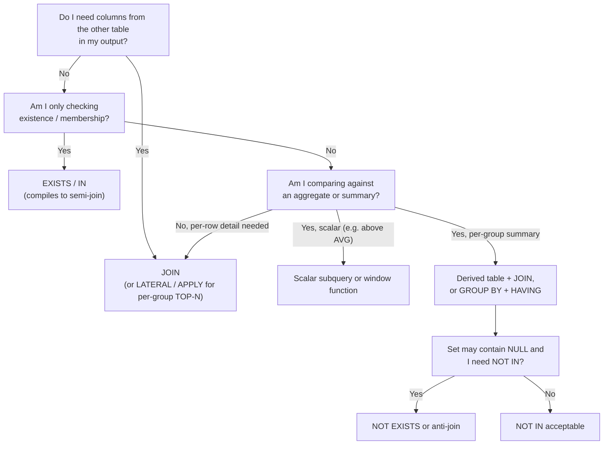

# 32. JOIN vs Subquery

A joined query and a subquery often produce the **same result** — but they are **not the same thing**. This section teaches you exactly where they overlap, where they differ, and how to choose between them without guessing.

Cross-references: [IN vs EXISTS], [NOT IN vs NOT EXISTS], [correlated subquery], [GROUP BY vs window functions], [window functions], [pagination].

---

## 1. Fundamentals

### What is a JOIN?

A JOIN combines **columns** from two or more tables into one result, using a join condition.

```sql
SELECT e.emp_name, d.dept_name
FROM employees e
JOIN departments d ON d.dept_id = e.dept_id;
```

The engine takes every pair of rows that satisfies the condition and **merges their columns into one output row**.

### What is a subquery?

A subquery is a complete `SELECT` nested inside another query. It can appear in many places and each placement has its own rules:

| Placement | Kind of subquery | What it may return |
|---|---|---|
| `SELECT` (target list) | scalar subquery | exactly 1 column, at most 1 row |
| `WHERE x IN (…)` / `WHERE x = (…)` | row / column subquery | a set or a single value |
| `WHERE EXISTS (…)` | existential subquery | any number of rows — only its existence matters |
| `FROM (…)` | derived table / inline view | a full table |
| `HAVING` / `ON` | correlated or scalar | varies |

### The key difference in one sentence

> A subquery can **filter** rows or **produce a value** based on other tables, but it cannot bring another table's columns into the outer `SELECT`. A JOIN can.

Example that makes it concrete. You cannot write this:

```sql
-- ERROR in most engines: d.dept_name is not visible in the outer SELECT
SELECT e.emp_name, d.dept_name
FROM employees e
WHERE e.dept_id IN (SELECT dept_id FROM departments d WHERE ...);
```

The outer `SELECT` has only `employees` columns. To expose `dept_name`, you need a JOIN.

---

## 2. Sample data — the grain of every table

> **One row in `departments` represents one department.**
> **One row in `employees` represents one employee.**
> **One row in `customers` represents one customer.**
> **One row in `orders` represents one order.**
> **One row in `order_items` represents one line item of an order.**
> **One row in `payments` represents one payment against an order.**

```sql
CREATE TABLE departments (
    dept_id   INT PRIMARY KEY,
    dept_name VARCHAR(50) NOT NULL
);

INSERT INTO departments VALUES
(1, 'Engineering'),
(2, 'Sales'),
(3, 'Human Resources'),
(4, 'Marketing');
```

```sql
CREATE TABLE employees (
    emp_id   INT PRIMARY KEY,
    emp_name VARCHAR(100) NOT NULL,
    dept_id  INT REFERENCES departments(dept_id),
    salary   NUMERIC(10,2)
);

INSERT INTO employees VALUES
(1, 'Alice Johnson', 1, 95000.00),
(2, 'Bob Smith',     1, 82000.00),
(3, 'Charlie Lee',   1, 88000.00),
(4, 'Diana Prince',  2, 74000.00),
(5, 'Eve Martinez',  2, 69000.00),
(6, 'Frank Wu',      3, 61000.00),
(7, 'Grace Kim',    NULL, 58000.00);
```

```sql
CREATE TABLE customers (
    customer_id   INT PRIMARY KEY,
    customer_name VARCHAR(100) NOT NULL
);

INSERT INTO customers VALUES
(1, 'Acme Corp'),
(2, 'Globex'),
(3, 'Initech'),
(4, 'Umbrella');
```

```sql
CREATE TABLE orders (
    order_id    INT PRIMARY KEY,
    customer_id INT REFERENCES customers(customer_id),
    status      VARCHAR(20),
    total       NUMERIC(12,2)
);

-- NOTE: order 105 deliberately has a NULL customer_id ("guest order")
INSERT INTO orders VALUES
(101, 1,    'shipped',  1200.00),
(102, 1,    'pending',   450.00),
(103, 2,    'shipped',   980.00),
(104, 4,    'cancelled',   0.00),
(105, NULL, 'shipped',   300.00);
```

```sql
CREATE TABLE order_items (
    order_item_id INT PRIMARY KEY,
    order_id      INT REFERENCES orders(order_id),
    product_id    INT,
    qty           INT,
    unit_price    NUMERIC(10,2)
);

INSERT INTO order_items VALUES
(1, 101, 501, 2, 250.00),
(2, 101, 502, 1, 700.00),
(3, 102, 503, 3, 150.00),
(4, 103, 501, 1, 250.00),
(5, 103, 504, 2, 365.00),
(6, 105, 503, 1, 150.00);
```

```sql
CREATE TABLE payments (
    payment_id INT PRIMARY KEY,
    order_id   INT REFERENCES orders(order_id),
    amount     NUMERIC(12,2)
);

INSERT INTO payments VALUES
(1001, 101, 700.00),
(1002, 101, 500.00),
(1003, 103, 980.00);
```

Facts you should be able to state before reading on:

- Engineering has **3** employees, Sales has **2**, HR has **1**, Marketing has **0**.
- Order 101 has **2 line items** and **2 payments**.
- Customer 3 (Initech) has **no orders**.
- Order 104 (Umbrella) is cancelled; Umbrella *has* placed an order.

---

## 3. When the two produce the identical result

### Scenario A — "Departments with more than 2 employees"

**Subquery version** (correlated subquery in `WHERE`):

```sql
SELECT dept_id, dept_name
FROM departments d
WHERE (SELECT COUNT(*) FROM employees e WHERE e.dept_id = d.dept_id) > 2;
```

**JOIN + GROUP BY + HAVING version**:

```sql
SELECT d.dept_id, d.dept_name
FROM departments d
JOIN employees e ON e.dept_id = d.dept_id
GROUP BY d.dept_id, d.dept_name
HAVING COUNT(*) > 2;
```

**Expected output (both):**

| dept_id | dept_name |
|---|---|
| 1 | Engineering |

**Why both work:** the subquery answers the question "how many employees does *this* department have?" per row; the GROUP BY version computes the same count and filters with `HAVING`. The optimizer may even transform one into the other — that is the *same* physical plan produced by different logical forms.

---

### Scenario B — "Employee count per department (keep departments with no employees)"

This is the LEFT JOIN / scalar-subquery pair. Notice the NULL and `COUNT` behavior.

**Correlated scalar subquery** (in the `SELECT` list):

```sql
SELECT d.dept_id, d.dept_name,
       (SELECT COUNT(*) FROM employees e WHERE e.dept_id = d.dept_id) AS emp_count
FROM departments d;
```

**LEFT JOIN + GROUP BY:**

```sql
SELECT d.dept_id, d.dept_name,
       COUNT(e.emp_id) AS emp_count
FROM departments d
LEFT JOIN employees e ON e.dept_id = d.dept_id
GROUP BY d.dept_id, d.dept_name;
```

**Expected output (both):**

| dept_id | dept_name | emp_count |
|---|---|---|
| 1 | Engineering | 3 |
| 2 | Sales | 2 |
| 3 | Human Resources | 1 |
| 4 | Marketing | 0 |

**Two traps hidden in plain sight:**

> **Production pitfall:** In the JOIN version you must write `COUNT(e.emp_id)`, not `COUNT(*)`. For Marketing, the LEFT JOIN synthesizes one row with `emp_id = NULL`; `COUNT(*)` counts that row → you would see **1** instead of **0**.

> **Edge case:** `COUNT`, `SUM` and `AVG` behave differently over **empty sets**. `COUNT(*)` over zero rows returns `0`; `MAX(salary)` over zero rows returns `NULL`; `SUM(salary)` returns `NULL` (not 0). That is why `COALESCE(SUM(salary), 0)` is a common pattern when the subquery may return nothing.

**Derived-table (subquery in FROM) version — same result:**

```sql
SELECT d.dept_id, d.dept_name, COALESCE(agg.emp_count, 0) AS emp_count
FROM departments d
LEFT JOIN (
    SELECT dept_id, COUNT(*) AS emp_count
    FROM employees
    GROUP BY dept_id
) agg ON agg.dept_id = d.dept_id;
```

Here the engine builds a small summary table first, then joins. `COALESCE` is needed because `agg.emp_count` is `NULL` for Marketing (no matching group).

---

### Scenario C — "Customers who have placed at least one order"

Three spellings, same answer. The subqueries here are **non-correlated**.

**`IN` subquery:**

```sql
SELECT customer_id, customer_name
FROM customers
WHERE customer_id IN (SELECT customer_id FROM orders);
```

**`EXISTS` subquery:**

```sql
SELECT c.customer_id, c.customer_name
FROM customers c
WHERE EXISTS (SELECT 1 FROM orders o WHERE o.customer_id = c.customer_id);
```

**JOIN + DISTINCT:**

```sql
SELECT DISTINCT c.customer_id, c.customer_name
FROM customers c
JOIN orders o ON o.customer_id = c.customer_id;
```

**Expected output (all three):**

| customer_id | customer_name |
|---|---|
| 1 | Acme Corp |
| 2 | Globex |
| 4 | Umbrella |

**The critical difference — row multiplicity:**

- `IN` and `EXISTS` return **each matching customer exactly once**, no matter how many orders they have.
- The JOIN returns **one row per order**. Acme would appear **twice** (orders 101 and 102). Without `DISTINCT`, Acme shows up as two rows; and if you were to count rows, you'd count orders, not customers.

> **Common misconception:** "You can always rewrite `IN` as a JOIN." You can — but you must add `DISTINCT` once the right side can be multi-valued, and `DISTINCT` itself costs a sort or hash operation that the semi-join (which is what `IN`/`EXISTS` often compile to) may not need.

**Semantic rule of thumb:**

- One output row per **customer**, no columns from orders → `IN`, `EXISTS`, or `JOIN + DISTINCT`.
- One output row per **customer–order pair**, columns from both → JOIN.

---

## 4. When you MUST use a subquery

1. **You need an aggregate computed once from a single table, compared across rows** — e.g. "every employee above the company average salary":

```sql
SELECT emp_name, salary
FROM employees
WHERE salary > (SELECT AVG(salary) FROM employees);
```

The `AVG` is computed once (non-correlated) and reused. A self-JOIN reformulation is possible but verbose and pointless.

2. **A derived table that pre-aggregates**, so you join a compact summary instead of raw rows (see the double-counting example in §6).

3. **`EXISTS` / `NOT EXISTS` existence checks**, where you only need a yes/no (these usually compile to semi/anti joins).

## 5. When you MUST use a JOIN

1. **You need to expose columns from both tables** in the output. A subquery cannot do this at all.
2. **You need every matched row**, including duplicates/sets, not "exists at least once".
3. **You need per-row detail preserved** while multiplying by the detail table (a one-to-many "fan-out" you actually want).
4. **You need to triage/diagnose what matched** — JOINs are typically easier to reason about when debugging (see §8).

> **Interview trap:** "When can a subquery produce data that a JOIN cannot?" The answer is **never for columns in the output** — LATERAL/APPLY aside, the only genuinely subquery-only cases are existence/aggregate-comparison shapes, and even those can be rewritten. Ultimately the real constraint is *what your result rows are allowed to contain*.

---

## 6. Reshaping JOINs with subqueries: the duplication trap

### Scenario D — "Revenue per order, and amount paid per order"

**BAD APPROACH** — join `orders` to `order_items` *and* to `payments` in one shot:

```sql
SELECT o.order_id,
       SUM(oi.qty * oi.unit_price) AS item_total,
       SUM(p.amount)               AS paid_total
FROM orders o
JOIN order_items oi ON oi.order_id = o.order_id
JOIN payments p     ON p.order_id = o.order_id
GROUP BY o.order_id;
```

**Why it is wrong:** order 101 has 2 line items and 2 payments. The engine cross-multiplies them → **4 rows**. `SUM` then double-counts *both* totals:

| order_id | item_total | paid_total |
|---|---|---|
| 101 | **2400.00** (should be 1200.00) | **2400.00** (should be 1200.00) |
| 103 | 980.00 | 980.00 |

This is a **many-to-many fan-out** between two independent detail tables. Classic symptoms:

- sums come out too big;
- enlarging a detail table (adding a 3rd payment) silently inflates unrelated totals;
- some rows appear multiple times in exports.

> **Production pitfall:** always ask *"what is the grain of each table I'm joining?"* — and, after the join, "what is the grain of each output row now?" If two one-to-many relationships are joined to the same parent in one query, you have a Cartesian product **between the two detail sets**, even if no `CROSS JOIN` appears.

**BETTER APPROACH** — pre-aggregate each detail table in derived-table subqueries, then join the summaries:

```sql
SELECT o.order_id,
       COALESCE(li.item_total, 0) AS item_total,
       COALESCE(pg.paid_total, 0) AS paid_total
FROM orders o
LEFT JOIN (
    SELECT order_id, SUM(qty * unit_price) AS item_total
    FROM order_items
    GROUP BY order_id
) li ON li.order_id = o.order_id
LEFT JOIN (
    SELECT order_id, SUM(amount) AS paid_total
    FROM payments
    GROUP BY order_id
) pg ON pg.order_id = o.order_id;
```

**Expected output:**

| order_id | item_total | paid_total |
|---|---|---|
| 101 | 1200.00 | 1200.00 |
| 102 | 450.00 | 0.00 |
| 103 | 980.00 | 980.00 |
| 104 | 0.00 | 0.00 |
| 105 | 150.00 | 0.00 |

Now every output row is still **one order**, and each total comes from exactly one aggregation.

### Scenario E — "Line-item count per order" (same pattern, benign)

**Scalar subquery version:**

```sql
SELECT o.order_id, o.total,
       (SELECT COUNT(*) FROM order_items oi WHERE oi.order_id = o.order_id) AS line_items
FROM orders o;
```

**LEFT JOIN + GROUP BY version:**

```sql
SELECT o.order_id, o.total, COUNT(oi.order_item_id) AS line_items
FROM orders o
LEFT JOIN order_items oi ON oi.order_id = o.order_id
GROUP BY o.order_id, o.total;
```

**Expected output (both):**

| order_id | total | line_items |
|---|---|---|
| 101 | 1200.00 | 2 |
| 102 | 450.00 | 1 |
| 103 | 980.00 | 2 |
| 104 | 0.00 | 0 |
| 105 | 300.00 | 1 |

---

## 7. The NULL trap: NOT IN vs NOT EXISTS vs LEFT JOIN

### Scenario F — "Customers who have never placed an order"

Three spellings, **not** the same answer — because order 105 has `customer_id = NULL`.

**BROKEN — `NOT IN`:**

```sql
SELECT customer_id, customer_name
FROM customers
WHERE customer_id NOT IN (SELECT customer_id FROM orders);
```

Returns **`0` rows.** Why? Recall three-valued logic: `NULL = comparison` always evaluates to `UNKNOWN`, never `TRUE` or `FALSE`.

`customer_id NOT IN (…)` is shorthand for `customer_id <> 1 AND customer_id <> 2 AND customer_id <> 4 AND customer_id <> NULL`.

The last comparison is `<> NULL` → `UNKNOWN`, so the whole `AND` chain is `UNKNOWN` → the `WHERE` rejects **every** row.

> **Common misconception:** "NULL is just a missing value." No — NULL is *absence of a value*, and comparisons with it produce `UNKNOWN` (three-valued logic). One `NULL` anywhere inside a `NOT IN` set poisons the entire predicate.

> **Interview trap:** "How many rows does `SELECT 1 WHERE 5 NOT IN (1, 2, NULL)` return?" Answer: **zero**. Same for `WHERE 5 IN (1, 2, NULL)`. But `WHERE 5 NOT IN (1, 2)` returns one row.

**SAFE — `NOT EXISTS`:**

```sql
SELECT c.customer_id, c.customer_name
FROM customers c
WHERE NOT EXISTS (SELECT 1 FROM orders o WHERE o.customer_id = c.customer_id);
```

**SAFE — LEFT JOIN anti-join:**

```sql
SELECT c.customer_id, c.customer_name
FROM customers c
LEFT JOIN orders o ON o.customer_id = c.customer_id
WHERE o.order_id IS NULL;
```

**Expected output (both safe versions):**

| customer_id | customer_name |
|---|---|
| 3 | Initech |

`NOT EXISTS` compares **per outer row within the join condition** — a NULL in the inner set simply never matches that row, and unmatched outer rows survive. The anti-join finds the same set of rows. Both are immune to the NULL-set problem.

The equivalent hidden trap inside a JOIN: if you want the "no match" rows you **must** use an outer join and may **not** filter on inner-table columns in `WHERE`.

---

## 8. ON vs WHERE — the "LEFT JOIN becomes INNER JOIN" trap

### Scenario G — "All customers and their shipped orders (keep everyone)"

**BAD APPROACH** — condition in `WHERE`:

```sql
SELECT c.customer_id, c.customer_name, o.order_id
FROM customers c
LEFT JOIN orders o ON o.customer_id = c.customer_id
WHERE o.status = 'shipped';
```

**Why wrong:** the LEFT JOIN pads unmatched customers with a NULL `order` row; the `WHERE` then evaluates `NULL = 'shipped'` → `UNKNOWN` → those rows are deleted, so customers *with orders that aren't shipped* (Umbrella) and customers *with no orders at all* (Initech) vanish. Result behaves like an INNER JOIN:

| customer_id | customer_name | order_id |
|---|---|---|
| 1 | Acme Corp | 101 |
| 1 | Acme Corp | 105? — no, 105 is a different customer |
| 2 | Globex | 103 |

Actually: order 105's customer_id is NULL so it matches nobody; the result is only Acme(101) and Globex(103).

> **Production pitfall:** a `WHERE` on the *right-hand* table's column converts an outer join into an inner join. In 30-character lowercase SQL on a 40-million-row table, this bug is next to invisible — and it silently drops rows.

**BETTER APPROACH** — condition in `ON`:

```sql
SELECT c.customer_id, c.customer_name, o.order_id
FROM customers c
LEFT JOIN orders o ON o.customer_id = c.customer_id AND o.status = 'shipped';
```

| customer_id | customer_name | order_id |
|---|---|---|
| 1 | Acme Corp | 101 |
| 2 | Globex | 103 |
| 3 | Initech | NULL |
| 4 | Umbrella | NULL |

Every customer is preserved; only the *matching* shipped orders are attached.

**Where does the subquery fit?** The same intent with an EXISTS-flavored anti-pattern would be:

```sql
SELECT c.customer_id, c.customer_name
FROM customers c
WHERE NOT EXISTS (SELECT 1 FROM orders o
                  WHERE o.customer_id = c.customer_id AND o.status = 'shipped');
```

With a subquery the filter is *inside* the subquery — nothing escapes and corrupts outer rows. That is exactly why `NOT EXISTS` is a workhorse for these "keep the outer rows, I don't care about detail" questions.

**Rule:** with an outer join, put **right-side** filtering in `ON`. With a subquery, put filtering **inside** the subquery. Both keep the semantics "preserve outer rows."

---

## 9. Scalar subqueries in the SELECT list — fewest rows matter

### Scenario H — "One look-up per row"

```sql
SELECT e.emp_name, e.salary,
       (SELECT d.dept_name FROM departments d WHERE d.dept_id = e.dept_id) AS dept_name
FROM employees e;
```

**Expected output:**

| emp_name | salary | dept_name |
|---|---|---|
| Alice Johnson | 95000.00 | Engineering |
| Bob Smith | 82000.00 | Engineering |
| Charlie Lee | 88000.00 | Engineering |
| Diana Prince | 74000.00 | Sales |
| Eve Martinez | 69000.00 | Sales |
| Frank Wu | 61000.00 | Human Resources |
| Grace Kim | 58000.00 | NULL |

Grace gets `NULL`, mirroring the LEFT JOIN semantics.

**Same result as a JOIN — and this is the more readable spelling of it:**

```sql
SELECT e.emp_name, e.salary, d.dept_name
FROM employees e
LEFT JOIN departments d ON d.dept_id = e.dept_id;
```

**Consequences of a scalar subquery:**

> **Production pitfall:** a scalar subquery is *required* to return at most **one row**. If the inner query ever returns more than one row, the whole query errors:
> - PostgreSQL: `ERROR: more than one row returned by a subquery used as an expression`
> - MySQL: `ERROR 1242 (21000): Subquery returns more than 1 row`
> - SQL Server: `Subquery returned more than 1 value`
> - Oracle: `ORA-01427: single-row subquery returns more than one row`

**BAD APPROACH — several scalar subqueries scanning the same table per row:**

```sql
SELECT d.dept_id,
       d.dept_name,
       (SELECT COUNT(*)            FROM employees e WHERE e.dept_id = d.dept_id) AS emp_count,
       (SELECT COALESCE(AVG(salary),0) FROM employees e WHERE e.dept_id = d.dept_id) AS avg_salary,
       (SELECT COALESCE(SUM(salary),0) FROM employees e WHERE e.dept_id = d.dept_id) AS total_salary
FROM departments d;
```

Conceptually this inspects `employees` up to three times per department row.

**BETTER APPROACH — compute the summary once in a derived table:**

```sql
SELECT d.dept_id,
       d.dept_name,
       COALESCE(agg.emp_count, 0)   AS emp_count,
       COALESCE(agg.avg_salary, 0)  AS avg_salary,
       COALESCE(agg.total_salary,0) AS total_salary
FROM departments d
LEFT JOIN (
    SELECT dept_id,
           COUNT(*)                    AS emp_count,
           AVG(salary)                 AS avg_salary,
           SUM(salary)                 AS total_salary
    FROM employees
    GROUP BY dept_id
) agg ON agg.dept_id = d.dept_id;
```

**Expected output:**

| dept_id | dept_name | emp_count | avg_salary | total_salary |
|---|---|---|---|---|
| 1 | Engineering | 3 | 88333.33 | 265000.00 |
| 2 | Sales | 2 | 71500.00 | 143000.00 |
| 3 | Human Resources | 1 | 61000.00 | 61000.00 |
| 4 | Marketing | 0 | 0.00 | 0.00 |

Why better: one pass over `employees`, one place to read the intent, and the optimizer is free to pick the cheapest strategy. That said, don't take "always better" on faith — a scalar subquery against a primary key can be extremely fast. Verify on your data; see §12.

---

## 10. Correlated vs non-correlated — and what the optimizer does

| Property | Non-correlated subquery | Correlated subquery |
|---|---|---|
| References outer query | no | yes (e.g. `e.dept_id = d.dept_id`) |
| Conceptually evaluated | once, independent | once per outer row |
| Typical placements | `FROM`, `WHERE ... IN`, `SELECT` | `WHERE`, `HAVING`, `SELECT`, `EXISTS` |
| Typical rewrites by optimizer | materialized / flattened | decorrelated into a join, or kept as loop |

```sql
-- NON-correlated: AVG computed once
SELECT emp_name FROM employees
WHERE salary > (SELECT AVG(salary) FROM employees);

-- CORRELATED: evaluated (conceptually) per department
SELECT d.dept_name
FROM departments d
WHERE (SELECT COUNT(*) FROM employees e WHERE e.dept_id = d.dept_id) > 2;
```

> **Common misconception:** "Correlated subqueries always run N+1 times and are always slow." Modern optimizers frequently **decorrelate** them into join / semi-join plans. Whether that happens depends on the engine, the version, and the query shape — check the plan. It is also why saying "EXISTS is always faster than IN" or "subqueries are always slower" is wrong.

---

## 11. LATERAL / APPLY — the best of both

For cases like "top N per group", a plain JOIN or subquery is awkward. The side join (`LATERAL` in PostgreSQL/MySQL, `APPLY` in SQL Server/Oracle) lets a subquery reference the **outer row** while feeding real columns into the result.

### Scenario I — "Highest-paid employee in each department"

**Classic JOIN-to-aggregate approach:**

```sql
SELECT e.emp_id, e.emp_name, e.salary, e.dept_id
FROM employees e
JOIN (
    SELECT dept_id, MAX(salary) AS max_salary
    FROM employees
    GROUP BY dept_id
) m ON m.dept_id = e.dept_id AND m.max_salary = e.salary;
```

**Expected output:**

| emp_id | emp_name | salary | dept_id |
|---|---|---|---|
| 1 | Alice Johnson | 95000.00 | 1 |
| 4 | Diana Prince | 74000.00 | 2 |
| 6 | Frank Wu | 61000.00 | 3 |

> **Edge case:** this returns **more than one row per department** if two employees are tied for the top salary. Decide whether that's the semantic you want. A window function (`ROW_NUMBER()`, see the window-functions section) gives you an explicit tie policy.

**LATERAL approach — clean and per-group ordered:**

```sql
SELECT d.dept_name, top.emp_name, top.salary
FROM departments d
CROSS JOIN LATERAL (
    SELECT e.emp_name, e.salary
    FROM employees e
    WHERE e.dept_id = d.dept_id
    ORDER BY e.salary DESC
    LIMIT 1
) top;
```

**Expected output:**

| dept_name | emp_name | salary |
|---|---|---|
| Engineering | Alice Johnson | 95000.00 |
| Sales | Diana Prince | 74000.00 |
| Human Resources | Frank Wu | 61000.00 |

Marketing is missing (CROSS JOIN LATERAL drops non-matching outer rows). Use `LEFT JOIN LATERAL` if you want Marketing present with NULLs.

**Database-specific names:**

> **PostgreSQL** — `LATERAL` (9.3+).
> **MySQL** — `LATERAL` (8.0.14+).
> **SQL Server** — `CROSS APPLY` / `OUTER APPLY` (no `LATERAL` keyword).
> **Oracle** — `CROSS APPLY` / `OUTER APPLY` and `LATERAL` (12c+).

---

## 12. Performance implications — no absolute claims

The single most important sentence in this section:

> Performance is decided by the **execution plan**, which depends on the optimizer, indexes, statistics, cardinality, data distribution, query shape, and engine. **Never** trust "JOIN is always faster than subquery" or "subqueries are always slow." Measure.

That said, here is what usually happens *when the shapes are semantically identical*, and what to verify:

### Execution plans to look for

- `IN` and `EXISTS` → often compiled to **semi-join** (stop at first match).
- `NOT IN` / `NOT EXISTS` / `LEFT JOIN … WHERE right IS NULL` → **anti-join**.
- Correlated subqueries → often **decorrelated** into the joins above.
- Derived tables (`FROM (SELECT …)`) → may be **flattened/merged** into the outer query, or **materialized** as a temporary structure (MySQL commonly materializes; check for `Materialize` / derived).
- JOIN + DISTINCT → the `DISTINCT` needs a hash/unique-sort step; it can be exactly the cost that a semi-join avoids.
- Scalar subquery on a unique key → likely a cheap **index probe** (nested loop).
- Scalar subquery on a non-indexed, ungrouped aggregate → forces a **scan of the inner table once per outer … loop**, unless decorated/uncorrelated.

### What indexes matter

- `EXISTS`/correlated filters benefit from an index on the subquery's join column, e.g. `orders(customer_id)`.
- A non-correlated `IN` set benefits from an index on the *outer* column.
- GROUP BY aggregations benefit from an index on the grouping key, e.g. `employees(dept_id)`.

### What to actually run

```sql
EXPLAIN ANALYZE
SELECT c.customer_id, c.customer_name
FROM customers c
WHERE c.customer_id IN (SELECT customer_id FROM orders);

EXPLAIN ANALYZE
SELECT DISTINCT c.customer_id, c.customer_name
FROM customers c
JOIN orders o ON o.customer_id = c.customer_id;
```

Then compare: rows scanned, access methods, whether a materialize/unique step appears, actual vs estimated rows (statistics). The winner can flip when `orders` is 100 rows vs 10 million rows.

**Rule of thumb (and only a rule of thumb):** for **pure existence checks**, `EXISTS`/`IN` (semi-joins) are frequently *at least as fast* and always simpler to reason about; for **returning both tables' columns**, a JOIN is required anyway. Whenever a rewrite *looks* faster on paper, confirm it on the plan.

---

## 13. Rewriting — semantic traps to check before and after

| Rewrite | Silent trap to check |
|---|---|
| `IN` → `JOIN` | add `DISTINCT` or you duplicate outer rows |
| `JOIN` → `IN` | NULLs back in the subquery set; loss of columns |
| `NOT IN` → `JOIN` | switch to anti-join / `NOT EXISTS`, not `<>` |
| `LEFT JOIN` → scalar subquery | subquery must return ≤ 1 row; multiple rows = error |
| correlated subquery → `JOIN` | aggregate boundaries must move to `GROUP BY` correctly |
| scalar subquery → `LATERAL` | you can now return *multiple rows and columns* — semantics may change |
| subquery in `ON` clause | many engines forbid correlated subqueries there; MySQL errors — move to `WHERE` or use `LATERAL` |

Additionally, `LIMIT`/`ORDER BY` inside a subquery is only meaningful in `FROM` and `LATERAL` contexts:

```sql
-- Meaningful: derived table keeps the TOP-1 per full set
SELECT * FROM (SELECT * FROM employees ORDER BY salary DESC LIMIT 1) t;

-- Misleading / illegal placement for subsetting per group
SELECT * FROM employees
WHERE emp_id IN (SELECT emp_id FROM employees ORDER BY salary DESC LIMIT 1); -- engine-dependent
```

Per-group top-N requires `LATERAL`/`APPLY` or a window function, not an `IN` subquery.

---

## 14. mermaid: one decision framework

When you can write the question both ways, this is how to pick the spelling that matches the *shape of the answer*:



---

## 15. Side-by-side comparison

| Criterion | JOIN | Subquery |
|---|---|---|
| Exposes columns from both tables | Yes | No (outer `SELECT` sees only outer query's tables) |
| Row multiplicity | can fan-out duplicates | `IN`/`EXISTS` deduplicate outer rows; scalar must return ≤ 1 row |
| NULL-safe `NOT` | anti-join is safe | `NOT IN` breaks on NULLs; `NOT EXISTS` is safe |
| Outer-join preservation | explicit | implicit (scalar → NULL; derived + LEFT JOIN) |
| Aggregation shape | forward (GROUP BY) | upright (aggregate inside, compare outside) |
| Top-N per group | needs LATERAL/APPLY/window | needs LATERAL/APPLY/window |
| Readability for existence checks | medium (DISTINCT noise) | high (`EXISTS`) |
| Readability for time-series fan-out | high | medium (derived tables add layers) |
| Typical optimum | nested-loop/hash/merge joins | semi-join / anti-join / materialize |
| Risk profile | fan-out, double counting, JOIN-to-INNER drift | NULL-poisoning, multi-row scalar errors, row-by-row loops |
| Cross-database portability | essentially identical | `LATERAL`/`APPLY` naming varies; some subquery placements differ |

---

## 16. Common mistakes, summarized

- Forgetting that `IN`/`EXISTS` return each outer row **once**, but JOIN multiplies rows.
- Writing `COUNT(*)` in a LEFT JOIN aggregate when `COUNT(inner_col)` was meant.
- Joining two one-to-many detail tables onto one parent (double counting) instead of pre-aggregating in derived tables.
- Filtering a right-hand column in `WHERE` and silently destroying the outer join.
- `NOT IN` with a subquery that can contain `NULL` → zero rows and a midnight pager.
- A scalar subquery in `SELECT` that can return > 1 row → whole query aborts.
- Rewriting `JOIN` → `IN` and losing the columns that made the JOIN necessary.
- Assuming the correlated subquery did the obvious thing — without reading the plan.

---

## 17. Production, best-practice checklist

1. State the grain of every table and of every output row before writing SQL.
2. If the output row is "one parent", join **aggregated** children (derived tables), never raw children, when more than one child table is involved.
3. Prefer `EXISTS`/`NOT EXISTS` for existence; prefer JOIN when you must show child columns.
4. With outer joins, put right-side filters in `ON`.
5. Never `NOT IN` a set that could carry `NULL`; use `NOT EXISTS` or an anti-join.
6. Keep correlated / scalar subqueries scoped to unique keys unless the plan says otherwise.
7. After any logical rewrite, re-run `EXPLAIN ANALYZE` and compare plans.
8. Prefer window functions or `LATERAL`/`APPLY` over clever self-joins for per-group ranking.

---

# Interview Questions

Use the sample schema from §2 for any question that needs data.

## Beginner
1. What is the difference between a JOIN and a subquery at the statement level?
2. Can a subquery in the `WHERE` clause reference columns of the outer query? What is that called?
3. Write two queries — one JOIN and one subquery — that return "customers with at least one order".
4. What is the difference between a correlated and a non-correlated subquery?
5. Where can a subquery appear in a statement? (list at least four placements)

## Intermediate
6. When you rewrite `x IN (subquery)` as a JOIN, why might you need `DISTINCT`, and what does that cost?
7. Explain why `COUNT(*)` in a LEFT JOIN group-by gives a different answer than `COUNT(inner_col)` for a parent with no children.
8. What is the difference between a derived table (`FROM (…)`) and a scalar subquery in the `SELECT` list?
9. Rewrite "departments with more than two employees" using (a) a correlated subquery and (b) a JOIN with `HAVING`. Are the results identical? Are the plans necessarily identical?
10. Why is `NOT IN` dangerous when the subquery may return NULL? Give a case where the same logic written with `NOT EXISTS` returns the correct rows.

## Advanced
11. Explain the semi-join and anti-join. Which SQL shapes typically compile to each?
12. A scalar subquery in the `SELECT` list returns one column and at most one row. What happens if it returns zero rows? What happens if it returns multiple rows, and what do PostgreSQL/MySQL/Oracle/SQL Server say about it?
13. You need the highest-paid employee per department, including departments with no employees. Contrast the JOIN-to-aggregate approach, a correlated subquery, a window function, and a `LATERAL`/`APPLY` join. Which semantics differ (ties, empty groups)?
14. When can a derived table be merged ("flattened") by the optimizer, and when must it be materialized? What would you inspect in an execution plan to tell?
15. Is `JOIN` always faster than a subquery? Answer precisely about what actually determines performance.

## Scenario Based
16. One row in `orders` is one order. One row in `order_items` is one line item. Compute per order: line-item revenue and total payments, without corrupting either sum.
17. Customer 3 has no orders; order 105 has a NULL customer. Give the correct query and result set for "customers with no orders". Show the trap version that returns the wrong answer.
18. You must keep all customers, showing their shipped orders, where customers with only unshipped orders stay in the result. Where do you put the `status = 'shipped'` filter — `ON` or `WHERE` — and why? How would you write the same thing with a subquery?
19. Produce one row per department: employee count, average salary, total salary — using a single scan pattern (derived table). Then show a version that needs static  `COALESCE`s and explain why.

## Tricky
20. `SELECT 1 WHERE 5 NOT IN (1, 2, NULL)` — how many rows? Explain with three-valued logic.
21. Two queries both return `Engineering` as the only department with > 2 employees. One uses a correlated subquery, the other `GROUP BY` + `HAVING`. Can their execution plans be identical? Can you predict which is faster without an optimizer?
22. A JOIN of `orders` with `order_items` and `payments` returns 4 rows for order 101. Why? What is this called, and what is the correct fix when you must sum `order_items` and `payments` independently?
23. `SELECT (SELECT dept_name FROM departments)` — are you guaranteed an answer? What does it return if `departments` is empty, and why?

## Output Prediction
Given the §2 data, predict the row count for each:
24. `SELECT customer_id FROM customers WHERE customer_id IN (SELECT customer_id FROM orders);`
25. `SELECT customer_id FROM customers WHERE customer_id NOT IN (SELECT customer_id FROM orders);`
26. `SELECT c.customer_id FROM customers c LEFT JOIN orders o ON o.customer_id = c.customer_id;`
27. `SELECT o.order_id, (SELECT COUNT(*) FROM order_items oi WHERE oi.order_id = o.order_id) FROM orders o;`
28. `SELECT dept_name FROM departments d WHERE (SELECT COUNT(*) FROM employees e WHERE e.dept_id = d.dept_id) > 2;`

## Debugging
29. A report shows `item_total` twice the expected value for one order. A second order is correct. What SQL shape produces that signature, and what's the fix?
30. `NOT IN` returns zero rows even though `LEFT JOIN … WHERE order_id IS NULL` returns one row (Initech). Which order is poisoning the `NOT IN`, and why does it not affect `NOT EXISTS`?
31. A query on a table with a large `IN (SELECT …)` is slow. Outline the debugging sequence: where you look in the plan, what you change, and how you verify the change.

## Performance
32. Compare `IN`, `EXISTS`, and `JOIN + DISTINCT` for "customers with orders". Under what data/engine conditions could each one win? What single tool settles the argument?
33. A correlated subquery in the `SELECT` list runs one lookup per employee row against a unique index on `departments.dept_id`. Explain why this can be cheap, and when it becomes pathological.
34. When the optimizer decorrelates a subquery, what kinds of plans replace the "per-row evaluation"? Name at least two and the operator names you'd look for in the plan output.
35. Rewriting a query for performance: give the exact sequence of steps you take (baseline, rewrite, re-measure) to *prove* a change helped rather than assume it did.
