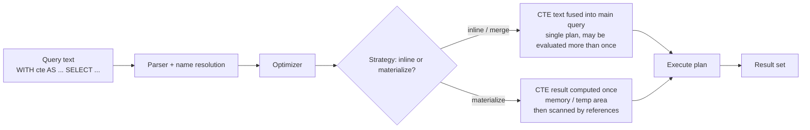

psql/mysql clients exist. Let me see if a server is running so I can validate the examples against real engine output.
PostgreSQL 17 is running. I'll validate the examples against it.
Let me inspect execution plans so the performance discussion is grounded in real behavior.
Plan behavior confirmed with real output. Let me verify a couple of MySQL-specific claims from the docs to stay accurate on cross-engine differences.
# 4 · Subqueries — 33 · CTEs (Common Table Expressions)

---

## In one sentence

A **CTE (Common Table Expression)** is a *named, statement-local subquery* that you define once at the top of a query with `WITH`, and then reference as if it were a table (or a view defined inline) inside that same statement.

```sql
WITH dept_avg AS (
    SELECT department_id, AVG(salary) AS avg_salary
    FROM employees
    GROUP BY department_id
)
SELECT *
FROM dept_avg;
```

---

## What it is

A CTE gives a subquery a **name** and a **scope**. The scope is exactly one statement — the whole `SELECT` (or `INSERT ... SELECT`, `UPDATE`, `DELETE`, `MERGE` in some engines) that follows the `WITH` clause. Outside that statement, the name does not exist.

A CTE is *logically* a named result set. *Physically*, the optimizer decides whether to:

- **Inline / merge** it: fuse the CTE's text into the main query and plan it as one unit, or
- **Materialize** it: compute the CTE result once (usually into memory or a temporary storage area) and read the stored result.

Which of the two happens is **engine-dependent** and is exactly what this section spends time explaining.

---

## Why it exists

1. **Readability** — replaces deeply nested subqueries with linear, top-to-bottom, named steps.
2. **Reuse within a statement** — the same named result can be referenced several times (a derived table cannot).
3. **Recursion** — the primary reason the standard introduced CTEs (a query that references itself).
4. **Encapsulation of transformation steps** — aggregation, dedup, window ranking, then join the *result* downstream.
5. **Data-modifying pipelines** — in some engines a CTE can return `RETURNING` rows from an `UPDATE`/`DELETE`/`INSERT` and feed them into another statement. See the DML section below.
6. **Self-documentation** — the name of a CTE can state the *grain* of its output: `order_totals` says "one row per order".

CTEs and **derived tables** (subqueries in `FROM`) are close cousins; the practical differences (reuse, recursion, readability) are covered in the comparison table at the end.

---

## Internal working

### Logical pipeline



Read from bottom-up mentally: the optimizer, using **statistics, indexes, cardinality and cost estimates**, chooses between two physical strategies. You **cannot correctly reason about CTE performance from the query text alone** — you must look at the plan (see Performance implications).

### Name resolution rules (standard)

- A CTE can only reference CTEs defined **earlier** in the same `WITH` clause, plus base tables. Forward references are not allowed in any mainstream engine.

> MySQL explicitly documents: *"A CTE can refer to CTEs defined earlier in the same WITH clause, but not those defined later."* This rules out mutual recursion (`cte1` ↔ `cte2`).

- A CTE name **shadows** base tables, temporary tables, and views. Inside the statement, `FROM employees` now means the CTE, *unless* you schema-qualify the table name (`public.employees`).
- A derived table defined in the same statement shadows a CTE of the same name.
- A CTE can be referenced inside a nested subquery of the main query, and inner query blocks can see CTEs from outer blocks.
- CTE names must be unique within a single `WITH` clause.

### "It's not executed first"

> Common misconception: "The DB computes the CTE first, then runs the main query."

Wrong — that is a *logical* description, not a physical one. When a CTE is inlined, there is literally no "CTE step" in the plan; the subquery is compiled into the main query. Even when materialized, the CTE node can appear anywhere in the plan and might be **pruned entirely** if unreferenced. Never reason about ordering of execution from the text.

---

## Syntax

```sql
WITH
    cte_name [(column_alias_1, column_alias_2, ...)] AS (
        <SELECT statement>
    )
  [, cte_name2 [(column_alias_1, ...)] AS (
        <SELECT statement>
    )
  ]

SELECT ... FROM cte_name ... ;      -- the "main" statement
```

### Grammar notes

| Piece | Meaning |
|---|---|
| `WITH` | Opens the clause. PostgreSQL requires *no* extra keyword for ordinary CTEs. |
| `WITH RECURSIVE` | Required in **PostgreSQL** and **MySQL** when a CTE references itself. |
| `cte_name [(cols)]` | Optional column list renaming the CTE's output columns. If you use it, the number of names **must** match the subquery's column count (otherwise PostgreSQL, MySQL, and Oracle raise a column-count error). |
| `AS ( ... )` | The subquery body. It may itself contain a `WITH`. |
| `,` | Separates multiple CTEs. Each can reference any CTE defined *before* it. |
| main statement | The `SELECT` / DML that consumes the CTEs. A `WITH` clause with no consuming statement is a syntax error. |

**PostgreSQL extension:**

```sql
WITH cte AS MATERIALIZED ( ... )      -- force: compute once, scan the result
WITH cte AS NOT MATERIALIZED ( ... )  -- force: inline the text into the query
```

(More on these in Performance implications.)

---

## Sample data used in this section

```sql
CREATE TABLE departments (
    department_id   INT PRIMARY KEY,
    department_name VARCHAR(50) NOT NULL
);

CREATE TABLE employees (
    employee_id   INT PRIMARY KEY,
    employee_name VARCHAR(100) NOT NULL,
    department_id INT REFERENCES departments(department_id),  -- nullable
    salary        NUMERIC(10,2)                                -- nullable
);

CREATE TABLE orders (
    order_id    INT PRIMARY KEY,
    customer_id INT,                 -- nullable
    order_date  DATE NOT NULL,
    status      VARCHAR(20) NOT NULL
);

CREATE TABLE order_items (
    item_id    INT PRIMARY KEY,
    order_id   INT NOT NULL REFERENCES orders(order_id),
    product    VARCHAR(50) NOT NULL,
    qty        INT NOT NULL,
    unit_price NUMERIC(10,2) NOT NULL
);
```

```sql
INSERT INTO departments VALUES
  (1,'Engineering'), (2,'Sales'), (3,'Marketing'), (4,'HR');

INSERT INTO employees VALUES
  (1,'Ada',      1, 120000),
  (2,'Grace',    1, 110000),
  (3,'Alan',     1,  95000),
  (4,'Margaret', 2,  70000),
  (5,'Katherine',2,  80000),
  (6,'Sheryl',   3,  60000),
  (7,'Barbara',  NULL, NULL);                 -- no department, no salary

INSERT INTO orders VALUES
  (100, 1,    '2026-01-10', 'completed'),
  (101, 1,    '2026-02-01', 'completed'),
  (102, 2,    '2026-01-15', 'pending'),
  (103, 3,    '2026-03-05', 'completed'),
  (104, NULL, '2026-03-20', 'cancelled');

INSERT INTO order_items VALUES
  (1, 100, 'Monitor',  2, 300),
  (2, 100, 'Keyboard', 1, 120),
  (3, 101, 'Mouse',    3, 40),
  (4, 102, 'Monitor',  1, 300),
  (5, 103, 'Desk',     1, 500),
  (6, 104, 'Chair',    1, 150);
```

### Statement of grain (read before writing any aggregation)

| Table | One row represents |
|---|---|
| `departments` | one department |
| `employees` | one employee (0 or 1 department, salary nullable) |
| `orders` | one order |
| `order_items` | one line item (an order has ≥ 1 line item here) |

Join failures and double-counting in this section are all explained by these grains.

---

## Example 1 — Basic CTE: departments whose average salary beats the company average

```sql
WITH dept_avg AS (
    SELECT department_id,
           AVG(salary) AS avg_salary,
           COUNT(*)    AS headcount
    FROM employees
    GROUP BY department_id
)
SELECT d.department_name, da.avg_salary, da.headcount
FROM dept_avg da
JOIN departments d ON d.department_id = da.department_id
WHERE da.avg_salary > (SELECT AVG(salary) FROM employees);
```

**Expected result:**

| department_name | avg_salary | headcount |
|---|---|---|
| Engineering | 108333.33 | 3 |

Notes:

- `dept_avg` is referenced exactly like a table once in `FROM`.
- Company average is `89166.67`; only Engineering (`108333.33`) exceeds it.
- Barbara (no department) is excluded from the `GROUP BY`, so HR shows **no row** at all — there is no `avg_salary = NULL` row for HR. That is the NULL behavior examined later.

---

## Example 2 — Multiple CTEs, chained

One CTE can feed the next. Read order: define the raw step, then the analytical step, then the main query.

```sql
WITH order_totals AS (           -- grain: one row per order
    SELECT o.order_id,
           o.customer_id,
           SUM(oi.qty * oi.unit_price) AS total
    FROM orders o
    JOIN order_items oi ON oi.order_id = o.order_id
    GROUP BY o.order_id, o.customer_id
),
ranked_orders AS (               -- grain: one row per order
    SELECT order_id, customer_id, total,
           ROW_NUMBER() OVER (ORDER BY total DESC) AS global_rank
    FROM order_totals
)
SELECT customer_id, order_id, total
FROM ranked_orders
WHERE global_rank <= 3;
```

**Expected result:**

| customer_id | order_id | total |
|---|---|---|
| 1 | 100 | 720.00 |
| 3 | 103 | 500.00 |
| 2 | 102 | 300.00 |

Because `order_totals` reduces to order grain *before* the rank is computed, the ranking never sees the duplicated line-item rows. This is exactly the kind of accident avoided by pre-aggregating inside a CTE.

> Interview trap: "What is the grain of `ranked_orders`?" If you cannot answer clearly, you probably have a fan-out bug.

---

## Example 3 — Reusing the same CTE twice in one statement

A derived table can only be referenced once. A CTE can be referenced several times. This is one of its two headline features (the other being recursion).

```sql
WITH stats AS (
    SELECT department_id, AVG(salary) AS dept_avg
    FROM employees
    WHERE department_id IS NOT NULL
    GROUP BY department_id
)
SELECT s.department_id,
       s.dept_avg,
       (SELECT COUNT(*)
        FROM employees e
        WHERE e.department_id = s.department_id
          AND e.salary > s.dept_avg) AS above_avg
FROM stats s
ORDER BY s.department_id;
```

**Expected result:**

| department_id | dept_avg | above_avg |
|---|---|---|
| 1 | 108333.33 | 2 |
| 2 | 75000.00 | 1 |
| 3 | 60000.00 | 0 |

Does the engine compute the aggregation **once** or does it recompute per reference? **It depends — verify with the plan.** What the "correct" interview answer is, differs by engine (see Performance implications — PostgreSQL materializes a multi-referenced CTE; MySQL typically does too; SQL Server and Oracle often fuse/merge).

---

## Example 4 — Window functions inside a CTE: top earner per department

You cannot filter on a window function in `WHERE`. The classic workaround puts the window function in a CTE (or derived table) and filters in the outer query — exactly what CTEs are for.

```sql
WITH ranked AS (
    SELECT employee_name,
           department_id,
           salary,
           ROW_NUMBER() OVER (PARTITION BY department_id
                              ORDER BY salary DESC) AS rn
    FROM employees
    WHERE department_id IS NOT NULL
)
SELECT d.department_name, r.employee_name, r.salary
FROM ranked r
JOIN departments d ON d.department_id = r.department_id
WHERE r.rn = 1;
```

**Expected result:**

| department_name | employee_name | salary |
|---|---|---|
| Engineering | Ada | 120000.00 |
| Sales | Katherine | 80000.00 |
| Marketing | Sheryl | 60000.00 |

Compare: if ties matter, use `RANK() OVER (...)` and filter `WHERE rn = 1` — both tied employees appear. With `ROW_NUMBER()` you silently keep only one. (This is a favorite interview answer-discussion; see Interview Questions.)

---

## Example 5 — Running totals piped through a CTE

```sql
WITH cum AS (
    SELECT employee_id,
           employee_name,
           salary,
           SUM(salary) OVER (ORDER BY employee_id) AS running_total
    FROM employees
    WHERE salary IS NOT NULL
)
SELECT employee_id, employee_name, salary, running_total
FROM cum
ORDER BY employee_id;
```

**Expected result:**

| employee_id | employee_name | salary | running_total |
|---|---|---|---|
| 1 | Ada | 120000.00 | 120000.00 |
| 2 | Grace | 110000.00 | 230000.00 |
| 3 | Alan | 95000.00 | 325000.00 |
| 4 | Margaret | 70000.00 | 395000.00 |
| 5 | Katherine | 80000.00 | 475000.00 |
| 6 | Sheryl | 60000.00 | 535000.00 |

Note Barbara is excluded *inside* the CTE via `WHERE salary IS NOT NULL`; running totals ignore her. Had we used `SUM(...) OVER (... ROWS BETWEEN UNBOUNDED PRECEDING AND CURRENT ROW)` with a NULL salary included, the NULL would simply be ignored by `SUM` but the employee row retained.

---

## Example 6 — Data-modifying CTE (PostgreSQL / SQL Server)

> PostgreSQL and SQL Server permit a CTE whose body is a modifying statement (`INSERT` / `UPDATE` / `DELETE`), captured via `RETURNING` (PG) or `OUTPUT` (SQL Server), and then consumed by the main statement. MySQL's `WITH` in DML is **read-only** (the CTE is materialized, then joined in `UPDATE ... JOIN` / `DELETE`); **Oracle does not support modifying CTEs**.

```sql
WITH raised AS (
    UPDATE employees
    SET salary = salary * 1.05
    WHERE department_id = 2
    RETURNING employee_id, employee_name, salary
)
SELECT *
FROM raised
ORDER BY employee_id;
```

**Expected result:**

| employee_id | employee_name | salary |
|---|---|---|
| 4 | Margaret | 73500.00 |
| 5 | Katherine | 84000.00 |

Common real use: an upsert that stores the affected rows and then re-associates or logs them. The `RETURNING` CTE turns a "changed rows" statement into a "result set" that the rest of the query can join.

> Production pitfall: a modifying CTE has **real side effects**. It runs exactly once even if the CTE is referenced multiple times (the engine materializes it). Read the plan before assuming how many times the DML fires.

---

## BAD approach vs BETTER approach

### Pattern A — nested subquery soup, fixed with a CTE pipeline

BAD — each step is buried inside the next, hard to read, easy to mis-parenthesize, and the team can't reuse `dept_avg`:

```sql
SELECT outer_dept.department_name
FROM departments outer_dept
WHERE outer_dept.department_id IN (
    SELECT i.department_id
    FROM (
        SELECT department_id, AVG(salary) AS a
        FROM employees
        GROUP BY department_id
    ) i
    WHERE i.a > (
        SELECT AVG(salary) FROM employees
    )
);
```

BETTER — same result, linear and named:

```sql
WITH dept_avg AS (
    SELECT department_id, AVG(salary) AS avg_salary
    FROM employees
    GROUP BY department_id
)
SELECT d.department_name
FROM dept_avg da
JOIN departments d ON d.department_id = da.department_id
WHERE da.avg_salary > (SELECT AVG(salary) FROM employees);
```

**Why it's better:** the business step ("average per department") is now a *named, testable unit*; the main query reads like English. Readability, not speed, is the reason — the engine may produce an identical plan for both.

### Pattern B — repeated scalar subquery replaced by one reused CTE

BAD — the aggregation is recomputed textually in two places (and may or may not be optimized):

```sql
SELECT e.employee_name
FROM employees e
WHERE e.salary > (SELECT AVG(salary) FROM employees)
  AND e.department_id IN (
      SELECT department_id
      FROM employees
      GROUP BY department_id
      HAVING AVG(salary) > (SELECT AVG(salary) FROM employees)
  );
```

BETTER — compute the aggregates once, reuse by name:

```sql
WITH company_avg AS (
    SELECT AVG(salary) AS v FROM employees
),
dept_avg AS (
    SELECT department_id, AVG(salary) AS avg_salary
    FROM employees
    GROUP BY department_id
)
SELECT e.employee_name, e.salary
FROM employees e
JOIN dept_avg da ON da.department_id = e.department_id
CROSS JOIN company_avg c
WHERE e.salary > c.v
  AND da.avg_salary > c.v;
```

**Caveat (interview gold):** whether this "reuses" the work is **not guaranteed by syntax alone**. In PostgreSQL a twice-referenced CTE materializes (verified below); in MySQL it is materialized when referenced more than once; in SQL Server/Oracle the optimizer may still fuse it and recalculate. **You must check `EXPLAIN`** before claiming a performance win.

---

## NULL behavior

CTEs do not add special NULL rules — the subquery *inside* the CTE obeys ordinary three-valued logic, and so does the outer query. But CTEs concentrate several classic NULL traps:

1. **`GROUP BY` produces a NULL group.** Barbara's `department_id IS NULL` forms its own group inside a CTE:

```sql
WITH dept_avg AS (
    SELECT department_id,
           AVG(salary)  AS avg_salary,
           COUNT(*)     AS headcount,
           COUNT(salary) AS sal_count
    FROM employees
    GROUP BY department_id
)
SELECT * FROM dept_avg ORDER BY department_id NULLS LAST;
```

**Expected result:**

| department_id | avg_salary | headcount | sal_count |
|---|---|---|---|
| 1 | 108333.33 | 3 | 3 |
| 2 | 75000.00 | 2 | 2 |
| 3 | 60000.00 | 1 | 1 |
| NULL | NULL | 1 | 0 |

Note the NULL group: `COUNT(*)` counts the row, `COUNT(salary)` counts only non-NULL. `AVG` of the single NULL salary is `NULL`.

2. **`AVG` returns `NULL` for an empty group**, but with `GROUP BY` there simply *is no row* for a group with zero rows. Distinguish "no row" (HR has no employees → absent) from "row with NULL" (employees with NULL department → present with NULL values). Filters like `WHERE avg_salary > ...` remove both.

3. **Comparisons with NULL inside/outside a CTE.** `WHERE da.avg_salary > 50000` drops the row where `avg_salary IS NULL` (because `NULL > 50000` is `UNKNOWN`). If a NULL average should pass the filter, use `COALESCE(da.avg_salary, 0)` — or rephrase the logic.

4. **Joining a CTE on a NULL key.** `JOIN ... ON e.department_id = d.department_id` never matches a NULL key. Use `IS NOT DISTINCT FROM` (PG/standard) or a deliberate `ON coalesce(...) = coalesce(...)` when NULL keys must match.

5. **`NOT IN` inside an outer query against a CTE result containing NULL** → the classic all-or-nothing trap. `WHERE x NOT IN (SELECT ... FROM cte)` returns nothing when the CTE contains a NULL. `NOT EXISTS` does not have this problem. (Cross-reference: the `IN`/`EXISTS`/`NOT IN` section.)

---

## Edge cases

| Case | Behavior |
|---|---|
| CTE returns zero rows | INNER JOIN to it → zero rows. LEFT JOIN to it → all outer rows, CTE columns `NULL`. |
| CTE defined but never referenced | Optimizer may prune it entirely (PostgreSQL does — it is *not executed*). Never rely on a CTE running "for its side effect". |
| Column-count mismatch with aliases | `WITH c(a, b) AS (SELECT x, y, z ...)` → error in all engines; alias count must equal column count. |
| CTE name equals a base table | The CTE wins inside the statement. Reach the real table with a schema qualifier: `public.orders`. |
| `ORDER BY` inside a CTE | Pointless — row order is not guaranteed unless a consumer like `TOP`/`LIMIT`/`OFFSET` depends on it. Window `ORDER BY` belongs inside the `OVER(...)` clause. |
| `LIMIT` inside a CTE | Legally truncates rows; makes materialization semantics explicit in most engines; but be aware the truncated set is what downstream joins see. |
| Forward reference | Not allowed (standard + MySQL/PostgreSQL/SQL Server/Oracle). |
| Recursive reference without `WITH RECURSIVE` | Syntax/planning error in PostgreSQL and MySQL; the standard says `WITH` non-recursive, SQL Server and Oracle allow recursion without the keyword. |
| Data types | Column types come from the CTE subquery; `numeric`/`decimal` widths and `NULL` typing bumps (e.g. `UNION` with NULL literal) are resolved by the usual rules. |
| CTE inside a subquery | Allowed; inner blocks can read outer CTEs; the CTE dies with the full statement. |

---

## Common mistakes

1. **Forgetting `WITH RECURSIVE`** (PostgreSQL/MySQL) the moment you write a self-referencing CTE. The engine then rejects the recursive reference.
2. **Defining CTEs in the wrong order** — a CTE cannot use a name defined after it.
3. **Believing the CTE executes "first" or "exactly once"** without looking at the plan.
4. **Using a CTE as if it were a temporary table** — it is not addressable by later statements, cannot be indexed directly, and disappears at the end of the statement.
5. **Unintentionally shadowing a base table** by naming a CTE the same as the table, then wondering why the real table seems to be missing.
6. **`ORDER BY` inside a CTE to "sort the final report"** — ordering is a property of the outermost query (and even there only guaranteed with a final `ORDER BY`).
7. **Aggregating at the wrong grain** — e.g. summing line items in a CTE, then joining to orders *again*, producing double counts.
8. **Comparing a CTE aggregate against `NULL`** and silently losing rows.
9. **Chaining 15 CTEs into one monster statement** — a readability win becomes a debugging nightmare.
10. **Assuming reuse is free** — a twice-referenced CTE may recompute (inlining) or spawn materialization where you did not expect it. Measure, don't assume.

---

## Production pitfalls

> Production pitfall: fan-out / double counting across CTE boundaries.

The `order_items` join multiplies rows. Inside a CTE this is fine *if* you re-aggregate to order grain before returning. If you don't, the outer query counts phantom rows:

```sql
-- wrong: counts completed orders = 4, but there are only 3
SELECT o.status, COUNT(*) AS rows_after_join
FROM orders o
JOIN order_items oi ON oi.order_id = o.order_id
GROUP BY o.status;
```

**Expected result (the bug):**

| status | rows_after_join |
|---|---|
| completed | 4 |
| pending | 1 |
| cancelled | 1 |

Order 100 has two line items, so it is counted twice. The CTE fix is to reach order grain *inside* the CTE (see Example 2) or use `COUNT(DISTINCT o.order_id)`.

> Production pitfall: CTE materialization can blow memory / temp space.

Materializing a large CTE writes rows to temp storage; in PostgreSQL the cost model decides, and you can force it with `AS MATERIALIZED`. If a huge join result is materialized every time, you can degrade, not improve, performance. Always compare both physical plans.

> Production pitfall: volatile functions and inlining.

If a CTE body calls `random()`, `now()` (as a volatile expression), `nextval()`, or a non-deterministic UDF, inlining can cause it to be **recomputed for every row or every reference**, changing results. PostgreSQL refuses to inline hazardous CTEs; other engines may not. Use a temp table when the value must be frozen.

> Production pitfall: unused CTE with side effects.

In PostgreSQL an unreferenced CTE is not executed, so a CTE that calls a procedure expecting a side effect silently does nothing. Do not use CTEs for side effects.

> Production pitfall: recursion depth.

Recursive CTEs in production need explicit depth guards (PostgreSQL `search_depth`/termination predicate, SQL Server `OPTION (MAXRECURSION n)`). See the Recursive CTE section.

---

## Performance implications

### The question is: inline or materialize?

Everything about CTE performance reduces to this decision, and the four engines make it differently:

| Engine | Default behavior of a non-recursive CTE |
|---|---|
| **PostgreSQL (12+)** | Inlines (merges) a CTE referenced once, if it has no hazards (no volatile functions, no DML, not recursive, referenced once). **Materializes** when referenced more than once or when hazardous. Pre-12 it always materialized (the famous "optimization fence"). |
| **MySQL (8.0+)** | Merges by default. **Materializes** when referenced more than once, or when the body contains constructs that block merging (`UNION`, `DISTINCT`, window functions, `GROUP BY` in many cases, recursion — recursion is always materialized). |
| **SQL Server** | Treats a CTE like an inline view: it is expanded/fused into the query. May trigger spools or temp-workfile materialization depending on the plan. No `MATERIALIZED` keyword. |
| **Oracle** | Fuses CTEs into the query by default (they behave like named inline views). `NO_MERGE` hint can force separate handling. |

### What the plan actually showed (PostgreSQL 17, verified)

CTE referenced **once** — inlined; there is no `CTE` node:

```
Aggregate
  ->  Hash Join
        Hash Cond: (e.department_id = d.department_id)
        ->  Seq Scan on employees e
        ->  Hash
              ->  Subquery Scan on d
                    ->  HashAggregate
                          Group Key: employees.department_id
```

CTE referenced **twice** — materialized once, scanned twice:

```
Hash Join
  Hash Cond: (x.department_id = y.department_id)
  CTE dept_avg
    ->  HashAggregate
          Group Key: employees.department_id
          ->  Seq Scan on employees
  ->  CTE Scan on dept_avg x
  ->  Hash
        ->  CTE Scan on dept_avg y
```

The visible difference: a `CTE <name>` node (compute-once) plus `CTE Scan` references, versus a fused `Subquery Scan`. **Force it** in PostgreSQL with:

```sql
WITH cte AS MATERIALIZED ( ... )      -- compute once, scan the result
WITH cte AS NOT MATERIALIZED ( ... )  -- inline the text
```

### When does materialization help?

- The CTE is referenced multiple times AND its body is expensive (big aggregation) — you avoid recomputing work. But you also lose the ability to push outer predicates into it ("optimization fence").
- The CTE uses a function that must be evaluated once (volatile timing, random assignment).

### When does inlining help?

- The CTE is referenced once, and outer filters/joins can be pushed down into the subquery — the main query can use **indexes on columns the CTE filters or joins on**. A materialized CTE is scanned as a blob; no index push-down (MySQL/PostgreSQL may add indexes on materialized CTEs in later versions, but that is optimizer-work, not a guarantee).

> No global rule: "CTEs materialize, so they are always faster/slower." Both strategies change the plan non-trivially. The only honest statement is: **run `EXPLAIN (ANALYZE, BUFFERS)`** and compare working times, rows and buffers.

### EXPLAIN equivalents per engine

| Engine | Tool |
|---|---|
| PostgreSQL | `EXPLAIN (ANALYZE, BUFFERS, COSTS) SELECT ...` |
| MySQL (8.0.18+) | `EXPLAIN ANALYZE SELECT ...` / `EXPLAIN FORMAT=TREE SELECT ...` |
| SQL Server | `SET STATISTICS IO, TIME ON;` + graphical execution plan / `SHOWPLAN` |
| Oracle | `EXPLAIN PLAN FOR ...; SELECT * FROM TABLE(DBMS_XPLAN.DISPLAY);` or `DBMS_XPLAN.DISPLAY_CURSOR` |

**Key plan signals to look for:** a `CTE`/`Derived`/`Table Spool`/`Temp` node (materialization happened) vs. the CTE pasted into a scan (`Merge`, `Subquery Scan`, `Nested Loop` re-evaluating a subplan). Also check **rows × loops**: a second execution of a "recomputed" subplan appears as extra loops.

### CTE vs alternatives, performance-wise — verify, don't assume

- **CTE (referenced once)** vs **derived table**: often the same plan. Choose CTE for readability.
- **CTE referenced several times** vs **repeated subqueries**: engines behave differently (PG/MySQL typically materialize the multi-ref CTE and may fuse repeated subqueries). Golden scenario for `EXPLAIN ANALYZE` comparison.
- **CTE** vs **temporary table** vs **view**: CTE cannot be indexed and lives one statement; a temp table can be indexed (covering index!), survives across statements, and is reusable in a multi-step process or in a procedure. CTEs win on syntax simplicity and transactional hygiene (no CREATE/DROP bookkeeping, invisible to other sessions).

**Rule of thumb for the book, not a guarantee:** if you keep reusing a heavy intermediate result across *several statements* or need an index on the intermediate, reach for a temp table; if the intermediate is inside one logical statement, a CTE is usually the cleaner choice — then confirm with the plan.

---

## Behavior differences across engines

| Feature | PostgreSQL | MySQL (8.0+) | SQL Server | Oracle |
|---|---|---|---|---|
| `WITH` syntax (non-recursive) | yes | yes | yes | yes (since 9i) |
| `RECURSIVE` keyword required | yes | yes | no | no |
| Forward reference to a later CTE | no | no | no | no |
| Multiple references in one statement | yes (materializes) | yes (materializes) | yes | yes |
| Default strategy | inline once / materialize multi-ref | merge, materialize multi-ref | fuse (inline) | fuse (merge) |
| Force materialize | `AS MATERIALIZED` | no keyword (hints/no-merge may apply) | no | `NO_MERGE` hint (partial) |
| Force inline | `AS NOT MATERIALIZED` | no keyword | no | `MERGE` hint |
| Modifying CTE (DML inside `WITH` + `RETURNING`/`OUTPUT`) | yes | no (read-only CTE in DML) | yes | no |
| `WITH` before `UPDATE`/`DELETE` | via main statement | yes (read-only CTE joined) | yes | no |
| Recursion depth guard | terminator predicate / `search_depth` | `cte_max_recursion_depth` | `OPTION (MAXRECURSION n)` | depth via `CONNECT BY` or recursion logic |

> The `MATERIALIZED`/`NOT MATERIALIZED` keywords are PostgreSQL-specific. If you write them in MySQL/SQL Server/Oracle, it is a syntax error.

---

## Comparison table — CTE vs derived table vs temp table vs view

| Capability | CTE | Derived table (subquery in `FROM`) | Temporary table | View |
|---|---|---|---|---|
| Named result in one statement | yes | no (anonymous) | yes | yes |
| Referenced multiple times in one statement | yes | no (must repeat the subquery) | yes | yes |
| Survives past the statement | no | no | yes (session) | yes (persists as schema object) |
| Recursion support | yes (recursive CTE) | no | no | no (recursive views need workarounds) |
| Can be indexed | no | no | yes | no (usually; indexed views special) |
| DML against it | only modifying CTE engines | no | yes | depends on view updatability |
| Definition lives in SQL text of one query | yes | yes | DDL to create/drop | schema DDL |
| Security / reuse across applications | no | no | no | yes |
| Empty/edge semantics | same as subquery | same as subquery | real table semantics | same as subquery |
| Typical cost | merge or materialize | merge or materialize | physical table in tempdb/catalog | same as subquery |

**When to prefer each (rough guide; confirm in the plan):**

- CTE — pipeline inside a single statement; recursion; top-N-per-group patterns; data-modifying pipelines (PG/SS).
- Derived table — one-off nesting where a name adds nothing.
- Temp table — result needed again later in the session; needs an index; huge multi-step ETL; or the optimizer fights your CTE strategy.
- View — same logic reused across many stored queries/applications; permissions isolation.

---

## Best practices

1. **Name the grain.** A CTE named `order_line_totals` communicates "one row per line item"; `order_totals` = "one row per order". When reviewers see a CTE name, they should know the grain instantly.
2. **One transformation step per CTE.** "define raw → aggregate → rank → join labels" beats one 200-line `WITH`.
3. **Compose linearly; avoid giant fan-out inside CTEs.** Reach the final grain *before* the main query joins.
4. **Put filtering as early as it is semantically safe** (WHERE positions, ON vs WHERE section applies inside CTEs too), but verify push-down behavior with the plan.
5. **Do not add `ORDER BY` to CTEs unless the rows must be ordered for `TOP`/`LIMIT`/`OFFSET` semantics.**
6. **Handle NULL groups explicitly** (`GROUP BY` includes the NULL group; decide whether to `COALESCE` or filter).
7. **Verify reuse claims with `EXPLAIN ANALYZE`** — count nodes, loops, and rows; compare materialized vs inlined variants where the engine lets you force them.
8. **Prefer CTE over derived-table for readability; prefer temp table over CTE when you need an index on the intermediate.** Do not mix "temporary table" needs into a CTE.
9. **Bound recursions explicitly** (anchor + terminator) — cross-reference the Recursive CTE section.
10. **Never use a CTE for side effects** — it may never run if unused, or run more than once if inlined.
11. **Keep CTEs out of the WHERE clause when a join/EXISTS expresses the intent more clearly** — cross-reference `JOIN vs EXISTS`, `IN vs EXISTS`.

---

## Cross-references

- Recursive CTEs (`WITH RECURSIVE`, anchor/step, depth guards) — **Section 34**.
- Window functions and top-N-per-group patterns — **Section on Window functions**.
- Derived tables vs CTEs — this section's comparison table.
- `IN` / `EXISTS` / `NOT IN` / `NOT EXISTS` and NULL traps — **Sections 35–36**.
- `GROUP BY` vs window functions vs CTE pipelines.
- Fan-out, grain, double counting — the JOIN sections.
- Keyset pagination (a CTE staging step is a common keyset implementation).
- Temporary tables and when CTEs cannot replace them.

---

# Interview Questions

*Attempt these before reading further. For any performance claim, answer "how would you verify it?" with that engine's `EXPLAIN` tool.*

## Beginner

1. What is a CTE and how is it different from a subquery written directly in the `FROM` clause?
2. Write a query with a CTE that returns each department name together with its employee count.
3. Can a CTE be referenced more than once in the same query? What does that let you do that a derived table cannot?
4. Why do PostgreSQL and MySQL require the keyword in `WITH RECURSIVE`, but SQL Server and Oracle do not?
5. True or false: *"The database always computes the CTE first, then runs the main query."* Justify your answer using execution-plan reasoning.

## Intermediate

1. Compare CTE, derived table, and temporary table: capabilities, lifetime, and when you would pick each.
2. You reuse one CTE in three separate places of a single query. Does the engine evaluate it once or three times? What tool would prove the answer for your database?
3. A CTE is named `orders` while a table `orders` also exists in `public`. Which one does `SELECT * FROM orders` see? How do you force the base table?
4. Show the top 3 products by revenue using `ROW_NUMBER()` inside a CTE. Why can't you filter on the rank directly in the CTE's `WHERE`?
5. When — if ever — is `ORDER BY` inside a CTE meaningful?

## Advanced

1. Explain inlining/merging vs materialization of a CTE. Under which plan conditions does PostgreSQL (12+) materialize by default? How do you force either strategy, and what is the semantic risk of forcing `NOT MATERIALIZED` with a volatile function?
2. A CTE referenced twice behaves differently across PostgreSQL, MySQL, SQL Server, and Oracle. Describe each expected physical strategy and how you would confirm it with a plan.
3. Give a scenario where nesting CTEs inside CTEs is justified, and one where switching to a temporary table is objectively better (e.g. because of indexing or multi-statement reuse).
4. In PostgreSQL, write a data-modifying CTE that archives updated rows. What guarantees does `RETURNING` give you about how many times the DML fires, even if the CTE is referenced twice?

## Scenario-based

1. **Top-per-group with ties.** For each department return the employee(s) with the highest salary. Explain why `ROW_NUMBER()` vs `RANK()` inside the CTE changes the result when salaries tie.
2. **Running balance.** Build a CTE computing a running total of `order_totals` per customer over time, then filter to the last order of each customer. Where must the `ROW_NUMBER` filter live, and why?
3. **Dedupe then aggregate.** Line items contain duplicates. Write a CTE that deduplicates with `ROW_NUMBER()` first, then aggregates — and explain the order of operations that prevents double counting.
4. **First/next order lifecycle.** Using the `orders` sample data, produce one row per customer with first order date, last order date, and order count, and keep only customers with two or more orders.

## Tricky

1. `WITH c(a, b) AS (SELECT x, y, z FROM t)` — why is this an error? How do you fix it?
2. A CTE returns zero rows. What changes between `JOIN cte` and `LEFT JOIN cte` in the output? Write the minimal example.
3. `WITH x AS (SELECT ... FROM x)` without `RECURSIVE` — which engines reject it and why is the standard's rule stricter than the engines'?
4. A CTE declared but never referenced — will it execute? Can you rely on a side-effect there? What does PostgreSQL do, and how would you check MySQL?
5. `WITH r AS (SELECT * FROM employees LIMIT 3)` then `SELECT COUNT(*) FROM r CROSS JOIN orders` — is the truncation guaranteed to happen before the join, and can materialization change that in any engine?

## Output Prediction

Using `employees` as defined above:

```sql
WITH numbered AS (
    SELECT employee_id, employee_name,
           ROW_NUMBER() OVER (ORDER BY salary DESC) AS rn
    FROM employees
    WHERE salary IS NOT NULL
)
SELECT employee_id, employee_name, rn
FROM numbered
WHERE rn BETWEEN 2 AND 4
ORDER BY rn;
```

Predict the three returned rows, then explain what would change if `WHERE salary IS NOT NULL` moved to the outer query (as `WHERE rn BETWEEN 2 AND 4 AND salary IS NOT NULL`).

Predict the output of Example 1's NULL-group query and the values of `headcount` vs `sal_count` for the `NULL` department group — and explain the `COUNT(*)` vs `COUNT(column)` difference for Barbara.

## Debugging

1. A colleague writes a self-referencing CTE in PostgreSQL without `WITH RECURSIVE` and gets an error. Explain the error, the fix, and why SQL Server accepts the same text.
2. A report shows "4 completed orders" when only 3 orders are completed. The query joins `orders` to `order_items` inside a CTE and then counts. Write the flawed query, then the CTE that fixes the grain, and the `COUNT(DISTINCT ...)` alternative.
3. A CTE contains a call to a stored procedure and "nothing seems to happen". List the two engine-dependent reasons this can be silently true, and how the plan would tell you which one it is.
4. A filter `WHERE da.avg_salary > 50000` excludes a department whose `avg_salary` is NULL even though it has employees. Explain why, and give the `COALESCE` fix plus a case where filtering NULLs out is actually the intended behavior.

## Performance

1. For a CTE referenced once in PostgreSQL, what does each plan look like for inlined vs `MATERIALIZED`? When would forcing `MATERIALIZED` be a *bad* idea (index push-down loss) and when a good one (repeated expensive computation)?
2. Same logical query three ways — CTE referenced twice, subquery duplicated twice, temporary table — say when each would win and exactly what you would measure (`EXPLAIN ANALYZE` timings, loops, buffers, rows) to decide.
3. `ORDER BY` appended inside a large CTE followed by an outer `JOIN` — explain why the plan may show an expensive sort with no benefit, and what the plan looks like when optimization works correctly.
4. Design the experiment to test "CTE vs repeated subquery" for your own database: dataset, indexes, the two SQL variants, the plan metrics to compare, and how many runs you need to trust timing.

---

*End of Section 33 (CTEs). Next: Section 34 — Recursive CTEs.*
