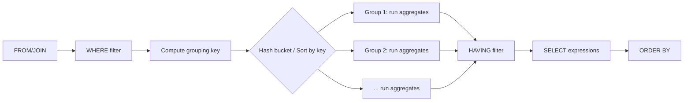

```markdown
# 36 — GROUP BY

> Category: 5-Aggregation — Section: 36-GROUP-BY

---

## Fundamentals

### What it is

`GROUP BY` is the clause that collapses multiple rows from a table into **groups**, and then allows you to compute one value *per group* using an aggregate function such as `COUNT`, `SUM`, `AVG`, `MIN`, `MAX`.

### Why it exists

Most real-world questions are not "how many rows total?" but "how many per something?" — per department, per customer, per day, per product. Without a way to group, you could only compute totals/globals. `GROUP BY` answers **"by what?"**.

### What it is NOT

`GROUP BY` does **not** order anything. It does **not** deduplicate rows (despite a very common misconception). It does not change the underlying table — it produces a new grouped result set.

> Common misconception: "GROUP BY removes duplicates." Wrong. `GROUP BY` collapses rows into groups and applies aggregates. `SELECT DISTINCT` removes duplicates. The results can *look* similar when you group by a column and select it without an aggregate, but the semantics are different: `GROUP BY` groups (and can compute aggregates), `DISTINCT` only dedupes.

---

## Core rules you must internalize

1. Every column in the `SELECT` list that is **not wrapped in an aggregate function** must appear in the `GROUP BY` clause.
2. Aggregate functions are evaluated **per group**, not over the whole result.
3. `GROUP BY` is applied **after** `FROM`, `WHERE`, `JOIN` and `WHERE` filtering.
4. `HAVING` filters groups, applied **after** grouping and aggregation. `WHERE` filters rows **before** grouping.
5. `GROUP BY` comes before `ORDER BY` (syntactically), but the grouping occurs before ordering in logical execution.

```sql
-- Logical execution order (standard SQL)
FROM     -- choose + join source tables
WHERE    -- filter individual rows
GROUP BY -- form groups
HAVING   -- filter groups (can use aggregates)
SELECT   -- compute expressions & aggregates
ORDER BY -- sort final rows
LIMIT/OFFSET
```

---

## Syntax

```sql
SELECT
    group_col_1,
    group_col_2,
    AGG(col) AS alias
FROM table
[WHERE filter_condition]
GROUP BY group_col_1, group_col_2
[HAVING group_condition]
[ORDER BY ...];
```

- `GROUP BY` accepts column names, or `ordinal positions` (e.g. `GROUP BY 1`), or in some engines expressions (e.g. `GROUP BY DATE(o.order_date)`).
- **ANSI SQL** allows grouping by expressions.

> PostgreSQL
>
> ANSI SQL allows `GROUP BY` on expressions (`GROUP BY DATE(created_at)`). PostgreSQL, SQL Server, and Oracle also allow it. MySQL traditionally allowed grouping without listing all non-aggregated columns (dependent on `sql_mode`), and **this is an extensibility trap** — more below.

---

## Sample tables

We'll use these throughout. Grain is stated for each.

```sql
CREATE TABLE departments (
    department_id   INT PRIMARY KEY,
    department_name VARCHAR(100) NOT NULL
);

-- One row = one department (grain: department)
INSERT INTO departments VALUES
 (1, 'Engineering'),
 (2, 'Sales'),
 (3, 'HR');

CREATE TABLE employees (
    employee_id   INT PRIMARY KEY,
    employee_name VARCHAR(100) NOT NULL,
    department_id INT REFERENCES departments(department_id),
    salary        NUMERIC(10,2),
    is_active     BOOLEAN
);

-- One row = one employee (grain: employee)
INSERT INTO employees VALUES
 (101, 'Alice',   1, 9000.00, TRUE),
 (102, 'Bob',     1, 8000.00, TRUE),
 (103, 'Carol',   2, 6000.00, TRUE),
 (104, 'Dave',    2, 6500.00, FALSE),
 (105, 'Eve',     3, 5000.00, TRUE),
 (106, 'Frank',   3, NULL,    TRUE),
 (107, 'Grace',   NULL, 7000.00, TRUE);  -- no department assigned

CREATE TABLE orders (
    order_id      INT PRIMARY KEY,
    customer_id   INT NOT NULL,
    order_date    DATE NOT NULL,
    status        VARCHAR(20) NOT NULL,
    total         NUMERIC(12,2) NOT NULL
);

-- One row = one order (grain: order)
INSERT INTO orders VALUES
 (1,  1, '2025-01-05', 'shipped',   250.00),
 (2,  1, '2025-01-20', 'cancelled',  99.00),
 (3,  2, '2025-01-12', 'shipped',   480.00),
 (4,  2, '2025-02-01', 'shipped',   120.00),
 (5,  3, '2025-02-10', 'pending',   300.00),
 (6,  3, '2025-02-15', 'shipped',    40.00);

CREATE TABLE order_items (
    order_item_id INT PRIMARY KEY,
    order_id      INT NOT NULL REFERENCES orders(order_id),
    product_id    INT NOT NULL,
    quantity      INT NOT NULL,
    unit_price    NUMERIC(10,2) NOT NULL
);

-- One row = one line item of an order (grain: line item). Orders can have many rows here.
INSERT INTO order_items VALUES
 (1, 1, 10, 2,  50.00),
 (2, 1, 11, 3,  50.00),
 (3, 3, 12, 1, 480.00),
 (4, 4, 10, 4,  30.00),
 (5, 5, 13, 5,  60.00),
 (6, 6, 14, 2,  20.00);
```

---

## Basic examples

### 1. Count employees per department

```sql
SELECT department_id, COUNT(*) AS employee_count
FROM employees
GROUP BY department_id;
```

| department_id | employee_count |
|---|---|
| 1 | 2 |
| 2 | 2 |
| 3 | 2 |
| NULL | 1 |

- `Grace` has `department_id = NULL`, and she still forms her own group.
- Because the question is "per department," the output grain is **one department per row**.

### 2. Sum of salary per department, with a join

```sql
SELECT d.department_name,
       COUNT(*)            AS headcount,
       SUM(e.salary)       AS total_salary,
       AVG(e.salary)       AS avg_salary,
       MIN(e.salary)       AS min_salary,
       MAX(e.salary)       AS max_salary
FROM employees e
JOIN departments d
  ON d.department_id = e.department_id
GROUP BY d.department_name;
```

| department_name | headcount | total_salary | avg_salary | min_salary | max_salary |
|---|---|---|---|---|---|
| Engineering | 2 | 17000.00 | 8500.00 | 8000.00 | 9000.00 |
| Sales | 2 | 12500.00 | 6250.00 | 6000.00 | 6500.00 |
| HR | 2 | 5000.00 | 5000.00 | 5000.00 | 5000.00 |

Note: `Frank`'s `NULL` salary is ignored by `SUM/AVG` but `COUNT(*)` still counts him. `Grace` (no department) is dropped because the join is an `INNER JOIN`.

---

## NULL behavior (critical)

NULL is not a value — it's "unknown/missing." Grouping shares the general three-valued logic rules from the NULL section. Key behaviors:

1. **NULLs form their own group.** `GROUP BY` treats all NULLs as one group, so a `GROUP BY department_id` produces a `NULL` group. (This matches standard SQL and PostgreSQL/MySQL/SQL Server/Oracle behavior.)

   ```sql
   SELECT department_id, COUNT(*)
   FROM employees
   GROUP BY department_id;
   ```
   includes `| NULL | 1 |` for Grace.

2. Aggregates ignore NULLs *except* `COUNT(*)`:
   - `COUNT(*)` counts all rows in the group **including NULL-containing rows**.
   - `COUNT(col)` counts only rows where `col IS NOT NULL`.
   - `SUM(col)`, `AVG(col)`, `MIN(col)`, `MAX(col)` ignore NULL rows entirely.
   - `AVG(col)` does **not** divide by group size — it divides by the number of **non-NULL** values.

```sql
SELECT department_id,
       COUNT(*)      AS rows_in_group,
       COUNT(salary) AS salaries_present,
       SUM(salary)   AS sum_salary,      -- ignores Frank's NULL
       AVG(salary)   AS avg_salary       -- divides by 1 for HR, not 2
FROM employees
GROUP BY department_id
ORDER BY department_id;
```

For `department_id = 3`:

| rows_in_group | salaries_present | sum_salary | avg_salary |
|---|---|---|---|
| 2 | 1 | 5000.00 | 5000.00 |

> Interview trap: `AVG(salary)` for HR returns **5000.00**, not 2500.00. Beginners assume average over all rows including NULL. Because NULL is excluded from the average, HR's average is 5000 (one non-null salary), even though the department has 2 employees.

3. `GROUP BY` a column that contains NULLs separates NULL rows into their own bucket. If you want to *exclude* or *label* that bucket, handle it explicitly:

   ```sql
   SELECT COALESCE(department_id, -1) AS department_id, COUNT(*)
   FROM employees
   GROUP BY COALESCE(department_id, -1);
   ```
   Note: group by the **same expression** you select, otherwise your `SELECT` column no longer matches the grouping key.

4. **`GROUP BY` does NOT collapse NULLs together with real values.** `NULL` is not equal to any value and not equal to another NULL — yet grouping still places them in one group. This is a deliberate, engine-wide behavior (distinct grouping keys), not a violation of three-valued logic.

---

## HAVING

`HAVING` filters **groups** after aggregation. `WHERE` cannot reference aggregate results.

```sql
-- Departments with more than 1 employee
SELECT department_id, COUNT(*) AS headcount
FROM employees
GROUP BY department_id
HAVING COUNT(*) > 1;
```

| department_id | headcount |
|---|---|
| 1 | 2 |
| 2 | 2 |
| 3 | 2 |

### WHERE vs HAVING — what runs first and why it matters

```sql
-- BAD APPROACH: filter then aggregate is correct here, but WHERE is the only valid tool
SELECT department_id, SUM(total)
FROM orders o
JOIN ...
WHERE status = 'shipped'   -- removes non-shipped ROWS before grouping
GROUP BY department_id;
```

| | WHERE | HAVING |
|---|---|---|
| Applied to | individual rows | groups |
| Timing | before grouping | after grouping |
| Can use aggregates | No | Yes |
| Can use plain columns | Yes | Yes (but must also be in SELECT/GROUP BY in strict engines) |
| Performance intent | filters early, fewer rows grouped | filters late, after aggregation work |

> Production pitfall: putting a cheap filter in `HAVING` instead of `WHERE` makes the engine **group all rows first**, then discard whole groups. On large tables this can execute aggregations over rows you never needed. Check the execution plan — a `Filter` before the `HashAggregate`/`GroupAggregate` node vs after is the telltale.

```sql
-- BAD APPROACH
SELECT department_id, COUNT(*) AS headcount
FROM employees
GROUP BY department_id
HAVING department_id IS NOT NULL;      -- could have been WHERE ... IS NOT NULL

-- BETTER APPROACH
SELECT department_id, COUNT(*) AS headcount
FROM employees
WHERE department_id IS NOT NULL
GROUP BY department_id;
```

---

## GROUP BY with multiple columns

Grouping by multiple columns builds groups on the **combination** of key values.

```sql
-- Orders shipped, revenue per customer per month
SELECT customer_id,
       EXTRACT(MONTH FROM order_date) AS month,
       SUM(total) AS revenue
FROM orders
WHERE status = 'shipped'
GROUP BY customer_id, EXTRACT(MONTH FROM order_date)
ORDER BY customer_id, month;
```

| customer_id | month | revenue |
|---|---|---|
| 1 | 1 | 250.00 |
| 2 | 1 | 480.00 |
| 2 | 2 | 120.00 |
| 3 | 2 | 340.00 |

Output grain: **one row per (customer, month)** combination.

---

## GROUP BY + JOIN: fan-out, duplication, double counting

This is the #1 source of wrong aggregation answers. Read carefully.

### The fan-out problem

`orders` has **one row per order**. `order_items` has **one row per line item**. Joining them multiplies rows — an order with 3 line items becomes 3 rows.

```sql
-- BAD APPROACH: SUM(o.total) after joining line items double-counts the order total
SELECT o.order_id, o.total, oi.quantity, oi.unit_price
FROM orders o
JOIN order_items oi ON oi.order_id = o.order_id
WHERE o.order_id = 1;
```

| order_id | total | quantity | unit_price |
|---|---|---|---|
| 1 | 250.00 | 2 | 50.00 |
| 1 | 250.00 | 2 | 50.00 | -- wait, we show order_items rows

Actually the join on order 1 yields 2 line items:

| order_id | o.total | quantity | unit_price | line_amt |
|---|---|---|---|---|
| 1 | 250.00 | 2 | 50.00 | 100.00 |
| 1 | 250.00 | 3 | 50.00 | 150.00 |

Now try: `SELECT o.order_id, SUM(o.total) FROM orders o JOIN order_items oi ... GROUP BY o.order_id` — the order total appears **twice** (once per line item).

```sql
-- BAD APPROACH: double counting
SELECT o.order_id,
       SUM(o.total) AS order_total_x2   -- WRONG value: 500 instead of 250
FROM orders o
JOIN order_items oi ON oi.order_id = o.order_id
WHERE o.order_id = 1
GROUP BY o.order_id;
```

| order_id | order_total_x2 |
|---|---|
| 1 | 500.00 |

Expected: 250.00. Actual: 500.00. Classic **fan-out double-counting**.

### Fixes

**Option A — aggregate before join (join to an already-aggregated subquery / CTE):**

```sql
-- BETTER APPROACH: aggregate line items first (grain: order), then join orders
WITH line_totals AS (
    SELECT order_id, SUM(quantity * unit_price) AS line_total
    FROM order_items
    GROUP BY order_id
)
SELECT o.order_id,
       o.total,
       lt.line_total,
       o.total AS double_check  -- both should match
FROM orders o
LEFT JOIN line_totals lt ON lt.order_id = o.order_id
WHERE o.order_id = 1;
```

**Option B — aggregate the distinct driving-table key with `SUM(DISTINCT ...)` — usually discouraged** (changes semantics, reads poorly).

**Option C — use a window function to compute one row per order:**

```sql
SELECT DISTINCT
       o.order_id,
       o.total,
       SUM(oi.quantity * oi.unit_price) OVER (PARTITION BY o.order_id) AS line_total
FROM orders o
JOIN order_items oi ON oi.order_id = o.order_id
WHERE o.order_id = 1;
```

> Common misconception: "The join is wrong." The join isn't wrong. The problem is **mixing two grains in one aggregation**: `o.total` lives at order grain; `order_items` rows live at line-item grain. Aggregating the two together creates a mismatch.

> Interview trap: Given orders and order_items, "sum the total revenue and the line-item quantity, grouped by customer." Correct approach: aggregate `order_items` to order grain *first*, then join, then aggregate to customer grain. The wrong approach joins first and over-counts `o.total`.

### Adopt the 5-question grain check from the Reasoning appendix for every grouped join:

1. What does one output row represent? (grain of output)
2. What is the grain of each table?
3. Which table drives (is the grain of) the output?
4. For each table I join — does joining it fan out the drives?
5. Am I aggregating a column from the fanning-out side **only at the correct grain**?

---

## GROUP BY vs DISTINCT

```sql
SELECT DISTINCT department_id FROM employees;
-- vs
SELECT department_id FROM employees GROUP BY department_id;
```

Both return one row per distinct department_id, but:

| | DISTINCT | GROUP BY |
|---|---|---|
| Purpose | deduplicate rows | form groups for aggregation |
| Aggregates | not allowed | allowed |
| Same output when | selecting only grouping columns | selecting only grouping columns |
| Readability | clearer intent for dedup | implies aggregation |
| Performance | engine-specific; optimizer may produce identical plans | same caveat |

If you are **not computing aggregates**, prefer `SELECT DISTINCT`. If you are **computing aggregates**, you need `GROUP BY`. Some engines optimize both to the same plan — verify with `EXPLAIN`, don't assume one is always faster.

---

## GROUP BY equality: GROUP BY vs window functions

`GROUP BY` destroys detail — you lose individual rows and can only see per-group summaries. When you need **per-group value plus the original rows** (e.g., "top salary per department with the person attached"), a window function is the correct tool.

```sql
-- BAD APPROACH: need Alice in output, GROUP BY removes her
SELECT department_id, MAX(salary) FROM employees GROUP BY department_id;
-- output: department_id=1, max=9000  ... but which employee? unknown.

-- BETTER APPROACH: window function keeps each row and adds per-group value
SELECT employee_name, department_id, salary,
       MAX(salary) OVER (PARTITION BY department_id) AS dept_max_salary
FROM employees;
```

| employee_name | department_id | salary | dept_max_salary |
|---|---|---|---|
| Alice | 1 | 9000 | 9000 |
| Bob | 1 | 8000 | 9000 |
| Carol | 2 | 6000 | 6500 |
| Dave | 2 | 6500 | 6500 |

Rules of thumb:

- Need one summary row per group → `GROUP BY`.
- Need summary **value alongside** detail rows → window function.
- Need a ranked subset within each group → `ROW_NUMBER()/RANK()/DENSE_RANK()` window function, then filter on the rank.

---

## GROUP BY with expressions

Grouping by an expression like `DATE(created_at)` or `SUBSTR(...)` is standard.

```sql
SELECT DATE(order_date) AS day, COUNT(*) AS orders
FROM orders
GROUP BY DATE(order_date);
```

> MySQL
>
> In ANSI SQL and PostgreSQL, you can `GROUP BY DATE(order_date)` and also reference `DATE(order_date)` in `SELECT`. MySQL allows referencing the alias in GROUP BY (also a widely used MySQL extension). However, in PostgreSQL and SQL Server you generally **group by the full expression**, not an alias; `GROUP BY d ORDER BY d` where `d` is a select alias may or may not be allowed depending on version/engine.

Best practice: keep the `SELECT` expression and the `GROUP BY` expression **byte-for-byte identical** to avoid engine-specific surprises and to let the optimizer match them.

---

## `GROUP BY` limitations on non-aggregated columns per engine

> MySQL
>
> Historically MySQL (default or loose `sql_mode`) allowed `SELECT department_id, employee_name ... GROUP BY department_id`, silently picking an *arbitrary* `employee_name`. This is **non-deterministic** and effectively an engine bug from a standards view. Design is: `ONLY_FULL_GROUP_BY` mode makes MySQL behave like other engines by rejecting these queries. Always work with `ONLY_FULL_GROUP_BY` enabled.

> SQL Server
>
> SQL Server enforces strict `GROUP BY` since 2000: any non-aggregate in `SELECT` must be in `GROUP BY`.

> PostgreSQL
>
> PostgreSQL is strict but supports **functional dependency**: if you group by a table's primary key, you may also `SELECT` any column of that same table (the values are functionally dependent on the PK). Other strict engines may reject this. Example is valid in PostgreSQL:

```sql
SELECT o.customer_id, o.order_id, SUM(oi.quantity)
FROM orders o
JOIN order_items oi ON oi.order_id = o.order_id
GROUP BY o.order_id, o.customer_id;   -- PostgreSQL allows o.customer_id because it's dependent on PK o.order_id
```

---

## GROUPING SETS, ROLLUP, CUBE (introduced by the SQL standard)

All are `GROUP BY` extensions; all produce multiple levels of grouping in one result.

- `GROUP BY GROUPING SETS (a, b, (a,b))` — specify exact groupings.
- `GROUP BY ROLLUP (a, b)` — groupings `(a,b)`, `(a)`, `()` total.
- `GROUP BY CUBE (a, b)` — all combinations `(a,b)`, `(a)`, `(b)`, `()`.

These are handy for reporting but **produce more rows than plain GROUP BY** — make sure your consumer expects subtotal rows.

---

## Internal working: what the engine actually does

A simplified view of a hash-based grouping plan:

1. **Read rows** (after `FROM`/`JOIN`/`WHERE` filters).
2. **Compute the grouping key** for each row.
3. **Hash the key** into buckets (hash aggregation) or **sort by the key** (group aggregation); each bucket = one group.
4. **For each group**, evaluate the aggregate expressions row by row, maintaining running values (e.g., sum accumulator, count accumulator).
5. **Emit one output row per group**; then evaluate `HAVING`, then `SELECT` expressions, then `ORDER BY`.



Performance-relevant detail: if the engine picks **HashAggregate**, it builds a hash table of groups (fast, but memory-hungry). If it picks **GroupAggregate/Sort-Aggregate**, it requires rows sorted by the group key (needs a sort unless an index already provides the order). Both are valid strategies; which appears in `EXPLAIN` depends on optimizer estimates of cardinality, stats, memory, and temp-disk settings. Never claim one is universally faster — verify.

---

## Performance implications

### Facts to state, not assume

- `GROUP BY` cost depends on: number of rows fed into it, number of distinct groups, available memory, whether the engine sorts or hashes, whether an index can provide sorted order, statistics/cardinality estimates.
- Filtering before grouping (`WHERE`) usually reduces work; but on a tiny filtered set it often makes no measurable difference. **Verify with `EXPLAIN ANALYZE`**.
- `UNIQUE`/PK index on grouping keys lets the optimizer skip a sort in group-agg plans.

```sql
EXPLAIN ANALYZE
SELECT department_id, COUNT(*), SUM(salary)
FROM employees
WHERE is_active = TRUE
GROUP BY department_id;
```

Expected plan hints (PostgreSQL example — adapt per engine):
- `Seq Scan` on employees + `Filter` → `HashAggregate` (or `GroupAggregate` with a sort).
- Row estimates vs actual rows: mismatch = stale statistics → `ANALYZE`.

### Pitfalls that hurt grouped queries

| Issue | Effect | Mitigation |
|---|---|---|
| Non-sargable predicate in `WHERE` (e.g. `WHERE DATE(col) = ...`) | index on `col` unusable → full scan | compare `col >= ... AND col < ...` boundary form |
| `HAVING` on a cheap filter instead of `WHERE` | groups all rows first | move to `WHERE` |
| `GROUP BY (huge expression)` or `GROUP BY` a wide `TEXT` concatenation | heavy key hashing/sorting | reduce key width, add derived column |
| enriching with joins at wrong grain | fan-out → wrong numbers | aggregate before join |
| `SELECT DISTINCT` + window function combo | often redundant | check if `GROUP BY` suffices |

> Note: an index does not magically make `GROUP BY` fast. Grouping still needs to materialize groups. What an index can do is *supply order* (so a sort can be skipped for GroupAggregate) or allow a *covering* scan so each aggregate scan avoids table fetches. Whether this pays off depends on the query and data — confirm with the execution plan.

---

## ORDER BY with GROUP BY

`ORDER BY` runs after grouping. You may order by grouping columns or aggregate expressions.

```sql
SELECT department_id, COUNT(*) AS cnt
FROM employees
GROUP BY department_id
ORDER BY cnt DESC;               -- top departments first
```

---

## Common mistakes checklist

1. Selecting a non-aggregated column not in `GROUP BY` (strict engines reject; MySQL may silently mislead).
2. Grouping `NULL` key leaving an unexpected `NULL` bucket.
3. `COUNT(*)` vs `COUNT(col)` confusion → different numbers on NULLs.
4. Forgetting an `INNER JOIN` drops rows with no matches; expecting them in output → use `LEFT JOIN` and watch group counts.
5. Using `WHERE` on an aggregate (e.g., `WHERE COUNT(*) > 5`) → syntax error; use `HAVING`.
6. Double counting order totals after a one-to-many join fan-out.
7. Assuming `GROUP BY` sorts; it does not (SQL does not guarantee sort unless `ORDER BY`).
8. Grouping by ordinal `GROUP BY 2` — works in many engines but is fragile if `SELECT` list changes.
9. `AVG(col)` division by non-null count, not row count (see NULL behavior above).
10. Grouping by an alias in engines where it's not allowed, or mixing expression forms.

```sql
-- BAD APPROACH (fail 4): counts drop Grace because INNER JOIN
SELECT d.department_name, COUNT(*) AS headcount
FROM employees e
JOIN departments d ON d.department_id = e.department_id
GROUP BY d.department_name;
-- Grace has no department => invisible

-- BETTER APPROACH: keep all employees
SELECT d.department_name, COUNT(*) AS headcount
FROM employees e
LEFT JOIN departments d ON d.department_id = e.department_id
GROUP BY d.department_name;
```

| department_name | headcount |
|---|---|
| Engineering | 2 |
| Sales | 2 |
| HR | 2 |
| NULL | 1 |

---

## Scenario-based examples

### Scenario 1 — SaaS signups: daily active users per week

Table `events` grain: one row per event. Want: count distinct users per week.

```sql
SELECT date_trunc('week', occurred_at::DATE) AS week,
       COUNT(DISTINCT user_id) AS active_users
FROM events
WHERE event_type = 'login'
GROUP BY 1
ORDER BY 1;
```

Note `COUNT(DISTINCT ...)` — a distinct aggregate. That is a heavier operation than plain `COUNT` (needs its own hash/set per group); verify on big tables.

### Scenario 2 — e-commerce: revenue per month with a status filter

```sql
SELECT to_char(DATE_TRUNC('month', order_date), 'YYYY-MM') AS month,
       COUNT(*)   AS orders,
       SUM(total) AS revenue
FROM orders
WHERE status <> 'cancelled'
GROUP BY DATE_TRUNC('month', order_date)
ORDER BY month;
```

| month | orders | revenue |
|---|---|---|
| 2025-01 | 2 | 730.00 |
| 2025-02 | 3 | 460.00 |

### Scenario 3 — "Top 3 employees per department" (window function + filter)

```sql
WITH ranked AS (
    SELECT employee_name, department_id, salary,
           ROW_NUMBER() OVER (PARTITION BY department_id
                              ORDER BY salary DESC NULLS LAST) AS rn
    FROM employees
    WHERE department_id IS NOT NULL
)
SELECT department_id, employee_name, salary
FROM ranked
WHERE rn <= 3
ORDER BY department_id, rn;
```

Group-by alone cannot keep the individual employee row tied to the max.

### Scenario 4 — percentage of total per group (with a subtotal)

```sql
SELECT department_id,
       SUM(salary) AS dept_salary,
       ROUND(100.0 * SUM(salary) / SUM(SUM(salary)) OVER (), 2) AS pct_of_total
FROM employees
WHERE department_id IS NOT NULL
GROUP BY department_id
ORDER BY dept_salary DESC;
```

Watch `100.0` to avoid integer division (see integer-division traps in the handbook).

---

## Edge cases

### Empty groups never appear

Grouping only creates groups for keys present in the source rows. If `dept 5` has zero employees, no `dept 5` row appears — even with a `LEFT JOIN`. To force zeros you must **generate the keys** separately (`generate_series`, a calendar table, or `VALUES`) and `LEFT JOIN` the aggregates onto them.

```sql
-- force a row for every month, even months with no orders
WITH months AS (
    SELECT generate_series('2025-01-01'::DATE, '2025-03-01'::DATE, '1 month')::DATE AS m
)
SELECT to_char(m, 'YYYY-MM') AS month, COUNT(o.order_id) AS orders
FROM months m
LEFT JOIN orders o
       ON DATE_TRUNC('month', o.order_date) = DATE_TRUNC('month', m)
GROUP BY m
ORDER BY m;
```

| month | orders |
|---|---|
| 2025-01 | 3 |
| 2025-02 | 3 |
| 2025-03 | 0 |

### Grouping on a column with all NULLs

All-NULL grouping key yields exactly one group with `NULL` key. Beware join keys that are NULL — see NULL semantics elsewhere.

### GROUP BY and collation / case sensitivity

Grouping is case-sensitive per the column's collation. In PostgreSQL with default `en_US` collation, `'A'` and `'a'` are different keys (unless a case-insensitive collation is set). In MySQL, the default collation often is case-insensitive, so they group together. **Same query can behave differently across engines** — a classification-level gotcha worth testing.

---

## Best practices

1. **State output grain first** before writing the query.
2. Keep `SELECT` non-aggregate columns identical to `GROUP BY` columns.
3. Use `WHERE` for row filters, `HAVING` for group filters.
4. Aggregate **before** joining when mixing grains (CTE/subquery pattern).
5. Prefer explicit column lists over `GROUP BY 1,2` (ordinals are fragile).
6. Handle the NULL bucket explicitly (`COALESCE` key).
7. Use `COUNT(*)` when counting rows, `COUNT(col)` when counting non-null values — deliberately.
8. Watch for integer division inside aggregates (coerce with `* 1.0`, `::numeric`, etc.).
9. Write `EXPLAIN` on grouped queries and confirm for yourself: sort vs hash, filter-early vs late, estimate vs actual.
10. Don't assume index ⇒ fast. Look at the plan.

---

## Summary comparison table

| Question | Tool |
|---|---|
| "How many per x?" | `GROUP BY` + `COUNT` |
| "Filter groups (e.g., count > 3)" | `HAVING` |
| "Skip rows before grouping" | `WHERE` |
| "Unique list of values" | `SELECT DISTINCT` |
| "Top-N per group with rows preserved" | window `ROW_NUMBER` / `RANK` |
| "Summary next to detail rows" | window aggregate |
| "Multiple grouping levels with subtotals" | `GROUPING SETS` / `ROLLUP` / `CUBE` |
| "Per group per second key" | multi-column `GROUP BY` |
| "Group by truncated date" | `GROUP BY DATE(col)` / `date_trunc` |

---

# Interview Questions

### Beginner

1. What is `GROUP BY` and what problem does it solve?
2. Why must every non-aggregated column in `SELECT` appear in `GROUP BY` (standard SQL)?
3. What is the difference between `WHERE` and `HAVING`?
4. Write a query: number of employees per department.
5. What does `COUNT(*)` return for a group that contains a row with a NULL salary?

### Intermediate

6. Explain why `SELECT department_id, employee_name ... GROUP BY department_id` is rejected in PostgreSQL/SQL Server but historically allowed in MySQL.
7. Write a query that returns only departments with more than 3 employees.
8. Difference between `COUNT(*)` and `COUNT(column)` and `COUNT(DISTINCT column)` — give an example with NULLs.
9. Write a query: total order value per customer for only `shipped` orders.
10. The query aggregates order total twice after joining order_items. Explain and fix.

### Advanced

11. How does the optimizer choose between HashAggregate and GroupAggregate? How would you inspect it?
12. When would you use `GROUP BY` vs window functions for per-group summaries? Give a query requiring window functions.
13. What are `ROLLUP`, `CUBE` and `GROUPING SETS`? When are they appropriate?
14. How does NULL behave as a grouping key? Explain using an edge-case query.
15. In PostgreSQL, why is `SELECT o.customer_id ... GROUP BY o.order_id` valid? What concept allows this?

### Scenario Based

16. You have `orders` (one row per order) and `order_items` (one row per line) — write the query reporting revenue and sold quantity per customer **without** double counting the order total.
17. A query groups by `DATE(created_at)` but the dashboard also needs empty dates. Fix the query.
18. Your grouped report should keep employees with no department. Choose the right join and explain the change in counts and NULL row.

### Tricky

19. `SELECT COUNT(*) FROM t GROUP BY col` — does this de-duplicate `col`? Would using `SELECT DISTINCT col` be equivalent? Why or why not?
20. Explain what `AVG(salary)` gives for a group with rows `[NULL, 5000, NULL]` and why.
21. Grouping is case-insensitive in MySQL but case-sensitive in PostgreSQL by default. Why does the same query return different group counts? How do you normalize?

### Output Prediction

22. Given the employees sample data, predict the output of:

```sql
SELECT COALESCE(department_id, 0) AS dept, COUNT(salary) AS c
FROM employees
GROUP BY COALESCE(department_id, 0)
ORDER BY dept;
```

23. Given the orders data, predict the output of:

```sql
SELECT EXTRACT(MONTH FROM order_date) AS m,
       SUM(total) FILTER (WHERE status = 'shipped') AS shipped_revenue,
       COUNT(*) AS all_orders
FROM orders
GROUP BY 1
ORDER BY 1;
```

### Debugging

24. The query below returns 500.00 but the order total is 250.00. Where is the bug and how do you fix it?

```sql
SELECT o.order_id, SUM(o.total)
FROM orders o
JOIN order_items oi ON oi.order_id = o.order_id
WHERE o.order_id = 1
GROUP BY o.order_id;
```

25. A query uses `HAVING status = 'shipped'` and is slower than expected on millions of rows. Explain the problem and fix.

### Performance

26. When would a covering index still not speed up a `GROUP BY`? What plan would you check?
27. `GROUP BY` with `COUNT(DISTINCT ...)` is slow on big tables. What alternative approaches exist, and how do they trade correctness vs cost?
28. Why might `GROUP BY` on a huge expression string be slow, and what schema-level change helps?
29. Explain how you would verify whether moving a predicate from `HAVING` to `WHERE` improves a grouped query's performance.

*(Questions 22–29 are practice — answer them yourself before checking against execution plans and the tables' grain
