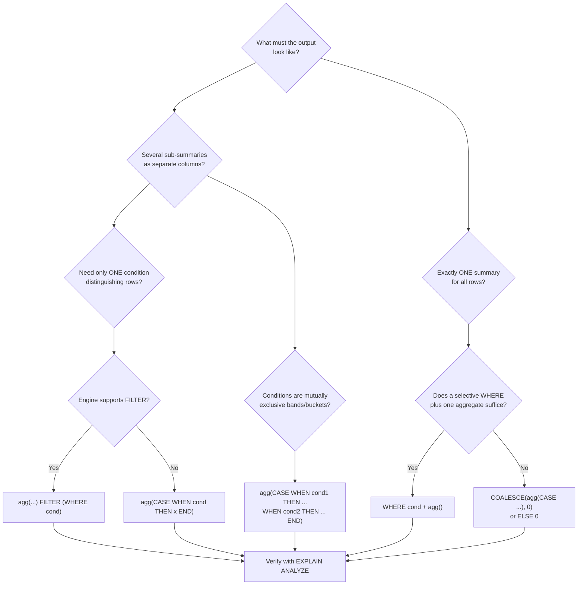

# 42 — Conditional Aggregation

> Category: 5-Aggregation — Section: 42-Conditional-Aggregation

---

## Fundamentals

### The one-paragraph answer

Conditional aggregation is the technique of putting a `CASE` expression *inside* an aggregate function (or attaching a `FILTER (WHERE ...)` clause to it) so that each aggregate only considers the rows that satisfy a condition.The corruption is fixed and the grep confirms no other interleavings in section 42 (matches were in unrelated pre-existing files). Let me do a final structure check.
Section 42 written to `sql-handbook/5-Aggregation/42-Conditional-Aggregation.md` (852 lines), matching the handbook's style:

- **Fundamentals** — what/why, three moving parts, the mental model (grain preserved)
- **Syntax** — ANSI `CASE` form, `FILTER (WHERE ...)` (SQL:2003) with verified dialect support (PostgreSQL/SQLite/DuckDB/BigQuery; Oracle 23ai+; not MySQL/SQL Server), engine shortcuts (`IF`/`IIF`/`DECODE`/`COUNTIF`), and the four count-if spellings
- **Internal working** — logical position, why NULL-skipping is the core trick, FILTER vs CASE mechanism (verified via PostgreSQL docs/jOOQ benchmark framing), and the `COUNT(DISTINCT ...)` disables-parallel-aggregation detail
- **Sample tables** — employees/orders/shipments with stated grains
- **10 worked examples** with verified expected outputs — status matrix, per-department conditional matrix, AVG/percentage (integer-division trap), MIN/MAX, conditional `COUNT(DISTINCT)`, FILTER equivalents, month-as-columns pivot-lite, carrier on-time report, conditional aggregate in `HAVING`
- **NULL behavior, edge cases (8), common mistakes, production pitfalls, performance** (EXPLAIN-driven, no absolute claims), **comparison tables, and a Mermaid decision flow**
- **# Interview Questions** across all 8 categories (33 questions, unanswered for practice)

One corruption was introduced during the write (my output text bled into the opening paragraph); I detected and repaired it and verified no other interleavings exist.
Self-join `employees a JOIN employees b` | Row duplication, fragile |
| "Share of late shipments by carrier" | `LEFT JOIN` a late-only aggregate | Complexity, NULL-row traps |

Conditional aggregation answers all of them with **one scan** and no self-joins. That is its reason for being: fewer passes over the same data, fewer moving parts, output already shaped like the report (rows in one column each).

> Common misconception: "Conditional aggregation is just a different spelling of `WHERE`." No. `WHERE` filters **input rows**; a conditional aggregate filters rows **per aggregate**, so some aggregates can see a row while others do not. `WHERE` would remove the row for *every* aggregate at once.

### The mental model and grain (unchanged)

One row in `employees` = one employee.
One row in `orders` = one order.
One row in `order_items` = one line item inside an order (an order can have many items).
One row in `shipments` = one shipment of an order (an order can have many shipments).

Conditional aggregation does not change the rules of *Section 36 — GROUP BY*: if you group rows, every non-aggregate in the `SELECT` must be a group key, and one output row still represents **one group**. Conditional aggregation only changes *which input rows feed each aggregate*, never the output grain.

---

## Syntax

### Pattern 1 — the portable ANSI `CASE` form

```sql
-- Count rows matching a condition
SELECT COUNT(CASE WHEN condition THEN 1 END) AS matching_rows
FROM table;

-- Sum a column over matching rows
SELECT SUM(CASE WHEN condition THEN numeric_col END) AS matching_sum
FROM table;

-- Sum over matching rows, with a defined zero for non-matching rows
SELECT SUM(CASE WHEN condition THEN numeric_col ELSE 0 END) AS matching_sum
FROM table;

-- Average over matching rows only
SELECT AVG(CASE WHEN condition THEN numeric_col END) AS matching_avg
FROM table;

-- Distinct values over matching rows only
SELECT COUNT(DISTINCT CASE WHEN condition THEN col END) AS matching_distinct
FROM table;
```

This runs everywhere `CASE` runs, i.e. every mainstream engine.

### Pattern 2 — the `FILTER (WHERE ...)` clause (SQL:2003)

```sql
SELECT
    COUNT(*)                    FILTER (WHERE condition) AS matching_rows,
    SUM(numeric_col)            FILTER (WHERE condition) AS matching_sum,
    AVG(numeric_col)            FILTER (WHERE condition) AS matching_avg,
    COUNT(DISTINCT col)         FILTER (WHERE condition) AS matching_distinct
FROM table;
```

Dialect support:

> PostgreSQL — full support (since 9.4).
> SQLite — support since 3.30.
> DuckDB — full support.
> BigQuery — support (also offers shorthand `COUNTIF(cond)` / `SUMIF(cond, x)`).
> Oracle — historically absent (use `CASE` / `DECODE` / `PIVOT`); very recent releases (23ai+) are adding it — check your version.
> SQL Server — not supported (use `CASE` or `PIVOT`).
> MySQL — not supported (use `CASE` or `IF`).

The order of clauses matters when combining with window functions: `SUM(x) FILTER (WHERE cond) OVER (PARTITION BY ...)` — `FILTER` comes before `OVER`.

### Pattern 3 — engine-specific one-liners (functionally the same idea)

| Engine | Count-if | Sum-if |
|---|---|---|
| MySQL | `COUNT(IF(cond, 1, NULL))`, `SUM(IF(cond, 1, 0))` | `SUM(IF(cond, sales, 0))` |
| SQL Server | `COUNT(IIF(cond, 1, NULL))`, `SUM(IIF(cond, 1, 0))` | `SUM(IIF(cond, sales, 0))` |
| Oracle | `COUNT(DECODE(status, 'shipped', 1))` | `SUM(DECODE(status, 'shipped', sales, 0))` |
| BigQuery | `COUNTIF(cond)` | `SUMIF(cond, sales)` |

`DECODE` deserves one warning: a missing match returns `NULL` (great for `COUNT`), and `DECODE` treats `NULL`/default specially — the same "shape the value to `NULL`" trick, but with its own footguns. Prefer `CASE` for portability; these shortcuts are conveniences for teams that never leave their engine.

### The four canonical "count-if" spellings (memorize these)

| Intent | Spelling | Non-matching rows become | Result when 0 match |
|---|---|---|---|
| count matching rows | `COUNT(CASE WHEN cond THEN 1 END)` | `NULL` (skipped) | `0` |
| count matching rows | `SUM(CASE WHEN cond THEN 1 ELSE 0 END)` | `0` (added, harmless) | `0` |
| count matching rows | `COUNT(*) FILTER (WHERE cond)` | excluded before counting | `0` |
| **WRONG** count | `COUNT(CASE WHEN cond THEN 1 ELSE 0 END)` | `0` (counted!) | `rows − 0 = everything` |

The last row is the most famous conditional-aggregation bug in existence. `COUNT` does not ignore `0`, so `ELSE 0` counts the rows that *failed* the condition. `COUNT` only lets you off the hook for `NULL`. `SUM(CASE ... ELSE 0 END)` is safe because adding zero is neutral; `COUNT(CASE ... ELSE 0 END)` is broken because counting zero is not.

---

## Internal working

### Where the pieces sit in logical execution order

```
FROM  →  WHERE  →  GROUP BY  →  HAVING  →  SELECT (expressions, incl. CASE)  →  aggregate  →  ORDER BY
```

- `WHERE` runs **before** grouping and before any aggregate. A row dropped by `WHERE` is gone for all aggregates.
- The `CASE` inside the aggregate is evaluated **per input row** (for the rows that survived `WHERE` and joined), and its result (`value` or `NULL`) is handed to the aggregate's running state.
- `FILTER (WHERE cond)` behaves as if only the rows satisfying `cond` are fed to that one aggregate — clausewise, *per aggregate*, exactly like a private `WHERE` for that aggregate.

### Why "CASE produces NULL" is the whole engine of the trick

The aggregate transition step looks at each incoming value:

```
Input row ──► CASE ──► matches?  yes ──► value ──► COUNT(*) : add to total
                              │
                              └──► no  ──► NULL  ──► COUNT(col) : skip silently
```

- `COUNT(CASE ... THEN 1 END)` → non-matching rows send `NULL` → `COUNT` skips them → only matches are counted.
- `SUM(CASE ... THEN total END)` → non-matching rows send `NULL` → `SUM` skips them → sum of matches only; if *no* row matches, `SUM` over only-NULL values returns `NULL` (not `0`) — see *Section 38*.
- `AVG(CASE ... THEN x END)` → `NULL`-rows are not in the **denominator** either, so the average is over matching rows only. This is the difference between "average of a filtered set" and accidentally dividing by all rows.

> Interview trap: "`AVG(CASE ... END)` and `AVG(x) FILTER (WHERE ...)` are the same, right?" Functionally yes, with the same NULL semantics. But the *reason* they work is not identical — `CASE` *relies on NULL-skipping* (which is why the wrong `ELSE 0` breaks `COUNT` but not `SUM`), while `FILTER` never feeds non-matching rows into the aggregate at all. One is a property of the value; the other is a property of the row set.

### Does `FILTER` change performance vs `CASE`? (The honest answer)

The two spellings are semantically equivalent, and the default assumption — until proven otherwise — is that the optimizer generates the same or comparable work. There are plausible mechanism-level reasons `FILTER` *could* differ from `CASE` in a given engine: with `CASE`, the aggregate's argument expression may still be visited for every input row, while a `FILTER`-style clause can short-circuit a row before evaluating the argument; engines may also treat `FILTER` aggregates as partial-able differently. But none of this is universal, and neither is "always faster".

**What to do:** treat them as equivalent by default, and if a hot query matters, measure it:

```sql
EXPLAIN ANALYZE
SELECT COUNT(CASE WHEN status = 'shipped' THEN 1 END) FROM orders;

EXPLAIN ANALYZE
SELECT COUNT(*) FILTER (WHERE status = 'shipped') FROM orders;
```

Compare plan shape and `actual rows` / `actual time`. If they plan identically, the choice is readability, not speed. See *jOOQ's "FILTER vs CASE" benchmarks* as a reference point, not a law — numbers depend on version, statistics, and data.

### One internal detail that *is* engine-flag-worthy: `COUNT(DISTINCT ...)`

In PostgreSQL, an aggregate containing `DISTINCT` (or `ORDER BY`) **does not participate in parallel aggregation** — the parser/planner treats it as not parallel-safe. That applies to both `COUNT(DISTINCT CASE ... END)` and `COUNT(DISTINCT x) FILTER (WHERE ...)`. Confirm with `EXPLAIN`: if you expect a `Gather` + `Partial Aggregate` and you see a plain serial `Finalize Aggregate`, distinct-count is likely the reason. This is engine-specific and version-specific — verify, don't assume.

---

## Sample tables (grain stated for each)

```sql
CREATE TABLE departments (
    department_id   INT PRIMARY KEY,
    department_name VARCHAR(100) NOT NULL
);

INSERT INTO departments VALUES
 (1, 'Engineering'),
 (2, 'Sales'),
 (3, 'HR');

-- One row = one employee
CREATE TABLE employees (
    employee_id   INT PRIMARY KEY,
    employee_name VARCHAR(100) NOT NULL,
    department_id INT REFERENCES departments(department_id),
    salary        NUMERIC(10,2),
    is_active     BOOLEAN
);

INSERT INTO employees VALUES
 (101, 'Alice',  1,    9000.00, TRUE),
 (102, 'Bob',    1,    8000.00, TRUE),
 (103, 'Carol',  2,    6000.00, TRUE),
 (104, 'Dave',   2,    6500.00, FALSE),
 (105, 'Eve',    3,    5000.00, TRUE),
 (106, 'Frank',  3,    NULL,    TRUE),
 (107, 'Grace',  NULL, 7000.00, TRUE);   -- no department assigned

-- One row = one order
CREATE TABLE orders (
    order_id    INT PRIMARY KEY,
    customer_id INT NOT NULL,
    order_date  DATE NOT NULL,
    status      VARCHAR(20) NOT NULL,
    total       NUMERIC(12,2) NOT NULL
);

INSERT INTO orders VALUES
 (1, 1, '2025-01-05', 'shipped',   250.00),
 (2, 1, '2025-01-20', 'cancelled',  99.00),
 (3, 2, '2025-01-12', 'shipped',   480.00),
 (4, 2, '2025-02-01', 'shipped',   120.00),
 (5, 3, '2025-02-10', 'pending',   300.00),
 (6, 3, '2025-02-15', 'shipped',    40.00);

-- One row = one shipment of an order (an order can ship in pieces)
CREATE TABLE shipments (
    shipment_id   INT PRIMARY KEY,
    order_id      INT NOT NULL REFERENCES orders(order_id),
    carrier       VARCHAR(20) NOT NULL,
    promised_date DATE NOT NULL,
    actual_date   DATE NOT NULL
);

INSERT INTO shipments VALUES
 (1, 1, 'UPS',  '2025-01-09', '2025-01-10'),  -- late
 (2, 1, 'UPS',  '2025-01-19', '2025-01-19'),  -- on time
 (3, 3, 'DHL',  '2025-01-13', '2025-01-12'),  -- early (on time)
 (4, 4, 'DHL',  '2025-02-02', '2025-02-05'),  -- late
 (5, 5, 'UPS',  '2025-02-12', '2025-02-10'),  -- early (on time)
 (6, 6, 'DHL',  '2025-02-16', '2025-02-20');  -- late
```

---

## Examples

### Example 1 — one-scan status report (the anti-`UNION`)

Goal: how many orders are in each status, side by side as columns.

```sql
-- BAD APPROACH: one aggregate per status, chased with UNION
SELECT 'shipped' AS status, COUNT(*) AS cnt FROM orders WHERE status = 'shipped'
UNION ALL
SELECT 'cancelled', COUNT(*) FROM orders WHERE status = 'cancelled'
UNION ALL
SELECT 'pending',   COUNT(*) FROM orders WHERE status = 'pending';
```

That is three scans, three statements bolted together, and the result is one column per *row* — backwards from what the report wants.

```sql
-- BETTER APPROACH: conditional aggregation, one scan, one row
SELECT
  COUNT(*)                                          AS total_orders,
  COUNT(CASE WHEN status = 'shipped'   THEN 1 END)  AS shipped,
  COUNT(CASE WHEN status = 'cancelled' THEN 1 END)  AS cancelled,
  COUNT(CASE WHEN status = 'pending'   THEN 1 END)  AS pending
FROM orders;
```

| total_orders | shipped | cancelled | pending |
|---|---|---|---|
| 6 | 4 | 1 | 1 |

Order 1, 3, 4, 6 are `shipped`; order 2 is `cancelled`; order 5 is `pending`.

### Example 2 — sums split by category

Goal: revenue (from `total`) per status, as columns.

```sql
SELECT
  SUM(CASE WHEN status = 'shipped'   THEN total END) AS shipped_revenue,
  SUM(CASE WHEN status = 'cancelled' THEN total END) AS cancelled_revenue,
  SUM(CASE WHEN status = 'pending'   THEN total END) AS pending_revenue
FROM orders;
```

| shipped_revenue | cancelled_revenue | pending_revenue |
|---|---|---|
| 890.00 | 99.00 | 300.00 |

`shipped`: 250 + 480 + 120 + 40 = 890. The three aggregates ran over the **same six rows in the same pass**; each one simply ignored the rows it did not care about.

### Example 3 — conditional aggregation with `GROUP BY` (matrix per department)

Conditional aggregation really earns its keep next to `GROUP BY`: the conditions and the groups are independent, so you get a matrix in one scan.

```sql
SELECT department_id,
       COUNT(*)                                       AS headcount,
       COUNT(CASE WHEN is_active THEN 1 END)          AS active_cnt,
       COUNT(CASE WHEN NOT is_active THEN 1 END)      AS inactive_cnt,
       SUM(CASE WHEN salary > 6500 THEN salary END)   AS high_pay_total
FROM employees
WHERE department_id IS NOT NULL
GROUP BY department_id
ORDER BY department_id;
```

| department_id | headcount | active_cnt | inactive_cnt | high_pay_total |
|---|---|---|---|---|
| 1 | 2 | 2 | 0 | 17000.00 |
| 2 | 2 | 1 | 1 | NULL |
| 3 | 2 | 2 | 0 | NULL |

Notes:

- `dept 2` shows the *shape* of the trick: Carol active, Dave inactive; nobody earns above 6500, so `high_pay_total` is `NULL`, **not 0** (every row became `NULL`, and `SUM` of nothing is `NULL`).
- `dept 3`: Frank is active but his salary is `NULL`; he counts in `active_cnt` (the condition is on `is_active`, unrelated to salary) but contributes nothing to any salary sum.

### Example 4 — conditional `AVG` and percentages (watch integer division)

```sql
SELECT
  AVG(salary)                                   AS avg_all,
  AVG(CASE WHEN is_active THEN salary END)      AS avg_active,
  AVG(CASE WHEN NOT is_active THEN salary END)  AS avg_inactive
FROM employees;
```

| avg_all | avg_active | avg_inactive |
|---|---|---|
| 6916.67 | 7000.00 | 6500.00 |

The `AVG` denominators differ by design: `avg_active` divides by **5** (the active employees with a salary; Frank's `NULL` salary is excluded), `avg_all` by 6, `avg_inactive` by 1.

Share of active employees:

```sql
-- BAD APPROACH: integer division truncates the ratio to 0
SELECT SUM(CASE WHEN is_active THEN 1 ELSE 0 END) / COUNT(*) AS active_share
FROM employees;   -- 6 / 7 = 0 (integer division)

-- BETTER APPROACH: force floating/fixed precision (1.0 / 100.0)
SELECT
  100.0 * COUNT(CASE WHEN is_active THEN 1 END) / COUNT(*) AS active_pct
FROM employees;
```

| active_pct |
|---|
| 85.71 |

`100.0 * 6 / 7 = 85.71`. Integer division (`6 / 7 = 0`) is the classic trap here — see *Section 38* — and it does not care that you used a `CASE`.

### Example 5 — conditional `MIN` / `MAX`

```sql
SELECT department_id,
       MIN(CASE WHEN is_active THEN salary END)     AS min_active_salary,
       MAX(CASE WHEN NOT is_active THEN salary END) AS max_inactive_salary
FROM employees
WHERE department_id IS NOT NULL
GROUP BY department_id
ORDER BY department_id;
```

| department_id | min_active_salary | max_inactive_salary |
|---|---|---|
| 1 | 8000.00 | NULL |
| 2 | 6000.00 | 6500.00 |
| 3 | 5000.00 | NULL |

`dept 1` has no inactive employee, so `max_inactive_salary` is `NULL`. `dept 3`'s `min` ignores Frank's `NULL` salary — proving that the `CASE` filter and the aggregate's own NULL-skipping compose.

### Example 6 — conditional `COUNT(DISTINCT ...)`

Goal: distinct customers who ever have a shipped order vs distinct customers who have a cancelled order.

```sql
SELECT
  COUNT(DISTINCT customer_id) AS customers_with_orders,
  COUNT(DISTINCT CASE WHEN status = 'shipped'   THEN customer_id END) AS customers_shipped,
  COUNT(DISTINCT CASE WHEN status = 'cancelled' THEN customer_id END) AS customers_cancelled
FROM orders;
```

| customers_with_orders | customers_shipped | customers_cancelled |
|---|---|---|
| 3 | 3 | 1 |

Every customer (1, 2, 3) appears on a shipped order, so `customers_shipped` = 3. Only customer 1 has a cancelled order. The `CASE` streams only matching `customer_id` values into the distinct set; both the non-matching rows (via `CASE` → `NULL`) and the NULL itself (never a distinct value) are ignored.

The `FILTER` version (PostgreSQL / SQLite / BigQuery / DuckDB):

```sql
SELECT
  COUNT(DISTINCT customer_id)                                    AS customers_with_orders,
  COUNT(DISTINCT customer_id) FILTER (WHERE status = 'shipped')  AS customers_shipped,
  COUNT(DISTINCT customer_id) FILTER (WHERE status = 'cancelled')AS customers_cancelled
FROM orders;
```

Same output — and note the repeated `customer_id` expression. The `CASE` form repeats the *condition*; the `FILTER` form repeats the *function arguments*. That symmetry is why neither is "cleaner" on every screen.

### Example 7 — `FILTER (WHERE ...)` equivalents of Examples 1 and 2

```sql
SELECT
  COUNT(*)                                     AS total_orders,
  COUNT(*) FILTER (WHERE status = 'shipped')   AS shipped,
  COUNT(*) FILTER (WHERE status = 'cancelled') AS cancelled,
  SUM(total) FILTER (WHERE status = 'shipped') AS shipped_revenue
FROM orders;
```

| total_orders | shipped | cancelled | shipped_revenue |
|---|---|---|---|
| 6 | 4 | 1 | 890.00 |

> Common misconception: "`FILTER` is a MySQL/PostgreSQL-ism." It is standard SQL:2003 *worldwide* — but only *implemented* in some engines. On MySQL or SQL Server this exact query is a syntax error.

### Example 8 — "pivot-lite": months as columns

Conditional aggregation is the poor-person's `PIVOT`: values that "want" to be separate rows become separate columns, using a condition per column.

```sql
SELECT customer_id,
  SUM(CASE WHEN EXTRACT(MONTH FROM order_date) = 1 THEN total END) AS jan_revenue,
  SUM(CASE WHEN EXTRACT(MONTH FROM order_date) = 2 THEN total END) AS feb_revenue
FROM orders
GROUP BY customer_id
ORDER BY customer_id;
```

| customer_id | jan_revenue | feb_revenue |
|---|---|---|
| 1 | 349.00 | NULL |
| 2 | 480.00 | 120.00 |
| 3 | NULL | 340.00 |

Customer 1's January total is 250 + 99 across two orders; customer 1 has no February order, so `feb_revenue` is `NULL` (not 0). For a real `PIVOT`/`CROSSTAB` engine comparison, see *Section 99 — Pivot & Unpivot*.

### Example 9 — on-time delivery ratio per carrier (real-world scenario)

Goal: per carrier, total shipments, on-time count, late count, and late percentage.

```sql
SELECT carrier,
       COUNT(*) AS shipments,
       COUNT(CASE WHEN actual_date <= promised_date THEN 1 END) AS on_time,
       COUNT(CASE WHEN actual_date  > promised_date THEN 1 END) AS late,
       ROUND(100.0 * COUNT(CASE WHEN actual_date > promised_date THEN 1 END) / COUNT(*), 2)
            AS late_pct
FROM shipments
GROUP BY carrier
ORDER BY carrier;
```

| carrier | shipments | on_time | late | late_pct |
|---|---|---|---|---|
| DHL | 3 | 1 | 2 | 66.67 |
| UPS | 3 | 2 | 1 | 33.33 |

(Shipment 3 and 5 — delivered early — count as on-time because `actual <= promised`.) One scan over six shipments produced a six-cell quality report that would otherwise need a `GROUP BY` per carrier status, a join, or two query passes.

### Example 10 — conditional aggregate inside `HAVING`

Goal: departments where more than half of the employees are active.

```sql
SELECT department_id,
       COUNT(*)                                  AS n,
       COUNT(CASE WHEN is_active THEN 1 END)     AS active_cnt
FROM employees
WHERE department_id IS NOT NULL
GROUP BY department_id
HAVING COUNT(CASE WHEN is_active THEN 1 END) > COUNT(*) / 2
ORDER BY department_id;
```

| department_id | n | active_cnt |
|---|---|---|
| 1 | 2 | 2 |
| 3 | 2 | 2 |

`dept 2` loses: 1 active of 2 is *not* greater than 1. Note you cannot move that condition into `WHERE` (it aggregates a group) and you cannot reference the `SELECT` alias `active_cnt` in `HAVING` on every engine (Oracle historically rejects it, PostgreSQL allows aggregates only) — see *Section 37*.

---

## NULL behavior

Conditional aggregation is *made of* NULL behavior. Every rule below is a direct consequence of the rules in *Sections 38–39*.

| Situation | Result | Why |
|---|---|---|
| Matching row, `COUNT(CASE ... THEN 1 END)` | counted | row value is `1` |
| Non-matching row, same aggregate | skipped | `CASE` (no `ELSE`) returns `NULL`; `COUNT(col)` skips `NULL` |
| Non-matching row, `COUNT(CASE ... THEN 1 ELSE 0 END)` | **counted** | `0` is a value; `COUNT` counts it — the famous bug |
| Matching row whose *source value* is `NULL` (`SUM(CASE WHEN cond THEN salary END)`, salary = NULL) | skipped | `SUM` skips `NULL` too — the condition may pass while the value is still NULL |
| Zero matching rows, `SUM(CASE ... END)` | `NULL` | `SUM` over zero non-NULL inputs is `NULL`, not 0 |
| Zero matching rows, `SUM(CASE ... ELSE 0 END)` | `0` | every row contributed `0` |
| Zero matching rows, both `COUNT` spellings | `0` | `COUNT` always returns a number |
| Condition itself involves NULL (`status = NULL`) | treated as `FALSE`/unknown → no match | three-valued logic: `NULL = NULL` is *unknown*, never true — see *Sections 10–11* |
| `COUNT(DISTINCT CASE ... THEN customer_id END)` | non-matching rows supply `NULL`; `NULL` is not "distinct", so excluded | distinct + NULL rules compose |
| Broken `CASE` branch ordering | wrong branches swallow matches | `CASE` picks **the first** true branch, top to bottom |

> Production pitfall: `SUM(CASE ... END)` returning `NULL` ripples through dashboards. `COALESCE(SUM(CASE ... END), 0)` is the standard fix — applying it after the aggregate, not inside the `CASE`.

---

## Edge cases

### 1. Conditions that overlap — "order of branches" is first-match

`CASE` evaluates branches **top to bottom** and stops at the first `TRUE`. If your conditions overlap, the earlier branch wins unconditionally:

```sql
SELECT
  COUNT(CASE WHEN total < 300      THEN 1 END) AS small,       -- orders 1,2,6
  COUNT(CASE WHEN total < 300 AND total >= 250 THEN 1 END) AS ... -- never the way to overlap
  ...
```

If you need bands, make them mutually exclusive explicitly, or accept that "first match wins" is the semantics you asked for. See *Section 08 — CASE Expressions* for the full precedence rules.

### 2. The condition is only "true-ish" — NULL status values

The `orders.status` column is `NOT NULL` in our sample, but if it were nullable, a row with `status = NULL` would satisfy **no** `WHEN status = 'x'` branch (unknown, not true). It would fall through to `ELSE`. If you want to count it explicitly, add a final `WHEN status IS NULL` branch.

### 3. Empty input, with and without `GROUP BY`

```sql
SELECT COUNT(CASE WHEN status = 'shipped' THEN 1 END) AS c FROM orders WHERE 1 = 0;
-- one output row: 0

SELECT customer_id,
       COUNT(CASE WHEN status = 'shipped' THEN 1 END) AS c
FROM orders
WHERE 1 = 0
GROUP BY customer_id;
-- zero output rows (no groups exist)
```

Same rule as *Section 36*: a bare aggregate over zero rows is one conceptual group and still emits a row; `GROUP BY` over zero rows emits nothing.

### 4. `ELSE 0` vs no `ELSE` with `SUM` — both legal, different NULL contract

```sql
SUM(CASE WHEN cond THEN x ELSE 0 END)  -- never NULL (0 when nothing matches)
SUM(CASE WHEN cond THEN x END)         -- NULL when nothing matches
```

Pick intentionally: NULL propagates "no data" honestly; 0 fabricates a number. Many production reports want NULL so a late-month row stays visually empty.

### 5. Type unification across branches

All `THEN` values in one `CASE` must unify to one type. `SUM(CASE WHEN x THEN 1 END)` is fine; `SUM(CASE WHEN x THEN 1 ELSE 'y' END)` is not. Similarly `COUNT(DISTINCT CASE ... THEN customer_id END)` requires `customer_id` on the right side — a classic typo is putting TRUE/1 there, which counts *distinct booleans* instead of customers.

### 6. `CASE` at the wrong level — inside `WHERE`, against aggregates

```sql
-- Impossible in one level: you cannot reference an aggregate inside CASE at the same SELECT level
SELECT CASE WHEN COUNT(*) > 5 THEN 'big' END FROM orders;  -- illegal in most engines
```

Conditional aggregation shapes *input* values. Deciding something about an *aggregate result* (`HAVING`, a subquery, a window function) is a different job.

### 7. Denominator choices with `AVG` and percentages

`AVG(CASE ... END)` divides by matching rows only. If the intent was "value when matching, 0 when not" — use `AVG(CASE WHEN cond THEN x ELSE 0 END)`. If the intent was literal NULL rows excluded — `AVG(NULLIF(...))`, see *Section 12*. These are three different numbers; say which one the report wants.

### 8. Note the case keywords vs `FILTER`: `COUNT(*)` inside `FILTER`

`COUNT(CASE ... )` is a `COUNT(expression)`; `COUNT(*) FILTER (WHERE ...)` is a counted-rows form. When the condition rides on the *row* rather than a column value, `COUNT(*) FILTER (WHERE cond)` says it plainly.

---

## Common mistakes

| Mistake | Symptom | Fix |
|---|---|---|
| `COUNT(CASE ... THEN 1 ELSE 0 END)` | counting **all** rows | drop `ELSE 0` (or switch to `SUM(CASE ... ELSE 0 END)`) |
| `SUM(CASE ... END)` treated as "always a number" | NULL where a 0 was expected | `COALESCE(SUM(...), 0)`, or `ELSE 0` |
| Filtering in `WHERE` when you need totals **and** sub-totals side by side | extra scans / subqueries to recover the grand total | conditional aggregates inside one scan |
| Repeating the condition dozens of times | typos drift between columns | build one clean `SELECT` per condition; or generate columns in your BI tool |
| `COUNT(DISTINCT CASE ... THEN flag END)` | counts 1/TRUE, not the real key | `THEN` the value you actually want to distinct-count |
| Branch order with overlapping conditions | earlier branch silently wins | make branches mutually exclusive or accept first-match |
| `WHEN status = NULL` | never matches | `WHEN status IS NULL` |
| Integer division in ratios | percent becomes `0` or `1` | multiply by `100.0` / `1.0` before dividing |
| Using `FILTER` on MySQL/SQL Server | syntax error | `CASE`, or check engine |
| JOINing a detail table and conditionally summing a parent column | double counting (fan-out) | aggregate children to the parent grain first (see *Section 21*) |

---

## Production pitfalls

> Production pitfall 1 — **fan-out + conditional aggregation on the wrong grain.**
>
> ```sql
> -- WRONG: oi rows duplicate o.total; the shipped conditional sum double counts order 1 (250 twice)
> SELECT o.customer_id,
>        SUM(CASE WHEN o.status = 'shipped' THEN o.total END) AS shipped_revenue
> FROM orders o
> JOIN order_items oi ON oi.order_id = o.order_id
> GROUP BY o.customer_id;
> ```
>
> A conditional aggregate is still an aggregate — it cannot repair rows that were duplicated by a join (see *Section 21*). Fix the grain: compute at `orders` level (no `order_items`), or pre-aggregate `order_items` to `order_id` before joining.

> Production pitfall 2 — **`FILTER` writing that dead-ends on a migration.**
>
> `FILTER` is lovely on PostgreSQL but a hard syntax error on MySQL and SQL Server. A query base that must travel engines should stay on `CASE`; keep `FILTER` for single-engine warehouses where it is supported.

> Production pitfall 3 — **many identical conditions = invisible drift.**
>
> `SUM(CASE WHEN x>0 AND y IS NULL THEN ...` written 12 times guarantees that one of the 12 will eventually differ. Prefer building the condition once (CTE/`LATERAL` convenience column, or a BI-level metric), or generate the SQL.

> Production pitfall 4 — **dashboard NULL-vs-0.**
>
> `SUM(CASE ... END)` columns are NULL when a period has no matching rows. If your dashboard renders NULL as blank and a "shipments" column goes blank for December, that is the NULL contract, not a bug — but decide it explicitly and apply `COALESCE` in one obvious place.

---

## Performance implications

Two claims you will hear, both oversimplified:

1. "Conditional aggregation is always faster than `UNION`."
2. "`FILTER` is always faster than `CASE`."

Neither is universally true. The truthful framing:

- **Scan count is the main lever.** A single `SELECT` with conditional aggregates can answer N questions with one scan of the table. N separate `COUNT ... WHERE` queries (or a `UNION ALL`) may scan N times. But the optimizer *can* combine, cache, or parallelize these differently — the number of physical scans is **not** guaranteed by the number of statements you write. Check the plan.
- **`FILTER` vs `CASE`** is, in most engines, the same aggregation node with a filter/expression attached. Whether the argument expression is evaluated for non-matching rows, whether the aggregate is partial-able, and whether parallel workers help all vary by engine/version. Measure, don't assume (see the two-`EXPLAIN ANALYZE` comparison above).
- **`WHERE` still matters.** If you only need *one* metric and it lives behind a selective predicate, `WHERE status = 'shipped'` + plain `COUNT(*)` typically scans far fewer rows than `COUNT(CASE...)` over the whole table — a conditional aggregate cannot push that predicate down the way a `WHERE` can. If you need multiple metrics **and** the filtered sub-total, conditional aggregation in one scan often beats a filtered query plus a full-scan query.
- **`COUNT(DISTINCT ...)` is the expensive cousin.** Exact distinct sets force state (hash or sort) per group and may spill; in PostgreSQL they also disable parallel aggregation for that call. If a conditional distinct count is your hot path, look at the plan and consider approximation engines where correctness allows (server-level approximate distinct functions).
- **Indexes.** Conditional aggregation over a whole table rarely benefits from an index unless it is *covering* (an index-only scan may avoid heap reads — see *Sections 72–77*). A partial index on `(status)` can also accelerate the standalone `WHERE status='shipped'` count dramatically by scanning only matching rows. Again: verify via `EXPLAIN`, don't assume.

Verification protocol — always:

```sql
EXPLAIN ANALYZE
SELECT
  COUNT(*)                                       AS total_orders,
  COUNT(CASE WHEN status = 'shipped' THEN 1 END) AS shipped
FROM orders;
```

Look for: node types (`Seq Scan` vs `Index Only Scan` vs `Gather`), `actual rows` vs `estimated rows` (statistics age), and `actual time`. Cheap query? Then the whole performance debate is moot — keep whichever spelling reads best.

---

## Comparison tables

### Technique selection

| Situation | Best tool | Why |
|---|---|---|
| "Count/sum per category, several categories, one pass" | Conditional aggregation (`CASE` or `FILTER`) | one scan, report-shaped output |
| "One category only, selective predicate" | `WHERE` + plain aggregate | can use index / skip rows |
| "Grand total **and** one sub-total" | one aggregate + one conditional aggregate | single scan keeps both |
| "Two sub-totals over the *same* scan" | two conditional aggregates | beats two queries |
| "Values that want to be columns" | conditional aggregation (pivot-lite) or real `PIVOT`/`CROSSTAB` | *Section 99* for the real thing |
| "Filter on an aggregate result" | `HAVING` (+ conditional aggregates inside it) | you need group-level filtering |
| "Need aggregates next to detail rows" | window functions (`SUM(...) FILTER (WHERE ...) OVER (PARTITION BY ...)`) | preserves rows instead of collapsing — *Section 56* |

### `CASE` vs `FILTER` vs engine shortcut

| Aspect | `CASE ... END` (ANSI) | `FILTER (WHERE ...)` (SQL:2003) | `IF`/`IIF`/`DECODE`/`COUNTIF` |
|---|---|---|---|
| Portability | everywhere | PostgreSQL, SQLite 3.30+, DuckDB, BigQuery; Oracle 23ai+ (recent); **not** MySQL/SQL Server | engine-bound only |
| Mechanism | reshape value to `NULL`; rely on NULL-skip | exclude rows before aggregation | reshape value; same idea as `CASE` |
| Count-if must avoid `ELSE 0` | yes | n/a — non-matching rows never counted | depends on function (`IF(cond,1,NULL)` ok, `IF(cond,1,0)` wrong for COUNT) |
| Reads as | "turn non-matches into nothing" | "filter this aggregate's input" | "COUNTIF/SUMIF" |
| Window functions | `CASE` inside the window's aggregation | `FILTER` before `OVER` | depends |

### The six spellings, side by side

| Metric | `CASE` | `FILTER` | Engine shortcut |
|---|---|---|---|
| count rows where cond | `COUNT(CASE WHEN cond THEN 1 END)` | `COUNT(*) FILTER (WHERE cond)` | `COUNTIF(cond)` (BigQuery) |
| count distinct values where cond | `COUNT(DISTINCT CASE WHEN cond THEN col END)` | `COUNT(DISTINCT col) FILTER (WHERE cond)` | `COUNT(DISTINCT IF(cond, col, NULL))` (BigQuery) |
| sum values where cond | `SUM(CASE WHEN cond THEN x END)` | `SUM(x) FILTER (WHERE cond)` | `SUMIF(cond, x)` (BigQuery), `SUM(IF(cond,x,0))` (MySQL) |
| average values where cond | `AVG(CASE WHEN cond THEN x END)` | `AVG(x) FILTER (WHERE cond)` | `AVG(IF(cond, x, NULL))` (MySQL) |
| share of rows | `100.0 * COUNT(CASE WHEN cond THEN 1 END) / COUNT(*)` | `100.0 * COUNT(*) FILTER (WHERE cond) / COUNT(*)` | `100.0 * COUNTIF(cond) / COUNT(*)` (BigQuery) |

---

## Decision flow



---

## Best practices

1. **State the output grain first.** "One output row per department; each row carries 6 conditional columns" — the same discipline as every other section.
2. **Prefer `CASE` when the query must be portable** (MySQL/`SQL Server` on the roadmap). Prefer `FILTER` on engines that support it for readability — the condition sits next to the aggregate it shapes.
3. **`COUNT(CASE ... THEN 1 END)` — never `ELSE 0`.** `SUM(CASE ... ELSE 0 END)` is fine; `COUNT` + `ELSE 0` is the flagship bug.
4. **Decide the NULL contract per column**: `SUM(CASE...END)` is NULL when empty (use `COALESCE(...,0)` if the report wants zero).
5. **Reuse one condition.** If the same condition appears 10 times, extract it (CTE/model layer) or generate the SQL. Rust-proof against drift.
6. **Make band conditions mutually exclusive**, or you are accepting "first-match wins" without realizing it.
7. **Watch the denominator**: `AVG(CASE...)` and percentage dividers only see matching rows — cast `100.0`/`1.0` to dodge integer division.
8. **Don't `JOIN` your way into fan-out** — conditionally aggregate at the correct grain, or pre-aggregate children first.
9. **Measure before arguing.** Compare `EXPLAIN ANALYZE` output for `CASE` vs `FILTER` vs one `WHERE` query when the query is hot; otherwise pick by readability.
10. **When the answer is "distinct count within a condition"**, write `COUNT(DISTINCT CASE ...)` (or `FILTER`), remembering NULLs and the repeated-key shape.

---

## Cross-references

- `CASE` expressions (order, `ELSE`, type rules) — section 08
- `GROUP BY` (grain, execution order, NULL buckets) — section 36
- `HAVING` (filtering groups, alias rules per engine) — section 37
- `COUNT`/`SUM`/`AVG`/`MIN`/`MAX` (NULL rules, integer division) — section 38
- `COUNT(*)` vs `COUNT(col)` vs `COUNT(DISTINCT ...)` and NULL — section 39
- `DISTINCT` (distinct counts, engines) — section 40
- Fan-out / double counting on joins (the grain rule) — section 21
- Window functions + `FILTER` (`... FILTER (WHERE ...) OVER (...)`) — section 56
- `ROLLUP`/`CUBE`/`GROUPING SETS` (multi-level summaries) — section 43
- `PIVOT`/`UNPIVOT`/`CROSSTAB` (true column transposition) — section 99
- Aggregation with `GROUPING SETS` for subtotal matrices — section 43
- Indexes, covering indexes, partial indexes — sections 72–77
- `EXPLAIN` / execution plans — section 78

---

# Interview Questions

## Beginner

1. What is conditional aggregation? Name the two SQL features it combines (only one of them is an aggregate).
2. Using the sample `orders`, write one query that counts `'shipped'`, `'pending'`, and `'cancelled'` orders as **three columns** using only `CASE`. What does `COUNT(*)` in the same `SELECT` give?
3. `COUNT(CASE WHEN status = 'shipped' THEN 1 ELSE 0 END)` — what does it return for the sample data and why is it wrong? What is the correct spelling?
4. Are `COUNT(CASE WHEN cond THEN 1 END)` and `SUM(CASE WHEN cond THEN 1 ELSE 0 END)` equivalent? Explain why via NULL-skipping.
5. When does `SUM(CASE WHEN status = 'pending' THEN total END)` return `NULL` rather than `0`?

## Intermediate

6. Rewrite this as one query using conditional aggregation (no `UNION`): "how many orders are shipped, how much revenue did shipped orders bring, how many are cancelled."
7. `COUNT(DISTINCT CASE WHEN status = 'cancelled' THEN customer_id END)` — walk through all six orders and predict the result. What role do NULLs (from `CASE` and from a hypothetical NULL `customer_id`) play?
8. What is the `FILTER (WHERE ...)` clause? Which engines support it (name at least two that do and two that don't)?
9. Explain why putting `ELSE 0` inside a `COUNT` breaks the query but putting it inside `SUM` is harmless.
10. The on-time report groups by carrier. Write it using `WHERE`-style thinking, then using conditional aggregation, and explain when each approach would scan fewer rows.

## Advanced

11. `CASE` picks the first `TRUE` branch top-to-bottom. Design banded revenue buckets (`<100`, `100–499`, `>=500`) with overlapping conditions and show how both *correct* and *buggy* results can emerge from the same rows.
12. In PostgreSQL, why might the same `EXPLAIN` show no `Gather`/`Partial Aggregate` for a query containing `COUNT(DISTINCT ...) FILTER (WHERE ...)`? What would you check to confirm the cause?
13. Compare the *mechanism* of `CASE`-inside-aggregate vs `FILTER`: one relies on NULL-skipping, the other on row exclusion. Give a concrete example where the distinction matters for correctness (e.g., an aggregate that does *not* skip NULLs).
14. A designer claims "`FILTER` is always faster than `CASE` because the argument expression is never evaluated for non-matching rows." Defend the *proper* answer: when is it plausible, when is it irrelevant, and how do you verify it on one specific engine?
15. Build a single-query report that needs, per department: headcount, active count, average active salary, and the share of employees above the company-wide average salary (without using a window function). Discuss what the denominator means in each column.

## Scenario Based

16. `shipments(carrier, promised_date, actual_date)`: write one query returning per carrier — total shipments, on-time count, late count, and `late_pct` — using the sample data. State the grain of the output.
17. `orders(order_date, status, total)`: produce one row per customer with `jan_revenue` and `feb_revenue` columns using `EXTRACT`. Predict what a NULL (not 0) cell means and when a cell would be 0 instead.
18. Per department, report how many employees earn above the median department salary — no window functions allowed. What must you do differently (subquery/join), and where does conditional aggregation stop being enough?

## Tricky

19. Rows with `status` NULL are fed into `COUNT(CASE WHEN status = 'shipped' THEN 1 END)`. What happens to them, and why does `WHEN status = NULL` never match?
20. With overlapping conditions `WHEN total >= 100` and `WHEN total >= 200`, a 300-dollar order increments which counter? Show the potential double-count "bug" and its correct mutually-exclusive spelling.
21. `COUNT(DISTINCT CASE WHEN cond THEN customer_id END)` vs `COUNT(DISTINCT customer_id) FILTER (WHERE cond)` — are they the same? If a `customer_id` is NULL and matches the condition, does either count it?
22. Someone "fixes" an over-counting `COUNT(CASE ... THEN 1 ELSE 0 END)` by changing `ELSE 0` to `ELSE NULL`. Walk through the sample `orders` and prove which numbers change.

## Output Prediction

23. Predict the exact result of:

```sql
SELECT
  COUNT(*)                                       AS total_orders,
  COUNT(CASE WHEN status = 'shipped'   THEN 1 END)  AS shipped,
  COUNT(CASE WHEN status = 'cancelled' THEN 1 END)  AS cancelled,
  COUNT(CASE WHEN status = 'pending'   THEN 1 END)  AS pending
FROM orders;
```

24. Predict rows and values for:

```sql
SELECT department_id,
       COUNT(*)                                       AS headcount,
       COUNT(CASE WHEN is_active THEN 1 END)          AS active_cnt,
       COUNT(CASE WHEN NOT is_active THEN 1 END)      AS inactive_cnt,
       SUM(CASE WHEN salary > 6500 THEN salary END)   AS high_pay_total
FROM employees
WHERE department_id IS NOT NULL
GROUP BY department_id
ORDER BY department_id;
```

Include the `NULL` cells and explain each one.

25. Predict the output of:

```sql
SELECT customer_id,
  SUM(CASE WHEN EXTRACT(MONTH FROM order_date) = 1 THEN total END) AS jan_revenue,
  SUM(CASE WHEN EXTRACT(MONTH FROM order_date) = 2 THEN total END) AS feb_revenue
FROM orders
GROUP BY customer_id
ORDER BY customer_id;
```

26. Predict what each of these returns on the sample `employees`, and explain *why* they differ:

```sql
SELECT AVG(salary)                                  AS a,
       AVG(CASE WHEN is_active THEN salary END)     AS b,
       AVG(CASE WHEN is_active THEN salary ELSE 0 END) AS c
FROM employees;
```

## Debugging

27. An analyst counts shipped orders with `COUNT(CASE WHEN status = 'shipped' THEN 1 ELSE 0 END)` and reports 6. The actual shipped orders are 4. Find the bug, fix it, and explain why the `SUM` version would have been safe.
28. A finance report shows `NULL` in the `cancelled_revenue` column for February even though the analyst "knows there were zero cancelled orders." Is that a data bug or a NULL-contract issue? Show the fix.
29. Two teams compute "share of active employees" and get `85.71` and `0`. Read both queries (`SUM(CASE...)` with `100.0`, and a version without it) and identify the integer-division culprit. How would you verify the intended value?
30. A query `SUM(CASE WHEN o.status='shipped' THEN o.total END)` joined to `order_items` reports $500 revenue for customer 1 when the correct number is $250. Explain the fan-out and rewrite it to the right grain (no joins needed).

## Performance

31. Design a rigorous comparison of "one scan of three conditional counts" vs "three separate `COUNT ... WHERE` queries" on your engine. What must you check in the `EXPLAIN` (node types, actual rows, time) before concluding either is faster on a 10M-row table?
32. Same metric, two spellings on PostgreSQL: `COUNT(CASE WHEN cond THEN 1 END)` vs `COUNT(*) FILTER (WHERE cond)`. Describe the experiment and which plan features (if any) would make `FILTER` plausibly cheaper.
33. A `COUNT(DISTINCT CASE ... END) FILTER (WHERE ...)` on a dimensional table of 20M rows is slow on PostgreSQL. List the things you would verify (parallel aggregation eligibility, index-only scan possibility, spill/memory, distinct-count approximation alternatives) *before* rewriting it.
34. Compare `WHERE status='shipped'` + plain `COUNT(*)` vs a conditional count over the whole table. When can the `WHERE` version legitimately be expected to scan fewer rows, and what schema object would you add to make that provable via `EXPLAIN`?

*(Questions are practice — reason them against the sample tables and your own `EXPLAIN` output before peeking at results.)*