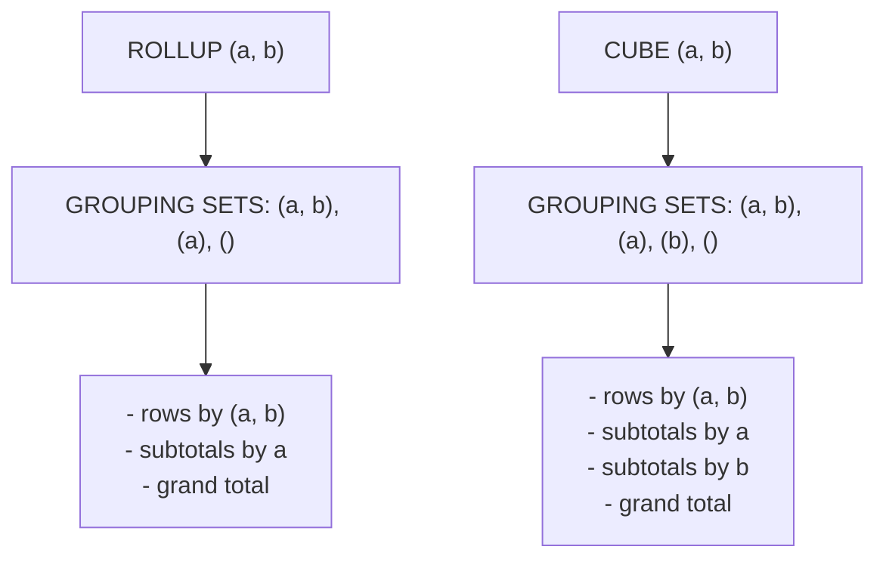
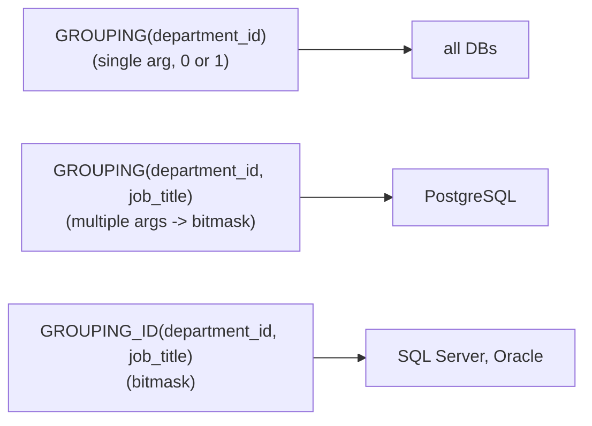

# 43 — ROLLUP, CUBE, GROUPING SETS

> Category: 5-Aggregation — Section: 43-ROLLUP-CUBE-GROUPING-SETS

---

## Fundamentals

### The one-paragraph answer

`ROLLUP`, `CUBE`, and `GROUPING SETS` are three extensions of the `GROUP BY` clause that let a single query produce **several aggregation levels at once**: regular row-level groups, subtotals, and a grSection 43 is clean now (the remaining matches are pre-existing corruption in section 42, not mine to fix). Verifying the full section 43 structure.
pear as `NULL`.

- `GROUP BY ROLLUP (a, b, c)` — the "hierarchical drill-down" tool: groups `(a,b,c)`, then `(a,b)`, then `(a)`, then the grand total `()`. Order of columns matters.
- `GROUP BY CUBE (a, b, c)` — the "all combinations" tool: every possible subset of the listed columns, plus the grand total.
- `GROUP BY GROUPING SETS ((a), (b), ())` — the "explicit shopping list" tool: you name exactly which grouping levels you want.

Why it exists: without these clauses, producing a subtotal report means running several `GROUP BY` queries by hand and stitching them together with `UNION ALL` (or worse, in application code). That approach must re-scan the same table for every level, must keep every `WHERE` filter in sync across copies of the query, and produces a result set with no way to tell a subtotal row from a detail row — a recipe for double-counting.

### The three clauses are one family

`GROUPING SETS` is the *primitive*. `ROLLUP` and `CUBE` are just convenient shorthand that expands into a list of grouping sets:



- `ROLLUP (a, b)` ≡ `GROUPING SETS ((a, b), (a), ())`
- `CUBE (a, b)` ≡ `GROUPING SETS ((a, b), (a), (b), ())`
- `ROLLUP (a)` ≡ `CUBE (a)` ≡ `GROUPING SETS ((a), ())`

> Common misconception: "ROLLUP gives subtotals for every column in the list." It does **not**. `ROLLUP (a, b)` produces a subtotal for `a` and a grand total, but **never** a `b`-level subtotal. Only `CUBE` crosses columns. This is the single most common interview trap in this whole section.

### The empty grouping set `()`

`()` is the grouping set over **no columns** — it collapses the entire filtered input into one grand-total row (pathologically: the empty set produces exactly one row even for zero input rows on engines that treat an aggregating query as producing one group, see *Edge cases*).

### Grain rule

> One row in `orders` represents one order.
> One row in `employees` represents one employee.

For the *output* of a `ROLLUP`/`CUBE`/`GROUPING SETS` query, the grain is:

> One output row = the aggregate of one grouping level (one grouping set and one group-key value within it). Subtotal and total rows technically belong to different grouping sets, so they are **different grains** living in the same result set — always tag them with `GROUPING()` before a report (or downstream ETL) touches them.

---

## Sample tables

```sql
CREATE TABLE orders (
    order_id          INT PRIMARY KEY,
    order_date        DATE,
    region            VARCHAR(20),      -- 'East', 'West', 'Central', 'South'
    product_category  VARCHAR(20),      -- 'Hardware', 'Electronics', 'Software'
    amount            NUMERIC(10,2)
);
```

> One row in `orders` represents one order. No NULL region exists in this table — the NULLs you will see in outputs belong to the *grouping machinery*, which is exactly the point to remember.

```sql
INSERT INTO orders VALUES
(101, '2025-01-10', 'East',    'Hardware',    120.00),
(102, '2025-01-14', 'East',    'Electronics', 240.00),
(103, '2025-01-20', 'West',    'Hardware',     80.00),
(104, '2025-02-05', 'West',    'Electronics', 150.00),
(105, '2025-02-11', 'East',    'Software',    300.00),
(106, '2025-02-22', 'Central', 'Hardware',     60.00),
(107, '2025-03-03', 'Central', 'Software',    200.00),
(108, '2025-03-09', 'South',   'Hardware',     90.00),
(109, '2025-03-15', 'South',   'Electronics', 180.00),
(110, '2025-03-28', 'West',    'Software',    240.00);
```

```sql
CREATE TABLE employees (
    employee_id   INT PRIMARY KEY,
    first_name    VARCHAR(50),
    department_id INT,                    -- NULL allowed: department unknown
    job_title     VARCHAR(50),
    salary        NUMERIC(10,2)
);
```

> One row in `employees` represents one employee. This table deliberately contains a **stored `NULL`** in `department_id` (Grace, Hank) so we can contrast a real `NULL` value with the `NULL` that grouping machinery generates for subtotals.

```sql
INSERT INTO employees VALUES
(1, 'Alice', 10,   'Engineer', 70000),
(2, 'Bob',   10,   'Analyst',  55000),
(3, 'Carol', 20,   'Engineer', 60000),
(4, 'Dave',  20,   'Manager',  72000),
(5, 'Eve',   10,   'Analyst',  48000),
(6, 'Frank', 10,   'Engineer', 62000),
(7, 'Grace', NULL, 'Director', 90000),
(8, 'Hank',  NULL, 'Analyst',  52000);
```

---

## Syntax

ANSI / dialect-neutral forms (PostgreSQL, SQL Server, Oracle, DuckDB):

```sql
-- ROLLUP: drill from most- to least-detailed, then grand total
SELECT region, product_category, SUM(amount)
FROM orders
GROUP BY ROLLUP (region, product_category);

-- CUBE: every subset combination + grand total
SELECT region, product_category, SUM(amount)
FROM orders
GROUP BY CUBE (region, product_category);

-- GROUPING SETS: explicit levels only
SELECT region, product_category, SUM(amount)
FROM orders
GROUP BY GROUPING SETS ((region, product_category), (region), ());
```

```sql
-- combine several GROUPING SETS in one GROUP BY:
-- detail, region subtotals, AND a category-level rollup, all at once
SELECT region, product_category, SUM(amount)
FROM orders
GROUP BY GROUPING SETS
    ( (region, product_category), (region), (product_category), () );
```

MySQL (only `ROLLUP` exists):

```sql
-- classic spelling (works on all MySQL versions with ROLLUP)
SELECT region, product_category, SUM(amount)
FROM orders
GROUP BY region, product_category WITH ROLLUP;

-- function-style spelling supported on current MySQL
SELECT region, product_category, SUM(amount)
FROM orders
GROUP BY ROLLUP (region, product_category);
```

### `GROUPING()` — the disambiguation function

`GROUPING(col)` returns `1` when `col` has been *rolled up* (i.e., the row is a subtotal/total that does not include `col`), and `0` when `col` is a genuine grouping key of the row's grouping set. It is the only reliable way to distinguish a subtotal `NULL` from a stored `NULL`.

```sql
SELECT department_id, job_title,
       COUNT(*) AS headcount,
       GROUPING(department_id) AS is_dept_rolled,
       GROUPING(job_title)     AS is_job_rolled
FROM employees
GROUP BY ROLLUP (department_id, job_title);
```

Multi-argument / `GROUPING_ID()`:



In bitmask form the **rightmost argument is the least-significant bit**:

```sql
-- PostgreSQL: GROUPING with several args returns the bitmask
SELECT department_id, job_title, SUM(salary),
       GROUPING(department_id, job_title) AS g
FROM employees
GROUP BY CUBE (department_id, job_title);

-- SQL Server / Oracle: GROUPING_ID is the bitmask equivalent
SELECT department_id, job_title, SUM(salary),
       GROUPING_ID(department_id, job_title) AS g
FROM employees
GROUP BY CUBE (department_id, job_title);
```

| Calling convention | `GROUPING(department_id, job_title)` | Meaning |
|---|---|---|
| department + job in group | `0 0` → `0` | detail row |
| job rolled up (subtotal over job) | `0 1` → `1` | department subtotal |
| department rolled up (subtotal over department) | `1 0` → `2` | job subtotal (CUBE only) |
| both rolled up | `1 1` → `3` | grand total |

> Note: `ROLLUP(department_id, job_title)` can **never** produce `g = 2` (job subtotals are not in a rollup). The `job` level only appears under `CUBE` or an explicit `(job_title)` grouping set.

---

## Fundamentals of behaviour (learn these, they govern every example)

1. **`WHERE` runs before grouping.** Subtotals and the grand total are computed **only over the rows that survive `WHERE`**. If you filter rows out, every level changes — not just detail.
2. **`HAVING` runs after grouping, over all levels.** Your `HAVING` condition applies to detail rows *and* subtotal rows *and* the grand total. This is what makes `HAVING GROUPING(col) = 1` work as a level filter.
3. **`ORDER BY` is never implied.** No level is guaranteed to precede another. Use `ORDER BY` (ideally on `GROUPING()` + keys) if the presentation order matters.
4. **Aggregates over the subtotal rows are real aggregates.** `SUM()`, `AVG()`, `COUNT()` on a subtotal row are computed over that level's rows — never confuse a subtotal row's value with "an extra row of data".
5. **`GROUPING()` never respects `WHERE`.** You cannot filter out subtotal rows with `WHERE`; you must use `HAVING GROUPING(...) = 1` because subtotals don't exist until after `WHERE`.

---

## Examples

### Example 1 — `ROLLUP` on two grouping columns

**Question:** "Total sales by region and category, plus a subtotal per region, plus the overall total."

```sql
SELECT region, product_category, SUM(amount) AS total
FROM orders
GROUP BY ROLLUP (region, product_category);
```

Result (order shown is conventional; `GROUP BY` does **not** guarantee it):

| region | product_category | total |
|---|---|---|
| East | Hardware | 120.00 |
| East | Electronics | 240.00 |
| East | Software | 300.00 |
| East | NULL | 660.00 |
| West | Hardware | 80.00 |
| West | Electronics | 150.00 |
| West | Software | 240.00 |
| West | NULL | 470.00 |
| Central | Hardware | 60.00 |
| Central | Software | 200.00 |
| Central | NULL | 260.00 |
| South | Hardware | 90.00 |
| South | Electronics | 180.00 |
| South | NULL | 270.00 |
| NULL | NULL | 1660.00 |

Rows `(East, NULL) = 660` etc. are the **region subtotals**; the final row `(NULL, NULL) = 1660.00` is the **grand total**. `ROLLUP(region, category)` expands to groups `(region, category)`, `(region)`, and `()` — note there is **no** `product_category`-only subtotal.

### Example 2 — ordering the presentation portably

Subtotal `NULL`s sort differently across engines (see *NULL behavior*). To put detail first, then subtotals, then the total, order on the `GROUPING()` flags first. Single-argument `GROUPING()` calls are portable to every engine:

```sql
SELECT region, product_category, SUM(amount) AS total
FROM orders
GROUP BY ROLLUP (region, product_category)
ORDER BY GROUPING(region),
         GROUPING(product_category),
         region,
         product_category;
```

(SQL Server has no `NULLS LAST` keyword; the `GROUPING()` prefix already handles subtotal placement, and real `NULL` regions, if any, can be forced last with a `CASE ... WHEN ... THEN 1 ELSE 0 END` helper.)

### Example 3 — tagging every row with its level

**Question:** "Return sales with a readable `level` column so a downstream report can distinguish detail / subtotal / total."

```sql
SELECT
    CASE
        WHEN GROUPING(region) = 1 AND GROUPING(product_category) = 1 THEN 'GRAND TOTAL'
        WHEN GROUPING(region) = 0 AND GROUPING(product_category) = 1 THEN 'REGION SUBTOTAL'
        ELSE 'DETAIL'
    END AS level,
    region, product_category, SUM(amount) AS total
FROM orders
GROUP BY ROLLUP (region, product_category);
```

Every row carries a stable, explicit tag. This is the pattern to use before shipping the result into a dashboard or downstream table.

### Example 4 — `CUBE` on two grouping columns

**Question:** "Sales by region, by category, and all cross combinations."

```sql
SELECT region, product_category, SUM(amount) AS total
FROM orders
GROUP BY CUBE (region, product_category);
```

| region | product_category | total |
|---|---|---|
| East | Hardware | 120.00 |
| East | Electronics | 240.00 |
| East | Software | 300.00 |
| West | Hardware | 80.00 |
| West | Electronics | 150.00 |
| West | Software | 240.00 |
| Central | Hardware | 60.00 |
| Central | Software | 200.00 |
| South | Hardware | 90.00 |
| South | Electronics | 180.00 |
| East | NULL | 660.00 |
| West | NULL | 470.00 |
| Central | NULL | 260.00 |
| South | NULL | 270.00 |
| NULL | Hardware | 350.00 |
| NULL | Electronics | 570.00 |
| NULL | Software | 740.00 |
| NULL | NULL | 1660.00 |

`CUBE` adds the `product_category` subtotals (350 / 570 / 740) that `ROLLUP` never produced. Cost: row explosion — `CUBE (a, b, c)` yields **8 levels**, `CUBE` on *n* columns yields `2^n` levels.

### Example 5 — `GROUPING SETS` with a custom menu

**Question:** "I only need region–category detail, region totals, and the grand total. No category subtotals."

```sql
SELECT region, product_category, SUM(amount) AS total
FROM orders
GROUP BY GROUPING SETS ((region, product_category), (region), ());
```

Exact same 15 rows as Example 1 — `ROLLUP(region, product_category)` and this `GROUPING SETS` list are equivalent. The difference is that `GROUPING SETS` lets you *drop* levels:

```sql
-- Detail + grand total ONLY (no region subtotals):
SELECT region, product_category, SUM(amount)
FROM orders
GROUP BY GROUPING SETS ((region, product_category), ());
```

### Example 6 — mixed level: fixed dimension + rollup

Sometimes one dimension stays fixed while another rolls up:

```sql
SELECT region, product_category, SUM(amount) AS total
FROM orders
GROUP BY region, ROLLUP (product_category);
```

Groups: `(region, category)` (10 rows) and `(region)` (4 rows). **No grand total** — `region` is never rolled up. This is the classic way to do "per region, add a category subtotal, but never collapse regions". In this data set it yields the same 14 rows as Examples 1–2 minus the final grand total.

> PostgreSQL / SQL Server / Oracle also accept nesting such as `GROUP BY ROLLUP (region, CUBE (product_category, <year-month>))`; MySQL does not (only single-level `WITH ROLLUP`).

### Example 7 — filtering by level with `HAVING` + `GROUPING()`

**Question:** "Give me the region subtotals and the grand total, but drop the detail rows."

```sql
SELECT region, product_category, SUM(amount) AS total,
       GROUPING(region) AS g_region, GROUPING(product_category) AS g_cat
FROM orders
GROUP BY ROLLUP (region, product_category)
HAVING GROUPING(product_category) = 1;
```

Only rows where `product_category` was rolled up remain: the 4 region subtotals and the grand total (note that the grand total has *both* flags set). To get **only** region subtotals:

```sql
HAVING GROUPING(region) = 0 AND GROUPING(product_category) = 1;
```

To get **only** the grand total:

```sql
HAVING GROUPING(region) = 1 AND GROUPING(product_category) = 1;
```

Portable "everything except the grand total" — works with single-arg `GROUPING()` on all engines:

```sql
HAVING GROUPING(region) + GROUPING(product_category) < 2;
```

> Interview trap: `WHERE GROUPING(...) = ...` is a syntax error — `GROUPING()` is only usable in `SELECT`, `HAVING`, and (in most engines) `ORDER BY`. The subtotal rows do not exist yet when `WHERE` is evaluated.

### Example 8 — percentages of the grand total (window function over grouped rows)

**Question:** "What share of company revenue does each region-category cell represent?"

```sql
SELECT region, product_category,
       SUM(amount) AS total,
       ROUND(100.0 * SUM(amount) / SUM(SUM(amount)) OVER (), 2) AS pct
FROM orders
GROUP BY ROLLUP (region, product_category);
```

`SUM(SUM(amount)) OVER ()` is `1660.00` for every row, so `East/Hardware` → `7.23%`, `West/NULL` → `28.31%`, and the grand-total row computes `100.00%`. This is far cleaner than a self-join or two separate queries. (See the Window Functions category for `OVER ()`.)

### Example 9 — a stored `NULL` vs a subtotal `NULL`

This is the case that decides whether you understood the section. `employees` contains two employees with `department_id = NULL` (Grace, Director; Hank, Analyst).

```sql
SELECT department_id, job_title,
       COUNT(*) AS headcount,
       SUM(salary) AS payroll,
       GROUPING(department_id) AS g_dept,
       GROUPING(job_title)     AS g_job
FROM employees
GROUP BY GROUPING SETS ((department_id, job_title), (department_id), ());
```

| department_id | job_title | headcount | payroll | g_dept | g_job |
|---|---|---|---|---|---|
| 10 | Engineer | 2 | 132000 | 0 | 0 |
| 10 | Analyst | 2 | 103000 | 0 | 0 |
| 20 | Engineer | 1 | 60000 | 0 | 0 |
| 20 | Manager | 1 | 72000 | 0 | 0 |
| **NULL** | **Director** | **1** | **90000** | **0** | **0** |
| **NULL** | **Analyst** | **1** | **52000** | **0** | **0** |
| 10 | NULL | 4 | 235000 | 0 | 1 |
| 20 | NULL | 2 | 132000 | 0 | 1 |
| **NULL** | **NULL** | **2** | **142000** | **0** | **1** |
| NULL | NULL | 8 | 509000 | 1 | 1 |

Three rows here print as `(NULL, ...)` but mean completely different things:

1. `(NULL, Director)` — a **stored** NULL: Grace really has no department. `g_dept = 0` proves it is a genuine key.
2. `(NULL, NULL) = 142000` — the subtotal for the *department-NULL group* (Grace + Hank). `g_job = 1` marks `job_title` rolled up.
3. `(NULL, NULL) = 509000` — the grand total. `g_job = 1` **and** `g_dept = 1`.

`NULL` value alone cannot tell these apart; **only `GROUPING()` can**. A naive report that renders `NULL` as "missing" will merge Grace's row, the 142000 subtotal, and the 509000 total into one confusing blob.

### Example 10 — the bad habit: hand-rolled `UNION ALL` of `GROUP BY`s

> Production pitfall

```sql
SELECT 'detail' AS level, region, product_category, SUM(amount) AS total
FROM orders
GROUP BY region, product_category
UNION ALL
SELECT 'region', region, NULL, SUM(amount)
FROM orders
GROUP BY region
UNION ALL
SELECT 'total', NULL, NULL, SUM(amount)
FROM orders;
```

This is the "BAD APPROACH":

- the `orders` table is scanned three times (verify with the execution plan — engines may cache a scan, but you must **not assume** it);
- every `WHERE` filter has to be copied into all three branches, and any future level change must be added three times;
- the rows carry a `level` string *you* invent — nothing prevents copy-paste drift;
- `ORDER BY` over `UNION ALL` needs yet another wrapping `SELECT`.

The `ROLLUP` version (Example 1) is a single statement, one place to edit, and the engine is free to visit the data fewer times — but verify with `EXPLAIN` rather than assuming.

> BETTER APPROACH: `GROUP BY ROLLUP (region, product_category)` and tag levels with `GROUPING()` as in Example 3.

### Example 11 — MySQL: `WITH ROLLUP` and its limits

MySQL supports `ROLLUP` only — no `CUBE`, no `GROUPING SETS`.

```sql
-- MySQL
SELECT region, product_category, SUM(amount) AS total
FROM orders
GROUP BY region, product_category WITH ROLLUP;
```

Same 15 rows as Example 1 (region subtotals + grand total). To get a `CUBE`-style cross-tabulation on MySQL, you must hand-roll the union:

```sql
-- MySQL: manually assembled CUBE
SELECT region, product_category, SUM(amount) AS total
FROM orders
GROUP BY region, product_category
UNION ALL
SELECT region, NULL, SUM(amount)
FROM orders
GROUP BY region
UNION ALL
SELECT NULL, product_category, SUM(amount)
FROM orders
GROUP BY product_category
UNION ALL
SELECT NULL, NULL, SUM(amount)
FROM orders;
```

MySQL specifics to remember:

- Subtotal `NULL`s are inserted at a **late** stage; you can test them in the `SELECT` list or `HAVING` (via `GROUPING()`), and since MySQL 8.0.12 also in `ORDER BY`.
- MySQL 8.0.12 lifted the old restriction that blocked `ORDER BY` and `DISTINCT` together with `ROLLUP`.
- A real `NULL` in a grouping column still collides visually with subtotal `NULL`s — `GROUPING()` (added in MySQL 8.0) is the only reliable test.
- The super-aggregate rows are added at the very end; combining `ROLLUP` with window functions is intentionally awkward (window processing happens after ROLLUP post-processing).

---

## NULL behavior

- **Subtotal/total `NULL` is a placeholder, not missing data.** It means "all values of this column". This is the *opposite* of `NULL` in the base table.
- **Stored `NULL`s in grouping columns are real keys** and form their own group (Example 9). They are visually identical to subtotal `NULL`s — always separate them with `GROUPING()`.
- **`COUNT(*)` still counts rows.** On a subtotal row, `COUNT(*)` counts the rows in *that* level. Aggregates (`SUM`, `AVG`, `MIN`, `MAX`, `COUNT(col)`) keep their usual NULL-skipping rules (see section 39); the placeholder `NULL`s do not affect them because a subtotal's input set is just the base rows with the key omitted.
- **`WHERE` never sees subtotal rows** — filters run before grouping.
- **`ORDER BY` placement of subtotal `NULL`s differs by engine:**

| Engine | Default position of NULLs (ASC) | Subtotal rows tend to |
|---|---|---|
| PostgreSQL | last (NULLS LAST for ASC) | bottom |
| Oracle | last (default, NULLS FIRST/LAST overridable) | bottom |
| MySQL | **first** (NULL is lowest) | top |
| SQL Server | **first** (NULL is lowest) | top |

That is why ordering on `GROUPING()` first (Example 2) is recommended for portable presentation.

- **`COALESCE(region, 'ALL')` is dangerous.** It rewrites a stored `NULL` region and a subtotal row into the same label *and* it runs before you can test `GROUPING()`. Correct pattern:

```sql
CASE
    WHEN GROUPING(region) = 1 THEN 'ALL REGIONS'
    WHEN region IS NULL       THEN '(unknown region)'
    ELSE region
END AS region_label
```

---

## Edge cases

1. **Single column:** `ROLLUP (region)` yields `(region)` + `()` → 5 rows in `orders` (4 regions + total). `CUBE (region)` and `ROLLUP (region)` are identical for one column.
2. **Empty grouping list:** `GROUP BY GROUPING SETS (())` returns exactly **one row** — the grand total.
3. **Empty input.** With no rows surviving `WHERE`, an explicit total level (`()` or a query with no `GROUP BY`) still produces a row: `COUNT(*) = 0`, `SUM = NULL` on PostgreSQL and most engines. A plain `GROUP BY` over a set that excludes the total returns zero rows. Verify the exact behaviour on your engine — this catches pipelines off guard.
4. **Overlapping / repeated grouping sets produce duplicate rows** (`UNION ALL` semantics, not `UNION`): `GROUPING SETS ((region), (region))` emits each region subtotal twice. `CUBE` + `ROLLUP` combined can also overlap.
5. **`GROUPING(expression)` must match the GROUP BY expression exactly.** `GROUP BY ROLLUP (EXTRACT(YEAR FROM order_date))` must use `GROUPING(EXTRACT(YEAR FROM order_date))`, not an alias. PostgreSQL additionally supports grouping by an output alias in some positions — do not rely on it.
6. **Column order changes the meaning of `ROLLUP` and `CUBE` output,** not just its order: `ROLLUP (a, b)` ≠ `ROLLUP (b, a)`.
7. **Levels you didn't ask for do not exist:** `ROLLUP(a,b)` has no `b`-subtotal; `GROUPING(a,b) = 2` never appears.
8. **Aggregate arguments are NOT expanded by rollup.** `ROLLUP` only changes the grouping keys; `SUM(amount)`, `AVG(salary)` etc. compute normally at each level.
9. **Combine clauses:** `GROUPING SETS (ROLLUP (a, b), CUBE (c))` is legal in PostgreSQL, SQL Server, and Oracle — mix and match as needed.
10. **`WHERE` reduces every level.** Adding `WHERE region = 'East'` changes detail rows *and* the region total *and* the grand total — tables that "cache" rollups must be wary of pre-aggregation invalidation.

---

## Common mistakes

1. **Assuming `ROLLUP(a,b)` contains a `b` subtotal.** It does not — see the trap above.
2. **Presenting subtotal rows without `GROUPING()`.** Every report/ETL consuming grouped output must tag levels, or a stored `NULL` region will be merged with totals.
3. **Using `COALESCE(col, 'ALL')` in the `SELECT`** to "prettify" subtotal NULLs and then losing the ability to distinguish them; it also makes the output unusable for further `GROUPING()` logic.
4. **Filtering with `WHERE ... IS NULL`** thinking it removes subtotals. It removes *stored* NULLs (or doesn't run at all for the placeholder rows). Use `HAVING GROUPING(...)`.
5. **Counting subtotal rows as if they were data rows.** Example 9: the 142000 subtotal looks like two extra employees.
6. **Writing `UNION ALL` chains** for multi-level reports instead of a single `ROLLUP`/`CUBE`/`GROUPING SETS` (Example 10).
7. **Ordering without `ORDER BY`.** No level ordering is guaranteed; MySQL 8.0 removed even the implicit grouping sort.
8. **MySQL users writing `CUBE` or `GROUPING SETS`** — those are syntax errors on MySQL; roll up manually with `UNION ALL` or switch engines.
9. **`HAVING` with plain column conditions** (e.g. `HAVING region = 'East'`) — legally allowed, but it filters whole groups *including subtotal/total rows* of the matching combination, which usually is not what you intended.
10. **Forgetting the grand total** exists and can be double-joined into aggregates.

---

## Production pitfalls

> Production pitfall — row explosion: `CUBE` on *n* columns generates `2^n` grouping levels. With 12 columns that is 4096 levels, and every level contributes output rows proportional to its distinct-key count. Estimate output cardinality *before* running: upper bound ≈ product over columns of `(1 + distinct values of col)`.

> Production pitfall — pipeline double counting: if a `ROLLUP` result is loaded into a fact table *without* the `level` tag, downstream `SUM()` will add detail + subtotal + total at once. Always persist a `level` column computed from `GROUPING()`.

> Production pitfall — MySQL super-aggregate rows are appended at the very end of processing; a paginated or `LIMIT`-ed read can silently drop every subtotal + the grand total.

> Production pitfall — dashboard tools that re-aggregate: feeding a client tool a pre-grouped multi-level result causes it to re-aggregate subtotal numbers ("double-count of totals").

> Production pitfall — cache invalidation: materialized rollups must be rebuilt whenever the base table changes in any row affecting more than one level; prefer incremental aggregation with explicit level keys.

---

## Performance implications

Honest framing: as with most optimizations, **verify, don't assume.** Performance depends on the optimizer, indexes, statistics, cardinality, data distribution, and query shape. Use `EXPLAIN` / `EXPLAIN ANALYZE` (or the engine's plan equivalent) and compare numbers on *your* data.

What is reasonable to state:

- **One statement vs many:** `GROUPING SETS`/`ROLLUP`/`CUBE` express several aggregation levels in a single plan. Engines differ in *how* they execute them — PostgreSQL (9.5+) emits a `GroupAggregate`/`HashAggregate` node annotated with `Grouping Sets:` and can read the input once; SQL Server's docs describe the semantics as producing the union of the individual group results (which an optimizer may fold into fewer passes or not). Therefore:
  - The naive `UNION ALL` of `GROUP BY`s may scan the table once per branch **or** be optimized into fewer passes — check the plan before claiming either is always faster ("EXISTS vs IN" style absolute claims apply here too).
  - A single `GROUPING SETS` statement is *at worst* as maintainable, and typically useful for the optimizer to schedule shared scans and shared orders.
- **Indexing rarely saves you an aggregate.** Aggregating generally reads all matching rows; an ordered index can sometimes enable quick ordered aggregation (PostgreSQL index scans feeding `GroupAggregate`, MySQL increase of loose-index-scan for grouped access) — but only if the order and prefix of the grouping keys align with the index *and* you verify it in the plan.
- **Sort vs hash:** some engines choose a sort-based aggregate for `ROLLUP`/`CUBE` levels; sorting cost grows with cardinality. Others hash. Watch for `work_mem`/hash-spill in the plan for wide `CUBE` runs.
- **Output cardinality can dominate cost.** `CUBE` of high-cardinality columns can emit far more rows than the input; the optimizer can't always anticipate the consumer, so bound the requested levels.
- **`GROUPING()` calls are cheap flag computations** — they are evaluated per output row, not per input row, so they add negligible cost.

What to check in the plan:

1. Number and type of aggregate nodes (how many passes?).
2. Whether a sort is introduced purely for grouping-set execution.
3. Any `Spill`/`Temporary`/`Hash` memory steps (hash aggregation spilling to disk).
4. Estimated vs actual output row count for `CUBE`/wide rollups.
5. For MySQL, `EXPLAIN` plus `EXPLAIN FORMAT=TREE` to see window/rollup post-processing.

---

## Comparison

| | `GROUP BY ROLLUP (a, b)` | `GROUP BY CUBE (a, b)` | `GROUP BY GROUPING SETS ((a,b),(a),())` | N × `GROUP BY` + `UNION ALL` |
|---|---|---|---|---|
| Levels produced | `(a,b)`, `(a)`, `()` | `(a,b)`, `(a)`, `(b)`, `()` | exactly what you list | exactly what you write |
| `(b)` subtotal | no | yes | only if listed | only if written |
| Column-order sensitive | yes | no (power set) | no (you list sets) | n/a |
| Number of grouping levels (n cols) | n + 1 | 2ⁿ | number of listed sets | number of `SELECT`s |
| Distinguish levels | `GROUPING()` | `GROUPING()` | `GROUPING()` | your own `level` column |
| Maintainability | high | high | high | low (filters duplicated per branch) |
| Engine support (see table below) | all 4 | not MySQL | not MySQL | all 4 |

### Level-set expansion reference

| Expression | Equivalent grouping sets |
|---|---|
| `ROLLUP (a, b)` | `(a, b)`, `(a)`, `()` |
| `ROLLUP (a)` | `(a)`, `()` |
| `CUBE (a, b)` | `(a, b)`, `(a)`, `(b)`, `()` |
| `CUBE (a)` | `(a)`, `()` |
| `GROUPING SETS ((a), (b))` | exactly `(a)`, `(b)` |
| `GROUPING SETS (ROLLUP (a, b), CUBE (b))` | `(a,b)`, `(a)`, `()`, `(b)`, `()` |

### Engine support matrix

| Feature | PostgreSQL | MySQL | SQL Server | Oracle |
|---|---|---|---|---|
| `ROLLUP` | ✓ (9.5+) | ✓ (`WITH ROLLUP` / `ROLLUP(...)`) | ✓ (`GROUP BY ROLLUP(...)` and legacy `WITH ROLLUP`) | ✓ |
| `CUBE` | ✓ (9.5+) | ✗ | ✓ (`GROUP BY CUBE(...)` and legacy `WITH CUBE`) | ✓ |
| `GROUPING SETS` | ✓ (9.5+) | ✗ | ✓ | ✓ |
| empty set `()` | ✓ | ✓ (implicit in rollup) | ✓ | ✓ |
| `GROUPING(col)` | ✓ (single and multi-arg) | ✓ (single arg, 8.0+) | ✓ (single arg) | ✓ (single arg) |
| `GROUPING_ID(...)` bitmask | — use `GROUPING(a, b)` | ✗ | ✓ | ✓ |
| combined/nested clauses | ✓ | ✗ | ✓ | ✓ (incl. `GROUP_ID()` dedup) |
| Grand-total row by default | only if `()` in sets | ✓ (`WITH ROLLUP` appends it) | only if `()` in sets / rollup | only if `()` in sets / rollup |

---

## Best practices

1. **State the output grain first.** For every level, decide "what does one row mean?" (detail / region subtotal / category subtotal / total) and encode it with `GROUPING()` before the result leaves SQL.
2. **Prefer `ROLLUP` for natural hierarchies** (year → quarter → month, country → region → store) and `CUBE` only when you genuinely need every cross-combination — remember 2ⁿ explosion.
3. **Prefer `GROUPING SETS` whenever the level list is irregular** — it documents intent and avoids generating levels nobody reads.
4. **Always add a `level`/`is_total` flag column** when the result feeds a dashboard, warehouse, or CSV.
5. **Filter levels with `HAVING GROUPING(...)`, never with `WHERE col IS NULL`.**
6. **Order by `GROUPING()` flags first** if presentation order matters (mind the MySQL/SQL Server NULL-first default).
7. **Use window functions for shares/rankings over the grouped output** instead of re-scanning with joins.
8. **Estimate CUBE output rows** before running on production-size tables.
9. **For MySQL, "hierarchical rollup + manual UNION for cube" is the honest ceiling** — don't fight the database.
10. **Verify with `EXPLAIN ANALYZE` when it matters** — number of scans, sort/hash strategy, spill, actual rows.

---

## Cross-references

- `GROUP BY` (grain, groups and NULL buckets) — section 36
- `HAVING` (post-group filtering, aggregate/alias rules) — section 37
- `COUNT`/`SUM`/`AVG`/`MIN`/`MAX` (NULL-skipping, integer division) — section 38
- `COUNT(*)` vs `COUNT(col)` vs `COUNT(DISTINCT ...)` — section 39
- Conditional aggregation (CASE inside aggregates + FILTER) — section 42
- Window functions (`OVER ()`, `PARTITION BY` for shares) — section 06
- NULL logic, three-valued logic, `IS [NOT] DISTINCT FROM` — section 02
- `UNION` vs `UNION ALL` (duplicate semantics for hand-rolled rollups) — section 04 (Subqueries) and section 45 (Set Operators)
- `EXPLAIN` / execution plans, cardinality estimation — section 78

---

# Interview Questions

*Practice on the sample `orders` and `employees` tables above. Reason them out — answers are deliberately withheld.*

## Beginner

1. What does `GROUP BY ROLLUP (region, product_category)` produce that a plain `GROUP BY` does not?
2. Which level(s) does `ROLLUP (product_category, region)` produce for the sample `orders`? Does the result differ from `ROLLUP (region, product_category)`?
3. What does the empty set `()` in `GROUPING SETS` mean, and how many rows does it return?
4. On which rows does the function `GROUPING(product_category)` return 1 in a `ROLLUP (region, product_category)` query?
5. What is the difference between `ROLLUP (a, b)` and `CUBE (a, b)` in terms of the grouping sets each generates?

## Intermediate

6. Rewrite this as a single `GROUPING SETS` query that returns *only* region subtotals and the grand total: two `SELECT ... GROUP BY` queries unioned together.
7. Using `employees`, write a query that flags each row of `GROUP BY ROLLUP (department_id, job_title)` as `detail`, `department subtotal`, or `grand total` using only `GROUPING()`.
8. Explain why `GROUPING(department_id, job_title)` can never return 2 in a `ROLLUP` query but can in a `CUBE` query. Which row (if any) has value 2 in a `CUBE` on `employees`?
9. A stored `NULL` in `department_id` and a subtotal `NULL` look identical. Give one query from `employees` where the output contains a row that is *visually* `(NULL, NULL)` and explain which one is a subtotal and which is the total — and how `GROUPING()` tells them apart.
10. On MySQL, how would you obtain `CUBE`-style output? What two restrictions were lifted in MySQL 8.0.12 with respect to `ROLLUP`?

## Advanced

11. Write a query returning, per region and category, the amount plus the percentage of the *grand total* for each cell, using a window function over a `ROLLUP` result.
12. Construct a `GROUPING SETS` clause that deliberately creates duplicate rows (overlapping sets), and explain why the result follows `UNION ALL` semantics. How would Oracle's `GROUP_ID()` help deduplicate?
13. Explain the bitmask convention: in `GROUPING_ID(department_id, job_title)`, which argument is the least-significant bit, and derive the 4 possible values for a `CUBE`.
14. You have `orders` with an extra column `channel`. Ask for detail, region subtotal, channel subtotal, and grand total in a single statement — write the query. Which of these levels would a `CUBE` give that a `ROLLUP` cannot?
15. Discuss `WHERE` vs `HAVING` with `ROLLUP`: which clause can reduce the grand total, and which can filter out subtotal rows? Write a query that keeps only `East` data *and* drops the grand-total row.

## Scenario Based

16. Report: "sales by region, then by category subtotal within region, then company total." Write the query and list the exact rows you expect from the sample `orders`.
17. You must email a single CSV containing detail, region subtotals, and total to a data analyst who will re-sum the `total` column. What column(s) must you add first to prevent double-counting? Write the query with the safety column.
18. HR wants headcount and payroll by `department_id` with a grand total, but Grace and Hank (department NULL) must appear under "(unknown)". Write the query, showing how `GROUPING()` and `CASE` handle this correctly and what the naive `COALESCE` would break.

## Tricky

19. `SELECT region, product_category, SUM(amount) ... GROUP BY GROUPING SETS ((region), (product_category));` — how many rows does it produce, and which columns are NULL on a region subtotal row? Could a row ever have *both* columns not NULL?
20. In `ROLLUP (region, product_category)`, the row `(East, NULL, 660)` — is `product_category` "really" NULL for that row? What would `GROUPING(product_category)` return and why does it matter if `East` also had an order with a stored NULL category?
21. `HAVING GROUPING(region) = 1` — which rows survive for a `ROLLUP` query, and why can't this be done with `WHERE`?
22. You roll up over `EXTRACT(YEAR FROM order_date)`. Why does `GROUPING(EXTRACT(YEAR FROM order_date))` work while `GROUPING(y)` on an alias does not? What must you pass instead?

## Output Prediction

23. Predict every row of this query on the sample `orders`, including NULL cells:

```sql
SELECT region, product_category, SUM(amount) AS total,
       GROUPING(region) AS gr,
       GROUPING(product_category) AS gc
FROM orders
GROUP BY ROLLUP (region, product_category);
```

24. Predict the output of:

```sql
SELECT department_id, job_title, SUM(salary) AS payroll,
       GROUPING(department_id, job_title) AS g
FROM employees
GROUP BY CUBE (department_id, job_title);
```

— list each row, its `payroll`, and its `g` (remember: stored NULLs form genuine groups).

25. Predict row count and content for this partially level-restricted query on `orders`:

```sql
SELECT region, product_category, SUM(amount) AS total
FROM orders
GROUP BY GROUPING SETS ((region, product_category), ());
```

26. Predict the values and NULL cells of:

```sql
SELECT region,
       GROUPING(region) AS gr,
       COUNT(*)  AS n_orders,
       SUM(amount) AS total
FROM orders
GROUP BY GROUPING SETS ((region), ());
```

## Debugging

27. A teammate produced a sales report with `ROLLUP (region, product_category)` but the dashboard keeps showing "5790.00" for total sales although the true total is 1660. Describe the most likely cause and the exact fix.
28. The same query on `employees` shows two rows that both print as `(NULL, NULL)` but with payroll 142000 and 509000. A reviewer deletes "duplicate" rows. What will break, and how would you add a column to make the rows unambiguous?
29. A MySQL query using `GROUP BY CUBE (region, product_category)` fails with a syntax error. Explain why and give a correct (if clunkier) version that returns the same rows.
30. A report orders by `product_category` on SQL Server and the grand total appears *first*; hours later the identical query on PostgreSQL shows it *last*. Is the query wrong? Show the ordering that is portable and why.

## Performance

31. Compare "one `ROLLUP` query" vs "three `GROUP BY` + `UNION ALL`" for the sample tables on your engine. Describe exactly what you would inspect in the execution plan before claiming either is faster.
32. A `CUBE` over 12 columns on a 10M-row table is slow. List the plan/output-cardinality checks you would run *before* rewriting, and the cheaper alternative (narrower column set / `GROUPING SETS` subset / pre-aggregated base).
33. Explain the role of sort vs hash in the engine plan for a wide `ROLLUP` on a high-cardinality grouping column, and where memory spill would show up in the plan on PostgreSQL.
34. Would an index on `(region, product_category, amount)` help *this* aggregation? Under what conditions could it (ordered-group scans / index-only access), and how would you confirm with `EXPLAIN` instead of assuming?