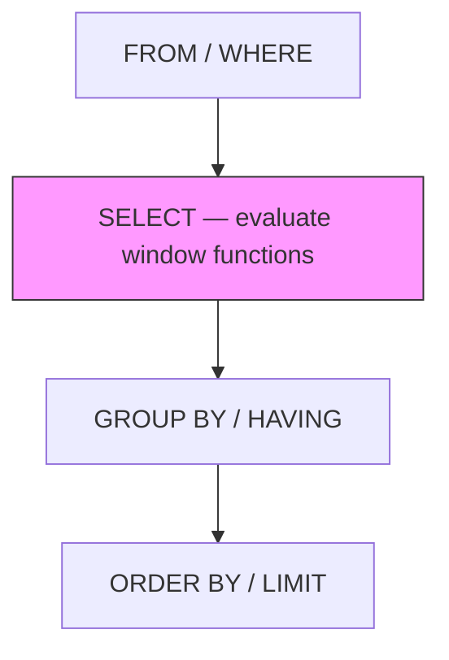
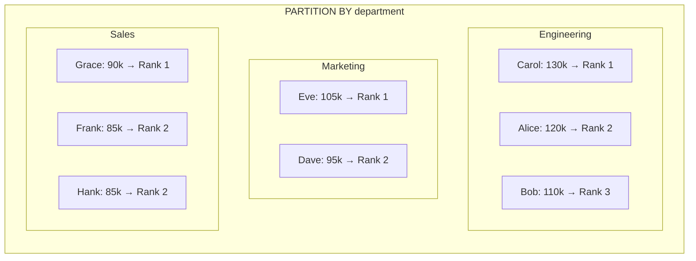

# 44 — Window Functions Basics

---

## What Is a Window Function?

A **window function** performs a calculation across a set of rows that are **related to the current row** — but unlike aggregate functions with `GROUP BY`, it **does not collapse rows**. Each input row produces exactly one output row.

Think of it as: *"Run a calculation, but keep every row visible."*

---

## Why Window Functions Exist

Before window functions, developers had to choose between:

| Goal | Old approach | Problem |
|---|---|---|
| Aggregate + keep detail | Self-join back to the aggregate | Complex, error-prone, slow |
| Running totals | Correlated subqueries | Painfully slow on large data |
| Ranking | Variables + session state | Non-portable, unreadable |
| Compare row to neighbors | Self-joins on row numbers | Fragile, needs physical ordering |

Window functions solve all of these **in a single, declarative step**.

---

## Sample Tables

All examples below use two tables:

### `employees`

| emp_id | name | department | salary | hire_date |
|--------|---------|------------|--------|------------|
| 1 | Alice | Engineering | 120000 | 2019-03-15 |
| 2 | Bob | Engineering | 110000 | 2020-01-10 |
| 3 | Carol | Engineering | 130000 | 2018-07-22 |
| 4 | Dave | Marketing | 95000 | 2021-06-01 |
| 5 | Eve | Marketing | 105000 | 2020-09-14 |
| 6 | Frank | Sales | 85000 | 2022-02-28 |
| 7 | Grace | Sales | 90000 | 2021-11-30 |
| 8 | Hank | Sales | 85000 | 2023-01-05 |

**Grain:** One row = one employee.

### `orders`

| order_id | customer | amount | order_date |
|----------|----------|--------|------------|
| 101 | Alice | 250 | 2024-01-05 |
| 102 | Bob | 150 | 2024-01-06 |
| 103 | Alice | 300 | 2024-01-10 |
| 104 | Carol | 100 | 2024-01-12 |
| 105 | Bob | 200 | 2024-01-15 |
| 106 | Alice | 400 | 2024-02-01 |

**Grain:** One row = one order.

---

## Syntax

```sql
function_name ( arguments )
    OVER (
        [ PARTITION BY partition_expression ]
        [ ORDER BY sort_expression [ ASC | DESC ] [ NULLS FIRST | NULLS LAST ] ]
        [ frame_clause ]
    )
```

### The Three Parts of `OVER`

| Part | Required? | Purpose |
|------|-----------|---------|
| `PARTITION BY` | No | Divides rows into groups (like a per-group window) |
| `ORDER BY` | Depends on function | Defines the logical order of rows inside each partition |
| `frame_clause` | No | Defines which rows in the partition are included in the calculation |

---

## How It Works Internally (Simplified)



**Key insight:** Window functions are evaluated **after** `FROM`, `WHERE`, and any joins — but **before** `GROUP BY`, `HAVING`, and `ORDER BY`. This means:

- You **can** use window functions in the `SELECT` list alongside non-aggregated columns.
- You **cannot** use window functions in `WHERE` or `GROUP BY` directly (because they haven't been computed yet).

```sql
-- This does NOT work:
SELECT *
FROM employees
WHERE ROW_NUMBER() OVER (ORDER BY salary DESC) = 1;

-- Use a subquery or CTE instead:
SELECT *
FROM (
    SELECT *, ROW_NUMBER() OVER (ORDER BY salary DESC) AS rn
    FROM employees
) sub
WHERE rn = 1;
```

---

## Core Window Functions

### 1. `ROW_NUMBER()`

Assigns a **unique sequential integer** to each row within a partition. Ties are broken arbitrarily.

```sql
SELECT
    name,
    department,
    salary,
    ROW_NUMBER() OVER (ORDER BY salary DESC) AS row_num
FROM employees;
```

| name | department | salary | row_num |
|------|------------|--------|---------|
| Carol | Engineering | 130000 | 1 |
| Alice | Engineering | 120000 | 2 |
| Bob | Engineering | 110000 | 3 |
| Eve | Marketing | 105000 | 4 |
| Dave | Marketing | 95000 | 5 |
| Grace | Sales | 90000 | 6 |
| Frank | Sales | 85000 | 7 |
| Hank | Sales | 85000 | 8 |

Notice Frank and Hank both earn 85000, but they get **different** row numbers (7 and 8). `ROW_NUMBER` never produces ties.

---

### 2. `RANK()`

Like `ROW_NUMBER()`, but **ties get the same rank**, and the next rank is **skipped**.

```sql
SELECT
    name,
    department,
    salary,
    RANK() OVER (ORDER BY salary DESC) AS rank_val
FROM employees;
```

| name | department | salary | rank_val |
|------|------------|--------|----------|
| Carol | Engineering | 130000 | 1 |
| Alice | Engineering | 120000 | 2 |
| Bob | Engineering | 110000 | 3 |
| Eve | Marketing | 105000 | 4 |
| Dave | Marketing | 95000 | 5 |
| Grace | Sales | 90000 | 6 |
| Frank | Sales | 85000 | 7 |
| Hank | Sales | 85000 | 7 |

Frank and Hank share rank **7**. Notice there is **no rank 8** — it was skipped.

---

### 3. `DENSE_RANK()`

Like `RANK()`, but **no gaps** in the ranking sequence.

```sql
SELECT
    name,
    department,
    salary,
    DENSE_RANK() OVER (ORDER BY salary DESC) AS dense_rank_val
FROM employees;
```

| name | department | salary | dense_rank_val |
|------|------------|--------|----------------|
| Carol | Engineering | 130000 | 1 |
| Alice | Engineering | 120000 | 2 |
| Bob | Engineering | 110000 | 3 |
| Eve | Marketing | 105000 | 4 |
| Dave | Marketing | 95000 | 5 |
| Grace | Sales | 90000 | 6 |
| Frank | Sales | 85000 | 7 |
| Hank | Sales | 85000 | 7 |

Same as `RANK` in this case. The difference shows when there are ties at the **top**. If two employees shared salary 130000:

| Function | Row 1 rank | Row 2 rank | Row 3 rank |
|----------|-----------|-----------|-----------|
| `ROW_NUMBER` | 1 | 2 | 3 |
| `RANK` | 1 | 1 | 3 |
| `DENSE_RANK` | 1 | 1 | 2 |

> **Interview trap:** `RANK()` vs `DENSE_RANK()` vs `ROW_NUMBER()` is one of the most frequently tested SQL topics. Know the gap behavior cold.

---

### 4. `NTILE(n)`

Distributes rows into `n` roughly equal buckets.

```sql
SELECT
    name,
    salary,
    NTILE(3) OVER (ORDER BY salary DESC) AS tercile
FROM employees;
```

| name | salary | tercile |
|------|--------|---------|
| Carol | 130000 | 1 |
| Alice | 120000 | 1 |
| Bob | 110000 | 2 |
| Eve | 105000 | 2 |
| Dave | 95000 | 2 |
| Grace | 90000 | 3 |
| Frank | 85000 | 3 |
| Hank | 85000 | 3 |

8 rows divided into 3 buckets → 3, 3, 2. The first buckets get the extra rows when the division isn't even.

---

### 5. Aggregate Functions as Window Functions

Every standard aggregate (`SUM`, `AVG`, `COUNT`, `MIN`, `MAX`) can be used as a window function by adding `OVER`.

```sql
SELECT
    name,
    department,
    salary,
    SUM(salary) OVER () AS total_salary,
    AVG(salary) OVER () AS avg_salary,
    COUNT(*) OVER () AS total_employees,
    salary - AVG(salary) OVER () AS diff_from_avg
FROM employees;
```

| name | department | salary | total_salary | avg_salary | total_employees | diff_from_avg |
|------|------------|--------|--------------|------------|-----------------|---------------|
| Alice | Engineering | 120000 | 820000 | 102500 | 8 | 17500 |
| Bob | Engineering | 110000 | 820000 | 102500 | 8 | 7500 |
| Carol | Engineering | 130000 | 820000 | 102500 | 8 | 27500 |
| Dave | Marketing | 95000 | 820000 | 102500 | 8 | -7500 |
| Eve | Marketing | 105000 | 820000 | 102500 | 8 | 2500 |
| Frank | Sales | 85000 | 820000 | 102500 | 8 | -17500 |
| Grace | Sales | 90000 | 820000 | 102500 | 8 | -12500 |
| Hank | Sales | 85000 | 820000 | 102500 | 8 | -17500 |

No `GROUP BY` — every row is preserved, and the aggregate is broadcast across all rows.

---

### 6. `LAG` and `LEAD`

Access values from a **previous** or **next** row without a self-join.

```sql
SELECT
    name,
    department,
    salary,
    LAG(salary, 1)  OVER (ORDER BY hire_date) AS prev_salary,
    LEAD(salary, 1) OVER (ORDER BY hire_date) AS next_salary
FROM employees;
```

| name | department | salary | prev_salary | next_salary |
|------|------------|--------|-------------|-------------|
| Carol | Engineering | 130000 | NULL | 120000 |
| Alice | Engineering | 120000 | 130000 | 110000 |
| Bob | Engineering | 110000 | 120000 | 105000 |
| Eve | Marketing | 105000 | 110000 | 95000 |
| Dave | Marketing | 95000 | 105000 | 90000 |
| Grace | Sales | 90000 | 95000 | 85000 |
| Frank | Sales | 85000 | 90000 | 85000 |
| Hank | Sales | 85000 | 85000 | NULL |

- The **first row** has no previous → `prev_salary` is `NULL`.
- The **last row** has no next → `next_salary` is `NULL`.

The second argument (`1`) is the offset. You can use `LAG(salary, 2)` to look back 2 rows.

The optional third argument replaces `NULL`:

```sql
LAG(salary, 1, 0) OVER (ORDER BY hire_date)  -- returns 0 instead of NULL
```

---

### 7. `FIRST_VALUE`, `LAST_VALUE`, `NTH_VALUE`

```sql
SELECT
    name,
    department,
    salary,
    FIRST_VALUE(salary) OVER (PARTITION BY department ORDER BY salary DESC) AS highest_in_dept,
    LAST_VALUE(salary)  OVER (
        PARTITION BY department
        ORDER BY salary DESC
        ROWS BETWEEN UNBOUNDED PRECEDING AND UNBOUNDED FOLLOWING  -- critical!
    ) AS lowest_in_dept
FROM employees;
```

| name | department | salary | highest_in_dept | lowest_in_dept |
|------|------------|--------|-----------------|----------------|
| Carol | Engineering | 130000 | 130000 | 110000 |
| Alice | Engineering | 120000 | 130000 | 110000 |
| Bob | Engineering | 110000 | 130000 | 110000 |
| Eve | Marketing | 105000 | 105000 | 95000 |
| Dave | Marketing | 95000 | 105000 | 95000 |
| Grace | Sales | 90000 | 90000 | 85000 |
| Frank | Sales | 85000 | 90000 | 85000 |
| Hank | Sales | 85000 | 90000 | 85000 |

> **Common misconception:** `LAST_VALUE` without a frame clause does **not** return the last value in the partition. By default, the frame is `RANGE BETWEEN UNBOUNDED PRECEDING AND CURRENT ROW`, so it only looks at rows **up to and including** the current row. You must explicitly set the frame to `UNBOUNDED FOLLOWING` to get the true last value. See Frame Clauses below.

---

## `PARTITION BY` — Per-Group Windows

`PARTITION BY` divides the data into groups, and the window function **resets** at each group boundary.

```sql
SELECT
    name,
    department,
    salary,
    RANK() OVER (PARTITION BY department ORDER BY salary DESC) AS dept_rank
FROM employees;
```

| name | department | salary | dept_rank |
|------|------------|--------|-----------|
| Carol | Engineering | 130000 | 1 |
| Alice | Engineering | 120000 | 2 |
| Bob | Engineering | 110000 | 3 |
| Eve | Marketing | 105000 | 1 |
| Dave | Marketing | 95000 | 2 |
| Grace | Sales | 90000 | 1 |
| Frank | Sales | 85000 | 2 |
| Hank | Sales | 85000 | 2 |

Compare this to the earlier `RANK()` without `PARTITION BY` — the ranking now restarts at 1 for each department.



---

## `ORDER BY` Inside `OVER`

This is **different** from the final `ORDER BY`. Inside `OVER`, `ORDER BY` does two things:

1. **Defines the logical row order** the window function sees.
2. **Determines the frame** (if no explicit frame clause is given).

```sql
-- This ordering affects the RANK computation, not the output order of the final query
RANK() OVER (ORDER BY salary DESC)  -- highest salary gets rank 1
```

> **Important:** The final output order of a query is **only** guaranteed by the outer `ORDER BY`. The `ORDER BY` inside `OVER` affects the window calculation, not necessarily the result set order.

---

## Frame Clauses — The Hidden Trap

When `ORDER BY` is present in `OVER` and no frame clause is specified, the **default frame** is:

```sql
RANGE BETWEEN UNBOUNDED PRECEDING AND CURRENT ROW
```

This is **not** the same as:

```sql
ROWS BETWEEN UNBOUNDED PRECEDING AND CURRENT ROW
```

### `RANGE` vs `ROWS`

| Frame type | Meaning |
|------------|---------|
| `ROWS` | Physical rows — exactly N rows before/after current |
| `RANGE` | Logical values — all rows with the same `ORDER BY` value as current are grouped together |

```sql
--假设有这些数据 (salary order):
-- salary: 100, 200, 200, 300

-- RANGE frame (default):
-- For the first 200: frame = [100, 200, 200]  (both 200s included)
-- For the second 200: frame = [100, 200, 200]  (same frame!)

-- ROWS frame:
-- For the first 200: frame = [100, 200]  (only physical row 2)
-- For the second 200: frame = [100, 200, 200]  (physical rows 2, 3)
```

> **Production pitfall:** This distinction matters when `ORDER BY` values have duplicates. `RANGE` includes all peer rows; `ROWS` does not. This can produce surprising results for running totals, moving averages, and `LAST_VALUE`.

### Common Frame Specifications

```sql
-- All rows in the partition
ROWS BETWEEN UNBOUNDED PRECEDING AND UNBOUNDED FOLLOWING

-- From first row to current row
ROWS BETWEEN UNBOUNDED PRECEDING AND CURRENT ROW

-- Current row and all following
ROWS BETWEEN CURRENT ROW AND UNBOUNDED FOLLOWING

-- Sliding window of 2 rows before and 2 rows after
ROWS BETWEEN 2 PRECEDING AND 2 FOLLOWING

-- All rows up to and including current row (explicit)
ROWS BETWEEN UNBOUNDED PRECEDING AND CURRENT ROW
```

### Running Total Example

```sql
SELECT
    order_id,
    customer,
    amount,
    order_date,
    SUM(amount) OVER (
        PARTITION BY customer
        ORDER BY order_date
        ROWS BETWEEN UNBOUNDED PRECEDING AND CURRENT ROW
    ) AS running_total
FROM orders;
```

| order_id | customer | amount | order_date | running_total |
|----------|----------|--------|------------|---------------|
| 101 | Alice | 250 | 2024-01-05 | 250 |
| 103 | Alice | 300 | 2024-01-10 | 550 |
| 106 | Alice | 400 | 2024-02-01 | 950 |
| 102 | Bob | 150 | 2024-01-06 | 150 |
| 105 | Bob | 200 | 2024-01-15 | 350 |
| 104 | Carol | 100 | 2024-01-12 | 100 |

---

## Moving Average Example

```sql
SELECT
    order_id,
    customer,
    amount,
    order_date,
    AVG(amount) OVER (
        PARTITION BY customer
        ORDER BY order_date
        ROWS BETWEEN 1 PRECEDING AND 1 FOLLOWING
    ) AS moving_avg_3
FROM orders;
```

| order_id | customer | amount | order_date | moving_avg_3 |
|----------|----------|--------|------------|--------------|
| 101 | Alice | 250 | 2024-01-05 | 275.00 |
| 103 | Alice | 300 | 2024-01-10 | 316.67 |
| 106 | Alice | 400 | 2024-02-01 | 350.00 |
| 102 | Bob | 150 | 2024-01-06 | 175.00 |
| 105 | Bob | 200 | 2024-01-15 | 175.00 |
| 104 | Carol | 100 | 2024-01-12 | 100.00 |

Alice row 1: only 101 and 103 exist before/after → avg(250, 300) = 275.00
Alice row 3: only 103 and 106 exist → avg(300, 400) = 350.00
Carol: only one row → avg(100) = 100.00

---

## Percentile Functions

### `PERCENT_RANK()` and `CUME_DIST()`

```sql
SELECT
    name,
    department,
    salary,
    ROUND(PERCENT_RANK() OVER (ORDER BY salary)::numeric, 3) AS pct_rank,
    ROUND(CUME_DIST()    OVER (ORDER BY salary)::numeric, 3) AS cum_dist
FROM employees;
```

| name | department | salary | pct_rank | cum_dist |
|------|------------|--------|----------|----------|
| Carol | Engineering | 130000 | 0.000 | 0.125 |
| Alice | Engineering | 120000 | 0.143 | 0.250 |
| Bob | Engineering | 110000 | 0.286 | 0.375 |
| Eve | Marketing | 105000 | 0.429 | 0.500 |
| Dave | Marketing | 95000 | 0.571 | 0.625 |
| Grace | Sales | 90000 | 0.714 | 0.750 |
| Frank | Sales | 85000 | 0.857 | 1.000 |
| Hank | Sales | 85000 | 0.857 | 1.000 |

**Formulae:**
- `PERCENT_RANK` = (rank - 1) / (total_rows - 1)
- `CUME_DIST` = cumulative distribution (fraction of rows ≤ current row)

---

## NULL Behavior

### NULLs in `ORDER BY`

The behavior of `NULL` in `ORDER BY` inside `OVER` depends on the database:

> **PostgreSQL:** `NULLS LAST` by default for `ASC`, `NULLS FIRST` by default for `DESC`.

> **MySQL:** `NULL` values sort **first** in `ASC`, **last** in `DESC` (opposite of Postgres defaults).

> **SQL Server:** `NULL` sorts **lowest** (before all non-null values) by default. Use `NULLS LAST` explicitly for clarity.

> **Oracle:** `NULL` sorts **highest** by default (after all non-null values).

```sql
-- Explicitly control NULL placement (ANSI standard):
RANK() OVER (ORDER BY salary DESC NULLS LAST)
```

### NULLs in Aggregates Inside `OVER`

Window aggregate functions **ignore NULLs** (same as regular aggregates), except `COUNT(*)`:

```sql
SELECT
    name,
    department,
    salary,
    COUNT(*)    OVER () AS count_all,
    COUNT(salary) OVER () AS count_salary,
    AVG(salary)  OVER () AS avg_salary
FROM employees;
```

### NULLs in `LAG` / `LEAD`

```sql
-- If the previous row's value is NULL, LAG returns NULL (or the default you specify)
LAG(salary, 1, 0) OVER (ORDER BY hire_date)  -- NULL replaced with 0
```

---

## Common Mistakes

### Mistake 1: Using Window Functions in `WHERE`

```sql
-- DOES NOT WORK
SELECT *
FROM employees
WHERE RANK() OVER (ORDER BY salary DESC) = 1;
```

**Fix:** Use a subquery or CTE:

```sql
SELECT *
FROM (
    SELECT *, RANK() OVER (ORDER BY salary DESC) AS rnk
    FROM employees
) sub
WHERE rnk = 1;
```

### Mistake 2: Expecting `LAST_VALUE` to Return the Last Row

```sql
-- BROKEN: frame defaults to UNBOUNDED PRECEDING AND CURRENT ROW
LAST_VALUE(salary) OVER (PARTITION BY department ORDER BY salary DESC)
-- For the last row in a partition, this returns... the last row's own salary.
-- It does NOT return the true last value of the partition.

-- FIX: Specify the full frame
LAST_VALUE(salary) OVER (
    PARTITION BY department
    ORDER BY salary DESC
    ROWS BETWEEN UNBOUNDED PRECEDING AND UNBOUNDED FOLLOWING
)
```

### Mistake 3: Confusing `RANK` with `ROW_NUMBER`

```sql
-- If you need exactly ONE row per group (e.g., latest order per customer),
-- use ROW_NUMBER, not RANK or DENSE_RANK.

-- BAD: May return multiple rows per customer if ties exist
SELECT *
FROM (
    SELECT *, RANK() OVER (PARTITION BY customer ORDER BY order_date DESC) AS rnk
    FROM orders
) sub
WHERE rnk = 1;

-- GOOD: Guarantees exactly one row per customer
SELECT *
FROM (
    SELECT *, ROW_NUMBER() OVER (PARTITION BY customer ORDER BY order_date DESC) AS rn
    FROM orders
) sub
WHERE rn = 1;
```

> **Interview trap:** The question "get the top 1 per group" almost always requires `ROW_NUMBER`, not `RANK`. If there can be ties and you want all of them, use `RANK`. If you want exactly one, use `ROW_NUMBER`.

### Mistake 4: `DISTINCT` with Window Functions

```sql
-- BAD: DISTINCT applies AFTER window functions, so no help with duplicates
SELECT DISTINCT
    department,
    RANK() OVER (ORDER BY salary DESC) AS rnk
FROM employees;
-- Returns all 8 rows, not 3 departments

-- Window functions are evaluated per-row; DISTINCT eliminates duplicate
-- *output* rows, but each row has a unique combination of columns.
```

### Mistake 5: Forgetting `PARTITION BY`

```sql
-- BAD: Ranks across ALL departments instead of within each
RANK() OVER (ORDER BY salary DESC) AS dept_rank

-- GOOD: Ranks within each department
RANK() OVER (PARTITION BY department ORDER BY salary DESC) AS dept_rank
```

---

## Window Functions vs. Alternatives

| Task | Window Function | Alternative | Notes |
|------|----------------|-------------|-------|
| Rank per group | `RANK() OVER (PARTITION BY ... ORDER BY ...)` | Self-join with subquery | Window function is cleaner and usually faster |
| Running total | `SUM() OVER (ORDER BY ... ROWS ...)` | Correlated subquery | Correlated subquery is O(n²) |
| Top N per group | `ROW_NUMBER() OVER (PARTITION BY ... ORDER BY ...)` | `LATERAL JOIN` / `CROSS APPLY` | `LATERAL` can be faster on some engines |
| Deduplicate | `ROW_NUMBER() ... = 1` | `SELECT DISTINCT ON ...` (PostgreSQL) | `DISTINCT ON` is Postgres-specific |
| Lead/Lag | `LAG(col) OVER (...)` | Self-join on row number | Self-join is more complex and slower |

---

## BAD APPROACH vs. BETTER APPROACH

### Running Total with Self-Join (BAD)

```sql
-- BAD: O(n²) correlated subquery approach
SELECT
    o1.order_id,
    o1.customer,
    o1.amount,
    (SELECT SUM(o2.amount)
     FROM orders o2
     WHERE o2.customer = o1.customer
       AND o2.order_date <= o1.order_date
    ) AS running_total
FROM orders o1
ORDER BY o1.customer, o1.order_date;
```

### Running Total with Window Function (BETTER)

```sql
-- BETTER: O(n) window function approach
SELECT
    order_id,
    customer,
    amount,
    SUM(amount) OVER (
        PARTITION BY customer
        ORDER BY order_date
        ROWS BETWEEN UNBOUNDED PRECEDING AND CURRENT ROW
    ) AS running_total
FROM orders
ORDER BY customer, order_date;
```

**Why better:** The window function approach scans the data once. The correlated subquery executes the inner query for **every row**. On a table with 1 million rows, this can mean 1 million subquery executions.

> **Performance pitfall:** Always verify with `EXPLAIN ANALYZE`. While window functions are *generally* more efficient than correlated subqueries, the optimizer may sometimes rewrite a correlated subquery into something efficient. Let the execution plan decide.

---

## Execution Plans and Performance

### How to Check

```sql
-- PostgreSQL
EXPLAIN ANALYZE
SELECT name, department, salary,
       RANK() OVER (PARTITION BY department ORDER BY salary DESC) AS rnk
FROM employees;

-- MySQL
EXPLAIN ANALYZE
SELECT name, department, salary,
       RANK() OVER (PARTITION BY department ORDER BY salary DESC) AS rnk
FROM employees;

-- SQL Server
SET STATISTICS IO ON;
SET STATISTICS TIME ON;
-- Then examine the execution plan

-- Oracle
EXPLAIN PLAN FOR
SELECT name, department, salary,
       RANK() OVER (PARTITION BY department ORDER BY salary DESC) AS rnk
FROM employees;
SELECT * FROM TABLE(DBMS_XPLAN.DISPLAY);
```

### What to Look For

| Sign | Possible issue |
|------|---------------|
| Sort operations in the plan | Window function requires sorting by `ORDER BY` columns |
| Large `work_mem` usage (Postgres) | Window function sorting spills to disk |
| Missing index on `PARTITION BY` / `ORDER BY` columns | Database must sort in memory |
| Nested loops for window functions | Rare, but possible on small datasets |

### Performance Factors

- **Sorting is the main cost.** If `ORDER BY` columns are indexed and the index matches the window's `ORDER BY`, the database may avoid a separate sort.
- **Partitioning** doesn't reduce sorting cost — it just divides it.
- **Frame size** matters: `ROWS BETWEEN UNBOUNDED PRECEDING AND CURRENT ROW` is cheaper than `ROWS BETWEEN UNBOUNDED PRECEDING AND UNBOUNDED FOLLOWING` because the latter requires access to all rows.
- **Cardinality of partitions:** Many small partitions (e.g., per-user) can be slower than few large ones due to per-partition overhead.

> **Production pitfall:** Window functions on billions of rows with complex frames can consume significant memory. Always test with production-scale data and monitor memory usage.

---

## Database-Specific Differences

| Feature | PostgreSQL | MySQL | SQL Server | Oracle |
|---------|-----------|-------|------------|--------|
| Window functions | Full support (8.4+) | Full support (8.0+) | Full support (2005+) | Full support (8i+) |
| `FILTER` clause | ✅ `COUNT(*) FILTER (WHERE ...)` | ❌ Use `CASE` | ❌ Use `CASE` | ❌ Use `CASE` |
| `GROUPS` frame | ✅ | ❌ | ❌ | ❌ |
| `RANGE` default | `UNBOUNDED PRECEDING TO CURRENT ROW` | Same | Same | Same |
| Named windows | ✅ `WINDOW w AS (...)` | ✅ (8.0+) | ✅ (2022+) | ❌ |
| `NULLS FIRST/LAST` | ✅ | ✅ (8.0+) | ✅ (2022+) | ✅ |
| `IGNORE NULLS` / `RESPECT NULLS` | ❌ | ❌ | ✅ | ✅ |

> **PostgreSQL** supports the `FILTER` clause, which is cleaner than `CASE` inside aggregates:
> ```sql
> COUNT(*) FILTER (WHERE salary > 100000) OVER (PARTITION BY department)
> ```
> Other databases require:
> ```sql>
> COUNT(CASE WHEN salary > 100000 THEN 1 END) OVER (PARTITION BY department)
> ```

> **PostgreSQL** supports **named windows** for readability:
> ```sql
> SELECT name, department, salary,
>        RANK() OVER w AS rnk,
>        SUM(salary) OVER w AS running_sum
> FROM employees
> WINDOW w AS (PARTITION BY department ORDER BY salary DESC);
> ```

---

## Named Windows (PostgreSQL / MySQL 8.0+)

When the same `OVER` clause is repeated, use a named window:

```sql
SELECT
    name,
    department,
    salary,
    RANK()       OVER w AS dept_rank,
    SUM(salary)  OVER w AS running_salary,
    AVG(salary)  OVER w AS running_avg
FROM employees
WINDOW w AS (PARTITION BY department ORDER BY salary DESC);
```

This avoids repetition and reduces errors.

---

## `FILTER` Clause (PostgreSQL)

```sql
-- Count only employees with salary > 100000, per department
SELECT
    name,
    department,
    COUNT(*) FILTER (WHERE salary > 100000) OVER (PARTITION BY department) AS high_earners
FROM employees;
```

Equivalent in other databases:

```sql
COUNT(CASE WHEN salary > 100000 THEN 1 END) OVER (PARTITION BY department)
```

---

## Edge Cases

### 1. Empty Partition

If a partition has no rows, the window function produces no output for that partition.

### 2. Single-Row Partition

Every window function that references neighbors (`LAG`, `LEAD`, `FIRST_VALUE`, `LAST_VALUE`) will produce `NULL` for missing neighbors (unless a default is provided).

### 3. All Identical `ORDER BY` Values

With `RANGE` frame (the default), all rows in the partition with the same `ORDER BY` value will be in the same frame. With `ROWS`, they're treated as separate physical rows.

### 4. Window Functions and `DISTINCT`

```sql
-- This does NOT deduplicate before the window function
SELECT DISTINCT
    department,
    RANK() OVER (ORDER BY salary DESC)
FROM employees;
-- Still returns 8 rows

-- To reduce to one row per department, aggregate instead:
SELECT department, MAX(salary)
FROM employees
GROUP BY department;
```

### 5. `NULL` Values in `ORDER BY`

```sql
-- NULLs may rank first or last depending on the database
-- Always be explicit:
RANK() OVER (ORDER BY salary ASC NULLS LAST)
```

### 6. Window Functions Cannot Be Nested

```sql
-- INVALID
SELECT RANK() OVER (ORDER BY SUM(amount) OVER (...)) FROM ...;

-- Use a subquery or CTE:
SELECT RANK() OVER (ORDER BY total_amount)
FROM (
    SELECT customer, SUM(amount) AS total_amount
    FROM orders
    GROUP BY customer
) sub;
```

---

## Comparison Table: Ranking Functions

| Function | Unique values? | Gaps in sequence? | Use case |
|----------|---------------|-------------------|----------|
| `ROW_NUMBER()` | Yes (always unique) | No | Deduplication, pagination, top-1-per-group |
| `RANK()` | No (ties share rank) | Yes (skips ranks) | Competitive ranking, leaderboard with ties |
| `DENSE_RANK()` | No (ties share rank) | No (no gaps) | Ranking without gaps, grade assignment |
| `NTILE(n)` | No | No | Bucketing, distribution analysis |

---

## Best Practices

1. **Always specify the frame clause explicitly** when using `ORDER BY` in `OVER`. Don't rely on the `RANGE` default.

2. **Use `ROW_NUMBER()` for guaranteed uniqueness** when you need exactly one row per partition.

3. **Use named windows** when the same `OVER` clause appears multiple times.

4. **Test with `EXPLAIN ANALYZE`** before deploying window functions on large tables.

5. **Be explicit about `NULLS FIRST`/`NULLS LAST`** for cross-database portability.

6. **Use subqueries or CTEs** when you need to filter on window function results.

7. **Consider indexes** on `PARTITION BY` and `ORDER BY` columns to avoid in-memory sorting.

8. **Remember that `RANGE` and `ROWS` differ** — especially with duplicate `ORDER BY` values.

9. **Don't use window functions where a simple `GROUP BY` suffices.** If you're only returning aggregated values, `GROUP BY` is simpler and often faster.

10. **Watch for fan-out:** If you `JOIN` a table that has window functions and then join again, you can accidentally multiply rows. See Section on JOINs.

---

## When NOT to Use Window Functions

- When a simple `GROUP BY` produces the output you need
- When filtering to "top N per group" and `DISTINCT ON` (PostgreSQL) is available and sufficient
- When the dataset is small enough that a self-join is readable and performance is irrelevant
- When the database doesn't support them (very old MySQL < 8.0, SQLite < 3.25)

---

## When to Use Window Functions

- You need both **detail rows** and **aggregate/ranking** in the same query
- You need **running totals**, **moving averages**, or **cumulative aggregates**
- You need **ranking** within groups
- You need to **compare** a row to its neighbors (`LAG`, `LEAD`)
- You need to **deduplicate** and keep one row per group
- You need **percentiles** or **distribution metrics**

---

# Interview Questions

## Beginner

1. What is the difference between `COUNT(*)` as a window function and `COUNT(*)` with `GROUP BY`?

2. What does `PARTITION BY` do inside an `OVER` clause?

3. Write a query to assign a row number to each employee ordered by salary descending.

4. Why can't you use `WHERE ROW_NUMBER() = 1` directly?

5. What is the default frame clause when `ORDER BY` is present in `OVER`?

## Intermediate

6. What is the difference between `RANK()`, `DENSE_RANK()`, and `ROW_NUMBER()`? Give a data example where all three differ.

7. Write a query to find the highest-paid employee per department using window functions.

8. Write a query to calculate each employee's salary as a percentage of the total salary.

9. What is the difference between `RANGE` and `ROWS` frame types? When do they produce different results?

10. Write a query to find employees who earn more than the average salary in their department.

## Advanced

11. Why does `LAST_VALUE()` without an explicit frame clause not always return the last value in a partition? Show the fix.

12. Write a query to find the **second highest** salary per department.

13. Write a query that calculates a 3-order moving average of `amount` per customer.

14. How would you find the **gap** between each employee's hire date and the previous employee's hire date (ordered by hire date)?

15. Explain why `LAG` returns `NULL` for the first row and how to replace it with a default.

## Scenario Based

16. You have an `orders` table with `order_id`, `customer_id`, `amount`, and `order_date`. Write a query to find the **cumulative revenue** per customer over time.

17. You have a `logins` table with `user_id`, `login_time`. Write a query to find each user's **previous login time** and the **days since last login**.

18. You need to assign employees to 4 roughly equal salary buckets. Which window function would you use? Write the query.

19. You have a `transactions` table. Write a query to flag the **first transaction** per account.

20. Your query uses `RANK() OVER (PARTITION BY department ORDER BY salary DESC)` and you get **multiple rows** per department at rank 1. Is this expected? What should you use instead if you need exactly one row?

## Tricky

21. What happens when two employees have the **same hire date** and you use `LAG(hire_date) OVER (ORDER BY hire_date, emp_id)` vs `LAG(hire_date) OVER (ORDER BY hire_date)`?

22. Can a window function reference another window function in the same `SELECT`? Why or why not?

23. What is the output when `NTILE(3)` is applied to 7 rows? Which buckets get the extra rows?

24. If you use `SUM(amount) OVER ()` (no `PARTITION BY`, no `ORDER BY`), what is the frame? Does every row see the total?

25. What happens if your `ORDER BY` in `OVER` has `NULL` values and you don't specify `NULLS FIRST` or `NULLS LAST`?

## Output Prediction

Given this data:

```
employees:
emp_id | name  | dept    | salary
1      | A     | X       | 100
2      | B     | X       | 200
3      | C     | X       | 200
4      | D     | Y       | 150
```

26. What is the output of `RANK() OVER (PARTITION BY dept ORDER BY salary)` for each row?

27. What is the output of `DENSE_RANK()` for the same query?

28. What is the output of `ROW_NUMBER()` for the same query?

29. What is the output of `LAG(salary) OVER (PARTITION BY dept ORDER BY salary)` for each row?

30. What is the output of `NTILE(2) OVER (PARTITION BY dept ORDER BY salary)` for each row?

## Debugging

31. This query returns 8 rows instead of 3 (one per department). What is wrong?

```sql
SELECT DISTINCT department,
       RANK() OVER (ORDER BY salary DESC)
FROM employees;
```

32. This running total query gives incorrect results when two orders have the **same date**. Why?

```sql
SELECT order_id, amount,
       SUM(amount) OVER (ORDER BY order_date) AS running_total
FROM orders;
```

33. This query to find the top employee per department sometimes returns **multiple rows**. Why? How do you fix it?

```sql
SELECT * FROM (
    SELECT *, RANK() OVER (PARTITION BY department ORDER BY salary DESC) AS rnk
    FROM employees
) sub WHERE rnk = 1;
```

34. A developer writes `FIRST_VALUE(salary) OVER (PARTITION BY department ORDER BY salary)` expecting to get the **highest** salary per department, but gets the **lowest**. What is wrong?

35. This query runs slowly on 100M rows. What could help?

```sql
SELECT *,
       SUM(amount) OVER (PARTITION BY customer_id ORDER BY created_at
                         ROWS BETWEEN UNBOUNDED PRECEDING AND CURRENT ROW)
FROM transactions;
```

## Performance

36. Under what conditions might a `LAG/LEAD` self-join be **faster** than the window function equivalent?

37. What index would help a `SUM() OVER (PARTITION BY customer_id ORDER BY order_date)` query?

38. What is the memory implication of using `ROWS BETWEEN UNBOUNDED PRECEDING AND UNBOUNDED FOLLOWING` vs `ROWS BETWEEN 2 PRECEDING AND 2 FOLLOWING`?

39. How does the number of partitions affect window function performance?

40. When should you prefer a materialized view or pre-aggregated table over window functions?
