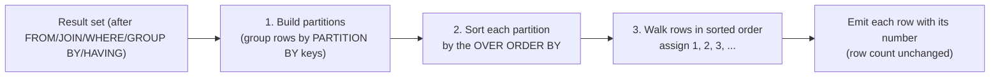

# 46. ROW_NUMBER

---

## Table of Contents

1. [What It Is](#what-it-is)
2. [Why It Exists](#why-it-exists)
3. [Syntax](#syntax)
4. [How It Works Internally](#how-it-works-internally)
5. [Sample TablWrote `sql-handbook/6-Window-Functions/46-ROW-NUMBER.md` (comprehensive, ~line 900+). It covers:

- **Fundamentals** — what `ROW_NUMBER()` is, why it exists, the three defining properties (unique, consecutive, ordered), and internal pipeline (partition → sort → enumerate) with a mermaid diagram
- **Syntax** — `OVER`, PARTITION BY, no-frame restriction (with per-engine behavior), named windows
- **Sample tables** — `orders`, `employees`, `user_logins` with stated grain, including deliberately tied rows
- **5 scenarios** — latest row per group, de-duplication (with `DELETE` patterns for SQL Server/PostgreSQL/MySQL/Oracle), top-N per group, continuous numbering, and pagination vs keyset
- **Comparisons** — ROW_NUMBER vs RANK vs DENSE_RANK table, determinism, NULL handling with per-dialect sort-position table
- **Edge cases, mistakes, production pitfalls, performance** (EXPLAIN/plan nodes, index shape, no absolute claims), interview traps, best practices
- **Interview Questions** — Beginner / Intermediate / Advanced / Scenario Based / Tricky / Output Prediction / Debugging / Performance (40 questions, answers withheld)
- **Cross-references** to 44, 45, 47, 53, 54, 84, 78, 73

Also fixed a data inconsistency I introduced in the de-duplication excerpt so `login_id`s match the sample table.
mber to each row.

The three defining properties:

| Property | Meaning |
|---|---|
| Unique | No two rows in the same partition get the same number |
| Consecutive | Numbers are `1, 2, 3, ...` with **no gaps** |
| Ordered | Row 1 is the "first" row under the `ORDER BY`; the last row gets the highest number |

---

## Why It Exists

Many business questions require "pick this row per group":

- "What is each customer's most recent order?"
- "Get the highest-paid employee in each department."
- "Delete duplicate rows keeping one."
- "Page through results 10 at a time."

Before window functions these required painful workarounds:

| Task | Pre-window-function approach | Problems |
|---|---|---|
| Latest row per group | Correlated subquery on `MAX(date)` and a join back | Wrong results when the key column ties; complex |
| Deduplicate | Self-join with `>`, or a temp table with an identity column | Dialect hacks, error-prone |
| Top-N per group | Correlated subquery counting "how many rows beat this one" | O(n²), unreadable |

`ROW_NUMBER()` replaces all of these with one declarative construct.

---

## Syntax

```sql
SELECT
    ...,
    ROW_NUMBER() OVER (
        PARTITION BY col1, col2, ...
        ORDER BY col3 [ASC | DESC], col4 [ASC | DESC], ...
    ) AS row_num
FROM ...
```

### Anatomy

| Element | Required? | Purpose |
|---|---|---|
| `ROW_NUMBER()` | Yes | The function itself — always takes no arguments |
| `OVER (...)` | Yes | Marks it as a window function |
| `PARTITION BY` | No | Restarts numbering at `1` for each group. Omit → the whole result set is one partition |
| `ORDER BY` | Yes | Defines **which row gets number 1**. Omit → numbers are assigned in arbitrary order (see [Edge Cases](#edge-cases)) |

### No frame clause

Ranking functions (`ROW_NUMBER`, `RANK`, `DENSE_RANK`, `NTILE`) **do not accept a frame clause**. This is invalid:

```sql
-- INVALID in PostgreSQL/MySQL/Oracle/SQL Server:
ROW_NUMBER() OVER (ORDER BY amount ROWS BETWEEN 1 PRECEDING AND 1 FOLLOWING)
```

> **PostgreSQL / MySQL:** raise an error if you add a frame to a ranking function.
>
> **Oracle / SQL Server:** ignore the frame because a ranking function's value does not depend on a frame. Don't rely on it — just don't write a frame.

### Named window (PostgreSQL, MySQL 8.0+, SQL Server 2022+)

```sql
SELECT
    order_id,
    customer_id,
    ROW_NUMBER() OVER win AS rn
FROM orders
WINDOW win AS (PARTITION BY customer_id ORDER BY order_date DESC);
```

---

## How It Works Internally

`ROW_NUMBER()` is nominally three steps inside the window aggregate node:



The important consequence of this pipeline: **`ROW_NUMBER()` implies a sort** unless the optimizer can reuse the physical order from an index that already matches `PARTITION BY` + `ORDER BY`.

> If the `ORDER BY` inside `OVER` has duplicate values (e.g., two orders on the same date for the same customer), the sort ties them, and the database must pick *some* order — usually the physical order it happened to read the rows in. That makes the numeric assignment **non-deterministic** unless you add a unique tiebreaker column.

### Logical query-processing position

Window functions are evaluated at the `SELECT` stage:

```
FROM / JOIN
-> WHERE
-> GROUP BY
-> HAVING
-> SELECT          <-- ROW_NUMBER() is computed here
-> DISTINCT
-> ORDER BY
-> LIMIT / OFFSET
```

Consequences:

- `WHERE rn = 1` fails — the number does not exist yet when `WHERE` runs.
- `ROW_NUMBER()` after `GROUP BY` numbers the **grouped** rows (see [Edge Cases](#edge-cases)).
- `LIMIT` applies *after* numbering, so you cannot use `LIMIT` to restrict per partition.

---

## Sample Tables

### orders

Grain: **one row = one order.**

| order_id | customer_id | order_date | amount |
|---|---|---|---|
| 101 | 1 | 2024-01-15 | 250.00 |
| 102 | 1 | 2024-02-20 | 180.00 |
| 103 | 2 | 2024-01-18 | 320.00 |
| 104 | 1 | 2024-03-10 | 400.00 |
| 105 | 3 | 2024-02-25 | 150.00 |
| 106 | 2 | 2024-03-05 | 275.00 |
| 107 | 1 | 2024-03-10 | 90.00 |

Note: orders 104 and 107 fall on the **same date** for the **same customer** — deliberately included to demonstrate tie handling.

### employees

Grain: **one row = one employee.**

| employee_id | name | department | salary | hire_date |
|---|---|---|---|---|
| 1 | Alice | Engineering | 90000 | 2019-03-15 |
| 2 | Bob | Engineering | 85000 | 2020-06-01 |
| 3 | Charlie | Engineering | 95000 | 2018-01-20 |
| 4 | Diana | Marketing | 70000 | 2021-02-10 |
| 5 | Eve | Marketing | 75000 | 2020-08-22 |
| 6 | Frank | Marketing | 72000 | 2019-11-05 |
| 7 | Grace | Sales | 65000 | 2022-01-12 |
| 8 | Hank | Sales | 65000 | 2021-07-19 |
| 9 | Ivy | Sales | 71000 | 2020-03-30 |

### user_logins

Grain: **one row = one login event.**
`session_id` is the entity used for de-duplication below.

| login_id | user_id | session_id | login_time |
|---|---|---|---|
| 1 | 100 | S-AAA-001 | 2024-06-01 08:00:00 |
| 2 | 100 | S-AAA-001 | 2024-06-01 08:05:00 |
| 3 | 100 | S-AAA-001 | 2024-06-01 08:12:00 |
| 4 | 100 | S-BBB-002 | 2024-06-02 09:00:00 |
| 5 | 101 | S-AAA-001 | 2024-06-01 10:00:00 |
| 6 | 100 | S-BBB-002 | 2024-06-02 09:07:00 |

---

## Basic Examples

### Example 1: Number every order, newest first

```sql
SELECT
    order_id,
    customer_id,
    order_date,
    amount,
    ROW_NUMBER() OVER (ORDER BY order_date DESC, order_id DESC) AS rn
FROM orders;
```

**Expected output:**

| order_id | customer_id | order_date | amount | rn |
|---|---|---|---|---|
| 107 | 1 | 2024-03-10 | 90.00 | 1 |
| 104 | 1 | 2024-03-10 | 400.00 | 2 |
| 106 | 2 | 2024-03-05 | 275.00 | 3 |
| 105 | 3 | 2024-02-25 | 150.00 | 4 |
| 102 | 1 | 2024-02-20 | 180.00 | 5 |
| 103 | 2 | 2024-01-18 | 320.00 | 6 |
| 101 | 1 | 2024-01-15 | 250.00 | 7 |

Without the `order_id DESC` tiebreaker, rows 104 and 107 could swap numbers between runs — both are in the same partition (the whole table) and share `order_date`.

### Example 2: Number orders per customer

```sql
SELECT
    order_id,
    customer_id,
    order_date,
    ROW_NUMBER() OVER (
        PARTITION BY customer_id
        ORDER BY order_date DESC, order_id DESC
    ) AS order_num_per_customer
FROM orders;
```

**Expected output:**

| order_id | customer_id | order_date | order_num_per_customer |
|---|---|---|---|
| 107 | 1 | 2024-03-10 | 1 |
| 104 | 1 | 2024-03-10 | 2 |
| 102 | 1 | 2024-02-20 | 3 |
| 101 | 1 | 2024-01-15 | 4 |
| 106 | 2 | 2024-03-05 | 1 |
| 103 | 2 | 2024-01-18 | 2 |
| 105 | 3 | 2024-02-25 | 1 |

Numbering restarts at `1` for each customer. Note the ordering of 104 and 107 — determined by the `order_id DESC` tiebreaker, not by chance.

---

## Scenario 1: Latest Row Per Group

**Question:** For each customer, return *their most recent order* (the full order row).

### The classic pattern: number, then filter in an outer query

```sql
SELECT order_id, customer_id, order_date, amount
FROM (
    SELECT
        order_id,
        customer_id,
        order_date,
        amount,
        ROW_NUMBER() OVER (
            PARTITION BY customer_id
            ORDER BY order_date DESC, order_id DESC
        ) AS rn
    FROM orders
) ranked
WHERE rn = 1;
```

**Expected output:**

| order_id | customer_id | order_date | amount |
|---|---|---|---|
| 107 | 1 | 2024-03-10 | 90.00 |
| 106 | 2 | 2024-03-05 | 275.00 |
| 105 | 3 | 2024-02-25 | 150.00 |

### BAD APPROACH: correlated subquery on MAX date

Tempting — but wrong whenever the tie columns are not unique.

```sql
-- BAD: if two orders share (customer_id, order_date), you get
--      "more rows than expected" back.
SELECT o.*
FROM orders o
JOIN (
    SELECT customer_id, MAX(order_date) AS max_date
    FROM orders
    GROUP BY customer_id
) m ON m.customer_id = o.customer_id
   AND m.max_date = o.order_date;
```

Customer 1 has two orders on 2024-03-10 (104 and 107) → this returns **two** rows for customer 1. The `ROW_NUMBER` version with the `order_id DESC` tiebreaker returns exactly one.

| Approach | Customer 1 result | Deterministic? |
|---|---|---|
| `JOIN` on `MAX(order_date)` | 2 rows (104, 107) | No choice — both match |
| `ROW_NUMBER() = 1` with tiebreaker | exactly 1 row (107) | Yes |
| `RANK() = 1` | 2 rows (104, 107) | Intended — all ties kept |

> **Interview trap:** "Most recent order per customer" defaults to `ROW_NUMBER`, not `RANK`. If the product says "show the latest order per customer," they almost always want exactly one row per customer.

---

## Scenario 2: De-duplication

### Find duplicates first

**Question:** In `user_logins`, detect duplicate login events recorded for the same `session_id` with the same `user_id`.

```sql
SELECT
    *,
    ROW_NUMBER() OVER (
        PARTITION BY user_id, session_id
        ORDER BY login_time, login_id
    ) AS occurrence_no
FROM user_logins;
```

**Expected output (excerpt):**

| login_id | user_id | session_id | login_time | occurrence_no |
|---|---|---|---|---|
| 1 | 100 | S-AAA-001 | 2024-06-01 08:00:00 | 1 |
| 2 | 100 | S-AAA-001 | 2024-06-01 08:05:00 | 2 |
| 3 | 100 | S-AAA-001 | 2024-06-01 08:12:00 | 3 |
| 4 | 100 | S-BBB-002 | 2024-06-02 09:00:00 | 1 |
| 6 | 100 | S-BBB-002 | 2024-06-02 09:07:00 | 2 |

`occurrence_no > 1` marks the duplicates.

### Keep one row per group

```sql
SELECT login_id, user_id, session_id, login_time
FROM (
    SELECT
        login_id,
        user_id,
        session_id,
        login_time,
        ROW_NUMBER() OVER (
            PARTITION BY user_id, session_id
            ORDER BY login_id
        ) AS rn
    FROM user_logins
) deduped
WHERE rn = 1;
```

**Expected output:**

| login_id | user_id | session_id | login_time |
|---|---|---|---|
| 1 | 100 | S-AAA-001 | 2024-06-01 08:00:00 |
| 4 | 100 | S-BBB-002 | 2024-06-02 09:00:00 |
| 5 | 101 | S-AAA-001 | 2024-06-01 10:00:00 |

### Deleting the duplicates

The same pattern drives a de-duplication `DELETE`. Dialect support differs:

> **SQL Server** (CTE-based delete):

```sql
WITH cte AS (
    SELECT *,
           ROW_NUMBER() OVER (PARTITION BY user_id, session_id ORDER BY login_id) AS rn
    FROM user_logins
)
DELETE FROM cte WHERE rn > 1;
```

> **PostgreSQL** (self-referencing DELETE — no `ORDER BY`/`LIMIT` in DELETE, but a CTE works):

```sql
WITH cte AS (
    SELECT login_id,
           ROW_NUMBER() OVER (PARTITION BY user_id, session_id ORDER BY login_id) AS rn
    FROM user_logins
)
DELETE FROM user_logins
WHERE login_id IN (SELECT login_id FROM cte WHERE rn > 1);
```

> **MySQL 8.0+** — you cannot delete from a CTE directly; join to a temp table or use `ROW_NUMBER` in a DELETE with a derived table:

```sql
DELETE ul
FROM user_logins ul
JOIN (
    SELECT login_id,
           ROW_NUMBER() OVER (PARTITION BY user_id, session_id ORDER BY login_id) AS rn
    FROM user_logins
) t ON t.login_id = ul.login_id
WHERE t.rn > 1;
```

> **Oracle** — same CTE pattern as SQL Server, but often done via `ROWID`:

```sql
DELETE FROM user_logins
WHERE ROWID IN (
    SELECT rid FROM (
        SELECT ROWID AS rid,
               ROW_NUMBER() OVER (PARTITION BY user_id, session_id ORDER BY login_id) AS rn
        FROM user_logins
    )
    WHERE rn > 1
);
```

> **Production pitfall:** Run the de-duplication as `SELECT COUNT(*)` over the candidate `rn > 1` rows **first**, and wrap the delete in a transaction. A typo in `PARTITION BY` (e.g., missing `session_id`) can delete legitimate distinct rows.

To count duplicates without touching data:

```sql
WITH cte AS (
    SELECT *,
           ROW_NUMBER() OVER (PARTITION BY user_id, session_id ORDER BY login_id) AS rn
    FROM user_logins
)
SELECT COUNT(*) AS duplicates
FROM cte
WHERE rn > 1;
```

---

## Scenario 3: Top-N Per Group

**Question:** Which are the top 2 highest-paid employees **per department**?

```sql
SELECT employee_id, name, department, salary
FROM (
    SELECT
        employee_id,
        name,
        department,
        salary,
        ROW_NUMBER() OVER (
            PARTITION BY department
            ORDER BY salary DESC, employee_id
        ) AS rn
    FROM employees
) ranked
WHERE rn <= 2;
```

**Expected output:**

| employee_id | name | department | salary |
|---|---|---|---|
| 3 | Charlie | Engineering | 95000 |
| 1 | Alice | Engineering | 90000 |
| 5 | Eve | Marketing | 75000 |
| 6 | Frank | Marketing | 72000 |
| 9 | Ivy | Sales | 71000 |
| 7 | Grace | Sales | 65000 |

Note Grace versus Hank (both 65000 in Sales): the tiebreaker `employee_id` decides Grace (7) over Hank (8).

### BAD APPROACH: fetch extra rows, filter in application code

```sql
-- BAD: pulls the whole table into the app and only then reduces it,
--      or worse, uses LIMIT globally which destroys per-department logic
SELECT employee_id, name, department, salary
FROM employees
ORDER BY department, salary DESC
LIMIT 6;  -- accidentally caps the total instead of per department
```

`LIMIT` counts **globally**, not per partition. The BETTER approach is the `ROW_NUMBER() ... WHERE rn <= 2` version above.

### Parameterized top-N

```sql
-- N = 3 here
SELECT employee_id, name, department, salary
FROM (
    SELECT
        *,
        ROW_NUMBER() OVER (PARTITION BY department ORDER BY salary DESC, employee_id) AS rn
    FROM employees
) ranked
WHERE rn <= 3;
```

> The derived-table version is ANSI-standard and works on every major engine. In engines that support it, `QUALIFY rn <= 3` (BigQuery, Databricks, Snowflake) or `QUALIFY`-equivalent syntax shortens the query, but the subquery/CTE form is the portable default.

---

## Scenario 4: Continuous Row Numbers

**Question:** Produce a numbered, stable list of employees — even if rows get inserted or deleted between runs.

```sql
SELECT
    ROW_NUMBER() OVER (ORDER BY salary DESC, employee_id) AS position,
    name,
    department,
    salary
FROM employees;
```

**Expected output:**

| position | name | department | salary |
|---|---|---|---|
| 1 | Charlie | Engineering | 95000 |
| 2 | Alice | Engineering | 90000 |
| 3 | Bob | Engineering | 85000 |
| 4 | Eve | Marketing | 75000 |
| 5 | Frank | Marketing | 72000 |
| 6 | Ivy | Sales | 71000 |
| 7 | Grace | Sales | 65000 |
| 8 | Hank | Sales | 65000 |

The numbers are consecutive **by construction** — that is the defining difference from `RANK` (gaps) and from the raw table `employee_id` (gaps after deletes).

---

## Scenario 5: Pagination

**Question:** Display orders 20 at a time, newest first.

### BAD APPROACH: deep `OFFSET` pagination

```sql
-- BAD: as page_number grows, the database still scans and discards
--      (page_number - 1) * 20 rows every time.
SELECT *
FROM orders
ORDER BY order_date DESC, order_id DESC
LIMIT 20 OFFSET 400;
```

### BETTER APPROACH: `ROW_NUMBER` on a stable key for page 1 of N

```sql
SELECT order_id, customer_id, order_date, amount
FROM (
    SELECT
        *,
        ROW_NUMBER() OVER (ORDER BY order_date DESC, order_id DESC) AS rn
    FROM orders
) paged
WHERE rn BETWEEN 21 AND 40;
```

### BEST APPROACH for deep pages: keyset pagination

`ROW_NUMBER` pagination still forces the database to compute and sort **all rows** on every page. For deep pages, remember the last seen key and filter directly:

```sql
-- Screen remembers the last (order_date, order_id) and sends it back
SELECT *
FROM orders
WHERE (order_date, order_id) < ('2024-02-20', 102)
ORDER BY order_date DESC, order_id DESC
LIMIT 20;
```

| Approach | Depth cost | Row-number role |
|---|---|---|
| `OFFSET` | O(offset) scan each page | none |
| `ROW_NUMBER` + `BETWEEN` | O(total) sort each page | gives stable page slices |
| Keyset (`WHERE` on last key) | O(page) via index | none — index does the work |

See [84-Pagination-and-Keyset-Pagination](../9-Optimization/84-Pagination-and-Keyset-Pagination.md).

> **Production pitfall:** Never paginate a *live* result set with `OFFSET`-style or `ROW_NUMBER`-style pagination if rows are inserted/deleted between page requests — row membership shifts and items can be skipped or shown twice. Keyset pagination avoids this entirely.

---

## ROW_NUMBER vs RANK vs DENSE_RANK

Take three employees in the same department with salaries: 95000, 90000, 90000, 85000.

| name | salary | ROW_NUMBER | RANK | DENSE_RANK |
|---|---|---|---|---|
| Charlie | 95000 | 1 | 1 | 1 |
| Alice | 90000 | 2 | 2 | 2 |
| Bob | 90000 | 3 | 2 | 2 |
| Dana | 85000 | 4 | 4 | 3 |

| Function | Ties share value? | Gaps in sequence? | Guaranteed N rows for N values? | Typical use |
|---|---|---|---|---|
| `ROW_NUMBER` | No — each row gets a distinct number | No | Yes | Dedup, latest-per-group, pagination |
| `RANK` | Yes | Yes (skips numbers) | No* | Competition leaderboards |
| `DENSE_RANK` | Yes | No | No* | Dense standings, "top 3 distinct values" |

\* Because ties share a rank, `WHERE rnk <= 3` with `RANK` can return more than 3 rows.

> **Common misconception:** "RANK is just ROW_NUMBER with ties." Not quite — `RANK` and `DENSE_RANK` intentionally merge tied rows into one value and produce gaps (RANK) or not (DENSE_RANK). `ROW_NUMBER` never merges anything.

---

## ROW_NUMBER and Determinism

`ROW_NUMBER` is **deterministic only when the `ORDER BY` inside `OVER` uniquely identifies each row within the partition.**

- If `(customer_id)` partitions and `(order_date, order_id)` sorts → deterministic.
- If the sort has ties and you add the primary key as the last sort column → deterministic.
- If the sort has ties and you do **not** add a tiebreaker → non-deterministic: the database assigns numbers in whatever physical order it read the rows.

> **Interview trap:** Ask "is `ROW_NUMBER()` deterministic?" The correct answer is *it depends on the ORDER BY having a unique tiebreaker*. It is not inherently deterministic.

```sql
-- Non-deterministic if two orders share (customer_id, order_date):
ROW_NUMBER() OVER (PARTITION BY customer_id ORDER BY order_date DESC)

-- Deterministic:
ROW_NUMBER() OVER (PARTITION BY customer_id ORDER BY order_date DESC, order_id DESC)
```

There is also a **validity** question: is `ROW_NUMBER` *allowed* in this context?

- Allowed in `SELECT` list and `ORDER BY` of the outer query.
- Not allowed directly in `WHERE`, `HAVING`, `GROUP BY`, or `LIMIT` — you must wrap in a subquery/CTE first.
- In `UPDATE`/`DELETE`, availability varies by engine (see [Scenario 2](#scenario-2-de-duplication)).

---

## NULL Behavior

### NULLs in `PARTITION BY`

All `NULL` values are treated as **one group**. If `department` is NULL for several employees, those employees share one partition and are numbered together.

```sql
SELECT
    employee_id,
    department,
    ROW_NUMBER() OVER (PARTITION BY department ORDER BY salary DESC, employee_id) AS rn
FROM employees;
```

If you want NULLs to *not* form their own group, or to join a specific group:

```sql
-- NULL department is folded into 'Unknown'
ROW_NUMBER() OVER (
    PARTITION BY COALESCE(department, 'Unknown')
    ORDER BY salary DESC, employee_id
) AS rn
```

### NULLs in `ORDER BY`

The NULLs' sort position in the partition ordering differs by engine:

| Engine | Default: NULLs first or last? | Override |
|---|---|---|
| PostgreSQL | ASC → last, DESC → first | `NULLS FIRST` / `NULLS LAST` |
| Oracle | ASC → last, DESC → first | `NULLS FIRST` / `NULLS LAST` |
| MySQL | ASC → first, DESC → last | `ORDER BY col IS NULL, col ...` |
| SQL Server | nulls are "smallest" → first on ASC | indexed views/NULL ordering tricks |

```sql
-- Explicit and portable:
ROW_NUMBER() OVER (PARTITION BY customer_id ORDER BY order_date DESC NULLS LAST, order_id DESC)
```

Whether NULLs get row numbers at all is unaffected — they always do; only their *position* changes.

---

## Edge Cases

### 1. No `ORDER BY` inside `OVER`

```sql
SELECT order_id, ROW_NUMBER() OVER () AS rn FROM orders;
```

Every engine returns a number per row, but the assignment order is **unspecified** — it is whatever order the engine scanned the table. Add an `ORDER BY` (typically on the primary key) for a meaningful, stable numbering.

### 2. Tied values produce nondeterministic numbers

Covered in [ROW_NUMBER and Determinism](#row_number-and-determinism). Fix: append a unique column to the sort.

### 3. Single-row partition

The only row gets `1`.

```sql
SELECT customer_id, order_id,
       ROW_NUMBER() OVER (PARTITION BY customer_id ORDER BY order_date, order_id) AS rn
FROM orders
WHERE customer_id = 3;
```

Customer 3 has one order → `rn = 1`.

### 4. Empty result set, zero partitions

No input rows → no output rows, no error.

### 5. `ROW_NUMBER` after `GROUP BY`

Window functions run after grouping, so they number the **grouped** rows:

```sql
SELECT
    customer_id,
    COUNT(*) AS order_count,
    ROW_NUMBER() OVER (ORDER BY COUNT(*) DESC, customer_id) AS rank_by_volume
FROM orders
GROUP BY customer_id;
```

**Expected output:**

| customer_id | order_count | rank_by_volume |
|---|---|---|
| 1 | 4 | 1 |
| 2 | 2 | 2 |
| 3 | 1 | 3 |

`ROW_NUMBER` numbers groups, not raw orders — a frequent source of 10× row-count confusion.

### 6. `ROW_NUMBER` with `DISTINCT`

`DISTINCT` runs **after** window functions. `ROW_NUMBER` produces a unique value per row, so `SELECT DISTINCT` barely removes anything:

```sql
-- Returns every row — the rn column differs on each row
SELECT DISTINCT department, salary,
       ROW_NUMBER() OVER (PARTITION BY department ORDER BY salary DESC, employee_id) AS rn
FROM employees;
```

If you need to deduplicate **before** numbering or deduplicate *away* the numbering, move the `DISTINCT` into a subquery first:

```sql
SELECT department, salary,
       ROW_NUMBER() OVER (PARTITION BY department ORDER BY salary DESC) AS rn
FROM (SELECT DISTINCT department, salary FROM employees) d;
```

### 7. Two-number partitions that look identical

Different `PARTITION BY` groupings can return the same numbers (both `1,2`) while meaning different things — always state the partition key in prose and aliases.

### 8. `ROW_NUMBER` with a `LATERAL` join

For very selective lookups, `LATERAL` (PostgreSQL) / `CROSS APPLY` (SQL Server) can replace the `ROW_NUMBER` filter for "top-N per group." This is an alternative, not a correctness fix — verify with `EXPLAIN ANALYZE` which is faster for your data.

---

## Common Mistakes

### 1. Filtering on `rn` inside the same query

```sql
-- WRONG: window functions don't exist yet in WHERE
SELECT *,
       ROW_NUMBER() OVER (ORDER BY order_date DESC, order_id DESC) AS rn
FROM orders
WHERE rn <= 10;

-- RIGHT: wrap in a derived table or CTE
SELECT *
FROM (
    SELECT *,
           ROW_NUMBER() OVER (ORDER BY order_date DESC, order_id DESC) AS rn
    FROM orders
) p
WHERE rn <= 10;
```

### 2. Forgetting `PARTITION BY`

```sql
-- WRONG intent: "top 2 per department" but no partition → global top 2
ROW_NUMBER() OVER (ORDER BY salary DESC, employee_id)  -- partition is the whole table

-- RIGHT: restart per department
ROW_NUMBER() OVER (PARTITION BY department ORDER BY salary DESC, employee_id)
```

### 3. Using `RANK`/`DENSE_RANK` where exactly one row per group is required

`RANK()` with ties can still return several rows for rank 1. If the requirement is "one row per customer," `ROW_NUMBER` + tiebreaker is required.

### 4. Assuming output is sorted by the window's `ORDER BY`

```sql
-- The OVER ORDER BY affects numbering, NOT the final output order.
-- Add an outer ORDER BY if the row order matters.
SELECT *,
       ROW_NUMBER() OVER (ORDER BY amount DESC, order_id) AS rn
FROM orders
ORDER BY order_id;   -- explicit final order
```

### 5. Using `LIMIT` to top-N within groups

`LIMIT` is global. Use `WHERE rn <= N`.

### 6. Repeating the same `OVER` clause everywhere

```sql
-- BAD: same computation written twice
SELECT order_id, amount,
       ROW_NUMBER() OVER w,        -- (if using named window) or repeated literal
       ROW_NUMBER() OVER w
FROM orders
WINDOW w AS (ORDER BY order_date DESC, order_id DESC);

-- BETTER: compute once in a CTE, reuse
WITH numbered AS (
    SELECT *, ROW_NUMBER() OVER (ORDER BY order_date DESC, order_id DESC) AS rn
    FROM orders
)
SELECT order_id, amount, rn, rn AS rn_again FROM numbered;
```

### 7. Numbering rows before a JOIN that fans out

If you number on a table and then join it to a one-to-many table, each parent row multiplies and every copy carries the same `rn`. Number **after** (or inside) the join if the number must be unique on the joined output:

```sql
-- BAD: duplicates the rn across rows after the join fans out
SELECT o.customer_id, o.order_id, oi.line_id,
       ROW_NUMBER() OVER (ORDER BY o.order_date DESC, o.order_id, oi.line_id) AS rn
FROM orders o
JOIN order_items oi ON oi.order_id = o.order_id;

-- Usually you want the number over the JOINED rows:
SELECT o.customer_id, o.order_id, oi.line_id,
       ROW_NUMBER() OVER (PARTITION BY o.customer_id ORDER BY o.order_date DESC, o.order_id, oi.line_id DESC) AS rn
FROM orders o
JOIN order_items oi ON oi.order_id = o.order_id;
```

### 8. Comparing `ROW_NUMBER()` output to `RANK()` output blindly

They answer different questions. See the comparison table in [ROW_NUMBER vs RANK vs DENSE_RANK](#row_number-vs-rank-vs-dense_rank).

---

## Production Pitfalls

### 1. Large sorts = memory and disk pressure

`ROW_NUMBER` needs a full sort of each partition. On many rows this can spill to disk. Watch `EXPLAIN ANALYZE` for a `Sort` node feeding a `WindowAgg` node, and for temp-file writes.

An index matching `(PARTITION BY ..., ORDER BY ...)` can let the engine **skip the sort**:

```sql
CREATE INDEX idx_orders_latest
    ON orders (customer_id, order_date DESC, order_id DESC);
```

Verify the plan actually uses it; indexes don't always keep a sort out.

### 2. Deep pagination cost

See [Scenario 5](#scenario-5-pagination): every page with `ROW_NUMBER` re-sorts everything. Prefer keyset pagination for deep pages.

### 3. De-duplication deletes not tested

A wrong `PARTITION BY` permanently deletes good data. Always `SELECT COUNT(*)` of the doomed rows first and run inside a transaction.

### 4. Numbering as a "primary key" substitute

`ROW_NUMBER()` values are ephemeral — they shift when new rows arrive or the sort changes. Never persist them as identifiers, foreign keys, or ledger line numbers.

### 5. Ignoring tie behavior in reporting

A nightly "top N list" that omits a tiebreaker can reorder itself run to run, confusing downstream dashboards and tests. Add the natural key to every window `ORDER BY`.

### 6. Applying `ROW_NUMBER` before expensive joins/filters

The database usually hoists `WHERE` filters before window evaluation, but placing a `DISTINCT`/`GROUP BY` *before* numbering (via subqueries) often shrinks the input the sort must handle. Measure, don't assume.

---

## Performance Implications

### What to verify

Use the execution plan, not folklore:

| Plan element (PostgreSQL/PG-style) | Meaning for `ROW_NUMBER` |
|---|---|
| `Sort` node before `WindowAgg` | The engine is sorting each partition — output grows with total rows |
| `WindowAgg` node | Where numbering happens; check its `rows`/`loops` |
| Temp file / external merge writes | Sort spilled to disk — partitions are too big for memory |
| Index-only scan leveraging `(partition, order)` | Sort avoided; usually much cheaper |
| `Incremental Sort` | Engine exploits index prefix ordering to reduce work |

### Cost model intuition

- The dominant cost is **one sort per partition** (or one big sort when no partition).
- Number of partitions does **not** remove sorting work — each partition still must be sorted internally.
- Wider `ORDER BY` keys = bigger sort tuples = slower sorts.
- `ROW_NUMBER` with no `ORDER BY` degenerates to a cheap scan (no sort), but the numbering is then meaningless.

### Index guidance

For `ROW_NUMBER() OVER (PARTITION BY a ORDER BY b DESC, id)`:

```sql
CREATE INDEX idx_x ON t (a, b DESC, id);
```

This gives the engine a ready-made order per partition and often removes the `Sort`. It is not guaranteed — check `EXPLAIN ANALYZE` on representative data.

> Performance of window functions depends on the optimizer, indexes, statistics, cardinality, data distribution, and engine. Always confirm with `EXPLAIN ANALYZE` (PostgreSQL/MySQL), `SET STATISTICS ...` + plan (SQL Server), or `DBMS_XPLAN` (Oracle) before assuming an index or a rewrite helps.

---

## Interview Traps

### Trap 1: "What's the 3rd highest salary?"

`DENSE_RANK` gives you the row for the 3rd distinct salary; `RANK`/`ROW_NUMBER` answer differently when ties exist. Clarify the requirement before answering.

### Trap 2: "Is ROW_NUMBER deterministic?"

Answer: only if the window `ORDER BY` is unique within each partition. Otherwise ties break arbitrarily.

### Trap 3: "Latest order per customer" and ties

If two rows tie under the ordering, `ROW_NUMBER` picks one arbitrarily (silently!) unless a tiebreaker exists. Interviewers love to ask "which one gets picked?"

### Trap 4: `WHERE rn = 1` syntax

A favorite fresh-graduate bug. Window functions are computed at the `SELECT` step; the fix is a derived table/CTE.

### Trap 5: Row-number over a `GROUP BY`

Numbering applies to the grouped rows, not the detail rows — the numbers do not match the raw table's row order.

### Trap 6: Comment that `PARTITION BY` orders the output

It defines numbering only; the final row order needs an explicit outer `ORDER BY`.

---

## Best Practices

1. **Always include a unique tiebreaker** (usually the primary key) as the last column of the window `ORDER BY` when a stable, deterministic number matters.
2. **State the grain.** A `ROW_NUMBER` query still returns one output row per input row — document what the number *represents* (e.g., "order 1 = most recent order for the customer").
3. **Filter with `WHERE rn = N`** in an outer query or CTE; never inline it.
4. **Prefer `ROW_NUMBER` for "exactly one per group"**, `RANK`/`DENSE_RANK` when ties matter.
5. **Add a matching index** `(partition_cols ..., order_cols ...)` and confirm with `EXPLAIN ANALYZE` that the sort disappears.
6. **Use keyset pagination** for deep pages instead of re-sorting with `ROW_NUMBER` every time.
7. **Choose `RANK`/`DENSE_RANK` over `ROW_NUMBER`** whenever "what position is this value in?" must be stable across tied values.
8. **Test de-duplication deletes** with a `SELECT COUNT(*)` first, inside a transaction.
9. **Be explicit with `NULLS FIRST`/`NULLS LAST`** for portability across engines.
10. **Never store row numbers** as durable business identifiers.

---

# Interview Questions

Use these as practice. Answers intentionally withheld.

## Beginner

1. What does `ROW_NUMBER()` do? What does the grain of its output remain?
2. Write a query that numbers all orders ordered by `order_date` descending.
3. Can you use `WHERE rn = 1` directly on a `ROW_NUMBER()` column? Why/why not?
4. What happens to the numbering when `PARTITION BY customer_id` is added? Where does it restart?
5. Does `ROW_NUMBER()` ever produce duplicate or missing numbers inside a partition? Why?

## Intermediate

6. Write a query to return, for every customer, the single most recent order (full order row).
7. Write a query returning the top 3 highest-earning employees per department.
8. When two rows tie under the window `ORDER BY`, what decides which gets the smaller number? How do you force a decision?
9. How would you number employees *after* collapsing them with `GROUP BY department`? What does the number then mean?
10. Why does `SELECT DISTINCT department, salary, ROW_NUMBER() OVER (...)` still return all rows?

## Advanced

11. Convert "latest order per customer" to a safe `DELETE` that keeps one row per `(customer_id, order_date)` on your favorite engine. Explain the dialect differences.
12. Design a stable pagination for 1,000,000 rows ordered by `(amount DESC, order_id)` using `ROW_NUMBER`. Then redesign it with keyset pagination. When is each justified?
13. Explain the logical position of `ROW_NUMBER` relative to `WHERE`, `GROUP BY`, `HAVING`, `DISTINCT`, `ORDER BY`, and `LIMIT`. What constraints does that imply?
14. How can `ROW_NUMBER` + a derived table replace a `LATERAL` / `CROSS APPLY` top-per-group? Which would you choose and why?
15. Write a query that assigns a session-offset (0, 1, 2, ...) to login events within a `session_id` and then computes the time gap between consecutive logins using the offset.

## Scenario Based

16. You have `events(event_id, user_id, event_time, event_type)`. For each user, find the last event of type 'login' per calendar day.
17. A nightly job ingests a `transactions` table that sometimes contains exact duplicate rows. Write a query that reports how many duplicates exist per `(account_id, tx_time, amount)`, then delete all but one.
18. Product wants a "versioned" export: every product's *current* price plus its price one revision ago. `ROW_NUMBER`-based approach vs `LAG` — compare and pick.
19. Orders often arrive with `order_placed_at` NULL. How must your "latest order" query change so customers with NULL placement dates are still handled predictably?
20. A dashboard calls your query 50 times/second with a `row_num` slice. How would you refactor performance-wise while keeping the same numbers stable?

## Tricky

21. Same data, same query, two runs — `ROW_NUMBER` output order differs on the second run. What is the likely cause and the fix?
22. `ROW_NUMBER() OVER (PARTITION BY department ORDER BY salary)` vs `RANK()` on the same window — when do they stop being interchangeable?
23. You number rows, then `ORDER BY amount DESC, order_id` at the query level. Are the numbers still what you expected? Is the *output order* guaranteed?
24. `PARTITION BY department` where some `department` values are NULL — how many "partitions" do the NULL rows form?
25. Can `ROW_NUMBER()` accept a frame clause (`ROWS BETWEEN ...`)? What do PostgreSQL, MySQL, SQL Server, and Oracle do if you write one?

## Output Prediction

Given `orders` (sample above, including orders 104 and 107 tying on 2024-03-10 for customer 1):

26. Predict exactly which row gets `rn = 1` for:
```sql
ROW_NUMBER() OVER (PARTITION BY customer_id ORDER BY order_date DESC, order_id DESC)
```
Then predict the output of the same window without `order_id DESC`. What changed and why?

27. Predict the numbers for:
```sql
ROW_NUMBER() OVER (PARTITION BY customer_id ORDER BY amount DESC, order_id)
```
per (customer_id, order_id).

28. Given the grouped query in Edge Case 5, predict `row_num` values for customers 1, 2, 3 and confirm why the largest order count maps to `1`.

29. Predict the result of numbering the employees table with `PARTITION BY department ORDER BY salary` with Grace and Hank tied at 65000 but no tiebreaker. Which row is more likely to be 7 versus 8 and why is it *not guaranteed*?

30. Predict `rn` when `ROW_NUMBER() OVER ()` without ordering is applied to the orders table. Now argue why your prediction is correct *or* impossible to guarantee.

## Debugging

31. This query claims to return the newest order per customer but returns 4 rows for customer 1. Find the bug.
```sql
SELECT order_id, customer_id, order_date, amount
FROM (
    SELECT *,
           ROW_NUMBER() OVER (PARTITION BY customer_id ORDER BY order_date) AS rn
    FROM orders
) t
WHERE rn = 1;
```

32. A de-duplication delete quietly removed 10,000 more rows than the duplicate count showed. What is the most likely culprit and the safety step that was skipped?

33. Your "top 2 per department" query returns different results across two consecutive nights. Which part of the window definition is missing?

34. A colleague wrote `ROW_NUMBER() OVER (PARTITION BY department ORDER BY salary DESC) = 1` inside a `WHERE` and it errors. Rewrite it correctly and explain where the error comes from.

35. The execution plan shows a huge `Sort` feeding `WindowAgg` with temp-file writes for a `ROW_NUMBER` over 80M rows partitioned by `customer_id`. You add the "obvious" index and nothing changes. What could be wrong, and what would you inspect next?

## Performance

36. What single index shape is most likely to remove the sort from this query, and why is it not guaranteed to work?
```sql
ROW_NUMBER() OVER (PARTITION BY customer_id ORDER BY order_date DESC, order_id)
```

37. Compare the cost intuition of `ROW_NUMBER() OVER (ORDER BY created_at, id)` on 100M rows with an empty `EXPLAIN` outcome: where does the time go and how would you confirm with the plan?

38. Under what circumstances might fetching "top 1 per group" via `LATERAL`/`CROSS APPLY` outperform the `ROW_NUMBER` + derived-table approach? What does the execution plan need to show for you to believe it?

39. Does partitioning into 1M tiny partitions vs 10 huge partitions change the total sort cost? Explain what changes and what does not.

40. You need an exactly-one-row-per-customer report that runs every 5 minutes on a 100M-row table. Sketch how you would verify (a) an index, (b) incremental computation, and (c) a keyset/materialized approach against each other using available plan/statistics tools.

---

> **Cross-references:** [44-Window-Functions-Basics](44-Window-Functions-Basics.md) covers the `OVER` clause and frame fundamentals. [45-PARTITION-BY](45-PARTITION-BY.md) deep-dives into partition semantics. [47-RANK-vs-DENSE-RANK](47-RANK-vs-DENSE-RANK.md) contrasts the ranking family. [53-Top-N-Per-Group](53-Top-N-Per-Group.md) and [54-Latest-Row-Per-Group](54-Latest-Row-Per-Group.md) build on this section. For pagination alternatives see [84-Pagination-and-Keyset-Pagination](../9-Optimization/84-Pagination-and-Keyset-Pagination.md). For sort-elimination guidance see [78-EXPLAIN-Execution-Plans](../9-Optimization/78-EXPLAIN-Execution-Plans.md) and [73-Composite-Indexes](../9-Optimization/73-Composite-Indexes.md).