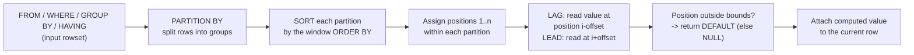

# 48. LAG and LEAD

> Section: 6-Window-Functions / 48
> Cross-references: `47-RowNumber-Rank-DenseRank`, `44-CTE`, `03-NULL-and-three-valued-logic`, `18-Exists-vs-In`, `16-Self-Join`, `23-GroupBy-vs-Window`, `50-Query-Optimization-Execution-Plans`

---

## Fundamentals

`LAG()` and `LEAD()` are **offset window functions**. They let a row "look backwards" or "look forwards" inside an ordered window and read the value of a column from that neighboring row — **without joining the table to itself**.

- `LAG(column [, offset] [, default])` reads the value of `column` from the **row that comes *before*** the current row.
- `LEAD(column [, offset] [, default])` reads the value of `column` from the **row that comes *after*** the current row.

The easiest way to remember which is which:

- **LAG** — the row "lags behind" (is earlier) in the ordering. Good for "how did we get here?".
- **LEAD** — the row "leads ahead" (comes next). Good for "what happens next?".

They perform the comparison **row to row**, so they are the natural tool for:

- Change from previous month/quarter/year
- Day-over-day percentage moves (stocks, dashboards)
- Difference between two consecutive rows in a log
- Filling in "the last known value before this one"
- "Did this employee's salary change vs the previous record?"

### Why do they exist?

Before window functions, "compare a row to the previous row" forced you into one of three awkward patterns:

1. **Self-join** on `(entity, previous_key)` — works, but can **duplicate rows** if the join keys are not unique, and reads the table twice.
2. **Correlated subquery** — easy to write wrong, and sensitive to `NULL` keys.
3. **`ROW_NUMBER()` + self-join** — correct, but verbose and easy to miscount.

`LAG`/`LEAD` collapse all of that into one function call, are **immune to the duplicate-row (fan-out) problem** because they never multiply rows, and are almost always simpler to read. They run **after** `GROUP BY`, which is how you compare "group totals to the previous group total" in a single pass.

> One output row still represents **one row**, computed on top of the rowset that already passed `FROM / WHERE / GROUP BY / HAVING`. LAG/LEAD never change the number of rows.

---

## Syntax

```sql
LAG( expression [, offset [, default]] ) OVER (
    [ PARTITION BY expr_list ]
    [ ORDER BY order_expr [ASC|DESC] [NULLS FIRST|LAST] ]
)

LEAD( expression [, offset [, default]] ) OVER (
    [ PARTITION BY expr_list ]
    [ ORDER BY order_expr [ASC|DESC] [NULLS FIRST|LAST] ]
)
```

(PostgreSQL/MySQL also allow the `IGNORE NULLS | RESPECT NULLS` clause; details below.)

### Parameters

| Parameter | Meaning | Default |
|---|---|---|
| `expression` | Value to read from the previous/next row. Can be any expression (a column, an arithmetic expression, a `CASE`, even a scalar subquery). | — |
| `offset` | How many rows **before** (LAG) / **after** (LEAD) the current row to look. Must be a non-negative integer. | `1` |
| `default` | Value returned when the offset row **falls outside the window partition** (there is no such row). | `NULL` |

Three properties worth stating up front:

1. **`ORDER BY` is mandatory** in the window for both functions (all major engines raise a syntax error without it). The `ORDER BY` inside `OVER` defines the logical order used to compute the offset — it is *not* optional, and it is *not* the same thing as the query's outer `ORDER BY`.
2. `PARTITION BY` is optional. Without it, the whole result set is one partition.
3. `LAG`/`LEAD` **ignore the window frame** (`ROWS`/`RANGE`). They always walk positions from the start of the partition. Oracle rejects the frame clause for them; PostgreSQL and MySQL permit it but ignore it. Simply don't write one.

### Named window (reuse without repeating)

```sql
select
  product_id,
  month,
  revenue,
  lag(revenue)  over w as prev_revenue,
  lead(revenue) over w as next_revenue
from monthly_sales
window w as (partition by product_id order by month);
```

`window w as (...)` is standard SQL — use it in PostgreSQL, MySQL 8, Oracle; SQL Server does not support the named `WINDOW` clause.

---

## Sample data used in this section

The grain of each table is stated explicitly — this matters more than the schema.

**`monthly_sales`** — one row = one product in one month.

```sql
create table monthly_sales (
  product_id int,
  month      date,
  revenue    numeric(10,2)
);

insert into monthly_sales values
  (1, '2024-01-01', 1200.00),
  (1, '2024-02-01', 1500.00),
  (1, '2024-03-01', 1100.00),
  (2, '2024-01-01',  800.00),
  (2, '2024-02-01',  750.00),
  (2, '2024-03-01',  900.00);
```

**`stock_prices`** — one row = one ticker on one trading day.

```sql
create table stock_prices (
  ticker      varchar(10),
  trade_date  date,
  close_price numeric(10,2)
);

insert into stock_prices values
  ('AAPL', '2024-04-01', 170.00),
  ('AAPL', '2024-04-02', 175.00),
  ('AAPL', '2024-04-03', 172.50),
  ('AAPL', '2024-04-04', 180.00),
  ('MSFT', '2024-04-01', 420.00),
  ('MSFT', '2024-04-02', 425.50),
  ('MSFT', '2024-04-03', 421.00);
```

**`employee_history`** — one row = one version of an employee's record on a given date.

```sql
create table employee_history (
  emp_id      int,
  change_date date,
  title       varchar(30),
  salary      numeric(10,2)
);

insert into employee_history values
  (1, '2021-01-01', 'Junior Analyst', 50000),
  (1, '2022-01-01', 'Analyst',        60000),
  (1, '2023-06-01', 'Senior Analyst', 75000),
  (2, '2021-05-15', 'Engineer I',     80000),
  (2, '2022-11-01', 'Engineer II',    90000);
```

---

## Basic examples

### 1. LAG — previous month's revenue

```sql
select
  product_id,
  month,
  revenue,
  lag(revenue) over (
    partition by product_id
    order by month
  ) as prev_revenue
from monthly_sales
order by product_id, month;
```

**Result:**

| product_id | month | revenue | prev_revenue |
|---:|---|---:|---:|
| 1 | 2024-01-01 | 1200.00 | NULL |
| 1 | 2024-02-01 | 1500.00 | 1200.00 |
| 1 | 2024-03-01 | 1100.00 | 1500.00 |
| 2 | 2024-01-01 |  800.00 | NULL |
| 2 | 2024-02-01 |  750.00 | 800.00 |
| 2 | 2024-03-01 |  900.00 | 750.00 |

Two things literally printed in the result:

- The **first row of each partition** (first month of each product) has no previous row → `NULL`.
- `PARTITION BY product_id` is what keeps product 1's January from being called "the previous row" of product 2's January. **Forgetting the partition clause is the single most common LAG bug.**

### 2. LEAD — next month's revenue

```sql
select
  month,
  revenue,
  lead(revenue) over (order by month) as next_revenue
from monthly_sales
where product_id = 1
order by month;
```

**Result:**

| month | revenue | next_revenue |
|---|---:|---:|
| 2024-01-01 | 1200.00 | 1500.00 |
| 2024-02-01 | 1500.00 | 1100.00 |
| 2024-03-01 | 1100.00 | NULL |

The **last row of the partition** gets `NULL`.

### 3. LAG and LEAD together — detecting local peaks

A value is a local maximum if it is bigger than both the previous and the next value. One query, zero joins:

```sql
select ticker, trade_date, close_price
from (
  select
    ticker,
    trade_date,
    close_price,
    lag(close_price)  over (partition by ticker order by trade_date) as prev_close,
    lead(close_price) over (partition by ticker order by trade_date) as next_close
  from stock_prices
) t
where close_price > prev_close
  and close_price > next_close;
```

**Result:**

| ticker | trade_date | close_price |
|---|---|---:|
| AAPL | 2024-04-04 | 180.00 |
| MSFT | 2024-04-02 | 425.50 |

Notes:

- The window functions are computed *inside* the subquery, then filtered in the outer `WHERE`. You **cannot** write the `prev_close > ...` conditions in the outer query's `WHERE` against the window result directly — window functions are not allowed in `WHERE`/`HAVING` (see *Common mistakes*).
- Rows with `NULL` in `prev_close`/`next_close` (first/last row) fail the comparison automatically, because `x > NULL` is `NULL`, which is filtered out. That is exactly what we want for peaks.

---

## How they work internally

Conceptually, the engine executes this pipeline:



Three consequences you should internalize:

1. **The offset is measured against the window's `ORDER BY`, not the physical order of the table.** There is no such thing as "the previous row in the table" for LAG — only "the previous row *in the sorted window*."
2. **Frame clauses do not apply.** A `ROWS BETWEEN 1 PRECEDING AND CURRENT ROW` frame has no effect on LAG/LEAD; they look at absolute positions inside the partition.
3. **They are non-lossy.** Every input row produces exactly one output row. This is the fundamental reason they cannot create the duplicate rows / double counting that self-joined solutions can.

The dominant cost is the **sort of each partition** (see *Performance implications*).

---

## NULL behavior

NULL behavior is the number-one source of confusion with LAG/LEAD, so it gets its own section.

### Rule 1 — the `default` argument only rescues "out of bounds", not "NULL data"

There are **two different** reasons a LAG result can be `NULL`:

| Situation | What LAG returns | Does the `default` argument replace it? |
|---|---|---|
| No such row exists (first row of partition, or offset beyond partition) | `default`, or `NULL` if omitted | **Yes** — this is exactly what `default` is for |
| A row exists, but the **column value itself is NULL** | `NULL` | **No** — the row exists, so `default` never comes into play |

> Common misconception
> People write `LAG(salary, 1, 0)` hoping to replace *missing salaries* with 0. It does **not** do that. It only replaces the *first row's* (or out-of-bounds) value. A `NULL` salary on an actual previous row is still `NULL`.

### Rule 2 — default behavior is RESPECT NULLS

By default, `LAG`/`LEAD` treat `NULL` values in the column as ordinary values:

- The offset still **counts the row** that contains the `NULL`.
- The result is `NULL` (the value of that row), it does not skip over the `NULL` row looking for a real value.

So "give me the previous *non-null* value" is a different task than "give me the previous row's value" — and LAG by default does **not** do the former.

### Rule 3 — IGNORE NULLS changes the meaning of offset

With `IGNORE NULLS`, the offset is counted only over rows whose value **is not NULL**:

```sql
select
  trade_date,
  close_price,
  lag(close_price) IGNORE NULLS over (order by trade_date) as prev_non_null
from price_feed;
```

Supported in:
- **PostgreSQL** (10+)
- **Oracle** (has supported it for a long time)

Not supported in:
- **MySQL** (8.x) — no `IGNORE NULLS`
- **SQL Server** (through at least 2022) — no `IGNORE NULLS`

For SQL Server, the classic workaround is a **"group-of-consecutive-NULLs" trick** using `SUM(...) OVER`:

```sql
-- SQL Server: previous non-null close price (manual forward-fill)
with grp as (
  select
    trade_date,
    close_price,
    sum(case when close_price is not null then 1 else 0 end)
      over (order by trade_date
            rows between unbounded preceding and current row) as grp_id
  from price_feed
)
select
  trade_date,
  close_price,
  max(close_price) over (partition by grp_id order by trade_date) as prev_non_null
from grp
order by trade_date;
```

The `grp_id` counter increases every time a real value appears, so all NULLs following a value share that value's group number; `max(close_price)` over the group is exactly "the last non-null value so far."

### NULLs in the ORDER BY key

If the key you sort by contains NULLs, the sort order of NULLs determines who the "previous row" is:

- **PostgreSQL**: `NULLS LAST` is default for `ASC`, `NULLS FIRST` for `DESC`.
- **MySQL**: NULLs sort **first** in `ASC`.
- **SQL Server**: NULLs sort **first** in `ASC`.
- **Oracle**: NULLs sort **last** in `ASC`.

You can always force it explicitly: `ORDER BY date ASC NULLS LAST`. For an interview question, "which row does LAG read when my sort column contains NULLs?" is a favorite trap.

---

## Scenario-based examples

### A. Month-over-month growth per product

```sql
select
  product_id,
  month,
  revenue,
  lag(revenue) over (partition by product_id order by month) as prev_revenue,
  round(
    100.0 * (revenue - lag(revenue) over (partition by product_id order by month))
            / nullif(lag(revenue) over (partition by product_id order by month), 0),
    2
  ) as growth_pct
from monthly_sales
order by product_id, month;
```

Highlights:

- The `LAG(...)` expression is repeated because standard SQL cannot alias a window function and reuse it in the same `SELECT` list. To compute the value once, wrap in a CTE (see the *better approach* below).
- `100.0 *` forces decimal math — avoids the **integer-division** trap (see *Common mistakes*).
- `NULLIF(prev, 0)` avoids division by zero; when `prev` is `NULL` (first row) the whole expression evaporates to `NULL`. Many shops prefer `COALESCE` at the end.
- `round(..., 2)` exists in PostgreSQL/MySQL/SQL Server/Oracle.

> BETTER APPROACH — compute once, reuse; also filter on the result later:

```sql
with sales_and_prev as (
  select
    product_id,
    month,
    revenue,
    lag(revenue) over (partition by product_id order by month) as prev_revenue
  from monthly_sales
)
select
  product_id,
  month,
  revenue,
  prev_revenue,
  round(100.0 * (revenue - prev_revenue) / nullif(prev_revenue, 0), 2) as growth_pct
from sales_and_prev
order by product_id, month;
```

> BAD APPROACH (equivalent but unreadable and error-prone):

```sql
-- three repetitions of the same LAG, three places to get the columns wrong
select
  product_id,
  month,
  revenue,
  lag(revenue) over (partition by product_id order by month)   as prev_revenue,
  revenue - lag(revenue) over (partition by product_id order by month) as change,
  round(100.0 * (revenue - lag(revenue) over (partition by product_id order by month))
                / nullif(lag(revenue) over (partition by product_id order by month), 0), 2) as pct
from monthly_sales;
```

Answer for product 1: `1200 → 1500` (+25.00%), `1500 → 1100` (−26.67%). Product 1's January has `NULL` prev and `NULL` pct.

### B. Day-over-day stock change

```sql
select
  ticker,
  trade_date,
  close_price,
  lead(close_price) over (partition by ticker order by trade_date) as next_close,
  round(
    100.0 * (lead(close_price) over (partition by ticker order by trade_date) - close_price)
            / close_price,
    2
  ) as next_day_pct
from stock_prices
order by ticker, trade_date;
```

The last trading day for each ticker has `NULL` `next_close` and `NULL` `next_day_pct` — tomorrow's number does not exist yet. This is the *canonical* LEAD use case.

### C. Year-over-year with offset > 1

You can compare against **any** earlier row with the second argument:

```sql
select
  month,
  revenue,
  lag(revenue, 12) over (order by month) as revenue_12_months_ago,
  revenue - lag(revenue, 12) over (order by month) as yoy_change
from monthly_totals
order by month;
```

> Production pitfall
> Offset arithmetic like `lag(..., 12)` **assumes exactly 12 rows exist between the two snapshots**. If a month is missing (data gap, closed branch, partial load), row #12 back is *not* the same calendar month a year ago. Check your data is gap-free first, or prefer a calendar-table join. `lag(revenue, 12)` counts **rows**, never **calendar distance**.

### D. "Did anything change since the previous record?" (current vs previous)

Fill a useful default so the first record isn't `NULL`:

```sql
select
  emp_id,
  change_date,
  title,
  salary,
  lag(title, 1, title) over (partition by emp_id order by change_date) as prev_title
from employee_history
order by emp_id, change_date;
```

`lag(title, 1, title)`: for the employee's *first* record there is no previous row, so the `default` kicks in and returns the employee's **own** title — neatly expressing "nothing changed before this". Row 1 of employee 1 shows `prev_title = 'Junior Analyst'`.

### E. Consecutive-day streaks (gaps-and-islands, LAG the previous date)

LAG is the standard engine for islands-and-gaps: compare each date to the previous date to find where gaps start.

```sql
with login_dates as (
  select distinct login_date
  from logins
  where user_id = 42
),
with_prev as (
  select
    login_date,
    lag(login_date) over (order by login_date) as prev_date
  from login_dates
)
select
  login_date,
  case
    when prev_date is null
         or login_date = prev_date + interval '1 day'   -- PostgreSQL syntax
    then 0
    else 1
  end as is_island_start
from with_prev
order by login_date;
```

- `prev_date IS NULL` → first date always starts an island.
- `login_date = prev_date + 1 day` → continues an island.
- Otherwise → a new island begins.

(DATE math syntax differs: PostgreSQL `+ interval '1 day'`, SQL Server `dateadd(day,1,prev_date)`, MySQL `+ interval 1 day`, Oracle `prev_date + 1`.)

### F. Salary history — previous AND next record together

```sql
with ranked as (
  select
    emp_id,
    change_date,
    title,
    salary,
    lag(salary)  over (partition by emp_id order by change_date) as prev_salary,
    lead(salary) over (partition by emp_id order by change_date) as next_salary,
    lead(change_date) over (partition by emp_id order by change_date) as next_change_date
  from employee_history
)
select
  emp_id,
  change_date,
  title,
  coalesce(salary - prev_salary, 0) as raise_from_prev,
  next_salary
from ranked
order by emp_id, change_date;
```

This is the pattern used to answer "for every change, how much did the salary move, and what came after?" in one pass.

### G. Combined with GROUP BY — compare group totals

Window functions execute *after* grouping, so this is legal and extremely common:

```sql
with yearly as (
  select
    date_part('year', month) as yr,        -- extract(xyearx from month) is ANSI
    sum(revenue) as total
  from monthly_sales
  group by 1
)
select
  yr,
  total,
  lag(total) over (order by yr) as prev_year_total,
  total - lag(total) over (order by yr) as delta
from yearly
order by yr;
```

---

## Edge cases

| Edge case | Behavior |
|---|---|
| Partition with a single row | Both `LAG` and `LEAD` return the `default`/`NULL`. |
| `offset = 0` | Returns the **current row's** value (`LAG(x,0)` = `LEAD(x,0)` = `x`). Valid in PostgreSQL/MySQL/Oracle. |
| `offset` larger than the partition | Returns `default`/`NULL`. |
| Negative `offset` | Syntax/semantic error — offset is non-negative. |
| Missing/wrong `ORDER BY` | Syntax error in PostgreSQL, MySQL, SQL Server, Oracle. |
| NULL in the *value* column | Returned as `NULL` (RESPECT NULLS default); the row is counted in the offset. |
| NULLs in the *sort* key | Ordering of NULLs (engine-dependent) decides which row is "previous". |
| Ties in the sort key | The engine picks *some* previous row among equals — **not deterministic**. |
| Gap-free requirement for `offset > 1` | Offsets count **rows**, not time. Missing months break anniversary comparisons. |
| Empty input rowset | Returns zero rows (no "single NULL row"). |
| `PARTITION BY` several columns | `partition by product_id, region` — fine; order keys apply within the combined group. |

---

## Differences across databases

| Feature | PostgreSQL | MySQL 8 | SQL Server | Oracle |
|---|---|---|---|---|
| `LAG`/`LEAD` basic form | ✅ | ✅ | ✅ (2012+) | ✅ |
| `IGNORE NULLS` option | ✅ (10+) | ❌ | ❌ | ✅ |
| Named `WINDOW` clause | ✅ | ✅ | ❌ | ✅ |
| Frame clause on LAG/LEAD | ignored | ignored | — | **not allowed** |
| NULL sort position in `ASC` | last | first | first | last |
| Date arithmetic syntax | `+ interval '1 day'` | `+ interval 1 day` | `dateadd(day,1,x)` | `x + 1` |

---

## Performance implications

> No universal claim is being made here — "LAG/LEAD is always faster than a self-join" is *not* a law. What follows is what to **verify with an execution plan**.

### Where the cost is

- LAG/LEAD typically require the engine to **sort each partition** by the window `ORDER BY` before assigning offsets. Sorting is `O(n log n)` per partition — often the dominant cost.
- A sort that spills to disk (large partitions, small `work_mem`/memory grant) is much slower than an in-memory sort.
- Because LAG/LEAD read **rows that are already in the working memory of the window**, the per-row cost is tiny compared with a self-join that re-scans the table.

### When an index can help

- If the partition and order keys line up with a **composite index's leading columns** — e.g. index on `(product_id, month)` for `partition by product_id order by month` — the engine may read rows already in the right order and **skip the explicit sort**.
- Check for this in the plan: a `Sort` node (or `Sort (partial)`/`Sort (full)`) means it sorted; an ordered index scan + "windowAgg" (PostgreSQL) with no sort means it did not.
- `ORDER BY ... DESC` vs `ASC` can need a **backward scan**; verify the plan supports it without an extra sort.

**What to run:**

```sql
explain analyze
select product_id, month, revenue,
       lag(revenue) over (partition by product_id order by month) as prev
from monthly_sales;
```

Look for: an explicit `Sort` node? A `windowAgg` / `WindowAggregate` / `Stream Aggregate`? Is an index providing the ordering? Does the step re-scan the table?

### LAG/LEAD vs self-join — the honest comparison

| Dimension | LAG/LEAD | Self-join (`ROW_NUMBER` + join on key) |
|---|---|---|
| Row count | Never duplicated | Must prove the join key is unique, else fan-out / double counting |
| Reads | One logical pass over the sorted window | Joins usually imply re-reading/folifting the right side |
| Sort work | One sort (reused by multiple LAG/LEAD in the same window) | A sort plus a join; duplicate-key joins can balloon |
| NULL keys | Not a problem — order defines positions | Join keys with NULL never match → silently missing "previous" rows |
| Plan to inspect | Sort + windowAgg | Sort + join node; check for nested loops on large inputs |

Verdict: prefer LAG/LEAD for readability and correctness. Whether it is *faster* for a *specific* query depends on the optimizer, statistics, cardinalities, and indexes — **verify with EXPLAIN**, don't assume.

---

## Common mistakes

1. **Forgetting `PARTITION BY`.** You compare product 2's January to product 1's December. This returns `NULL` only by luck and is wrong almost always. Label it out loud before you write: "previous row *within the same product*."

2. **Forgetting the window `ORDER BY`.** It's mandatory; without it you get a syntax error in every major engine. But there's a sneakier variant — people write *an outer* `ORDER BY` and *assume* LAG uses it. It doesn't; the window needs its own.

3. **Non-deterministic `ORDER BY` keys.** Sorting ties (e.g., `ORDER BY revenue` when two months have equal revenue) mean "who is the previous row?" is arbitrary. Add a tie-breaker.

4. **Repeating the LAG expression everywhere instead of aliasing in a CTE.** Readability and a single place to fix mistakes.

5. **`WHERE`-filtering on a window result directly.** `WHERE prev_revenue > 100` → syntax error. Wrap in a subquery/CTE first.

6. **Integer division.** `(revenue - prev)/prev` in PostgreSQL/SQL Server/Oracle gives integer truncation for integer columns. Multiply by `100.0` first.

7. **Thinking `default` fills NULL data.** Covered above — it only fires when the offset row is out of bounds.

8. **Assuming LAG == "previous *distinct* value".** LAG walks rows, not distinct values. If you sort a statistic per day but want month-over-month from *calendar* months in a table with gaps, LAG off-by-one silently gives the wrong comparison.

9. **Ignoring NULLs in the value.** Default `RESPECT NULLS` means a NULL mid-stream breaks your "previous value" chain — you need `IGNORE NULLS` (where supported) or the SUM-over-group trick.

---

## Production pitfalls

> Production pitfall
> **Missing `PARTITION BY` in a mixed-entity table is a silent-corruption bug.** Your ETL reports *will* show "day-over-day change" computed across different stores/products/customers and nobody will notice until a data-quality audit. Guard with linting or code review rules.

> Production pitfall
> **Piping LAG output into further arithmetic without handling the first row.** Every partition's first LAG is `NULL`; `x - NULL` is `NULL`, and a downstream `SUM`/metric that swallows NULLs (or uses `AVG`) will skew totals. Decide explicitly: `COALESCE(..., 0)`, or `LAG(x, 1, x)` to treat "no previous" as "unchanged".

> Production pitfall
> **Using `offset > 1` for time comparisons in gappy data.** Offsets count rows. Prefer calendar tables or `OUTER APPLY`/window keyed on real dates for anniversary comparisons.

> Production pitfall
> **Putting window functions in `WHERE`/`HAVING`** errors at deployment time in every major engine — but the "fix" people reach for (outer subquery that re-aggregates incorrectly) often returns cardinality bugs. Wrap in a CTE, then filter.

> Production pitfall
> **Modern MySQL pre-8.0 and SQL Server pre-2012** have no LAG/LEAD at all. If your platform mix includes MySQL 5.7, your "LAG" code must be rewritten as joins/variables. An anonymous/transaction framework won't catch this — the migration will.

---

## Interview traps

> Interview trap
> "What does `LAG(salary, 1, 0)` return for the first row of each partition?" — **0**, not NULL. But everyone who says "it also makes all NULL salaries 0" is wrong. Both facts get tested.

> Interview trap
> "Which row does LAG read, when the query has an outer `ORDER BY`?" A common wrong instinct: LAG follows the *final displayed* order. It follows the *window* ORDER BY. The final ORDER BY only sorts display.

> Interview trap
> Tie-breakers. "Given ordering by `revenue` only, is `LAG(revenue)` deterministic?" — No. The outcome depends on which tied row the engine emits last.

> Interview trap
> "Can I use LAG to find the second-highest salary per department?" — Sort `DESC` and take `LEAD(salary, 1)` of the **top** row, or more cleanly use `DENSE_RANK()`/`ROW_NUMBER()`. LAG/LEAD give *neighbor* rows, not *ranks*; ties make neighbor-based "second highest" ambiguous.

> Interview trap
> NULL sort order. "The sort key contains NULLs; which row becomes prev/next?" Engine-dependent (see table above). If the answer surprises you, fix with `NULLS FIRST/LAST`.

> Interview trap
> People answer "LAG is for 'previous row'" and forget the partition boundary: the first row *of each partition* is NULL, not just the very first row of the result.

---

## Best practices

1. **State the grain before you write the query** — "one row = one product-month" — then decide `PARTITION BY` and window `ORDER BY` from the grain, not from what "feels right."
2. **Always make the window `ORDER BY` deterministic**: add a surrogate/unique tie-breaker column.
3. **`PARTITION BY` explicitly**, even when the data "is" just one entity in your head. It self-documents intent and survives future data mixes.
4. **Compute LAG/LEAD once in a CTE**, then filter/compute in the outer query. Never bury the window expression inside a giant `SELECT` that repeats it.
5. **Handle the boundary rows deliberately**: prefer `LAG(x, 1, x)` (or `COALESCE`) when "no previous" should read as "no change", and accept `NULL` when the consumer downstream should be able to tell "there was no previous row".
6. **Watch integer division** — multiply by `100.0`.
7. **For time-series, first make the series gap-free** (calendar table + left join) before relying on `offset = 1` or `offset = 12` semantics.
8. **Verify with the execution plan.** Look for the `Sort` node and whether an index serves the ordering. Only then talk about "fast on this workload."
9. **Remember the alias problem**: you cannot reference a window alias within the same `SELECT` list — this is *why* the CTE pattern exists.
10. When you only need to know *existence* of a previous/next row (not its value), consider `EXISTS`/`LATERAL` instead of LAG — different tools, chosen by what the output row must carry.

---

## Comparison tables

### LAG vs LEAD

| | `LAG` | `LEAD` |
|---|---|---|
| Direction | previous rows (behind) | next rows (ahead) |
| First row of partition | `NULL`/`default` | (depends on data) |
| Last row of partition | — | `NULL`/`default` |
| Typical question | "how did this compare to last?" | "what comes next?" |
| Offset meaning | row at position `i - offset` | row at position `i + offset` |
| Memory trick | a horse "lags behind" | a leader "goes ahead" |

### LAG/LEAD vs self-join with ROW_NUMBER

| | LAG / LEAD | ROW_NUMBER + self-join |
|---|---|---|
| Row duplication risk | none | high if join key not unique |
| Code size | 1 function | CTE + join + ON condition |
| Reads the table twice | no (sorted once) | commonly yes |
| Surrogate order needed | only tie-breaker | yes, must build a rank key |

Use the self-join when you need the previous row **only under a complex condition that can't be expressed by a plain window** (rare), and then guard uniqueness carefully.

### LAG/LEAD vs correlated subquery

| | LAG / LEAD | correlated subquery |
|---|---|---|
| Reads | one sorted pass | potentially re-evaluated per row |
| NULL-safe keying | no key needed (positions) | `NULL` keys silently fail (`=` never matches) |
| Readability | high | error-prone + verbose |
| Plan | windowAgg / sort node | dependent subquery (often Nested Loop) |

The subquery wins only for "previous row *matching a predicate*" (e.g., previous non-null, previous record before this date) where the fastest plan is genuinely an index lookup, not a sort. Decide case by case; check the plan.

---

## Cross-references

- `47-RowNumber-Rank-DenseRank` — ranking vs offset functions; useful for "nth row" rather than "neighbor row".
- `23-GroupBy-vs-Window` — why window functions can run after aggregation.
- `44-CTE` — why LAG results are wrapped in a CTE before filtering.
- `03-NULL-and-three-valued-logic` — NULL arithmetic (`revenue - NULL = NULL`) and NULL ordering.
- `16-Self-Join` — the alternative to LAG, and its fan-out hazards.
- `50-Query-Optimization-Execution-Plans` — how to read the `Sort`/`windowAgg` nodes and verify performance claims.

---

# Interview Questions

### Beginner

1. What is the difference between `LAG` and `LEAD` in one sentence each?
2. Is the window `ORDER BY` optional for LAG/LEAD? What happens if you omit it in PostgreSQL, MySQL, SQL Server, and Oracle?
3. What does `LAG(salary)` return for the **first row of a partition**? What does `LEAD(salary)` return for the **last row of a partition**?
4. What are the three arguments of `LAG` and their defaults?
5. When is `PARTITION BY` needed, and what happens if you forget it on a table containing multiple products?

### Intermediate

6. Explain exactly when the third argument (the `default`) is used — and give one example where it does *not* do what people expect.
7. Write a query that returns each stock day with the **% change vs the previous day**, ordered by ticker and date.
8. How do you get **both** the previous and the next row's values in one query?
9. Compare `LAG` + CTE vs self-joining the table on `(product_id, month-1)` for the month-over-month problem. Under what conditions does each return the *wrong* number of rows?
10. Why can't you write `WHERE lag(revenue) > 100`? How do you filter on a LAG result?

### Advanced

11. In PostgreSQL, `LAG(close) IGNORE NULLS over (order by d)` vs `lag(close)` — how does `IGNORE NULLS` change what counts as "offset"? Which major databases lack the feature, and what is the SQL Server workaround (describe the technique, not just the code)?
12. Show how you'd find **local maxima** in a stock price series with LAG and LEAD — and what changes when the last row of the partition participates.
13. Compare LAG/LEAD performance to a `ROW_NUMBER` + self-join. When might the self-join actually be chosen by the optimizer, and how would you *prove* one path is cheaper (name the exact tool/command per database)?
14. A "gaps and islands" query: use LAG on a sorted date column to mark the starts of consecutive-day islands. Which rows fail the `prev_date` comparison and why?
15. What does `LAG(x, 0, 'n/a')` return? Is the default argument used here?

### Scenario Based

16. "For each employee version, show the raise relative to the employee's previous version, and the title change (from/to)." Write the query. What do you do for the employee's first version — keep NULL or coalesce to 0, and why does the choice matter downstream?
17. "Revenue by month, with a column 'revenue 12 months ago'." What assumption must you state, and verify, before trusting `LAG(revenue, 12)`?
18. Stock dashboard: "red days after green days." Given open/high/low/close, write a query to tag each day and rank streaks.
19. Payment log with occasional `NULL` amounts. "Every row should show the last *non-null* amount." Which function/technique is the correct answer in PostgreSQL vs SQL Server?

### Tricky

20. A table orders `ORDER BY month ASC`, but two rows share the same month. Is `LAG(revenue)` deterministic? If not, how do you make it deterministic?
21. The sort key contains NULLs. In which database does the "previous" row of a `NULL`-keyed row differ from the others? How do you force the intended behavior?
22. `SELECT lag(revenue, 1, 0) ...` — your colleague claims the 0 "fills missing revenue". Where is that claim wrong?
23. Your query has the window ORDER BY `DESC`. Which physical row becomes "previous" for LAG — and does that match the business meaning you intended?

### Output Prediction

24. Given the `monthly_sales` data above, predict the exact output of:

```sql
select product_id, month, revenue,
       lag(revenue, 1, 0) over (partition by product_id order by month) as prev
from monthly_sales
order by month, product_id;
```

25. Predict the output of this — note that the outer ORDER BY and the window ORDER BY disagree:

```sql
select month, revenue,
       lead(revenue) over (order by month) as next_rev
from monthly_sales
where product_id = 1
order by revenue desc;
```

26. In this query, why is row 1 (employee 1, Jan '21) `prev = 0` under `lag(salary, 1, 0)`, and what would row 1 of employee 2 show?

### Debugging

27. The following query returns `NULL` for `delta` on every row, even though data is present. Find the two bugs:

```sql
select product_id, month, revenue,
       revenue - lag(revenue) over (order by month) as delta
from monthly_sales;
```

28. A developer reports: "My month-over-month comparison joins everything together." The query is:

```sql
select ..., revenue - lag(revenue) over (order by month) as mo_chg
from monthly_sales
where product_id = 1;
```

Only one product is filtered, yet values look off. What's the missing piece anyway, and why will it break the moment the WHERE clause changes?

29. On PostgreSQL, `round((revenue - lag(revenue) over (...))/lag(revenue) over (...), 2)` returns `0.00` for many rows. What single change fixes it, and why?

30. The query below errors with "window function not allowed in WHERE clause". Rewrite it to run, without changing the result:

```sql
select * from monthly_sales
where lag(revenue) over (partition by product_id order by month) > 1000;
```

### Performance

31. Where does the hot cost of a LAG query typically live? What node appears in an `EXPLAIN` when the engine sorts for the window, and what does it mean for the plan *not* to contain that node?
32. Design an index that lets `partition by product_id order by month` run with **no explicit sort** in PostgreSQL/MySQL. Which index *does not* help?
33. "LAG is always faster than a self-join." True or false? Give the argument you'd use in a code review, and name the two things you'd check in the execution plan before accepting either version.
34. In SQL Server, a huge LAG query "spills to tempdb" — what is happening, and what are the two practical knobs you'd pull?
35. When is `offset = 12` cheaper or more dangerous than a self-join keyed on `date` for a year-over-year comparison? (Hint: think rows vs calendar and NULL-key behavior.)

---

*Answers to the practice questions above are intentionally omitted — work through them, then verify against the examples and tables in this section. If you want an answers appendix for this section, request `48-LAG-LEAD-Answers`.*
