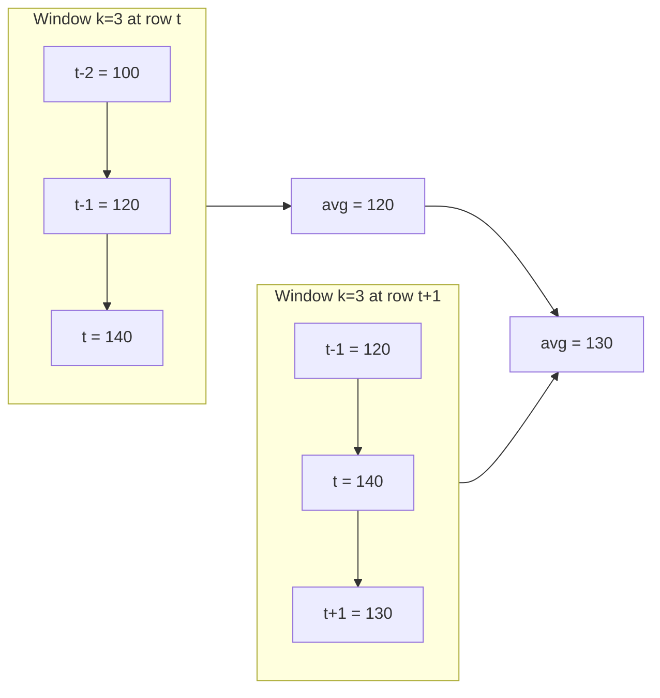

# 6-Window-Functions / 50 — Moving Averages

> Cross-references: [Section 47 — Window Functions], [Section 61 — NULLs & Three-Valued Logic], [Section on CTE / Recursive CTE], [Section on GROUP BY vs Window Functions], [Section on Query Optimization / EXPLAIN].

---

## 1. Fundamentals

A **moving average** (also called *rolling average*, *running average*, *sliding window average*) is the average of the last *k* (or time-based) values of a series as the window "slides" forward one value at a time.

- Each output row answers: *"What is the average of the most recent N values up to this point?"*
- It smooths short-term noise so that **trends**, **seasonality**, and **level shifts** become visible.
- It is the standard building block in financial analysis (SMA — Simple Moving Average), demand forecasting, anomaly detection, and QA/metrics monitoring.

**Why it exists**
A raw time series is noisy. `GROUP BY date` would give you one average *per bucket* (no overlap, no granularity change). A moving average instead gives you **one averaged value per original row**, so you can plot a smooth line *on top of* the raw data without losing granularity.

---

## 2. The moving average families

| Family | Frame | Weight | Typical use |
|---|---|---|---|
| **Running / cumulative average** | `UNBOUNDED PRECEDING` to current row | equal | "Average revenue since the start of the year" |
| **Simple Moving Average (SMA)** | last *n* rows (`ROWS n PRECEDING..CURRENT ROW`) or last *n* time units | equal | Smoothing, technical analysis |
| **Centered moving average** | `n PRECEDING` to `n FOLLOWING` (window centered on the row) | equal| Removing seasonality, backtesting |
| **Weighted moving average** | last *n* rows | increasing weights | Trending, anomaly scoring |
| **Exponential Moving Average (EMA)** | all history, recursively | exponentially decaying | Finance, forecasting (needs recursion) |
| **Moving average over time (RANGE)** | rows whose order value is within a time interval | equal | Sparse / irregular time series |

Most exam and production questions concern **SMA**, the **running average**, and the **RANGE** (time-based) variant.

---

## 3. Syntax

The weapon is `AVG()` used as a **window function** with an explicit **frame** (`ROWS` / `RANGE` / `GROUPS`):

```sql
AVG(expression) OVER (
    [PARTITION BY partition_columns]
    [ORDER BY order_columns]
    [frame_clause]
)
```

Frame clause grammar (ANSI SQL):

```sql
{ ROWS | RANGE | GROUPS }
{
     BETWEEN frame_start AND frame_end
   | frame_start                                  -- start defaults to CURRENT ROW
}

frame_start / frame_end:
     UNBOUNDED PRECEDING
   | UNBOUNDED FOLLOWING
   | n PRECEDING            -- or: n FOLLOWING
   | CURRENT ROW
```

The three workhorse patterns:

```sql
-- 1) Simple moving average: last 7 rows
AVG(revenue) OVER (PARTITION BY region ORDER BY sale_date
                   ROWS BETWEEN 7 PRECEDING AND CURRENT ROW)

-- 2) Running average: everything up to the current row
AVG(revenue) OVER (PARTITION BY region ORDER BY sale_date
                   ROWS BETWEEN UNBOUNDED PRECEDING AND CURRENT ROW)

-- 3) Time-based rolling average: last 7 calendar days
AVG(revenue) OVER (PARTITION BY region ORDER BY sale_date
                   RANGE BETWEEN INTERVAL '6' DAY PRECEDING AND CURRENT ROW)
```

> PostgreSQL / SQL Server / Oracle 19c support `INTERVAL` in the `RANGE` frame. MySQL 8.0+ supports `RANGE BETWEEN INTERVAL 6 DAY PRECEDING` too, but only for `DATE`/`DATETIME`/`TIMESTAMP` columns. Older MySQL / MariaDB (pre-10.2) have **no window functions at all**.

---

## 4. Internal working

Roughly what the engine does:

1. **Sorts** the input by `PARTITION BY` then `ORDER BY` over the whole result set (or uses an index that already provides that order).
2. **Groups rows into partitions.** The frame can never cross a partition boundary.
3. For **each row**, the engine evaluates the frame; for `ROWS` frames this is cheap pointer arithmetic (an accumulated sum lets it reuse prior work); for `RANGE`/`GROUPS` it resolves *logical* frames via the ordered value.
4. Evaluates the aggregate over just the rows in the frame.

Because a well-written moving-average query **scans the series once**, its growth is roughly O(n·log n) for the sort plus O(n) for the aggregate — versus O(n·k) for a self-join implementation.



The heavy work is the **sort**. If an index on `(region, sale_date)` already supplies the ordering, the sort can be skipped entirely — this is exactly what you must verify with the execution plan, not assume.

---

## 5. Sample data

```sql
-- Grain: one row = total daily revenue for one region on one calendar date.
CREATE TABLE daily_sales (
    region    VARCHAR(20),
    sale_date DATE,
    revenue   NUMERIC(10,2),
    PRIMARY KEY (region, sale_date)
);

INSERT INTO daily_sales VALUES
    ('North', DATE '2026-01-01', 100), ('North', DATE '2026-01-02', 120),
    ('North', DATE '2026-01-03', 140), ('North', DATE '2026-01-04', 130),
    ('North', DATE '2026-01-05', 150), ('North', DATE '2026-01-06', 160),
    ('North', DATE '2026-01-07', 150), ('North', DATE '2026-01-08', 170),
    ('North', DATE '2026-01-09', 160), ('North', DATE '2026-01-10', 180);
```

```sql
-- Grain: one row = closing price of one ticker on one trading day.
CREATE TABLE stock_prices (
    ticker       VARCHAR(10),
    trade_date   DATE,
    close_price  NUMERIC(12,2),
    PRIMARY KEY (ticker, trade_date)
);
```

---

## 6. Example — Simple Moving Average over the last 3 rows

```sql
SELECT sale_date,
       revenue,
       AVG(revenue) OVER (ORDER BY sale_date
                          ROWS BETWEEN 2 PRECEDING AND CURRENT ROW) AS ma_3
FROM   daily_sales
WHERE  region = 'North'
ORDER  BY sale_date;
```

| sale_date | revenue | ma_3 |
|---|---|---|
| 2026-01-01 | 100 | 100.00 |
| 2026-01-02 | 120 | 110.00 |
| 2026-01-03 | 140 | 120.00 |
| 2026-01-04 | 130 | 130.00 |
| 2026-01-05 | 150 | 140.00 |
| 2026-01-06 | 160 | 146.67 |
| 2026-01-07 | 150 | 153.33 |
| 2026-01-08 | 170 | 160.00 |
| 2026-01-09 | 160 | 160.00 |
| 2026-01-10 | 180 | 170.00 |

Notice the first two rows average **only over the rows that exist** — no padding. If you need a strict "always divide by 3" average, see "Fixed divisor" below.

---

## 7. Example — Running (cumulative) average per partition

```sql
-- Average revenue since the start of the region's year, updating every day.
SELECT region,
       sale_date,
       revenue,
       AVG(revenue) OVER (PARTITION BY region
                          ORDER BY sale_date
                          ROWS BETWEEN UNBOUNDED PRECEDING AND CURRENT ROW) AS running_avg
FROM   daily_sales
ORDER  BY region, sale_date;
```

For `('North', '2026-01-04')` you get `(100+120+140+130)/4 = 122.50`. The frame grows by one row per output row and never shrinks.

> Cross-reference: this is the same frame used for **running totals** (Section on running totals / cumulative aggregates); just swap `AVG` for `SUM`.

---

## 8. Example — RANGE: moving average over the last 7 *calendar days*

`ROWS` counts **physical rows**. If some days are missing, "last 7 rows" may span 30 calendar days. `RANGE` counts **time**:

```sql
INSERT INTO daily_sales VALUES
    ('East', DATE '2026-02-01', 200),
    ('East', DATE '2026-02-03', 210),
    ('East', DATE '2026-02-10', 220),
    ('East', DATE '2026-02-11', 230);
```

```sql
SELECT sale_date,
       revenue,
       AVG(revenue) OVER (ORDER BY sale_date
                          RANGE BETWEEN INTERVAL '6' DAY PRECEDING AND CURRENT ROW) AS ma_7d
FROM   daily_sales
WHERE  region = 'East'
ORDER  BY sale_date;
```

| sale_date | revenue | ma_7d |
|---|---|---|
| 2026-02-01 | 200 | 200.00 |
| 2026-02-03 | 210 | 205.00 |
| 2026-02-10 | 220 | 220.00 |
| 2026-02-11 | 230 | 225.00 |

- `2026-02-03`: frame covers `2026-01-28 … 2026-02-03` → rows `02-01, 02-03` → 205.
- `2026-02-10`: frame covers `2026-02-04…02-10` → only `02-10` → 220.

---

## 9. Example — Centered moving average

```sql
SELECT sale_date,
       revenue,
       AVG(revenue) OVER (ORDER BY sale_date
                          ROWS BETWEEN 1 PRECEDING AND 1 FOLLOWING) AS centered_3
FROM   daily_sales
WHERE  region = 'North'
ORDER  BY sale_date;
```

`('2026-01-05')` → `(140+150+160)/3 ≈ 150.00`. This is the frame used in backtesting and seasonal-smoothing because it uses *past and future* context (it is not usable causally — see "When NOT to use").

---

## 10. ROWS vs RANGE vs GROUPS

| | ROWS | RANGE | GROUPS |
|---|---|---|---|
| Frame defined by | physical row count | order-by value + peers | peer groups |
| Tomb | ignores tied ORDER BY values | **includes all peer rows** with equal order value | includes whole peer groups |
| Best for | evenly spaced, unique keys | dates/timestamps, sparse data | ties / grouped aggregation |
| Caveat | ordering of tied rows is nondeterministic | "n PRECEDING" for numbers/dates uses value arithmetic | requires ≥3 window functions support (PG 11+, others vary) |

> **Interview trap:** with duplicate `ORDER BY` values, `ROWS BETWEEN 1 PRECEDING …` picks arbitrary physical neighbors among the ties, so the result set is nondeterministic. Add a tiebreaker column (e.g. `ORDER BY sale_date, created_at`) or use `RANGE`.
>
> > **Common misconception:** "RANGE always means dates." `RANGE n PRECEDING` works with any ordered value — `RANGE BETWEEN 5 PRECEDING …` means "order-values within `current_value − 5` … `current_value`", which for dates requires `INTERVAL`.

---

## 11. Fixed divisor vs dynamic frame

The default behavior averages **whatever rows are in the frame**. The first rows therefore average over 1, 2, ... rows. Two alternatives:

**Always divide by exactly n (pad early rows with NULL):**

```sql
SELECT sale_date,
       revenue,
       SUM(revenue) OVER (ORDER BY sale_date
                          ROWS BETWEEN 2 PRECEDING AND CURRENT ROW) / 3.0 AS ma_3_fixed
FROM   daily_sales
WHERE  region = 'North';
```

This reuses `SUM`, and dividing by `3.0` (not `3`) avoids integer division.

**Drop the partial-frame rows:**

```sql
SELECT *
FROM (
    SELECT sale_date, revenue,
           AVG(revenue) OVER (ORDER BY sale_date
                              ROWS BETWEEN 2 PRECEDING AND CURRENT ROW) AS ma_3
    FROM daily_sales
    WHERE region = 'North'
) t
WHERE NOT EXISTS (
    -- rows that do not yet have 3 members in the frame
    SELECT 1 FROM daily_sales
    WHERE region = 'North' AND sale_date BETWEEN t.sale_date - 2 AND t.sale_date
)
ORDER BY sale_date;
```

Simpler when using a counter + `HAVING`-style filter via CTE:

```sql
WITH ma AS (
    SELECT sale_date, revenue,
           COUNT(*) OVER (ORDER BY sale_date
                          ROWS BETWEEN 2 PRECEDING AND CURRENT ROW) AS n,
           AVG(revenue) OVER (ORDER BY sale_date
                              ROWS BETWEEN 2 PRECEDING AND CURRENT ROW) AS ma_3
    FROM daily_sales WHERE region = 'North'
)
SELECT sale_date, revenue, ma_3
FROM ma
WHERE n = 3
ORDER BY sale_date;
```

| sale_date | revenue | ma_3 |
|---|---|---|
| 2026-01-03 | 140 | 120.00 |
| 2026-01-04 | 130 | 130.00 |
| 2026-01-05 | 150 | 140.00 |
| ... | ... | ... |

---

## 12. NULL behavior

`AVG` (and every aggregate) **ignores NULLs** in its window unless the window is *all NULL* — then it returns NULL.

```sql
-- Grain: one row per region per day (revenue may be NULL when unreported)
('West', DATE '2026-01-01', NULL),
('West', DATE '2026-01-02', 100),
('West', DATE '2026-01-03', NULL),
('West', DATE '2026-01-04', NULL),
('West', DATE '2026-01-05', 200);

SELECT sale_date, revenue,
       AVG(revenue) OVER (ORDER BY sale_date
                          ROWS BETWEEN 2 PRECEDING AND CURRENT ROW) AS ma_3
FROM   daily_sales
WHERE  region = 'West'
ORDER  BY sale_date;
```

| sale_date | revenue | ma_3 | explanation |
|---|---|---|---|
| 01-01 | NULL | NULL | frame is all-NULL |
| 01-02 | 100 | 100.00 | NULL ignored |
| 01-03 | NULL | 100.00 | NULL ignored |
| 01-04 | NULL | 100.00 | NULL ignored |
| 01-05 | 200 | 150.00 | `(100+200)/2`, NULLs ignored |

Implications:
- "Average of last 7 days" with a `NULL` day silently becomes "average of the *non-null* days in the last 7" — a **silent data-quality bug** if you intended an implicit 0.
- To count NULL as 0 use `COALESCE(revenue, 0)` inside the aggregate.
- Oracle supports `AVG(...) IGNORE NULLS / RESPECT NULLS OVER (...)`; SQL Server 2022 added (partial) `IGNORE NULLS` but not for all aggregates; PostgreSQL and MySQL have no such clause — use `COALESCE` there.

---

## 13. Moving average WITH alignment / lagged windows

Sometimes you want the average of the *previous* 3 days, excluding the current day:

```sql
SELECT sale_date, revenue,
       AVG(revenue) OVER (ORDER BY sale_date
                          ROWS BETWEEN 3 PRECEDING AND 1 PRECEDING) AS ma_prev3
FROM   daily_sales
WHERE  region = 'North'
ORDER  BY sale_date;
```

| sale_date | revenue | ma_prev3 |
|---|---|---|
| 2026-01-04 | 130 | 110.00 | `(100+120+140)/3` |
| 2026-01-05 | 150 | 130.00 | `(120+140+130)/3` |

This is the "1-lag centered" pattern used for **anomaly detection** (compare current value against the trailing window that excludes it).

---

## 14. Exponential Moving Average (EMA)

EMA gives exponentially decaying weight to older values: `EMA_t = α·value_t + (1−α)·EMA_{t−1}`. Standard SQL has **no `EXP_AVG`**, so EMA needs a **recursive CTE** (or a procedural/UDF loop). Compact PostgreSQL example:

```sql
WITH RECURSIVE ema AS (
    SELECT trade_date, close_price, close_price          AS ema_val
    FROM   stock_prices
    WHERE  ticker = 'AAPL'
    ORDER  BY trade_date
    LIMIT  1
    UNION ALL
    SELECT p.trade_date, p.close_price,
           round(0.2 * p.close_price + 0.8 * e.ema_val, 2)
    FROM   stock_prices p
    JOIN   ema e ON p.ticker = e.ticker
               AND p.trade_date = (SELECT MIN(s.trade_date) FROM stock_prices s
                                   WHERE s.ticker = e.ticker AND s.trade_date > e.trade_date)
    WHERE  p.ticker = 'AAPL'
)
SELECT * FROM ema;
```

> The recursive scan is O(n) in practice for a single stock, but the correlated `MIN` can be slow over many tickers; for large universes, databases with native support (e.g. `TIES`/`lag` tricks, or analytic `AVG` over an exponential-damped series) or application-side computation win. **Always check the plan for the per-row index cost.**

---

## 15. Edge cases

| Situation | Behavior / fix |
|---|---|
| Frame shorter than *n* at partition start | averages over fewer rows; use fixed divisor or `COUNT(*)` filter if a strict *n* is required |
| Duplicate `ORDER BY` values | `ROWS` is nondeterministic among ties; `RANGE` includes all peers; `ORDER BY date, id` for determinism |
| Missing days (sparse series) | `ROWS` spans too much *time*; use `RANGE ... INTERVAL` for calendar correctness |
| `NULL` values in series | ignored by aggregate; all-NULL frame → NULL; `COALESCE` if you want implicit 0 |
| First/last rows of the whole result | frame is truncated at partition boundary (and start/end of partition) |
| `WHERE` referencing the window alias | not allowed in the same `SELECT` — wrap in a derived table/CTE, because filtering happens *after* window evaluation at a different step |
| Integer division | `AVG` is normally fine; `SUM(...)/n` with integer columns **truncates** on many engines |
| Very large *n* relative to partition | frame ≈ running average; memory grows, but still one pass |
| Multiple rows per `(partition, order)` key | this is a fan-out: the same average repeats for every row with that key (see Interviews / fan-out section) |
| Empty table / empty ordering | returns zero rows; `AVG` over all-NULL or empty window → NULL |

---

## 16. BAD vs BETTER

### BAD — self-join does a moving average
```sql
-- O(n·k), hard to read, hard to extend to time-windows
SELECT a.sale_date, a.revenue,
       ROUND(AVG(b.revenue), 2) AS ma_3
FROM   daily_sales a
JOIN   daily_sales b
  ON   b.region = a.region
 AND   b.sale_date BETWEEN a.sale_date - 2 AND a.sale_date
WHERE  a.region = 'North'
GROUP  BY a.sale_date, a.revenue
ORDER  BY a.sale_date;
```

### BETTER — window function
```sql
SELECT sale_date, revenue,
       ROUND(AVG(revenue) OVER (ORDER BY sale_date
                                ROWS BETWEEN 2 PRECEDING AND CURRENT ROW), 2) AS ma_3
FROM   daily_sales
WHERE  region = 'North'
ORDER  BY sale_date;
```

**Why better:** single scan + sort, no self-join fan-out, frame semantics handled by the engine, and easily extended with `PARTITION BY` / `RANGE`. The self-join version also *silently mis-behaves* if the PK were not `(region, sale_date)`, and needs an extra index.

### BAD — trying to filter the moving average in `WHERE`
```sql
SELECT sale_date, revenue, AVG(revenue) OVER (...) AS ma_3
FROM   daily_sales
WHERE  ma_3 > 150;   -- ERROR: window function in WHERE
```

### BETTER — filter in an outer query
```sql
SELECT *
FROM (
    SELECT sale_date, revenue,
           AVG(revenue) OVER (ORDER BY sale_date
                              ROWS BETWEEN 2 PRECEDING AND CURRENT ROW) AS ma_3
    FROM daily_sales WHERE region = 'North'
) s
WHERE ma_3 > 150
ORDER  BY sale_date;
```

---

## 17. Performance implications

Do not guess — **verify every claim with `EXPLAIN (ANALYZE)`** (PostgreSQL), `EXPLAIN ANALYZE` (MySQL), or the equivalent plan tool.

Things that actually matter here:

1. **Ordering cost.** The plan may contain a `Sort` over `(region, sale_date)` — that is the dominant cost. An index on `(region, sale_date)` (or just `(sale_date)` when unpivot-uously partitioned) can turn `Sort` into an index-order scan.
2. **Where you filter.** `WHERE` before the window shrinks the dataset before the sort; filtering the moving-average result after is unavoidable and not "cheaper" — test both.
3. **Frame size.** A fixed small frame keeps the frame cheap; `UNBOUNDED PRECEDING` keeps a running aggregate; a huge `ROWS` frame is still one pass but uses more memory.
4. **Self-join alternative.** Classic self-join SMA is O(n·k) and is nearly always worse above a few thousand rows; the plan will show nested-loop join count. The window version wins, but confirm with plans for *your* data distribution.
5. **`RANGE` with `INTERVAL`** often cannot use an index for the frame membership check in the same way a named-aggregate frame can; on very large series a `LAG`-based or `date_bin`-based rewrite may beat it — test, don't assume.
6. **Big partitions** can spill window state to disk; a partial pushdown via the index ordering is usually the practical fix.

> > **Production pitfall:** a moving-average query on *all* partitions at once (no `WHERE`) sorts the whole table. If you only need one region/ticker, filter first — a `Seq Scan` of the full table followed by a huge `Sort` is a classic.

---

## 18. Production pitfalls

- **Counting missing days as days.** `ROWS BETWEEN 6 PRECEDING` on a series with weekends/missing days silently means "last 7 reporting rows", which can span two weeks of calendar time. Use `RANGE ... INTERVAL` when "last 7 calendar days" is the requirement.
- **Silent NULLs.** `AVG` over a window containing NULLs yields an average of fewer points (or NULL). Audit with `COUNT(*) OVER (...)` before trusting the number.
- **Nondeterministic ties.** Duplicate ordering keys + `ROWS` = unpredictable windows. Add an explicit tie-breaker.
- **Double counting via JOINs.** If you join `daily_sales` to another table *before* windowing (e.g. attaching `customers` fan-out), rows are duplicated and the moving average is silently inflated. Window over the **base aggregate** first, then join:
  ```sql
  WITH base AS (
      SELECT region, sale_date, SUM(revenue) AS revenue
      FROM   daily_sales GROUP BY region, sale_date
  )
  SELECT ..., AVG(revenue) OVER (PARTITION BY region ORDER BY sale_date ...)
  FROM   base;
  ```
- **User-facing gaps.** When the output is summed back or charted, partial-frame edges (first n rows) confuse consumers — state whether those output rows are "warm-up".
- **No `ORDER BY` in `OVER()`.** Without `ORDER BY`, the frame is the whole partition — that's a global average, not moving. This is the #1 accidental bug.

---

## 19. Best practices

1. State the grain. "One row = one day × one region." If it isn't unique-per-key, aggregate to that grain first.
2. Always write an explicit frame. Never rely on the default `UNBOUNDED PRECEDING AND CURRENT ROW` silently.
3. Use `RANGE` for calendar/time windows, `ROWS` for physical counts.
4. Make `ORDER BY` deterministic (add a unique tiebreaker) whenever duplicates are possible.
5. Decide and document the warm-up behavior: dynamic divisor (default) vs fixed divisor vs drop partial frames.
6. Handle NULLs deliberately: `COALESCE` (treat as 0) or leave ignored (ever-halved) — and say which.
7. Use `ROUND(..., 2)` at the display layer; keep full precision for downstream math.
8. Filter partitions *before* windowing; verify with the execution plan.
9. Check `COUNT(*) OVER (...)` alongside the average during QA to catch short/NULL frames.

---

## 20. Comparison tables

### Window function vs self-join

| | Window function | Self-join |
|---|---|---|
| Readability | 1 line, declarative | join + group, error-prone |
| Correctness with heavy fan-out | window over base grain | easily double counts |
| Complexity | O(n log n) typical | O(n·k) |
| Time-based frames | `RANGE ... INTERVAL` | manual filtering (easy to get wrong) |
| Portability | 8.0+ / PG / SQL Server / Oracle | everywhere |
| Edge-case handling | handled by engine | must be hand-coded |
| When indicted | the default choice | legacy engines without window support |

### SMA vs RANGE vs running average quick reference

| Formula | Frame | When |
|---|---|---|
| `ROWS BETWEEN 5 PRECEDING AND CURRENT ROW` | last 6 recorded values | regularly spaced series |
| `RANGE BETWEEN INTERVAL '6' DAY PRECEDING AND CURRENT ROW` | last 7 calendar days | realistic calendar semantics |
| `ROWS BETWEEN UNBOUNDED PRECEDING AND CURRENT ROW` | all history to date | cumulative level |
| `ROWS BETWEEN 2 PRECEDING AND 2 FOLLOWING` | centered | smoothing for backtesting |

---

## 21. When to use / When NOT to use

**Use when:**
- tracking trends over noisy daily values
- anomaly detection (current vs trailing baseline)
- financial indicators (SMA/EMA), forecast pre-processing
- QA metrics that must smooth flakiness (error rates, latency)

**Do NOT use when:**
- you need a **causal** prediction — a centered MA leaks the future; use trailing only
- you need equal-weight recent data and heavy machines for forecasting — consider EMA or exponential smoothing (Section 14)
- rows are sampled at irregular physical intervals — prefer `RANGE`
- you need one number per bucket (week/month) — `GROUP BY` + `AVG` is cheaper (Section on GROUP BY)
- you're on MySQL ≤5.7 / MariaDB <10.2 — no window functions available

---

# Interview Questions

## Beginner

1. What is a moving average, and what problem does it solve?
2. Write a query for a 7-day simple moving average of `revenue` partitioned by `region`.
3. What is the difference between `AVG(x) OVER ()` and `AVG(x) OVER (ORDER BY d)`?
4. What happens to the moving average on the first rows of a partition when the window is 7 days wide?
5. What's the difference between `ROWS BETWEEN 3 PRECEDING AND CURRENT ROW` and `ROWS BETWEEN UNBOUNDED PRECEDING AND CURRENT ROW`?

## Intermediate

6. Explain the difference between `ROWS` and `RANGE` and when each is correct.
7. Write a query that returns a 7-day moving average over **calendar days** even if some days are missing.
8. How do you fix the partial-frame problem if you need the first 6 rows to also divide by exactly 7?
9. What would a **centered** moving average of 3 look like, and when is it inappropriate to use for prediction?
10. Why can't you write `WHERE ma_3 > 100` in the same `SELECT` that defines `ma_3`? Show the fix.

## Advanced

11. Implement an EMA (α = 0.2) using window functions only. What are the limitations, and how do you work around them with a recursive CTE?
12. Given a series with NULL values for unreported days, explain exactly what `AVG(revenue) OVER (ORDER BY d ROWS BETWEEN 6 PRECEDING AND CURRENT ROW)` returns and why — and how to make NULL count as 0.
13. Write a query that compresses duplicate rows per `(region, date)` before computing the moving average, and explain what goes wrong if you skip that step.
14. How would computing the moving average after joining `daily_sales` to `customers` produce an inflated number? Show the fan-out.

## Scenario Based

15. `stock_prices` has one row per ticker per trading day, with weekends absent. You need "10-day moving average". What kind of window do you write and why — `ROWS` or `RANGE`?
16. A dashboard shows spikes in a daily-error-rate series. Devise a query that flags days whose rate exceeds `max(prev 7-day avg)` by 2x.
17. You must report the moving average **only for dates that have a full 7-day history**. Write it with a `COUNT(*)` window and explain the warm-up cutoff.

## Tricky

18. The query uses `ORDER BY sale_date` where `sale_date` is not unique. What can go wrong with `ROWS BETWEEN 2 PRECEDING AND CURRENT ROW`?
19. In SQL Server, `AVG` of an `int` column returns an `int`. What is the implication for a moving average of integer `revenue`, and how do you fix it? (Mention `CAST(revenue AS NUMERIC)`)
20. `COALESCE(revenue, 0)` inside `AVG` versus ignoring NULLs — give a series where the two answers differ.
21. Why does a self-join moving average multiply rows when `daily_sales` lacks a unique key on `(region, sale_date)`?

## Output Prediction

22. Given `100, 200, 400, 300` with `ROWS BETWEEN 1 PRECEDING AND CURRENT ROW`, predict the four output values.
23. Given NULLs `[NULL, 100, NULL, 200]` with a window of `ROWS BETWEEN 2 PRECEDING AND CURRENT ROW`, predict outputs, explaining the all-NULL and partial-NULL rows.
24. Same series as #22 but `ROWS BETWEEN 1 PRECEDING AND 1 FOLLOWING` — predict the values (including edge rows).
25. `AVG` with `RANGE BETWEEN INTERVAL '6' DAY PRECEDING AND CURRENT ROW` over dates `Feb 1, Feb 3, Feb 10, Feb 11` — predict the four averages.

## Debugging

26. A moving-average report looks "too smooth" and skips the first week. What query mistake causes the first rows to disappear?
27. The average jumps unexpectedly even though data "looks the same". How would you first investigate? (List the checks: frame size, NULLs, duplicates, sort order, JOIN fan-out.)
28. Two databases return different moving-averages for the same data. Which four suspects do you check first? (integer division, index-order-used-vs-window-sort, NULL handling, ROWS-vs-RANGE semantics)
29. Explain why `EXPLAIN (ANALYZE)` is mandatory before claiming a window function is "faster than a self-join".

## Performance

30. Design an index for `AVG(revenue) OVER (PARTITION BY region ORDER BY sale_date ...)`. What columns, what order, and what does the execution plan do differently?
31. A 7-day moving average over 100M rows takes 5 minutes. Where is the time going, and which three things would you check with `EXPLAIN ANALYZE`?
32. Compare the self-join and window-function versions of a 30-day average on a 10M-row table. Which scaling smells wrong, and why should you verify, not assume, the answer?

---

*Questions above are left unanswered as practice. Cross-reference [Section 47 — Window Functions], [Section on NULLs & Three-Valued Logic], [Section on Recursive CTEs], and [Section on Query Optimization / EXPLAIN] while working through them.*
