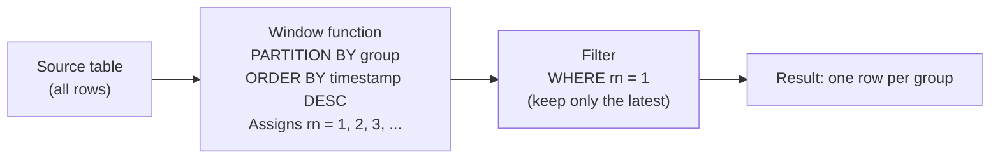

# 54 — Latest Row Per Group

---

## Table of Contents

1. [What It Is](#what-it-is)
2. [Why It Exists](#why-it-exists)
3. [Syntax](#syntax)
4. [How It Works Internally](#how-it-works-internally)
5. [Sample Tables](#sample-tables)
6. [Method 1 — ROW_NUMBER Window Function](#method-1--row_number-window-function)
7. [Method 2 — Correlated Subquery](#method-2--correlated-subquery)
8. [Method 3 — JOIN on MAX/MIN Aggregate](#method-3--join-on-maxmin-aggregate)
9. [Method 4 — LATERAL JOIN / CROSS APPLY](#method-4--lateral-join--cross-apply)
10. [Method 5 — NOT EXISTS Anti-Pattern](#method-5--not-exists-anti-pattern)
11. [Method 6 — DISTINCT ON (PostgreSQL)](#method-6--distinct-on-postThere's more text pollution. Let me do a clean rewrite of the entire TOC section.
Based Examples](#scenario-based-examples)
14. [Edge Cases](#edge-cases)
15. [NULL Behavior](#null-behavior)
16. [Common Mistakes](#common-mistakes)
17. [Production Pitfalls](#production-pitfalls)
18. [Performance Implications](#performance-implications)
19. [Interview Traps](#interview-traps)
20. [Best Practices](#best-practices)
21. [Interview Questions](#interview-questions)

---

## What It Is

"Latest row per group" means: **for each group defined by one or more columns, return the row that is most recent according to some timestamp or ordering column**.

This is one of the **most common SQL problems** — it appears in interviews, production systems, analytics pipelines, and reporting queries. It is a special case of "Top-N per group" (Section 53) where N = 1 and the ordering is by recency.

### Concrete Examples

| Business Question | Group Column | "Latest" Means |
|---|---|---|
| Most recent order per customer | `customer_id` | Highest `order_date` |
| Latest price per product | `product_id` | Highest `effective_date` |
| Most recent login per user | `user_id` | Highest `login_time` |
| Current address per customer | `customer_id` | Highest `updated_at` |
| Last transaction per account | `account_id` | Highest `transaction_date` |

---

## Why It Exists

Before window functions, getting "the latest row per group" required workarounds that were either **slow**, **wrong**, or **fragile**:

| Approach | Problem |
|---|---|
| `GROUP BY` + `MAX(date)` + JOIN back | Returns multiple rows when the max date ties |
| Correlated subquery | O(n²) performance |
| `DISTINCT ON` (PostgreSQL only) | Not portable |
| Application-side filtering | Pulls unnecessary data |

`ROW_NUMBER()` provides a clean, correct, and portable solution that works across all modern databases.

> **Common misconception:** "Just use `MAX()` and join back." This only works when the ordering column is **unique within each group**. When two rows share the same max timestamp, you get **extra rows** — often silently, producing plausible but wrong results.

---

## Syntax

### Pattern 1 — Window Function (Most Portable)

```sql
SELECT *
FROM (
    SELECT
        t.*,
        ROW_NUMBER() OVER (
            PARTITION BY group_column
            ORDER BY timestamp_column DESC, tiebreaker_column DESC
        ) AS rn
    FROM source_table t
) ranked
WHERE rn = 1;
```

### Pattern 2 — CTE Variant

```sql
WITH ranked AS (
    SELECT
        t.*,
        ROW_NUMBER() OVER (
            PARTITION BY group_column
            ORDER BY timestamp_column DESC, tiebreaker_column DESC
        ) AS rn
    FROM source_table t
)
SELECT *
FROM ranked
WHERE rn = 1;
```

### Pattern 3 — LATERAL / CROSS APPLY

```sql
-- PostgreSQL / MySQL 8+
SELECT g.*, latest.*
FROM (SELECT DISTINCT group_column FROM source_table) g
CROSS JOIN LATERAL (
    SELECT *
    FROM source_table t
    WHERE t.group_column = g.group_column
    ORDER BY timestamp_column DESC
    LIMIT 1
) latest;
```

```sql
-- SQL Server / Oracle
SELECT g.*, latest.*
FROM (SELECT DISTINCT group_column FROM source_table) g
CROSS APPLY (
    SELECT TOP (1) *
    FROM source_table t
    WHERE t.group_column = g.group_column
    ORDER BY timestamp_column DESC
) latest;
```

---

## How It Works Internally

The `ROW_NUMBER()` approach works in two logical stages:



### Logical Query Processing Position

Window functions execute at the `SELECT` stage:

```
FROM / JOIN
  → WHERE
  → GROUP BY
  → HAVING
  → SELECT          ← ROW_NUMBER() is computed here
  → DISTINCT
  → ORDER BY
  → LIMIT / OFFSET
```

This means:
- You **cannot** use `WHERE rn = 1` in the same `SELECT` that defines `rn`.
- You **must** wrap the window function in a subquery or CTE first.
- `ROW_NUMBER()` runs on the result of all preceding clauses.

### What the Database Physically Does

1. **Partition** — group rows by `PARTITION BY` columns
2. **Sort** — within each partition, sort by `ORDER BY` columns (descending for "latest")
3. **Enumerate** — assign 1, 2, 3, ... to each row within the sorted partition
4. **Filter** — the outer `WHERE rn = 1` discards all but the first row per partition

---

## Sample Tables

### orders

Grain: **one row = one order.**

| order_id | customer_id | order_date | amount |
|---|---|---|---|
| 101 | 1 | 2024-01-15 | 250.00 |
| 102 | 1 | 2024-02-20 | 180.00 |
| 103 | 2 | 2024-01-18 | 320.00 |
| 104 | 1 | 2024-03-10 | 400.00 |
| 105 | 3 | 2024-02-25 | 150.00 |
| 106 | 2 | 2024-03-05 | 275.00 |
| 107 | 1 | 2024-03-10 | 90.00 |

Note: Orders 104 and 107 share the **same date** and **same customer** — deliberately included to demonstrate tie handling.

### product_prices

Grain: **one row = one price record for a product at a point in time.**

| price_id | product_id | price | effective_date |
|---|---|---|---|
| 1 | 101 | 29.99 | 2024-01-01 |
| 2 | 101 | 32.99 | 2024-06-01 |
| 3 | 101 | 27.99 | 2024-09-01 |
| 4 | 102 | 49.99 | 2024-01-01 |
| 5 | 102 | 44.99 | 2024-04-15 |
| 6 | 103 | 15.00 | 2024-02-10 |

### user_logins

Grain: **one row = one login event.**

| login_id | user_id | login_time |
|---|---|---|
| 1 | 100 | 2024-06-01 08:00:00 |
| 2 | 100 | 2024-06-02 09:15:00 |
| 3 | 100 | 2024-06-03 07:45:00 |
| 4 | 101 | 2024-06-01 10:30:00 |
| 5 | 101 | 2024-06-04 11:00:00 |

### employees

Grain: **one row = one employee.**

| employee_id | employee_name | department | salary | hire_date |
|---|---|---|---|---|
| 1 | Alice | Engineering | 120000 | 2019-03-15 |
| 2 | Bob | Engineering | 110000 | 2020-06-01 |
| 3 | Charlie | Engineering | 130000 | 2018-01-20 |
| 4 | Diana | Marketing | 95000 | 2021-02-10 |
| 5 | Eve | Marketing | 88000 | 2022-07-25 |
| 6 | Frank | Marketing | 95000 | 2019-11-30 |
| 7 | Grace | Sales | 105000 | 2020-04-18 |
| 8 | Hank | Sales | 105000 | 2018-09-12 |
| 9 | Ivy | Sales | 92000 | 2023-01-05 |
| 10 | Jack | Sales | 87000 | 2023-08-20 |

---

## Method 1 — ROW_NUMBER Window Function

This is the **standard, portable, recommended** approach.

### How It Works

`ROW_NUMBER()` assigns a unique sequential integer to each row within a partition. The row with `rn = 1` is the "latest" row by the `ORDER BY` definition.

### Example: Most Recent Order Per Customer

```sql
SELECT order_id, customer_id, order_date, amount
FROM (
    SELECT
        order_id,
        customer_id,
        order_date,
        amount,
        ROW_NUMBER() OVER (
            PARTITION BY customer_id
            ORDER BY order_date DESC, order_id DESC
        ) AS rn
    FROM orders
) ranked
WHERE rn = 1;
```

**Why `order_id DESC` in the tiebreaker?** Orders 104 and 107 share the same `(customer_id, order_date)`. Without a tiebreaker, which one gets `rn = 1` is **nondeterministic** — the same query can return different results on different runs.

### Expected Output

| order_id | customer_id | order_date | amount |
|---|---|---|---|
| 107 | 1 | 2024-03-10 | 90.00 |
| 106 | 2 | 2024-03-05 | 275.00 |
| 105 | 3 | 2024-02-25 | 150.00 |

Order 107 is chosen over 104 because `order_id DESC` places 107 before 104 within the tie.

### Example: Latest Price Per Product

```sql
SELECT product_id, price, effective_date
FROM (
    SELECT
        product_id,
        price,
        effective_date,
        ROW_NUMBER() OVER (
            PARTITION BY product_id
            ORDER BY effective_date DESC, price_id DESC
        ) AS rn
    FROM product_prices
) ranked
WHERE rn = 1;
```

### Expected Output

| product_id | price | effective_date |
|---|---|---|
| 101 | 27.99 | 2024-09-01 |
| 102 | 44.99 | 2024-04-15 |
| 103 | 15.00 | 2024-02-10 |

---

## Method 2 — Correlated Subquery

### Syntax

```sql
SELECT o1.*
FROM orders o1
WHERE o1.order_date = (
    SELECT MAX(o2.order_date)
    FROM orders o2
    WHERE o2.customer_id = o1.customer_id
);
```

### How It Works

For each row, the subquery finds the maximum `order_date` within the same group. The row matches if its own `order_date` equals the group maximum.

### The Tie Problem

**BAD APPROACH — this silently returns duplicates:**

```sql
-- Customer 1 has two orders on 2024-03-10 (orders 104 and 107)
-- Both match the MAX(order_date) for customer 1
-- Result: TWO rows for customer 1 instead of one
SELECT o1.*
FROM orders o1
WHERE o1.order_date = (
    SELECT MAX(o2.order_date)
    FROM orders o2
    WHERE o2.customer_id = o1.customer_id
);
```

**Expected (wrong) output:**

| order_id | customer_id | order_date | amount |
|---|---|---|---|
| 104 | 1 | 2024-03-10 | 400.00 |
| 107 | 1 | 2024-03-10 | 90.00 |
| 106 | 2 | 2024-03-05 | 275.00 |
| 105 | 3 | 2024-02-25 | 150.00 |

Customer 1 returns **two rows** — one more than expected.

### Fix: Add a Tiebreaker to the Correlated Subquery

```sql
SELECT o1.*
FROM orders o1
WHERE (o1.order_date, o1.order_id) = (
    SELECT o2.order_date, MAX(o2.order_id)
    FROM orders o2
    WHERE o2.customer_id = o1.customer_id
      AND o2.order_date = (
          SELECT MAX(o3.order_date)
          FROM orders o3
          WHERE o3.customer_id = o1.customer_id
      )
);
```

This is complex and error-prone. The window function approach is superior.

### When to Use

- When window functions are unavailable (very rare)
- When the ordering column is **guaranteed unique** within each group (then the simple version works)

---

## Method 3 — JOIN on MAX/MIN Aggregate

### Syntax

```sql
SELECT o.*
FROM orders o
INNER JOIN (
    SELECT customer_id, MAX(order_date) AS max_date
    FROM orders
    GROUP BY customer_id
) latest ON latest.customer_id = o.customer_id
        AND latest.max_date = o.order_date;
```

### How It Works

1. The subquery finds the latest `order_date` per customer
2. The JOIN matches back to the original table on both `customer_id` and `order_date`

### The Same Tie Problem

This suffers from the **same issue** as the correlated subquery — when multiple rows share the max date, the JOIN multiplies them.

**BAD APPROACH — returns duplicates on ties:**

```sql
-- Customer 1 has orders 104 and 107 on 2024-03-10
-- Both match the join condition → 2 rows for customer 1
SELECT o.*
FROM orders o
INNER JOIN (
    SELECT customer_id, MAX(order_date) AS max_date
    FROM orders
    GROUP BY customer_id
) latest ON latest.customer_id = o.customer_id
        AND latest.max_date = o.order_date;
```

### Fix: Add a Secondary Tiebreaker

```sql
SELECT o.*
FROM orders o
INNER JOIN (
    SELECT customer_id, MAX(order_date) AS max_date, MAX(order_id) AS max_id
    FROM orders
    WHERE (customer_id, order_date) IN (
        SELECT customer_id, MAX(order_date)
        FROM orders
        GROUP BY customer_id
    )
    GROUP BY customer_id
) latest ON latest.customer_id = o.customer_id
        AND latest.max_date = o.order_date
        AND latest.max_id = o.order_id;
```

**BETTER APPROACH — ROW_NUMBER:**

```sql
SELECT order_id, customer_id, order_date, amount
FROM (
    SELECT *, ROW_NUMBER() OVER (
        PARTITION BY customer_id
        ORDER BY order_date DESC, order_id DESC
    ) AS rn
    FROM orders
) ranked
WHERE rn = 1;
```

The `ROW_NUMBER` approach handles ties correctly in one line without nesting.

### When to Use

- When the ordering column is **guaranteed unique** per group (then the simple version is fine)
- When you need the aggregated max/min values for other purposes alongside the latest row

---

## Method 4 — LATERAL JOIN / CROSS APPLY

### PostgreSQL / MySQL 8+ Syntax

```sql
SELECT g.customer_id, latest.*
FROM (SELECT DISTINCT customer_id FROM orders) g
CROSS JOIN LATERAL (
    SELECT order_id, order_date, amount
    FROM orders o
    WHERE o.customer_id = g.customer_id
    ORDER BY order_date DESC, order_id DESC
    LIMIT 1
) latest;
```

### SQL Server / Oracle Syntax

```sql
SELECT g.customer_id, latest.*
FROM (SELECT DISTINCT customer_id FROM orders) g
CROSS APPLY (
    SELECT TOP (1) order_id, order_date, amount
    FROM orders o
    WHERE o.customer_id = g.customer_id
    ORDER BY order_date DESC, order_id DESC
) latest;
```

### How It Works

1. The outer query produces one row per distinct group value
2. For each group, the `LATERAL`/`CROSS APPLY` subquery runs **independently**
3. The subquery sorts by the timestamp and takes only 1 row (`LIMIT 1` / `TOP (1)`)
4. No full-table sort is needed — the database can stop after finding 1 row per group

### Why This Can Be Faster

The key advantage: **the database does not need to sort the entire table**. For each group, it can use an index to find the latest row and stop immediately.

```sql
-- Ideal index for this approach:
CREATE INDEX idx_orders_customer_date
    ON orders (customer_id, order_date DESC, order_id DESC);
```

With this index, the database does an index scan per group — no sort, no materialization of all ranked rows.

### When to Use

- When you need only the **top 1** (or top N with small N) per group
- When partitions are **very large** and you want to avoid sorting them entirely
- When an appropriate index exists

> **See also:** Section 53 (Top-N Per Group) for a detailed comparison of `LATERAL` vs window function performance.

---

## Method 5 — NOT EXISTS Anti-Pattern

### Syntax

```sql
SELECT o1.*
FROM orders o1
WHERE NOT EXISTS (
    SELECT 1
    FROM orders o2
    WHERE o2.customer_id = o1.customer_id
      AND (o2.order_date > o1.order_date
           OR (o2.order_date = o1.order_date AND o2.order_id > o1.order_id))
);
```

### How It Works

For each row, check whether there is any **newer** row in the same group. If no newer row exists, this row is the latest.

### When to Use

- When you want to avoid window functions entirely
- When the table has a good index on `(customer_id, order_date, order_id)`

### Why Not Prefer This

- **Readability:** Much harder to understand than `ROW_NUMBER`
- **Performance:** Can be efficient with the right index, but the correlated subquery executes once per row
- **Fragility:** The tiebreaker logic in the `NOT EXISTS` condition is easy to get wrong

> **Production pitfall:** If you forget the tiebreaker in the `NOT EXISTS` condition (`OR (o2.order_date = o1.order_date AND o2.order_id > o1.order_id)`), rows with the same timestamp all pass the filter — returning duplicates.

---

## Method 6 — DISTINCT ON (PostgreSQL)

### Syntax

```sql
SELECT DISTINCT ON (customer_id)
    order_id, customer_id, order_date, amount
FROM orders
ORDER BY customer_id, order_date DESC, order_id DESC;
```

### How It Works

`DISTINCT ON (column)` keeps the first row for each distinct value of the listed columns, based on the `ORDER BY` clause. It is a PostgreSQL-specific shorthand.

### Expected Output

| order_id | customer_id | order_date | amount |
|---|---|---|---|
| 107 | 1 | 2024-03-10 | 90.00 |
| 106 | 2 | 2024-03-05 | 275.00 |
| 105 | 3 | 2024-02-25 | 150.00 |

### When to Use

- **PostgreSQL only**
- When you want a concise, readable one-liner
- When the `ORDER BY` uniquely determines which row is "first" per group

### Why Not Use Elsewhere

`DISTINCT ON` is **not supported** by MySQL, SQL Server, or Oracle. It is non-portable.

> **PostgreSQL:** `DISTINCT ON` is idiomatic and often optimized well by the planner. It is functionally equivalent to `ROW_NUMBER() = 1` with the same `ORDER BY`.

---

## Comparison of All Methods

| Method | Readability | Handles Ties | DB Support | Performance | When to Prefer |
|---|---|---|---|---|---|
| `ROW_NUMBER()` | Excellent | Yes (with tiebreaker) | All modern | Good | **Default choice** — portable, clear, correct |
| Correlated Subquery | Poor | Only with complex fix | All | O(n²) without index | Rarely — legacy systems |
| JOIN on MAX aggregate | Moderate | Only with complex fix | All | Good with index | When aggregate values are also needed |
| `LATERAL` / `CROSS APPLY` | Good | Yes | PostgreSQL, MySQL 8+, SQL Server, Oracle | Excellent for small N | Large partitions, top-1 per group |
| `NOT EXISTS` | Poor | Only with correct tiebreaker | All | Moderate | When window functions unavailable |
| `DISTINCT ON` | Excellent | Yes (with tiebreaker) | PostgreSQL only | Excellent | PostgreSQL one-liner |

### Decision Flowchart

```
Need latest row per group?
  │
  ├─ PostgreSQL? ──────────────────────────► DISTINCT ON (simplest)
  │
  ├─ Need only top 1 with large partitions? ► LATERAL / CROSS APPLY
  │
  └─ Default / portable? ─────────────────► ROW_NUMBER()
```

---

## Scenario-Based Examples

### Scenario 1: Most Recent Order Per Customer (with Full Row)

```sql
SELECT order_id, customer_id, order_date, amount
FROM (
    SELECT
        *,
        ROW_NUMBER() OVER (
            PARTITION BY customer_id
            ORDER BY order_date DESC, order_id DESC
        ) AS rn
    FROM orders
) ranked
WHERE rn = 1;
```

**Output:**

| order_id | customer_id | order_date | amount |
|---|---|---|---|
| 107 | 1 | 2024-03-10 | 90.00 |
| 106 | 2 | 2024-03-05 | 275.00 |
| 105 | 3 | 2024-02-25 | 150.00 |

### Scenario 2: Latest Price Per Product

```sql
SELECT product_id, price, effective_date
FROM (
    SELECT
        product_id,
        price,
        effective_date,
        ROW_NUMBER() OVER (
            PARTITION BY product_id
            ORDER BY effective_date DESC, price_id DESC
        ) AS rn
    FROM product_prices
) ranked
WHERE rn = 1;
```

**Output:**

| product_id | price | effective_date |
|---|---|---|
| 101 | 27.99 | 2024-09-01 |
| 102 | 44.99 | 2024-04-15 |
| 103 | 15.00 | 2024-02-10 |

### Scenario 3: Most Recent Login Per User (with JOIN to Get User Details)

```sql
-- Grain: user_logins has multiple rows per user
-- We want one login per user, then join to a users table

SELECT u.user_id, u.username, l.login_time
FROM users u
INNER JOIN (
    SELECT
        user_id,
        login_time,
        ROW_NUMBER() OVER (
            PARTITION BY user_id
            ORDER BY login_time DESC
        ) AS rn
    FROM user_logins
) l ON l.user_id = u.user_id AND l.rn = 1;
```

**Why the JOIN order matters:** The `ROW_NUMBER` is computed on `user_logins` **before** the join to `users`. This is correct because we want the latest login per user, and `users` only provides supplementary columns.

> **Production pitfall:** If you join first and then rank, the grain changes. A one-to-many join from `users` to `user_logins` fans out the rows, and ranking after the join may not give the expected "one row per user" result.

### Scenario 4: Latest Order Per Customer, Including Customers with No Orders

```sql
SELECT c.customer_id, c.customer_name, o.order_id, o.order_date, o.amount
FROM customers c
LEFT JOIN (
    SELECT
        *,
        ROW_NUMBER() OVER (
            PARTITION BY customer_id
            ORDER BY order_date DESC, order_id DESC
        ) AS rn
    FROM orders
) o ON o.customer_id = c.customer_id AND o.rn = 1;
```

**Expected Output (with sample data):**

| customer_id | customer_name | order_id | order_date | amount |
|---|---|---|---|---|
| 1 | (name) | 107 | 2024-03-10 | 90.00 |
| 2 | (name) | 106 | 2024-03-05 | 275.00 |
| 3 | (name) | 105 | 2024-02-25 | 150.00 |
| 4 | (name) | NULL | NULL | NULL |

Customer 4 has no orders — the `LEFT JOIN` preserves them with NULLs.

> **Important:** The `ROW_NUMBER` is computed **inside** the subquery on `orders` only. You do not rank the joined result — you rank the orders first, then join.

### Scenario 5: Employee with Highest Salary Per Department (Including Ties)

If you want **all** employees who share the highest salary in their department:

```sql
WITH salary_ranks AS (
    SELECT
        employee_id,
        employee_name,
        department,
        salary,
        DENSE_RANK() OVER (
            PARTITION BY department
            ORDER BY salary DESC
        ) AS salary_rank
    FROM employees
)
SELECT employee_id, employee_name, department, salary
FROM salary_ranks
WHERE salary_rank = 1;
```

**Output:**

| employee_id | employee_name | department | salary |
|---|---|---|---|
| 3 | Charlie | Engineering | 130000 |
| 4 | Diana | Marketing | 95000 |
| 6 | Frank | Marketing | 95000 |
| 7 | Grace | Sales | 105000 |
| 8 | Hank | Sales | 105000 |

Diana and Frank both have salary 95000 in Marketing — both are returned because `DENSE_RANK` keeps ties.

> **Interview trap:** If the question says "the employee with the highest salary per department" without specifying "all ties," clarify whether you should return one row or all tied rows. Use `ROW_NUMBER` for exactly one, `DENSE_RANK` for all ties.

### Scenario 6: Latest Status Change Per Order (Event Sourcing Pattern)

```sql
-- order_status_history grain: one row per status change
CREATE TABLE order_status_history (
    history_id   INT PRIMARY KEY,
    order_id     INT,
    status       VARCHAR(20),
    changed_at   TIMESTAMP
);

-- Get the current status of each order
SELECT order_id, status, changed_at
FROM (
    SELECT
        order_id,
        status,
        changed_at,
        ROW_NUMBER() OVER (
            PARTITION BY order_id
            ORDER BY changed_at DESC
        ) AS rn
    FROM order_status_history
) ranked
WHERE rn = 1;
```

---

## Edge Cases

### Edge Case 1: Groups with Zero Rows

If a group exists in the dimension table but has **no rows** in the fact table, a `LEFT JOIN` approach preserves the group with NULLs. A subquery approach (e.g., `SELECT DISTINCT group_column FROM fact_table`) will **not** include the empty group.

```sql
-- This excludes groups with no orders:
SELECT DISTINCT customer_id FROM orders;

-- This includes all customers, even those with no orders:
SELECT c.customer_id
FROM customers c
LEFT JOIN (
    SELECT *, ROW_NUMBER() OVER (
        PARTITION BY customer_id ORDER BY order_date DESC, order_id DESC
    ) AS rn
    FROM orders
) o ON o.customer_id = c.customer_id AND o.rn = 1;
```

### Edge Case 2: Single-Row Groups

If a group has exactly one row, `ROW_NUMBER` assigns `rn = 1` and the row is returned. No special handling needed.

### Edge Case 3: All Rows in a Group Have the Same Timestamp

```sql
-- If orders 104 and 107 both have order_date = '2024-03-10'
-- and customer_id = 1:
ROW_NUMBER() OVER (
    PARTITION BY customer_id
    ORDER BY order_date DESC, order_id DESC
) AS rn
```

- Without `order_id` tiebreaker: **nondeterministic** — which row gets `rn = 1` changes between runs
- With `order_id DESC` tiebreaker: order 107 gets `rn = 1` (deterministic)

### Edge Case 4: Empty Table

Zero input rows → zero output rows, no error.

### Edge Case 5: Large Number of Groups

If you have 10 million distinct groups and 100 million rows, the `ROW_NUMBER` approach must sort all 100 million rows (or use an index to avoid sorting). The `LATERAL`/`CROSS APPLY` approach may be more efficient because it can stop after 1 row per group.

### Edge Case 6: Groups with One Row Each, but Many Groups

If every group has exactly one row, `ROW_NUMBER` still works — every row gets `rn = 1`. The overhead is the sort, which could be avoided by recognizing this pattern in advance.

---

## NULL Behavior

### NULL in the Group Column (PARTITION BY)

All NULL values form **one partition**. If `customer_id` is NULL for several orders, they are treated as one group and ranked together.

```sql
-- If orders have customer_id = NULL:
-- All NULL-customer orders are ranked together
-- The "latest" NULL-customer order gets rn = 1
ROW_NUMBER() OVER (
    PARTITION BY customer_id
    ORDER BY order_date DESC, order_id DESC
) AS rn
```

> **Production pitfall:** If you have orders with NULL `customer_id` and you join to a `customers` table, the NULL partition does not match any customer. This is often correct behavior but can cause "missing groups" in reports.

### NULL in the Ordering Column (order_date)

The position of NULLs depends on the database:

| Database | `ORDER BY order_date DESC` | NULLs Position |
|---|---|---|
| PostgreSQL | NULLs first by default | Use `NULLS LAST` to push them to the bottom |
| MySQL | NULLs last in DESC | NULLs sorted as lowest value |
| SQL Server | NULLs last in DESC | NULLs sorted as lowest value |
| Oracle | NULLs first by default | Use `NULLS LAST` to push them to the bottom |

```sql
-- PostgreSQL / Oracle: push NULLs to the bottom
ROW_NUMBER() OVER (
    PARTITION BY customer_id
    ORDER BY order_date DESC NULLS LAST, order_id DESC
) AS rn
```

**What happens:** If `order_date` is NULL and you order DESC with default NULL ordering, the NULL row may get `rn = 1` — meaning a row with **no date** is treated as "the latest." This is usually wrong.

**BETTER APPROACH — filter or coalesce NULLs:**

```sql
-- Option A: Exclude rows with NULL order_date
WHERE order_date IS NOT NULL

-- Option B: Treat NULL as the oldest date
ORDER BY COALESCE(order_date, '1900-01-01') DESC, order_id DESC
```

### NULL in the Tiebreaker Column

If `order_id` can be NULL (unusual for a primary key), NULLs sort according to the database's NULL ordering rules. This can cause nondeterministic results even when a tiebreaker is present.

> **Rule of thumb:** The tiebreaker column should be `NOT NULL` and unique within each partition. Primary keys satisfy both conditions.

---

## Common Mistakes

### Mistake 1: Filtering on `rn` in the Same SELECT

```sql
-- WRONG: rn does not exist when WHERE executes
SELECT
    *,
    ROW_NUMBER() OVER (
        PARTITION BY customer_id
        ORDER BY order_date DESC
    ) AS rn
FROM orders
WHERE rn = 1;  -- ERROR
```

**Fix:** Wrap in a subquery or CTE.

```sql
-- CORRECT
SELECT *
FROM (
    SELECT *,
        ROW_NUMBER() OVER (
            PARTITION BY customer_id
            ORDER BY order_date DESC
        ) AS rn
    FROM orders
) ranked
WHERE rn = 1;
```

### Mistake 2: Missing Tiebreaker in ORDER BY

```sql
-- WRONG: nondeterministic when order_date ties
ROW_NUMBER() OVER (
    PARTITION BY customer_id
    ORDER BY order_date DESC
) AS rn

-- CORRECT: deterministic with tiebreaker
ROW_NUMBER() OVER (
    PARTITION BY customer_id
    ORDER BY order_date DESC, order_id DESC
) AS rn
```

Without the tiebreaker, the same query can return **different results on different runs**. This causes:
- Bugs in applications that cache results
- Inconsistent reports
- Flaky tests

### Mistake 3: Using MAX() and JOINing Back Without Handling Ties

```sql
-- BAD: returns extra rows when ties exist
SELECT o.*
FROM orders o
INNER JOIN (
    SELECT customer_id, MAX(order_date) AS max_date
    FROM orders
    GROUP BY customer_id
) m ON m.customer_id = o.customer_id AND m.max_date = o.order_date;
```

If customer 1 has two orders on the max date, you get **two rows** instead of one.

### Mistake 4: Using LIMIT Instead of WHERE rn = 1

```sql
-- WRONG: LIMIT is global, not per group
SELECT *
FROM orders
ORDER BY customer_id, order_date DESC
LIMIT 10;  -- Returns 10 rows total, not 10 per customer

-- CORRECT: ROW_NUMBER gives per-group filtering
SELECT *
FROM (
    SELECT *, ROW_NUMBER() OVER (
        PARTITION BY customer_id
        ORDER BY order_date DESC, order_id DESC
    ) AS rn
    FROM orders
) ranked
WHERE rn <= 10;
```

### Mistake 5: Ranking After a Fan-Out JOIN

```sql
-- BAD: JOIN fans out rows, then ranking is over the wrong grain
SELECT o.customer_id, o.order_id, oi.product_id,
       ROW_NUMBER() OVER (PARTITION BY o.customer_id ORDER BY o.order_date DESC) AS rn
FROM orders o
JOIN order_items oi ON oi.order_id = o.order_id
WHERE rn = 1;  -- Also invalid syntax (rn not defined in WHERE)
```

The JOIN produces one row per order item. Ranking after the JOIN means each order may appear multiple times with `rn = 1` (one per item).

**Fix:** Rank on the parent table **before** joining:

```sql
WITH latest_orders AS (
    SELECT *
    FROM (
        SELECT *,
            ROW_NUMBER() OVER (
                PARTITION BY customer_id
                ORDER BY order_date DESC, order_id DESC
            ) AS rn
        FROM orders
    ) ranked
    WHERE rn = 1
)
SELECT lo.customer_id, lo.order_id, oi.product_id
FROM latest_orders lo
JOIN order_items oi ON oi.order_id = lo.order_id;
```

### Mistake 6: Forgetting PARTITION BY

```sql
-- WRONG intent: "latest order per customer" but no partition
ROW_NUMBER() OVER (ORDER BY order_date DESC) AS rn
-- This gives the global latest order, not per customer
```

### Mistake 7: Using RANK or DENSE_RANK When Exactly One Row is Needed

```sql
-- If two orders tie at the latest date:
RANK() OVER (PARTITION BY customer_id ORDER BY order_date DESC) AS rnk
-- WHERE rnk = 1 returns BOTH tied rows

-- ROW_NUMBER ensures exactly one row:
ROW_NUMBER() OVER (PARTITION BY customer_id ORDER BY order_date DESC, order_id DESC) AS rn
-- WHERE rn = 1 returns exactly one row
```

---

## Production Pitfalls

### Pitfall 1: Non-Deterministic Results

Without a tiebreaker, **the same query returns different results on different runs**. In production this causes:
- Application bugs when results are cached or paginated
- Inconsistent nightly reports
- Flaky integration tests

**Fix:** Always include a unique column (typically the primary key) as the last `ORDER BY` element.

### Pitfall 2: Large Sort Spilling to Disk

`ROW_NUMBER` requires sorting all rows within each partition. When partitions are large (millions of rows), the sort may spill to disk, causing:
- High I/O
- Memory pressure
- Slow queries

**Mitigation:**
- Create an index matching `(partition_cols, order_cols)` to avoid the sort
- Use `EXPLAIN ANALYZE` to verify the sort is eliminated
- Consider `LATERAL`/`CROSS APPLY` for top-1 queries on very large partitions

```sql
-- Index that eliminates the sort for this query pattern:
CREATE INDEX idx_orders_customer_date
    ON orders (customer_id, order_date DESC, order_id DESC);
```

### Pitfall 3: Wrong Grain After JOIN

If you join a one-to-many table and then rank, the grain of the result is **wrong**. Always rank on the parent table, then join.

### Pitfall 4: NULL Dates Causing Wrong "Latest"

If `order_date` can be NULL and you don't handle it, a NULL-dated row may be treated as the latest (depending on the database's NULL ordering). Filter or coalesce NULLs before ranking.

### Pitfall 5: Nondeterminism in De-duplication

If this pattern is used for de-duplication (keeping one row per group), nondeterministic ordering means **different rows are kept on different runs**. This can cause data loss or inconsistencies in downstream systems.

### Pitfall 6: Modifying Data While Running the Query

If rows are inserted or deleted while the query runs, the ranking may be inconsistent within a single transaction unless you use proper isolation (`REPEATABLE READ` or snapshot isolation).

---

## Performance Implications

### Index Strategy

The most effective index for "latest row per group" with `ROW_NUMBER`:

```sql
CREATE INDEX idx_latest_per_group
    ON table_name (group_column, timestamp_column DESC, tiebreaker_column DESC);
```

This index supports:
1. **Partition pruning** — scan one group at a time
2. **Pre-sorted order** — no sort step needed
3. **Limit pushdown** — the database can stop after 1 row per partition

### What to Check in the Execution Plan

Run `EXPLAIN ANALYZE` (PostgreSQL), `EXPLAIN` (MySQL), or the equivalent for your database.

| Good Signs | Bad Signs |
|---|---|
| Index Scan / Index Only Scan | Full Table Scan |
| Limit / Top-N Sort | Filesort / Sort on full partition |
| Nested Loop with LATERAL | Hash Join on full table before ranking |
| Partition-wise processing | Materializing entire ranked result before filtering |

### LATERAL vs ROW_NUMBER Performance

| Aspect | ROW_NUMBER | LATERAL / CROSS APPLY |
|---|---|---|
| Materializes all ranked rows before filtering | Yes (typically) | No — can stop at 1 |
| Works with complex GROUP BY | Yes (via CTE) | Requires more steps |
| Index usage | Depends on partition size | Excellent with per-group index |
| Readability | Excellent | Good |
| Works for top-N where N > 1 | Yes | Yes |

For **very large** partitions where you need only 1 row, `LATERAL`/`CROSS APPLY` can outperform `ROW_NUMBER` because it avoids sorting the entire partition. However, for most practical cases, the `ROW_NUMBER` approach is equally fast and more readable.

> **Do not guess about performance.** Run `EXPLAIN ANALYZE` with realistic data volumes and verify which approach is faster for your specific case. Performance depends on the optimizer, indexes, statistics, cardinality, data distribution, and engine.

### Cardinality and Data Distribution

- If most groups are **small** (< 100 rows), `ROW_NUMBER` is fast regardless of approach
- If some groups are **very large** (millions of rows) and you need only 1, `LATERAL` with an index is often better
- If the data is **uniformly distributed**, the optimizer can usually parallelize window functions effectively

---

## Interview Traps

### Trap 1: "Get the most recent order per customer" — Ties

If two orders share the same `(customer_id, order_date)`, `ROW_NUMBER` picks one **arbitrarily** (without a tiebreaker). The interviewer may ask "which one?" The correct answer: "whichever the tiebreaker determines — I always include a unique column in the `ORDER BY`."

### Trap 2: Using MAX() and JOINing Back

The interviewer may expect you to recognize that `MAX(date) + JOIN` returns **extra rows** on ties. This is a very common trap.

### Trap 3: Filtering `rn = 1` in the Same SELECT

A classic syntax trap — window functions are computed at the `SELECT` stage, so `WHERE rn = 1` is invalid in the same query.

### Trap 4: "What is the grain of the result?"

The output is **one row per group**. The grain is different from the source table. If the source table has grain "one row per order," the result has grain "one row per customer."

### Trap 5: LEFT JOIN and NULL Groups

If you `LEFT JOIN` from a dimension table, groups with no matching rows in the fact table appear with NULLs. The interviewer may ask "how do you include customers with no orders?" The answer is `LEFT JOIN` with the `ROW_NUMBER` subquery on the fact table.

### Trap 6: "What if the timestamp column has NULLs?"

NULLs in the `ORDER BY` column may be treated as the "latest" or "earliest" depending on the database. The interviewer wants to see that you handle this explicitly.

### Trap 7: Confusing "latest" with "highest"

"Latest" means most recent by time. "Highest" means maximum by value. These are different questions that may have different answers (e.g., the most recent order may not be the largest).

---

## Best Practices

1. **Always include a unique tiebreaker** in the `ORDER BY` — typically the primary key. This makes results deterministic.
2. **State the grain** of both the source table and the result. The result has grain "one row per group."
3. **Filter NULLs** in the timestamp column before ranking if they should not be treated as "latest."
4. **Rank on the parent table** before joining to child tables to avoid fan-out.
5. **Use `ROW_NUMBER`** for exactly one row per group. Use `DENSE_RANK` when you want all ties.
6. **Create a supporting index** on `(group_column, timestamp_column DESC, tiebreaker_column DESC)` and verify with `EXPLAIN ANALYZE`.
7. **Consider `LATERAL`/`CROSS APPLY`** for top-1 queries on very large partitions with appropriate indexes.
8. **Use `DISTINCT ON`** on PostgreSQL for a concise one-liner when portability is not required.
9. **Wrap the window function** in a subquery or CTE — never filter on `rn` in the same `SELECT`.
10. **Test with tied data** to verify your query handles ties correctly.

---

# Interview Questions

Use these as practice. Answers intentionally withheld.

## Beginner

1. Write a query to find the most recent order for each customer using `ROW_NUMBER()`.
2. Why can't you write `WHERE rn = 1` directly in the same `SELECT` that defines `rn`?
3. What happens if two orders for the same customer have the same `order_date`?
4. What is the grain of the result when you get "the latest order per customer"?
5. Write a query using `GROUP BY` + `MAX(order_date)` to find the latest order date per customer. What problem does this approach have?

## Intermediate

6. Write a query that returns the full order row for each customer's most recent order, including customers who have **no orders** (use `LEFT JOIN`).
7. Write the same query using `LATERAL JOIN` (PostgreSQL) or `CROSS APPLY` (SQL Server).
8. How would you modify the query to return the **top 3** most recent orders per customer instead of just 1?
9. Write a query that returns, for each product, its most recent price from the `product_prices` table.
10. What index would you create to optimize the "latest order per customer" query? What would you look for in the execution plan?

## Advanced

11. You have a table `events(event_id, user_id, event_type, event_time)` with 500 million rows and 10 million distinct users. You need the most recent event per user. Compare the `ROW_NUMBER` approach vs `LATERAL JOIN` approach. Under what conditions might one be significantly faster?
12. Convert the "latest row per group" pattern into a `DELETE` that removes all but the most recent row per customer. Show the syntax for PostgreSQL and MySQL.
13. Explain the logical position of `ROW_NUMBER` relative to `WHERE`, `GROUP BY`, `HAVING`, `DISTINCT`, `ORDER BY`, and `LIMIT`. What constraints does this imply for "latest row per group" queries?
14. How would you handle the case where the "latest" row is defined by multiple columns (e.g., latest `order_date` AND latest `order_id` when dates tie)?
15. Design a query that returns each customer's most recent order AND the order before that (for comparison). Use `ROW_NUMBER` or `LAG`.

## Scenario Based

16. You have `product_prices(product_id, price, effective_date, expiration_date)`. The "current" price is the one where `CURRENT_DATE BETWEEN effective_date AND expiration_date`. How does this change the "latest row per group" pattern?
17. A stakeholder asks: "Show me each salesperson's most recent deal." The `deals` table has `(deal_id, salesperson_id, deal_amount, deal_date, status)`. Should you filter by `status = 'closed'` before or after ranking? Why?
18. You notice that your "latest order per customer" query returns different results each night. What is the most likely cause, and how do you fix it?
19. A dashboard calls your query with a filter `WHERE customer_id IN (...)`. How can you optimize the "latest order per group" query when you only need a subset of groups?
20. You need the latest status change per order, but the `order_status_history` table sometimes has duplicate rows (same `order_id`, `status`, `changed_at`). How does this affect your approach?

## Tricky

21. What is the result of this query? Walk through step by step:

    ```sql
    SELECT *
    FROM (
        SELECT
            customer_id,
            order_id,
            order_date,
            ROW_NUMBER() OVER (
                PARTITION BY customer_id
                ORDER BY order_date DESC
            ) AS rn
        FROM orders
    ) ranked
    WHERE rn = 1;
    ```

    Customer 1 has orders on 2024-03-10 (order 104) and 2024-03-10 (order 107). Which one is returned? Is this guaranteed?

22. Two engineers write:

    **Engineer A:**
    ```sql
    SELECT * FROM (
        SELECT *, ROW_NUMBER() OVER (PARTITION BY dept ORDER BY hire_date DESC) rn
        FROM employees
    ) t WHERE rn = 1;
    ```

    **Engineer B:**
    ```sql
    SELECT e.*
    FROM employees e
    INNER JOIN (
        SELECT dept, MAX(hire_date) AS max_hire
        FROM employees
        GROUP BY dept
    ) m ON m.dept = e.dept AND m.max_hire = e.hire_date;
    ```

    Under what data conditions do these return different results? Give a concrete example.

23. You use `ROW_NUMBER() OVER (PARTITION BY customer_id ORDER BY order_date DESC, order_id DESC)`. If `order_id` is `NULL` for some rows (e.g., a data quality issue), what happens to the ordering within the tiebreaker?

## Output Prediction

24. Given the `orders` sample table above (including orders 104 and 107 on the same date for customer 1), predict the exact output of:

    ```sql
    SELECT order_id, customer_id, order_date
    FROM (
        SELECT *,
            ROW_NUMBER() OVER (
                PARTITION BY customer_id
                ORDER BY order_date DESC, order_id DESC
            ) AS rn
        FROM orders
    ) ranked
    WHERE rn = 1;
    ```

25. Now predict the output if the tiebreaker is removed:

    ```sql
    ROW_NUMBER() OVER (PARTITION BY customer_id ORDER BY order_date DESC) AS rn
    ```

    How many rows are returned? Which order_id is returned for customer 1? Is this guaranteed?

26. Given the `product_prices` table, predict the output of:

    ```sql
    SELECT product_id, price
    FROM (
        SELECT *,
            ROW_NUMBER() OVER (PARTITION BY product_id ORDER BY effective_date DESC, price_id DESC) AS rn
        FROM product_prices
    ) ranked
    WHERE rn = 1;
    ```

## Debugging

27. The following query claims to return the latest order per customer but returns 2 rows for customer 1. Identify the bug:

    ```sql
    SELECT *
    FROM (
        SELECT *,
            ROW_NUMBER() OVER (
                PARTITION BY customer_id
                ORDER BY order_date DESC
            ) AS rn
        FROM orders
    ) ranked
    WHERE rn = 1;
    ```

28. A developer writes this query and gets an error. What is wrong?

    ```sql
    SELECT
        customer_id,
        order_id,
        order_date,
        ROW_NUMBER() OVER (PARTITION BY customer_id ORDER BY order_date DESC) AS rn
    FROM orders
    WHERE rn = 1;
    ```

29. A "latest order per customer" query works in development (PostgreSQL) but returns wrong results in production (MySQL). The query uses `ORDER BY order_date DESC`. What is the most likely cause?

30. The execution plan for a "latest row per group" query shows a `Sort` node with temp-file writes on 50 million rows. You add an index on `(customer_id, order_date DESC, order_id DESC)` but the plan does not change. What could be wrong?

## Performance

31. You have a table with 100 million rows and 10,000 distinct groups. You need the top 1 row per group. Compare the cost intuition of: (a) `ROW_NUMBER()` with no index, (b) `ROW_NUMBER()` with a covering index, (c) `LATERAL JOIN` with the same index. What would you look for in each execution plan?

32. Under what circumstances might the `NOT EXISTS` anti-pattern outperform `ROW_NUMBER()` for "latest row per group"? What index is required?

33. A nightly batch job runs the "latest row per group" query on a table that is partitioned by month. How does partition pruning affect performance? What partition key would you choose?

34. You need to run the "latest row per group" query 50 times per second on a read replica. The query currently uses `ROW_NUMBER()`. How would you optimize for this throughput? Consider caching, indexing, and materialized views.

---

> **Cross-references:** [44-Window-Functions-Basics](44-Window-Functions-Basics.md) covers the `OVER` clause fundamentals. [45-PARTITION-BY](45-PARTITION-BY.md) deep-dives into partition semantics. [46-ROW-NUMBER](46-ROW-NUMBER.md) covers the core function in detail. [47-RANK-vs-DENSE-RANK](47-RANK-vs-DENSE-RANK.md) contrasts the ranking family for when ties matter. [53-Top-N-Per-Group](53-Top-N-Per-Group.md) generalizes this to any N. For pagination alternatives see [84-Pagination-and-Keyset-Pagination](../9-Optimization/84-Pagination-and-Keyset-Pagination.md). For sort-elimination guidance see [78-EXPLAIN-Execution-Plans](../9-Optimization/78-EXPLAIN-Execution-Plans.md) and [73-Composite-Indexes](../9-Optimization/73-Composite-Indexes.md).
